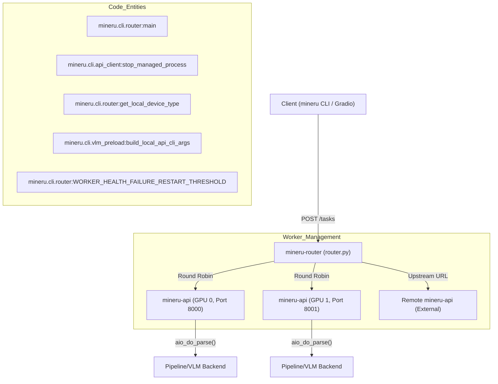
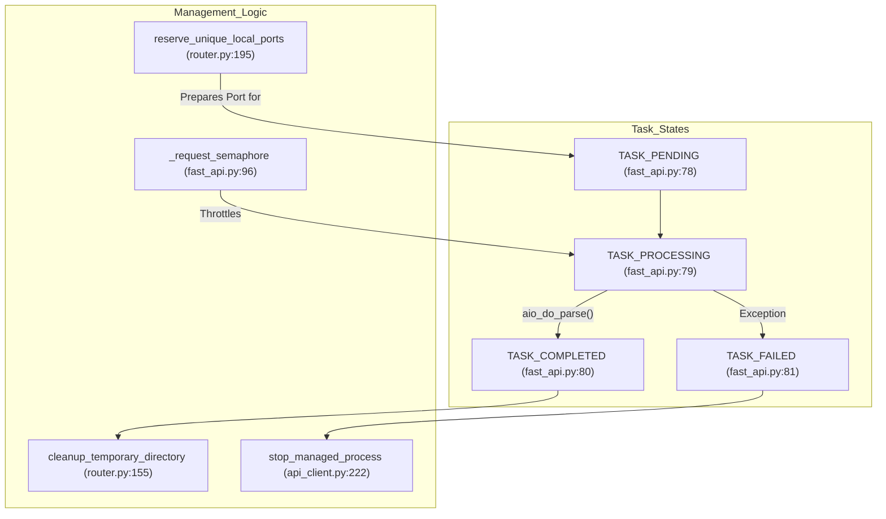

# 다중 GPU 및 엔터프라이즈 배포

관련 소스 파일

이 위키 페이지를 생성하는 데 다음 파일들이 컨텍스트로 사용되었습니다:

- [docs/en/quick_start/extension_modules.md](docs/en/quick_start/extension_modules.md)
- [docs/zh/quick_start/extension_modules.md](docs/zh/quick_start/extension_modules.md)
- [mineru/cli/api_client.py](mineru/cli/api_client.py)
- [mineru/cli/api_protocol.py](mineru/cli/api_protocol.py)
- [mineru/cli/fast_api.py](mineru/cli/fast_api.py)
- [mineru/cli/router.py](mineru/cli/router.py)
- [mineru/utils/cli_parser.py](mineru/utils/cli_parser.py)
- [projects/README.md](projects/README.md)
- [projects/README_zh-CN.md](projects/README_zh-CN.md)

이 페이지는 MinerU의 고성능 및 분산 배포 옵션에 대해 다룹니다. 핵심 라이브러리가 강력한 PDF 파싱 기능을 제공하지만, 엔터프라이즈 시나리오에서는 여러 GPU에 작업 부하를 분산하고, 장기 실행 작업 대기열을 관리하며, `vLLM` 또는 `lmdeploy`와 같은 고처리량 추론 엔진과 통합해야 하는 경우가 많습니다.

> [!NOTE]
> 최근 업데이트 기준으로, 리소스를 통합하기 위해 메인 레포지토리의 `projects` 디렉터리는 아카이브되었습니다. 새로운 커뮤니티 주도 배포 프로젝트는 이제 [awesome-mineru](https://github.com/opendatalab/awesome-mineru) 레포지토리에서 호스팅됩니다 [projects/README.md:1-6]().

## 1. 다중 GPU 병렬 추론 (mineru-router)

MinerU는 `mineru-router` CLI를 통해 정교한 라우팅 및 부하 분산 레이어를 제공합니다. 이 컴포넌트는 추론 작업을 여러 로컬 GPU에 분산하거나 여러 원격 `mineru-api` 인스턴스를 집계하도록 설계되었습니다.

### 구현 세부사항
라우터는 워커 풀을 관리합니다. `--local-gpus auto`로 시작하면 사용 가능한 하드웨어를 감지하고 GPU당 하나의 워커를 실행합니다 [mineru/cli/router.py:70-71](), [mineru/cli/router.py:220-224]().

- **GPU 감지**: `get_local_device_type()` 함수는 구성 리더에서 `get_device()`를 호출하여 사용 가능한 가속기를 식별합니다 [mineru/cli/router.py:220-224]().
- **프로세스 관리**: 로컬 워커는 `build_managed_process_popen_kwargs`를 사용하여 관리형 하위 프로세스로 시작됩니다 [mineru/cli/api_client.py:148-154](). 라우터는 VRAM 격리를 보장하기 위해 각 워커에 고유한 포트와 특정 환경 변수를 할당합니다 [mineru/cli/router.py:195-211]().
- **헬스 체크**: 라우터는 `/health` 엔드포인트를 통해 워커를 지속적으로 모니터링합니다 [mineru/cli/router.py:66-67](). 워커가 여러 번의 헬스 체크에 실패하면(`WORKER_HEALTH_FAILURE_RESTART_THRESHOLD`에 의해 정의된 임계값) 제외되거나 재시작됩니다 [mineru/cli/router.py:75-76]().
- **동시성 제어**: 라우터는 개별 노드에 과부하가 걸리는 것을 방지하기 위해 현재 `processing_window_size`를 포함한 `WorkerState`를 추적합니다 [mineru/cli/router.py:76]().

### 데이터 흐름: 라우터 부하 분산
다음 다이어그램은 클라이언트 요청이 라우터에 의해 관리되는 특정 GPU 워커 프로세스로 어떻게 분산되는지 보여줍니다.

**MinerU 라우터 분산**

출처: [mineru/cli/router.py:55-76](), [mineru/cli/router.py:134-141](), [mineru/cli/router.py:195-225](), [mineru/cli/api_client.py:148-154](), [mineru/cli/api_client.py:222-236]()

## 2. 분산 추론 가속화

엔터프라이즈 배포에서는 종종 MinerU의 과도한 Vision-Language Model (VLM) 요구 사항을 처리하기 위해 `vllm` 또는 `lmdeploy`를 활용합니다.

- **실행 모드**: 라우터는 충돌을 방지하기 위해 자동 포트 감지를 사용하여 로컬 워커를 실행할 수 있습니다 [mineru/cli/router.py:195-211](). `subprocess` 및 `spawn` 모드를 지원하며, 화웨이 어센드(Ascend, NPU)와 같은 특정 하드웨어의 경우 `spawn`이 선호됩니다 [mineru/cli/api_client.py:135-146]().
- **포트 관리**: 병렬 시작 중 충돌을 방지하기 위해 `reserve_unique_local_ports()`는 워커 초기화 전에 사용 가능한 여유 포트를 찾아 유지하기 위해 여러 소켓을 일시적으로 바인딩합니다 [mineru/cli/router.py:195-211]().
- **추론 엔진**:
    - **vLLM**: Volta 아키텍처 이상에 대한 가속을 제공합니다. 고처리량 VLM 추론에 권장됩니다 [docs/en/quick_start/extension_modules.md:22-30]().
    - **LMDeploy**: 대안적인 가속을 제공하며, 특정 하드웨어 대상을 타겟팅할 때 특히 유용합니다 [docs/en/quick_start/extension_modules.md:38-46]().
- **경량 클라이언트**: 프로그래밍 방식의 클라이언트는 API URL을 지정하여 원격 서버에 연결할 수 있으므로, 로컬 모델 로딩을 우회할 수 있습니다 [mineru/cli/fast_api.py:155](). 이를 통해 CPU만 있는 에지 장치가 강력한 원격 GPU 클러스를 활용할 수 있습니다 [docs/en/quick_start/extension_modules.md:52-67]().

출처: [mineru/cli/router.py:195-211](), [mineru/cli/api_client.py:135-146](), [mineru/cli/fast_api.py:155](), [docs/en/quick_start/extension_modules.md:22-67]()

## 3. 서비스 오케스트레이션 (MinerU 천추/Tianshu)

MinerU는 서비스 지향 아키텍처를 위해 여러 진입점을 제공하여 API 레이어, 라우팅 레이어 및 VLM 추론 레이어 간의 관심사 분리를 가능하게 합니다.

| 서비스 CLI | 구현 진입점 | 목적 |
| :--- | :--- | :--- |
| `mineru-api` | `mineru.cli.fast_api:create_app` | 비동기 작업 지원 및 GZip 미들웨어가 포함된 기본 FastAPI 서버 [mineru/cli/fast_api.py:212-221]() |
| `mineru-router` | `mineru.cli.router:main` | 다중 GPU 부하 분산기 및 워커 풀 관리자 [mineru/cli/router.py:18-21]() |
| `mineru-vllm-server` | `mineru.cli.vlm_server:vllm_server` | 문서 분석을 위한 독립형 vLLM 추론 엔진 |
| `mineru-openai-server` | `mineru.cli.vlm_server:openai_server` | OpenAI 호환 VLM 서버 인터페이스 |

### 엔터프라이즈 서비스 기능
- **비동기 작업 지원**: `mineru-api`는 장기 실행 작업을 추적하기 위해 `AsyncParseTask` 클래스를 구현합니다 [mineru/cli/fast_api.py:142-171]().
- **작업 지속성**: 작업은 상태 URL 및 결과 URL로 추적되므로 클라이언트가 완료 여부를 폴링할 수 있습니다 [mineru/cli/fast_api.py:173-196]().
- **MCP 서버 통합**: MinerU는 AI 어시스턴트와의 통합을 위해 Model Context Protocol (MCP)을 지원하여 LLM이 표준화된 도구 정의를 통해 MinerU 파싱 기능을 직접 호출할 수 있도록 합니다.
- **천추 (Tianshu, 天枢) 부하 분산**: 엔터프라이즈 컨텍스트에서 MinerU는 요청 분산 및 워커 생명주기를 관리하기 위해 `LitServe` 또는 `mineru-router`를 활용합니다.

출처: [mineru/cli/fast_api.py:142-221](), [mineru/cli/router.py:18-21](), [mineru/cli/api_protocol.py:2-4]()

## 4. 작업 관리 및 생명주기

엔터프라이즈 배포에서 작업 지속성 및 상태 관리는 API 및 Router 레이어에서 처리됩니다.

- **작업 대기열 상태**: 시스템은 `TASK_PENDING`, `TASK_PROCESSING`, `TASK_COMPLETED` 및 `TASK_FAILED`와 같은 내부 작업 상태를 유지합니다 [mineru/cli/fast_api.py:78-81]().
- **보존 및 정리**: 작업 데이터는 `DEFAULT_TASK_RETENTION_SECONDS`(기본 24시간)로 설정된 기간 동안 보존됩니다 [mineru/cli/fast_api.py:85](). 임시 디렉터리는 강건한 정리를 위해 재시도 로직(`LOCAL_API_CLEANUP_RETRIES`에 의해 정의됨)이 포함된 `cleanup_temporary_directory`를 사용하여 스크럽됩니다 [mineru/cli/router.py:155-173]().
- **프로세스 생명주기**: 시스템은 워커 프로세스를 관리하고 `stop_managed_process`를 사용하여 깨끗한 종료를 보장하며, 여기에는 Windows(via `taskkill /T`) 및 Linux(via `os.killpg`)에서 프로세스 트리에 시그널을 보내는 작업이 포함됩니다 [mineru/cli/api_client.py:157-191](), [mineru/cli/api_client.py:222-236]().
- **동시성 제한**: FastAPI 레이어의 `_request_semaphore`는 `MAX_CONCURRENT_REQUESTS`에 기반하여 동시 활성 파싱 요청 수를 제어합니다 [mineru/cli/fast_api.py:95-97]().

**작업 생명주기 및 코드 매핑**

출처: [mineru/cli/fast_api.py:78-97](), [mineru/cli/router.py:155-173](), [mineru/cli/api_client.py:157-236]()

## 5. 엔터프라이즈 구성 및 프로토콜

MinerU는 다중 클라이언트/서버 통신을 위해 표준화된 프로토콜을 사용합니다.

- **API 프로토콜**: 시스템은 클라이언트와 서버 간의 호환성을 보장하기 위해 `API_PROTOCOL_VERSION`(현재 버전 2)을 사용합니다 [mineru/cli/api_protocol.py:2]().
- **인수 파싱**: `cli_parser.py` 유틸리티는 엔터프라이즈 스크립트에 대한 복잡한 CLI 구성을 처리하여 알 수 없는 인수(`--` 접두사로 시작됨)가 내부 함수 호출을 위해 적절한 유형(bool, float, int)으로 변환되도록 합니다 [mineru/utils/cli_parser.py:7-23](), [mineru/utils/cli_parser.py:25-53]().
- **공용 액세스 보안**: 라우터와 API에는 서비스가 공용 인터페이스에 노출되는지 유효성을 검사하고 경고하는 로직이 `MINERU_API_ALLOW_PUBLIC_HTTP_CLIENT_ENV` 또는 `MINERU_ROUTER_ALLOW_PUBLIC_HTTP_CLIENT_ENV`를 통해 포함되어 있습니다 [mineru/cli/fast_api.py:92-93](), [mineru/cli/router.py:77-78]().
- **GZip 압축**: 대규모 JSON/Markdown 응답의 대역폭을 줄이기 위해 엔터프라이즈 배포는 FastAPI 앱에서 `GZipMiddleware`를 활성화합니다 [mineru/cli/fast_api.py:28]().

출처: [mineru/cli/fast_api.py:28-93](), [mineru/cli/router.py:77-78](), [mineru/utils/cli_parser.py:7-53](), [mineru/cli/api_protocol.py:2]()
