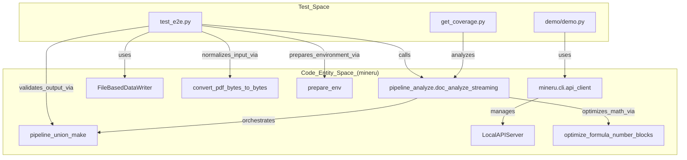
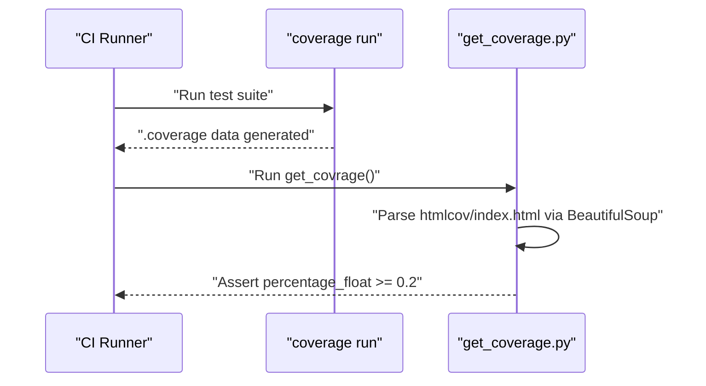

# Test Suite

관련 소스 파일

이 위키 페이지를 생성하는 데 컨텍스트로 사용된 파일은 다음과 같습니다:

- [.github/ISSUE_TEMPLATE/bug_report.yml](.github/ISSUE_TEMPLATE/bug_report.yml)
- [.github/ISSUE_TEMPLATE/config.yml](.github/ISSUE_TEMPLATE/config.yml)
- [demo/demo.py](demo/demo.py)
- [mineru/backend/utils/formula_number.py](mineru/backend/utils/formula_number.py)
- [mineru/cli/backend_options.py](mineru/cli/backend_options.py)
- [mineru/utils/pdf_page_id.py](mineru/utils/pdf_page_id.py)
- [tests/get_coverage.py](tests/get_coverage.py)
- [tests/unittest/pdfs/test.pdf](tests/unittest/pdfs/test.pdf)
- [tests/unittest/test_e2e.py](tests/unittest/test_e2e.py)

MinerU 테스트 스위트는 문서 파싱 정확도, CLI 기능 및 모델 성능을 검증하기 위한 포괄적인 프레임워크를 제공합니다. 이는 로우레벨 유닛 테스트부터 하이레벨 엔드투엔드(E2E) 통합 테스트 및 특화된 벤치마크 도구에 이르기까지 다양하게 걸쳐 있습니다.

## 테스트 아키텍처 개요

테스트 인프라는 높은 코드 커버리지를 유지하면서 세 가지 주요 백엔드(Pipeline, VLM 및 Hybrid) 전반에서 일관성을 보장하도록 설계되었습니다. 테스트는 지속적 통합을 위해 GitHub Actions를 통해 오케스트레이션됩니다.

### 테스트 흐름 및 엔티티 매핑

다음 다이어그램은 테스트 엔티티가 핵심 MinerU 처리 함수 및 유틸리티 모듈과 어떻게 상호 작용하는지 보여줍니다.

**MinerU 테스트 흐름 및 엔티티 매핑**

Sources: [tests/unittest/test_e2e.py:8-20](), [tests/unittest/test_e2e.py:47-48](), [tests/unittest/test_e2e.py:84-86](), [tests/unittest/test_e2e.py:99-105](), [tests/unittest/test_e2e.py:119-129](), [demo/demo.py:9-11](), [demo/demo.py:148-154](), [mineru/backend/utils/formula_number.py:155-156]()

## 유닛 및 엔드투엔드(E2E) 테스트

핵심 검증 로직은 `tests/unittest/` 디렉토리에 위치합니다. 이 테스트들은 파싱 로직의 내부 일관성과 중간 `middle_json` 형식의 정확성에 중점을 둡니다.

### 엔드투엔드(E2E) 검증

`test_e2e.py`는 원시 PDF 바이트에서 최종 Markdown 및 JSON 콘텐츠 리스트에 이르는 전체 흐름을 검증합니다.
- **파이프라인 테스트**: `test_pipeline_with_two_config` 함수는 샘플 PDF를 순회하며 `txt` 및 `ocr` 방식을 모두 사용하여 `pipeline_doc_analyze_streaming` 함수를 실행합니다 [tests/unittest/test_e2e.py:23-71]().
- **결과 변환**: `pipeline_union_make`를 사용하여 `middle_json`의 `pdf_info`를 최종 `MM_MD`(Markdown) 및 `CONTENT_LIST` 형식으로 변환합니다 [tests/unittest/test_e2e.py:119-129]().
- **콘텐츠 검증**: `assert_content` 함수는 퍼지 문자열 매칭(`fuzz.ratio`) 및 HTML 파싱(`BeautifulSoup`)을 사용하여 이미지, 표, 수식 및 텍스트가 올바르게 추출되었는지 검증합니다 [tests/unittest/test_e2e.py:152-219]().

### 특화 로직 테스트
- **표 인식**: 생성된 HTML `table_body` 내에 특정 대상 문자열(예: "Model", "Regression", "0.98740")이 존재하는지 확인하여 표 복원 로직을 검증합니다 [tests/unittest/test_e2e.py:171-203]().
- **수식 번호 최적화**: `formula_number.py` 모듈은 `build_tagged_formula_content`를 사용하여 수식 태그(예: `(1.1)`)를 LaTeX 콘텐츠와 병합하는 로직을 포함합니다 [mineru/backend/utils/formula_number.py:53-65](). 이는 파이프라인 [mineru/backend/utils/formula_number.py:155-165]() 및 하이브리드 [mineru/backend/utils/formula_number.py:168-178]() 백엔드를 모두 지원합니다.
- **방정식 검증**: 테스트는 LaTeX 구분 기호(`$$`) 및 특정 기호(예: `lambda`, `frac`, `bar`)가 있는지 확인하여 수식 인식 정확도를 보장합니다 [tests/unittest/test_e2e.py:205-209]().

Sources: [tests/unittest/test_e2e.py:23-219](), [mineru/backend/utils/formula_number.py:53-178](), [tests/unittest/pdfs/test.pdf:1-53]()

## CLI 및 통합 테스트

이 테스트들은 시스템의 외부 인터페이스를 검증하여 명령줄 도구와 SDK 래퍼(wrapper)가 올바르게 작동하는지 확인합니다.

### API 및 클라이언트 통합
`demo/demo.py` 스크립트는 API 클라이언트 로직에 대한 기능 통합 테스트 역할을 합니다.
- **로컬 서버 수명 주기**: `LocalAPIServer`를 시작하고 [demo/demo.py:148-149](), `wait_for_local_api_ready`를 통해 서버가 준비될 때까지 대기하는 과정을 시연합니다 [demo/demo.py:151-154]().
- **작업 제출**: 상태 콜백을 포함한 `submit_parse_task` 및 `wait_for_task_result` 흐름을 테스트합니다 [demo/demo.py:163-187]().
- **결과 처리**: `download_result_zip` 및 `safe_extract_zip` 유틸리티를 검증합니다 [demo/demo.py:189-200]().

### CLI 워크플로우 및 유틸리티
- **환경 준비**: `prepare_env`를 사용하여 이미지 및 markdown 출력을 위한 로컬 디렉토리를 설정합니다 [tests/unittest/test_e2e.py:84-84]().
- **백엔드 정규화**: `backend_options.py` 모듈은 CLI 입력이 유효한 내부 백엔드에 매핑되도록 보장합니다 (예: `vlm-auto-engine`을 `vlm-engine`에 매핑) [mineru/cli/backend_options.py:25-28](), [mineru/cli/backend_options.py:39-46]().
- **페이지 범위 로직**: `get_end_page_id` 유틸리티를 테스트하여 페이지 범위의 경계 조건이 올바르게 처리되는지 확인합니다 [mineru/utils/pdf_page_id.py:5-10]().

Sources: [demo/demo.py:144-203](), [tests/unittest/test_e2e.py:84-115](), [mineru/cli/backend_options.py:25-50](), [mineru/utils/pdf_page_id.py:5-10]()

## 커버리지 및 CI 도구

MinerU는 테스트 효과성을 추적하기 위해 `coverage.py`를 사용하고 결과를 처리하기 위해 자동화된 스크립트를 사용합니다.

### 커버리지 실행 흐름
커버리지 파이프라인은 새로운 변경 사항이 이미 테스트된 코드 경로를 손상시키지 않도록 보장합니다.

**커버리지 파이프라인 시퀀스**

Sources: [tests/get_coverage.py:7-20]()

### 커버리지 도구
- **get_coverage.py**: `BeautifulSoup`을 사용하여 `htmlcov/index.html` 파일을 처리하여 총 커버리지 비율(`pc_cov`)을 추출하고, 최소 임계값(현재 기본 검증을 위해 0.2로 설정됨)을 충족하는지 확인합니다 [tests/get_coverage.py:7-20]().

Sources: [tests/get_coverage.py:1-23]()
