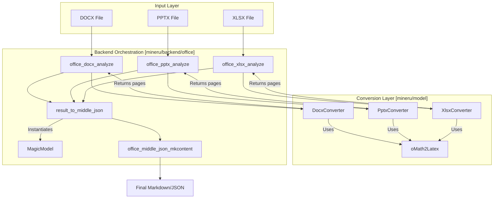

# 오피스 문서 지원 (DOCX 및 PPTX)

관련 소스 파일

이 위키 페이지를 생성하는 데 컨텍스트로 사용된 파일은 다음과 같습니다:

- [demo/office_docs/docx_01.docx](demo/office_docs/docx_01.docx)
- [demo/office_docs/pptx_01.pptx](demo/office_docs/pptx_01.pptx)
- [demo/office_docs/xlsx_01.xlsx](demo/office_docs/xlsx_01.xlsx)
- [mineru/backend/office/docx_analyze.py](mineru/backend/office/docx_analyze.py)
- [mineru/backend/office/mkcontent/__init__.py](mineru/backend/office/mkcontent/__init__.py)
- [mineru/backend/office/mkcontent/inline_renderer.py](mineru/backend/office/mkcontent/inline_renderer.py)
- [mineru/backend/office/mkcontent/output_builders.py](mineru/backend/office/mkcontent/output_builders.py)
- [mineru/backend/office/model_output_to_middle_json.py](mineru/backend/office/model_output_to_middle_json.py)
- [mineru/backend/office/office_magic_model.py](mineru/backend/office/office_magic_model.py)
- [mineru/backend/office/office_middle_json_mkcontent.py](mineru/backend/office/office_middle_json_mkcontent.py)
- [mineru/backend/office/pptx_analyze.py](mineru/backend/office/pptx_analyze.py)
- [mineru/backend/office/xlsx_analyze.py](mineru/backend/office/xlsx_analyze.py)
- [mineru/backend/utils/markdown_utils.py](mineru/backend/utils/markdown_utils.py)
- [mineru/backend/utils/office_chart.py](mineru/backend/utils/office_chart.py)
- [mineru/cli/public_http_client_policy.py](mineru/cli/public_http_client_policy.py)
- [mineru/model/docx/docx_converter.py](mineru/model/docx/docx_converter.py)
- [mineru/model/docx/main.py](mineru/model/docx/main.py)
- [mineru/model/docx/tools/__init__.py](mineru/model/docx/tools/__init__.py)
- [mineru/model/docx/tools/math/__init__.py](mineru/model/docx/tools/math/__init__.py)
- [mineru/model/docx/tools/math/latex_dict.py](mineru/model/docx/tools/math/latex_dict.py)
- [mineru/model/docx/tools/math/omml.py](mineru/model/docx/tools/math/omml.py)
- [mineru/model/docx/tools/office_xml.py](mineru/model/docx/tools/office_xml.py)
- [mineru/model/office_stream.py](mineru/model/office_stream.py)
- [mineru/model/pptx/package_normalizer.py](mineru/model/pptx/package_normalizer.py)
- [mineru/model/pptx/pptx_converter.py](mineru/model/pptx/pptx_converter.py)
- [mineru/model/pptx/xycut_pp_sorter.py](mineru/model/pptx/xycut_pp_sorter.py)
- [mineru/model/xlsx/__init__.py](mineru/model/xlsx/__init__.py)
- [mineru/model/xlsx/main.py](mineru/model/xlsx/main.py)
- [mineru/model/xlsx/xlsx_converter.py](mineru/model/xlsx/xlsx_converter.py)
- [mineru/utils/office_rich_text.py](mineru/utils/office_rich_text.py)

MinerU는 Microsoft Office 문서(DOCX, PPTX, XLSX)에 대한 네이티브 지원을 제공합니다. 레이아웃 감지 및 OCR을 위해 무거운 컴퓨터 비전 모델이 필요한 PDF 변환 경로와 달리, Office 파이프라인은 OpenXML (OOXML) 파일 내의 정형 XML 데이터를 활용합니다. 이러한 아키텍처적 선택으로 인해 텍스트, 표, 수학 수식의 높은 완성도를 유지하면서 PDF 렌더링 대비 **10배 빠른 속도 향상**을 이루어냈습니다.

## 아키텍처 개요

오피스 지원은 `DocxConverter`, `PptxConverter`, `XlsxConverter`라는 특화된 변환기로 나뉩니다. 이들은 PDF에 사용되는 전통적인 `BatchAnalyze` 파이프라인을 우회하여, `middle_json` 생성을 위해 데이터를 준비하는 특화된 `MagicModel`로 직접 입력됩니다.

### 시스템 데이터 흐름

다음 다이어그램은 오피스 문서가 어떻게 최종 Markdown/JSON 출력으로 변환되는지 보여주며, 원시 파일 파싱과 통합된 내부 표현 간의 간극을 좁혀줍니다.

**오피스 문서 처리 파이프라인**

**Sources:** [mineru/backend/office/docx_analyze.py:11-29](), [mineru/model/docx/docx_converter.py:80-101](), [mineru/backend/office/office_magic_model.py:13-157](), [mineru/backend/office/model_output_to_middle_json.py:126-171]().

---

## DOCX 변환 파이프라인

DOCX 파이프라인은 `office_docx_analyze`에 의해 조정됩니다 [mineru/backend/office/docx_analyze.py:11-29](). 이 파이프라인은 문서 구조를 파싱하기 위해 `DocxConverter` 클래스를 활용합니다.

### 주요 구현 세부 사항
1.  **OpenXML 파싱**: `lxml` 및 `python-docx`를 사용하여 문서 본문을 탐색합니다. `w`, `a`, `wp`, `mc`, `v` 등 다양한 XML 네임스페이스를 매핑하여 텍스트 런(text run), 드로잉 요소 및 관계를 추출합니다 [mineru/model/docx/docx_converter.py:43-78]().
2.  **표 처리**: 텍스트는 네이티브 방식으로 파싱되지만, 복잡한 표 구조는 `mammoth` 라이브러리를 사용하여 사전 처리되어 깨끗한 HTML 표현을 생성하고 이를 `_mammoth_tables_html`에 저장합니다 [mineru/model/docx/docx_converter.py:94-95]().
3.  **미디어 추출**: DOCX zip 패키지에서 이미지를 추출합니다. 변환기는 벡터 이미지를 처리하고 `serialize_office_image`를 사용하여 직렬화합니다 [mineru/model/docx/docx_converter.py:38-40]().
4.  **수식 변환**: Office Math (OMML)는 특화된 `oMath2Latex` 유틸리티를 사용하여 LaTeX로 변환됩니다 [mineru/model/docx/docx_converter.py:22]().
5.  **차트 추출**: 차트는 `extract_chart_html_from_ooxml`을 통해 처리되며, 임베디드 통합 문서(workbook) 또는 캐싱된 XML 값에서 데이터를 복구하려고 시도합니다 [mineru/model/docx/docx_converter.py:41]().
6.  **패키지 정규화**: 파싱을 수행하기 전에, `normalize_docx_package`를 사용하여 ZIP 수준의 문제 및 유실된 내부 관계를 복구합니다 [mineru/model/docx/docx_converter.py:20]().
7.  **스타일 캐싱**: 대용량 문서를 효율적으로 처리하기 위해 `DocxConverter`는 `_style_lookup_cache` 및 `_style_bool_cache`를 구현하여 `styles.xml`에 대한 반복적인 선형 스캔을 피합니다 [mineru/model/docx/docx_converter.py:115-116]().

**Sources:** [mineru/model/docx/docx_converter.py:43-116](), [mineru/backend/office/docx_analyze.py:11-29](), [mineru/model/docx/docx_converter.py:20-22](), [mineru/backend/utils/office_chart.py:159-178]().

---

## PPTX 및 XLSX 지원

`PptxConverter`와 `XlsxConverter`는 각각 슬라이드 및 스프레드시트 데이터를 처리합니다.

### PPTX 파이프라인
`PptxConverter`는 [mineru/model/pptx/pptx_converter.py:88-107]() 슬라이드와 도형을 순회하며, 읽기 순서를 유지하기 위해 공간 정렬 알고리즘을 사용합니다.
- **도형 평탄화 (Shape Flattening)**: `_SlideTransform`을 통해 좌표 변환을 적용하면서 그룹화된 도형들을 재귀적으로 평탄화합니다 [mineru/model/pptx/pptx_converter.py:54-80]().
- **공간 정렬**: XY-Cut 방식에 기반한 `sort_entries`를 사용하여 경계 상자(bounding box)를 기준으로 슬라이드 내 도형들의 순서를 지정합니다 [mineru/model/pptx/pptx_converter.py:25]().
- **정규화**: 초기 파싱이 실패할 경우, `normalize_pptx_package`를 사용하여 패키지를 수정하려고 시도합니다 [mineru/model/pptx/pptx_converter.py:152-162]().

### XLSX 파이프라인
`XlsxConverter`는 [mineru/model/xlsx/xlsx_converter.py:167-187]() 스프레드시트를 정형화된 표로 변환합니다.
- **데이터 영역 감지**: `DataRegion`을 사용하여 워크시트에서 비어 있지 않은 셀들의 경계 사각형을 식별합니다 [mineru/model/xlsx/xlsx_converter.py:39-62]().
- **서식 있는 텍스트 및 수식 (Rich Text & Math)**: `openpyxl`을 통해 셀 내의 서식 있는 텍스트를 지원하고, `math_map`을 사용하여 각 셀 위치에 수학 수식을 매핑합니다 [mineru/model/xlsx/xlsx_converter.py:181-185]().
- **정규화**: 다른 형식과 유사하게, 패키지 수준의 결함 허용(fault tolerance)을 위해 `normalize_xlsx_package`를 사용합니다 [mineru/model/xlsx/xlsx_converter.py:193-200]().

**Sources:** [mineru/model/pptx/pptx_converter.py:88-162](), [mineru/model/xlsx/xlsx_converter.py:167-200](), [mineru/model/xlsx/xlsx_converter.py:39-62](), [mineru/model/pptx/pptx_converter.py:25-54]().

---

## Office Math (OMML)에서 LaTeX로의 변환

`oMath2Latex` 클래스는 [mineru/model/docx/tools/math/omml.py:200-215]() Office Math XML 트리를 표준 LaTeX 문자열로 재귀적으로 변환합니다.

### 매핑 로직
- **문자**: `latex_dict.py`에 정의된 종합 사전 `T`를 사용하여 유니코드 수학 기호를 LaTeX 명령어로 매핑합니다 (예: `\u2211`을 `\sum`으로 매핑) [mineru/model/docx/tools/math/latex_dict.py:83-152]().
- **글꼴 스타일**: OMML `<m:scr>` 값(script, fraktur, double-struck, sans-serif, monospace)을 `\mathscr`, `\mathfrak`, `\mathbb`, `\mathsf`, `\mathtt`와 같은 LaTeX 수학 글꼴 명령어로 매핑합니다 [mineru/model/docx/tools/math/omml.py:47-53]().
- **재귀적 파싱**: 각 OMML 태그(예: `sSub`, `sSup`, `num`, `den`)를 그에 상응하는 LaTeX 문자열을 구축하는 핸들러에 매핑하는 `Tag2Method` 패턴을 구현합니다 [mineru/model/docx/tools/math/omml.py:207-229]().

**Sources:** [mineru/model/docx/tools/math/omml.py:47-229](), [mineru/model/docx/tools/math/latex_dict.py:83-152]().

---

## MagicModel 및 콘텐츠 생성

변환기가 가공되지 않은 블록 목록을 생성하면, `MagicModel` 클래스는 이들을 MinerU `middle_json` 스키마와 호환되는 형식으로 정규화합니다.

### 블록 분류 및 정제
`MagicModel`은 [mineru/backend/office/office_magic_model.py:13-16]() 다음을 수행합니다:
1.  **캡션 연관 (Caption Association)**: `classify_caption_blocks`를 통해 일반적인 캡션 블록을 `image_caption`, `table_caption` 또는 `chart_caption`으로 분류합니다 [mineru/backend/office/office_magic_model.py:21]().
2.  **스팬 파싱 (Span Parsing)**: `parse_text_block_spans`를 사용하여 텍스트 블록에서 인라인 스타일(굵게, 기울임꼴, 밑줄, 취소선, 강조, 위 첨자, 아래 첨자)을 추출합니다 [mineru/backend/office/office_magic_model.py:41]().
3.  **섹션 번호 매기기**: `result_to_middle_json` 함수는 제목이 있는 블록에 대한 계층적 섹션 번호(예: "1.2.1")를 자동으로 계산하며, 상위 수준의 제목을 만나면 하위 수준의 카운터를 재설정합니다 [mineru/backend/office/model_output_to_middle_json.py:132-152]().

### 렌더링 및 Markdown 출력
`office_middle_json_mkcontent` 모듈은 최종 Markdown 구축을 조정합니다 [mineru/backend/office/office_middle_json_mkcontent.py:1-36]().
- **출력 빌더 (Output Builders)**: 다양한 출력 형식(Markdown, 콘텐츠 목록 V1/V2)으로 분기시키기 위해 `union_make`를 사용합니다 [mineru/backend/office/office_middle_json_mkcontent.py:10-19]().
- **인라인 렌더링**: 블록 유형에 따라 Markdown 또는 HTML 스타일을 적용하는 로직을 처리합니다. 표준 서식을 위해 `OFFICE_MARKDOWN_STYLE_WRAPPERS`를 지원하고, 밑줄이나 강조 같은 기능을 위해 `OFFICE_COMPLEX_HTML_STYLES`를 지원합니다 [mineru/backend/office/mkcontent/inline_renderer.py:29-59]().
- **표 정리 (Table Cleaning)**: 유효한 HTML/Markdown 출력을 보장하기 위해 블록 파싱 중에 표를 깨끗하게 정리하고 다듬습니다 [mineru/backend/office/office_magic_model.py:53-54]().

**Sources:** [mineru/backend/office/office_magic_model.py:13-157](), [mineru/backend/office/model_output_to_middle_json.py:126-171](), [mineru/backend/office/office_middle_json_mkcontent.py:1-36](), [mineru/backend/office/mkcontent/inline_renderer.py:29-59]().
