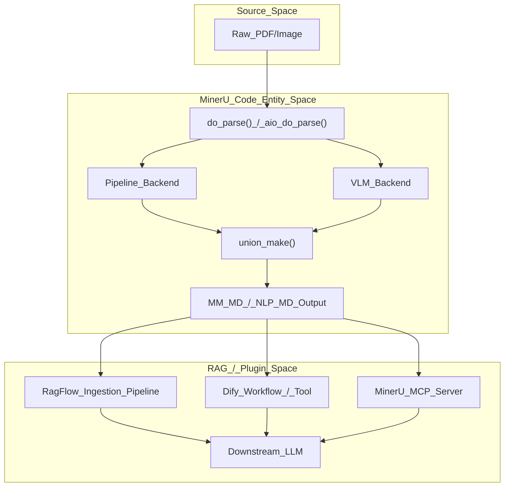
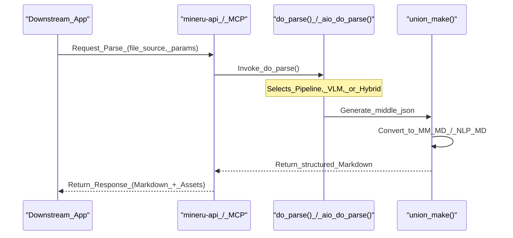

# RAG & Plugin Integrations

관련 소스 파일

이 위키 페이지를 생성하는 데 컨텍스트로 사용된 파일은 다음과 같습니다:

- [docs/assets/images/RagFlow_01.png](docs/assets/images/RagFlow_01.png)
- [docs/assets/images/RagFlow_02.png](docs/assets/images/RagFlow_02.png)
- [docs/zh/usage/plugin/BISHENG.md](docs/zh/usage/plugin/BISHENG.md)
- [docs/zh/usage/plugin/Cherry_Studio.md](docs/zh/usage/plugin/Cherry_Studio.md)
- [docs/zh/usage/plugin/Coze.md](docs/zh/usage/plugin/Coze.md)
- [docs/zh/usage/plugin/DataFlow.md](docs/zh/usage/plugin/DataFlow.md)
- [docs/zh/usage/plugin/Dify.md](docs/zh/usage/plugin/Dify.md)
- [docs/zh/usage/plugin/DingTalk.md](docs/zh/usage/plugin/DingTalk.md)
- [docs/zh/usage/plugin/FastGPT.md](docs/zh/usage/plugin/FastGPT.md)
- [docs/zh/usage/plugin/ModelWhale.md](docs/zh/usage/plugin/ModelWhale.md)
- [docs/zh/usage/plugin/RagFlow.md](docs/zh/usage/plugin/RagFlow.md)
- [docs/zh/usage/plugin/Sider.md](docs/zh/usage/plugin/Sider.md)
- [docs/zh/usage/plugin/n8n.md](docs/zh/usage/plugin/n8n.md)

MinerU는 고성능 문서 파싱 엔진으로 설계되어, 검색 증강 생성(RAG) 파이프라인 및 AI 어시스턴트 생태계를 위한 기초적인 데이터 수집(ingestion) 레이어 역할을 합니다. 복잡한 PDF를 정형화되고 기계가 읽을 수 있는 Markdown(구체적으로 `MM_MD` 및 `NLP_MD` 형식)으로 변환함으로써, MinerU는 대규모 언어 모델(LLM)이 수식, 표, 다단 레이아웃을 정확하게 해석할 수 있도록 지원합니다.

이 페이지는 주요 RAG 프레임워크 및 플러그인 생태계와의 통합 패턴을 문서화하고, MinerU의 출력이 다운스트림 파이프라인으로 어떻게 입력되는지 상세히 설명합니다.

## 통합 아키텍처

MinerU는 일반적으로 다음 세 가지 주요 방법을 통해 다운스트림 시스템에 통합됩니다:
1.  **직접 API 통합**: FastAPI 서버 또는 `mineru-api`를 사용하여 온디맨드로 문서를 처리합니다.
2.  **MCP (Model Context Protocol)**: `mineru-mcp` 명령어를 통해 Claude, Cursor, Cherry Studio와 같은 AI 클라이언트에 MinerU 도구를 노출합니다 [docs/zh/usage/plugin/Cherry_Studio.md:36-37]().
3.  **기본 플러그인/파서**: RAG 플랫폼(예: RagFlow, Dify) 내에 기본 지원 기능으로 제공되어 MinerU를 수집 엔진으로 선택할 수 있습니다 [docs/zh/usage/plugin/RagFlow.md:4-5]().

### 데이터 흐름: PDF에서 RAG 컨텍스트로

다음 다이어그램은 MinerU가 RAG 프레임워크 내에서 원시 문서 바이트와 LLM의 컨텍스트 창 사이의 간극을 어떻게 좁혀주는지 보여줍니다.

**MinerU에서 RAG로의 데이터 흐름**

**Sources:** [docs/zh/usage/plugin/RagFlow.md:68-82](), [docs/zh/usage/plugin/Dify.md:54-68]().

---

## RAG 프레임워크 통합

### RagFlow
RagFlow는 MinerU를 기본 PDF 파서로 깊이 통합했습니다. RagFlow 내 지식 베이스의 **Ingestion Pipeline** 설정에서 MinerU를 선택할 수 있습니다 [docs/zh/usage/plugin/RagFlow.md:1-5]().

*   **구현**: RagFlow는 청킹(chunking) 및 임베딩을 수행하기 전에 문서를 처리하기 위해 MinerU 실행 파일(주로 Docker 컨테이너 내부)을 호출합니다 [docs/zh/usage/plugin/RagFlow.md:13-15]().
*   **설정**: 사용자는 RagFlow `.env` 파일에 `MINERU_EXECUTABLE`을 설정하여 가상 환경의 `mineru` 바이너리를 가리키도록 합니다 [docs/zh/usage/plugin/RagFlow.md:21-30]().
*   **워크플로우**:
    1.  지식 베이스(Knowledge Base) -> 설정(Configuration)으로 이동합니다 [docs/zh/usage/plugin/RagFlow.md:72-74]().
    2.  Ingestion Pipeline 섹션에서 **PDF Parser**를 찾습니다 [docs/zh/usage/plugin/RagFlow.md:75-77]().
    3.  드롭다운에서 **MinerU**를 선택합니다 [docs/zh/usage/plugin/RagFlow.md:78-80]().

**Sources:** [docs/zh/usage/plugin/RagFlow.md:1-84]().

### Dify
MinerU는 Dify Marketplace에서 사용할 수 있는 Dify 공식 플러그인(v0.4.0 이상)을 제공합니다. 이는 공식 MinerU Cloud API와 로컬 API 배포를 모두 지원합니다 [docs/zh/usage/plugin/Dify.md:1-17]().

*   **도구 노드**: 플러그인은 Dify **Chatflow** 또는 **Workflow**에 삽입할 수 있는 `Parse File` 도구를 제공합니다 [docs/zh/usage/plugin/Dify.md:54-61]().
*   **변수**: MinerU `text` 출력(Markdown)을 LLM의 `context` 변수에 매핑합니다 [docs/zh/usage/plugin/Dify.md:62-68]().
*   **고급 사용 사례**: MinerU 출력을 Base64로 변환하고 `botos3` 플러그인을 통해 S3에 업로드하는 자동화된 배치 처리 방식입니다 [docs/zh/usage/plugin/Dify.md:90-156]().

**Sources:** [docs/zh/usage/plugin/Dify.md:1-171]().

### FastGPT
FastGPT는 LLM과 시각적 오케스트레이션을 결합한 지식 베이스 Q&A 시스템입니다. MinerU는 전문적인 문서 파싱 지원을 제공하기 위해 시스템 플러그인으로 통합되었습니다 [docs/zh/usage/plugin/FastGPT.md:1-5]().

**Sources:** [docs/zh/usage/plugin/FastGPT.md:1-13]().

### ADP (DataFlow)
OriginHub의 **ADP (Agent Data Platform)**는 MinerU를 자사의 **DataFlow** 모듈 내에 통합했습니다 [docs/zh/usage/plugin/DataFlow.md:1-5](). MinerU는 핵심 문서 코퍼스 추출 엔진 역할을 하여, 자동화된 데이터 거버넌스 및 모델/에이전트 훈련 데이터 준비를 가능하게 합니다 [docs/zh/usage/plugin/DataFlow.md:3-8]().

**Sources:** [docs/zh/usage/plugin/DataFlow.md:1-11]().

---

## AI 어시스턴트 및 플러그인 통합

### Model Context Protocol (MCP)
MinerU는 AI 어시스턴트가 파싱 도구를 직접 호출할 수 있도록 하는 MCP 서버(`mineru-mcp`)를 구현합니다.

*   **주요 도구**:
    *   `parse_documents`: URL 또는 로컬 경로를 Markdown으로 변환합니다 [docs/zh/usage/plugin/Cherry_Studio.md:147-150]().
    *   `get_ocr_languages`: 지원되는 OCR 언어 목록을 가져옵니다 [docs/zh/usage/plugin/Cherry_Studio.md:151-153]().
*   **통합**:
    *   **Cherry Studio**: `uvx mineru-mcp`를 사용하여 "표준 입출력 (stdio)" MCP 서버로 구성됩니다 [docs/zh/usage/plugin/Cherry_Studio.md:24-48]().
    *   **Claude/Cursor**: 코딩 또는 분석 세션 중에 높은 수준의 문서 컨텍스트를 제공하는 데 사용됩니다.

**Sources:** [docs/zh/usage/plugin/Cherry_Studio.md:1-238]().

### ByteDance Coze (扣子)
MinerU는 Coze 플러그인 스토어에서 제공되며, 지능형 에이전트 및 워크플로우를 구축하기 위한 `parse_file` 도구를 제공합니다 [docs/zh/usage/plugin/Coze.md:1-5](). 

*   **설정**: 사용자는 플러그인 설정에서 `MinerU`를 검색하고 `parse_file` 도구를 추가합니다 [docs/zh/usage/plugin/Coze.md:26-32]().
*   **워크플로우**: 파일 입력이 포함된 `Start` 노드가 `MinerU` 노드에 연결되고, 이 노드는 `parse_file.text`를 `End` 노드에 전달합니다 [docs/zh/usage/plugin/Coze.md:66-72]().

**Sources:** [docs/zh/usage/plugin/Coze.md:1-92]().

### DingTalk (钉钉)
DingTalk은 MinerU 기능을 **DingTalk Docs** 및 **AI Tables**에 통합했습니다 [docs/zh/usage/plugin/DingTalk.md:7](). 오픈 플랫폼 API를 통해 생태계 개발자에게 문서 파싱 기능을 제공하여 기업 관리를 위한 디지털화된 워크플로우를 지원합니다 [docs/zh/usage/plugin/DingTalk.md:3-7]().

**Sources:** [docs/zh/usage/plugin/DingTalk.md:1-12]().

### BISHENG (毕昇)
BISHENG은 기업 시나리오를 위한 오픈소스 LLM 애플리케이션 개발 플랫폼입니다. MinerU는 강력한 문서 파싱 기능을 제공하여 지능형 애플리케이션 안착을 지원하기 위해 플러그인으로 통합되었습니다 [docs/zh/usage/plugin/BISHENG.md:1-9]().

**Sources:** [docs/zh/usage/plugin/BISHENG.md:1-11]().

### Sider
Sider는 브라우저 사이드바 AI 어시스턴트로, 자사의 **Wisebase** 모듈 내에 MinerU를 통합했습니다 [docs/zh/usage/plugin/Sider.md:1-5](). 이 통합을 통해 사용자는 PDF에서 개인 라이브러리를 구축하고 MinerU의 파싱 기능을 사용하여 정확한 정보를 추출할 수 있습니다 [docs/zh/usage/plugin/Sider.md:5-10]().

**Sources:** [docs/zh/usage/plugin/Sider.md:1-10]().

### ModelWhale
ModelWhale은 클라우드 기반 분석 환경을 제공하며, 여기서 MinerU는 에이전트 및 워크플로우를 구축하는 데 사용되어 강력한 문서 파싱 기능을 통해 AI 애플리케이션 개발을 가속화합니다 [docs/zh/usage/plugin/ModelWhale.md:3-5]().

**Sources:** [docs/zh/usage/plugin/ModelWhale.md:1-19]().

### n8n
MinerU는 n8n 자동화 플랫폼과 통합되어, 사용자가 복잡한 다단계 워크플로우에 고급 문서 파싱 기능을 통합할 수 있도록 합니다 [docs/zh/usage/plugin/n8n.md:1-10]().

---

## 플러그인 생태계 맵

다음 표는 다양한 플랫폼에서 MinerU의 통합 상태 및 주요 사용 사례를 요약합니다:

| 플랫폼 | 통합 유형 | 주요 리소스 | 핵심 기능 |
| :--- | :--- | :--- | :--- |
| **RagFlow** | 기본 파서 | `docs/zh/usage/plugin/RagFlow.md` | 기업 RAG를 위한 심층 문서 이해. |
| **Dify** | 마켓플레이스 플러그인 | `docs/zh/usage/plugin/Dify.md` | 워크플로우 자동화 및 Chat PDF 앱. |
| **Cherry Studio** | MCP 서버 | `docs/zh/usage/plugin/Cherry_Studio.md` | 로컬 AI 어시스턴트 문서 처리. |
| **FastGPT** | 시스템 플러그인 | `docs/zh/usage/plugin/FastGPT.md` | 지식 베이스 Q&A 시스템. |
| **Coze** | 플러그인 스토어 | `docs/zh/usage/plugin/Coze.md` | 무코드(Zero-code) 에이전트 및 워크플로우 구축. |
| **DingTalk** | SaaS 통합 | `docs/zh/usage/plugin/DingTalk.md` | 기업 오피스 문서 파싱 (DLU). |
| **BISHENG** | 플러그인 | `docs/zh/usage/plugin/BISHENG.md` | 기업용 LLM 애플리케이션 플랫폼. |
| **Sider** | Wisebase 모듈 | `docs/zh/usage/plugin/Sider.md` | 브라우저 기반 AI 지식 관리. |
| **ModelWhale** | 캔버스/노트북 | `docs/zh/usage/plugin/ModelWhale.md` | 과학 연구 데이터 추출. |
| **DataFlow** | ADP 통합 | `docs/zh/usage/plugin/DataFlow.md` | 자동화된 데이터 거버넌스 및 준비. |
| **n8n** | 워크플로우 노드 | `docs/zh/usage/plugin/n8n.md` | 문서 처리를 위한 워크플로우 자동화. |

**Sources:** [docs/zh/usage/plugin/DingTalk.md:1-12](), [docs/zh/usage/plugin/Sider.md:1-10](), [docs/zh/usage/plugin/ModelWhale.md:1-19](), [docs/zh/usage/plugin/DataFlow.md:1-11](), [docs/zh/usage/plugin/BISHENG.md:1-9](), [docs/zh/usage/plugin/Coze.md:1-92]().

---

## 개발자를 위한 기술적 구현

MinerU를 새로운 다운스트림 파이프라인에 통합할 때, 기본 인터페이스는 백엔드 선택 및 출력 생성을 조정하는 `do_parse()` 또는 `aio_do_parse()` 로직입니다.

**다운스트림 파이프라인 통합 패턴**

**Sources:** [docs/zh/usage/plugin/Dify.md:120-133](), [docs/zh/usage/plugin/Cherry_Studio.md:143-155]().
