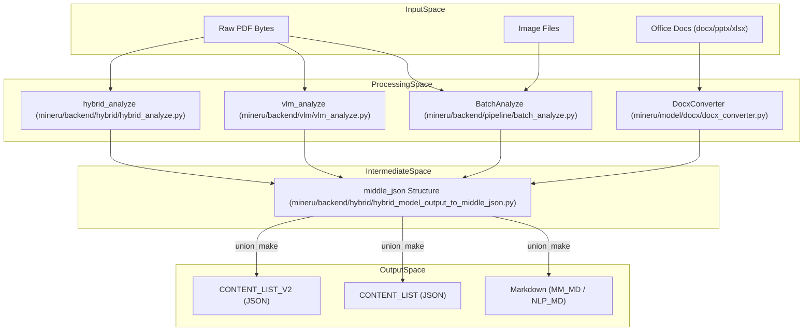
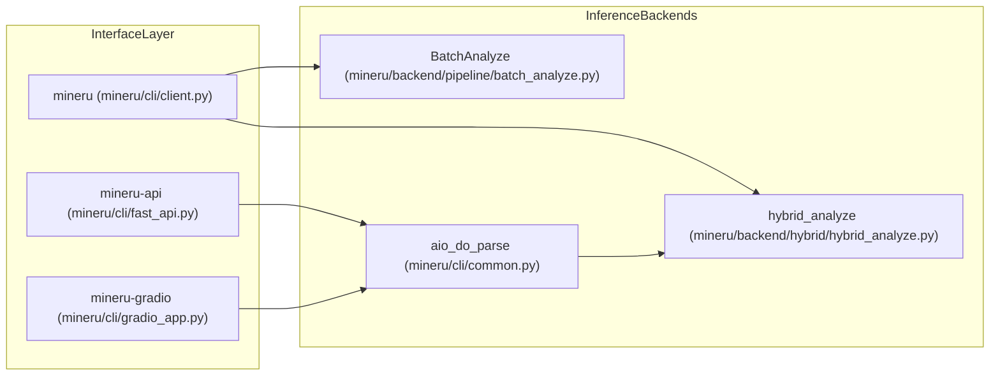

# Glossary

관련 소스 파일

이 위키 페이지를 생성하는 데 컨텍스트로 사용된 파일은 다음과 같습니다:

- [README.md](README.md)
- [README_zh-CN.md](README_zh-CN.md)
- [docs/en/quick_start/index.md](docs/en/quick_start/index.md)
- [docs/zh/quick_start/index.md](docs/zh/quick_start/index.md)
- [mineru/backend/hybrid/hybrid_analyze.py](mineru/backend/hybrid/hybrid_analyze.py)
- [mineru/backend/hybrid/hybrid_magic_model.py](mineru/backend/hybrid/hybrid_magic_model.py)
- [mineru/backend/hybrid/hybrid_model_output_to_middle_json.py](mineru/backend/hybrid/hybrid_model_output_to_middle_json.py)
- [mineru/backend/pipeline/batch_analyze.py](mineru/backend/pipeline/batch_analyze.py)
- [mineru/backend/pipeline/model_init.py](mineru/backend/pipeline/model_init.py)
- [mineru/backend/pipeline/pipeline_magic_model.py](mineru/backend/pipeline/pipeline_magic_model.py)
- [mineru/backend/pipeline/pipeline_middle_json_mkcontent.py](mineru/backend/pipeline/pipeline_middle_json_mkcontent.py)
- [mineru/backend/utils/para_block_utils.py](mineru/backend/utils/para_block_utils.py)
- [mineru/backend/vlm/model_output_to_middle_json.py](mineru/backend/vlm/model_output_to_middle_json.py)
- [mineru/backend/vlm/vlm_magic_model.py](mineru/backend/vlm/vlm_magic_model.py)
- [mineru/backend/vlm/vlm_middle_json_mkcontent.py](mineru/backend/vlm/vlm_middle_json_mkcontent.py)
- [mineru/utils/boxbase.py](mineru/utils/boxbase.py)
- [mineru/utils/char_utils.py](mineru/utils/char_utils.py)
- [mineru/utils/draw_bbox.py](mineru/utils/draw_bbox.py)
- [mineru/utils/enum_class.py](mineru/utils/enum_class.py)
- [mineru/utils/magic_model_utils.py](mineru/utils/magic_model_utils.py)
- [mineru/utils/table_continuation.py](mineru/utils/table_continuation.py)
- [mineru/utils/table_merge.py](mineru/utils/table_merge.py)
- [mineru/utils/title_level_postprocess.py](mineru/utils/title_level_postprocess.py)
- [mineru/utils/visual_magic_model_utils.py](mineru/utils/visual_magic_model_utils.py)
- [pyproject.toml](pyproject.toml)

이 용어 사전은 MinerU 코드베이스 내에서 사용되는 핵심 기술 용어, 데이터 구조 및 도메인 특화 개념을 정의하며, 개념적 문서와 기저의 구현을 연결해 줍니다.

## 핵심 시스템 개념

### 파이프라인 백엔드 (Pipeline Backend)
일련의 특화된 소형 모델을 차례로 사용하는 전통적인 추출 아키텍처입니다. 문서를 복원하기 위해 레이아웃 감지, 수식 인식, OCR을 조정합니다.
*   **로직**: 문서 윈도우를 처리하기 위해 `BatchAnalyze`를 사용하고 [mineru/backend/pipeline/batch_analyze.py:52-81](), 구조 복원을 위해 `MagicModel` (파이프라인 버전)을 사용합니다 [mineru/backend/pipeline/pipeline_magic_model.py:17-127]().
*   **배칭**: `LAYOUT_BASE_BATCH_SIZE` (1), `MFR_BASE_BATCH_SIZE` (16), `OCR_DET_BASE_BATCH_SIZE` (8)와 같이 단계별로 특정 배치 크기를 채택합니다 [mineru/backend/pipeline/batch_analyze.py:38-40]().
*   **모델 관리**: OCR 및 MFR과 같은 모델이 단 한 번만 로드되고 파이프라인 전반에서 공유되도록 보장하기 위해 `AtomModelSingleton`을 사용합니다 [mineru/backend/pipeline/model_init.py:148-188]().

### VLM 백엔드 (VLM Backend)
엔드투엔드 문서 이해를 수행하기 위해 비전-언어 모델 (Vision-Language Models, 예: MinerU2.5-Pro)을 활용하는 현대적인 추출 아키텍처입니다.
*   **구조 복원**: 가공되지 않은 VLM 출력 블록을 정형화된 계층 구조로 변환하기 위해 `MagicModel` (VLM 버전)을 사용합니다 [mineru/backend/vlm/vlm_magic_model.py:29-184]().
*   **콘텐츠 생성**: `union_make` 프로세스 도중에 VLM 출력 유형을 표준화된 `BlockType` 및 `ContentType`으로 매핑합니다 [mineru/backend/vlm/vlm_middle_json_mkcontent.py:162-232]().
*   **텍스트 병합**: 하이픈 및 전각/반각 문자 변환을 처리하면서 스팬들을 결합하기 위해 `merge_para_with_text`를 사용합니다 [mineru/backend/vlm/vlm_middle_json_mkcontent.py:146]().

### 하이브리드 백엔드 (Hybrid Backend)
높은 정확도를 달성하기 위해 VLM 기반 레이아웃 이해와 특화된 파이프라인 모델(OCR, MFR)을 결합한 고급 아키텍처입니다.
*   **로직**: `hybrid_analyze`를 통해 VLM 분석과 특화된 원자(atom) 모델 간의 오케스트레이션을 수행합니다 [mineru/backend/hybrid/hybrid_analyze.py:30-36]().
*   **작업 강도 (Effort Levels)**: `medium` 및 `high` 수준을 지원하며, 여기서 `medium` 수준은 빠른 처리를 유지하기 위해 이미지 분석을 강제로 비활성화합니다 [mineru/backend/hybrid/hybrid_analyze.py:110-122]().
*   **추론 락 (Inference Locks)**: `run_layout_inference`, `run_mfr_inference`, `run_ocr_inference`를 통해 공유 모델의 스레드 안전한 실행을 제공합니다 [mineru/backend/pipeline/model_init.py:41-60]().
*   **MagicModel (Hybrid)**: VLM/레이아웃 감지 결과와 OCR 결과를 병합하여 페이지 구조를 복원합니다 [mineru/backend/hybrid/hybrid_model_output_to_middle_json.py:68-124]().

### 오피스 백엔드 (Office Backend)
오피스 문서(`.docx`, `.pptx`, `.xlsx`)를 위한 특화된 처리 방식입니다.
*   **네이티브 변환**: PDF 렌더링을 우회하고 `DocxConverter` [mineru/model/docx/docx_converter.py:43](), `mammoth` [pyproject.toml:56](), `python-docx` [pyproject.toml:54]() 등의 도구를 사용하여 XML/OOXML 구조를 `middle_json`으로 직접 변환합니다.
*   **속도**: 렌더링 기반의 PDF 파이프라인과 비교하여 상당한 성능 향상(최대 10배)을 제공합니다.

### middle_json
MinerU에서 사용하는 표준화된 중간 표현 양식입니다. 모든 백엔드는 최종 Markdown/JSON을 생성하기 전에 가공되지 않은 모델 출력을 이 스키마로 변환합니다.
*   **표준화**: 다양한 모델 출력 결과를 `pdf_info`, `_backend`, `_effort`, `_version_name`을 포함하는 통일된 구조로 변환합니다 [mineru/backend/hybrid/hybrid_model_output_to_middle_json.py:181-190]().

**Sources:** [mineru/backend/pipeline/batch_analyze.py:38-81](), [mineru/backend/hybrid/hybrid_analyze.py:110-122](), [mineru/backend/pipeline/model_init.py:41-188](), [mineru/backend/vlm/vlm_middle_json_mkcontent.py:146-232](), [mineru/backend/hybrid/hybrid_model_output_to_middle_json.py:181-190](), [mineru/backend/vlm/vlm_magic_model.py:29-184]()

---

## 데이터 흐름 및 아키텍처

다음 다이어그램은 입력 유형, 처리 백엔드 및 통합된 출력 생성 간의 관계를 보여줍니다.

### 데이터 변환 수명 주기

**Sources:** [mineru/backend/pipeline/batch_analyze.py:52](), [mineru/backend/hybrid/hybrid_analyze.py:30](), [mineru/backend/hybrid/hybrid_model_output_to_middle_json.py:181](), [mineru/utils/enum_class.py:89-93](), [mineru/backend/vlm/vlm_analyze.py:30]()

---

## 도메인 용어

### MFD (Mathematical Formula Detection)
페이지 이미지 내에서 수학 수식의 위치를 찾는 프로세스입니다.
*   **구현**: `BatchAnalyze` 내의 `formula_enable` 플래그를 통해 제어됩니다 [mineru/backend/pipeline/batch_analyze.py:66]().

### MFR (Mathematical Formula Recognition)
감지된 수식 이미지를 LaTeX 문자열로 변환하는 프로세스입니다.
*   **모델**: `unimernet_small` 및 `pp_formulanet_plus_m`을 지원합니다 [mineru/backend/pipeline/model_init.py:114-123]().
*   **추론**: 리소스 경합을 처리하기 위해 `run_mfr_inference`를 통해 통제됩니다 [mineru/backend/pipeline/model_init.py:49-53]().

### 레이아웃 분석 (Layout Analysis)
페이지 영역을 `text`, `title`, `figure`, `table`, 또는 `formula`와 같은 카테고리로 분류하는 작업입니다.
*   **블록 유형**: `BlockType` [mineru/utils/enum_class.py:4-50]()에 정의되어 있으며, `abstract`, `doc_title`, `vertical_text`와 같은 특화된 유형들을 포함합니다.
*   **매핑**: `MEDIUM_EFFORT_LAYOUT_LABEL_TO_VLM_TYPE`는 하이브리드 백엔드에서 파이프라인 레이아웃 라벨을 VLM 유형에 매핑합니다 [mineru/backend/hybrid/hybrid_analyze.py:83-107]().
*   **PP-DocLayoutV2**: 파이프라인 백엔드에서 레이아웃 감지를 위해 사용하는 기본 모델입니다 [mineru/backend/pipeline/model_init.py:126-130]().

### 읽기 순서 (Reading Order)
감지된 레이아웃 블록들을 사람이 읽을 수 있는 순서로 정렬하는 로직입니다.
*   **구현**: 블록은 `middle_json` 내의 `index` 속성에 따라 정렬됩니다 [mineru/backend/hybrid/hybrid_model_output_to_middle_json.py:116]().

### 표 인식 (Table Recognition, TabRec)
표 구조(행, 열, 셀)를 식별하는 프로세스입니다.
*   **모델**: `slanet_plus` (선 없음, Wireless) 및 `unet_structure` (선 있음, Wired)를 포함합니다 [mineru/utils/enum_class.py:105-106]().
*   **방향**: `MineruTableOrientationClsModel` [mineru/backend/pipeline/model_init.py:81]()이 표의 회전 감지를 처리합니다.
*   **페이지 간 병합**: `middle_json` 완료 단계에서 `cross_page_table_merge`를 통해 관리됩니다 [mineru/backend/hybrid/hybrid_model_output_to_middle_json.py:16]().

---

## 구현 구성 요소

MinerU는 싱글톤 패턴을 사용하여 무거운 ML 모델을 메모리에서 관리하며, 스레드 안전한 초기화 및 리소스 공유를 보장합니다.

| 클래스 | 목적 | 파일 포인터 |
| :--- | :--- | :--- |
| `AtomModelSingleton` | 파이프라인 모델(OCR, MFD, MFR, Layout) 관리 | [mineru/backend/pipeline/model_init.py:148-188]() |
| `PytorchPaddleOCR` | 문자 감지/인식을 위해 PaddleOCR을 PyTorch로 포팅한 버전 | [mineru/model/ocr/pytorch_paddle.py]() |
| `HybridModelSingleton` | 하이브리드 전용 파이프라인 모델을 위한 싱글톤 래퍼 | [mineru/backend/pipeline/model_init.py:22]() |
| `ModelSingleton` | VLM 백엔드 모델을 위한 수명 주기 관리 | [mineru/backend/vlm/vlm_analyze.py:31]() |

### 콘텐츠 생성
최종 출력 생성은 `middle_json`을 대상 형식으로 변환하는 `union_make` 함수에 의해 처리됩니다.

| 엔티티 | 역할 | 파일 포인터 |
| :--- | :--- | :--- |
| `union_make` (VLM) | VLM 출력에서 Markdown 및 JSON 렌더링 | [mineru/backend/vlm/vlm_middle_json_mkcontent.py]() |
| `merge_para_with_text` | 하이픈 처리를 적용하면서 스팬들을 단락으로 결합하는 핵심 유틸리티 | [mineru/backend/vlm/vlm_middle_json_mkcontent.py:146]() |
| `blocks_to_page_info` | MagicModel 블록을 middle_json 페이지 구조로 변환 | [mineru/backend/hybrid/hybrid_model_output_to_middle_json.py:52-124]() |

---

## 실행 엔티티 맵

다음 다이어그램은 사용자용 인터페이스를 기저의 오케스트레이션 및 추론 레이어에 매핑합니다.

### 엔트리포인트에서 추론으로의 매핑

**Sources:** [pyproject.toml:128-136](), [mineru/backend/pipeline/batch_analyze.py:52](), [mineru/backend/hybrid/hybrid_analyze.py:30]()

---

## 약어 및 상수

*   **MFD**: Mathematical Formula Detection (수학 수식 감지).
*   **MFR**: Mathematical Formula Recognition (수학 수식 인식).
*   **VLM**: Vision-Language Model (비전-언어 모델).
*   **MM_MD**: Multi-Modal Markdown (이미지/표 링크 포함) [mineru/utils/enum_class.py:90]().
*   **NLP_MD**: NLP 작업에 최적화된 텍스트 전용 Markdown [mineru/utils/enum_class.py:91]().
*   **BlockType**: 페이지 요소를 분류하기 위한 클래스 [mineru/utils/enum_class.py:4-50]().
*   **ContentType**: 세밀한 스팬 콘텐츠 분류를 위한 클래 [mineru/utils/enum_class.py:51-60]().
*   **ModelPath**: HF/ModelScope의 모델 가중치에 대한 중앙 집중식 레지스트리 [mineru/utils/enum_class.py:96-108]().
*   **MFR_BASE_BATCH_SIZE**: 수식 인식을 위한 기본 배치 크기 (16) [mineru/backend/pipeline/batch_analyze.py:39]().
*   **OCR_DET_BASE_BATCH_SIZE**: OCR 감지를 위한 기본 배치 크기 (8) [mineru/backend/pipeline/batch_analyze.py:40]().
*   **LAYOUT_BASE_BATCH_SIZE**: 레이아웃 추론을 위한 기본 배치 크기 (1) [mineru/backend/pipeline/batch_analyze.py:38]().

**Sources:** [mineru/utils/enum_class.py:1-134](), [mineru/backend/pipeline/batch_analyze.py:38-40]()
