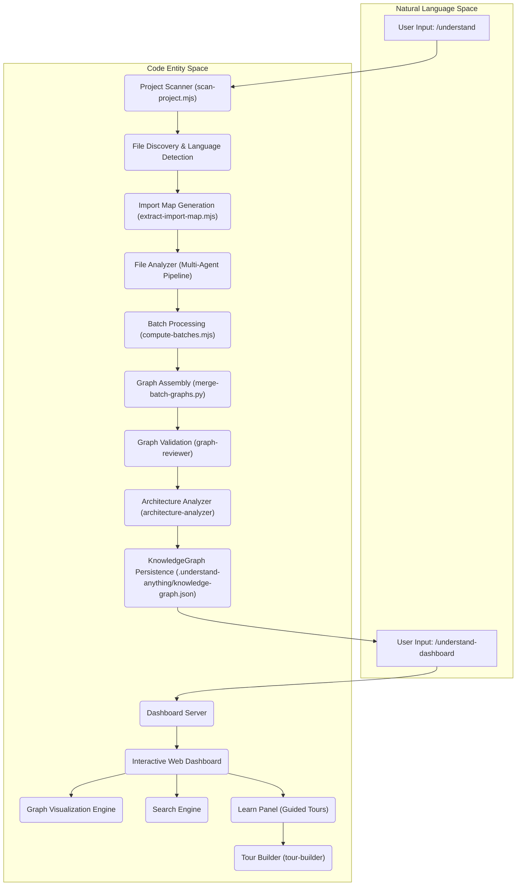
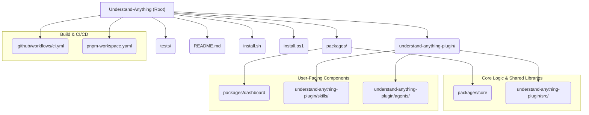

# 개요

<details>
<summary>관련 소스 파일</summary>

다음 파일들은 이 위키 페이지를 생성하기 위한 맥락으로 사용되었습니다.

- [.claude-plugin/marketplace.json](.claude-plugin/marketplace.json)
- [.claude-plugin/plugin.json](.claude-plugin/plugin.json)
- [.copilot-plugin/plugin.json](.copilot-plugin/plugin.json)
- [.cursor-plugin/plugin.json](.cursor-plugin/plugin.json)
- [.github/workflows/ci.yml](.github/workflows/ci.yml)
- [.gitignore](.gitignore)
- [.npmrc](.npmrc)
- [README.md](README.md)
- [READMEs/README.es-ES.md](READMEs/README.es-ES.md)
- [READMEs/README.ja-JP.md](READMEs/README.ja-JP.md)
- [READMEs/README.ko-KR.md](READMEs/README.ko-KR.md)
- [READMEs/README.tr-TR.md](READMEs/README.tr-TR.md)
- [READMEs/README.zh-CN.md](READMEs/README.zh-CN.md)
- [READMEs/README.zh-TW.md](READMEs/README.zh-TW.md)
- [install.ps1](install.ps1)
- [install.sh](install.sh)
- [package.json](package.json)
- [pnpm-workspace.yaml](pnpm-workspace.yaml)
- [tsconfig.json](tsconfig.json)
- [understand-anything-plugin/.claude-plugin/plugin.json](understand-anything-plugin/.claude-plugin/plugin.json)
- [understand-anything-plugin/package.json](understand-anything-plugin/package.json)

</details>


Understand Anything은 모든 코드베이스, 지식 베이스, 문서를 대화형 지식 그래프로 변환하도록 설계된 AI 기반 플러그인입니다. 이 그래프를 통해 사용자는 프로젝트를 탐색하고, 검색하고, 질문할 수 있으며, 여러 구성 요소가 서로 어떻게 맞물리는지 포괄적으로 이해할 수 있습니다 [README.md:3-5](). 이 시스템은 멀티 에이전트 파이프라인을 사용해 프로젝트를 분석하고, 파일, 함수, 클래스, 의존성에 대한 상세한 지식 그래프를 구축합니다 [README.md:46-47](). 그런 다음 결과는 시각적 탐색을 위한 대화형 대시보드로 제공됩니다 [README.md:47-48]().

이 페이지는 Understand Anything, 엔드투엔드 워크플로, 모노레포 구조, 주요 하위 시스템 링크에 대한 상위 수준 소개를 제공합니다. 또한 설치, 지원 플랫폼, 핵심 명령도 다룹니다. 설치와 초기 설정에 대한 자세한 안내는 [시작하기 및 설치](#1.1)를 참조하세요. 프로젝트의 디렉터리 구조를 이해하려면 [저장소 구조 및 모노레포 레이아웃](#1.2)을 참조하세요. 사용 가능한 명령과 사용법의 전체 목록은 [스킬 참조](#1.3)를 확인하세요.

## 작동 방식: 엔드투엔드 흐름

Understand Anything은 프로젝트를 처리하고 지식 그래프를 생성하는 멀티 에이전트 파이프라인을 통해 동작합니다. 핵심 프로세스는 프로젝트 스캔, 구조 정보 추출, 콘텐츠 분석, 그리고 이 정보를 탐색 가능한 그래프로 조립하는 단계로 이루어집니다.

프로세스는 분석을 시작하는 `/understand` 명령으로 시작됩니다. 멀티 에이전트 파이프라인이 프로젝트를 스캔하고 모든 파일, 함수, 클래스, 의존성을 추출한 다음, `.understand-anything/knowledge-graph.json`에 저장되는 지식 그래프를 구축합니다 [README.md:119-120](). 이후 이 그래프는 대화형 웹 인터페이스를 실행하는 `/understand-dashboard` 명령으로 탐색할 수 있습니다 [README.md:140-143]().

### 다이어그램: Understand Anything 엔드투엔드 흐름


출처: [README.md:46-48](), [README.md:119-120](), [README.md:140-143]()

## 모노레포 레이아웃

Understand Anything 프로젝트는 pnpm 모노레포로 구성되어 있으며, 단일 저장소 안에서 서로 의존하는 여러 패키지를 관리하는 데 도움이 됩니다. 이 설정은 공유 코드, 일관된 도구 체계, 간소화된 개발 워크플로를 가능하게 합니다.

주요 패키지에는 `@understand-anything/core`와 `@understand-anything/dashboard`가 포함됩니다. `understand-anything-plugin` 디렉터리에는 스킬과 에이전트를 포함해 플러그인 자체의 핵심 로직이 들어 있습니다 [understand-anything-plugin/package.json:1-2]().

`packages/core`, `packages/dashboard`, `src/`, `skills/`, `agents/`, `hooks/`, 루트 테스트 스위트를 포함한 저장소 구조의 자세한 분석은 [저장소 구조 및 모노레포 레이아웃](#1.2)을 참조하세요.

### 다이어그램: 모노레포 구조


출처: [pnpm-workspace.yaml:1-5](), [understand-anything-plugin/package.json:1-2](), [install.sh:1-200](), [install.ps1:1-198](), [README.md:1-37]()

## 설치 및 지원 플랫폼

Understand Anything은 다양한 AI 코딩 플랫폼에서 높은 호환성을 갖도록 설계되었습니다. Claude Code, Cursor, Copilot과 기타 CLI 기반 AI 어시스턴트 같은 환경에 플러그인으로 설치할 수 있습니다.

### 빠른 시작 설치

시작하려면 일반적으로 마켓플레이스에서 플러그인을 추가한 뒤 설치합니다. Claude Code의 명령은 다음과 같습니다.
```bash
/plugin marketplace add Lum1104/Understand-Anything
/plugin install understand-anything
```
[README.md:109-111]()

Codex, OpenCode, Gemini CLI, VS Code Copilot 같은 다른 플랫폼의 경우 macOS/Linux와 Windows용 한 줄 설치 스크립트가 제공됩니다 [README.md:184-197](). 이 스크립트는 저장소를 `~/.understand-anything/repo`에 클론하고 선택한 플랫폼에 대한 심볼릭 링크를 생성합니다 [README.md:198-199]().

구성 및 문제 해결을 포함해 지원되는 각 플랫폼별 상세 단계별 설치 가이드는 [시작하기 및 설치](#1.1)를 참조하세요.

### 지원 플랫폼

Understand Anything은 다양한 AI 코딩 플랫폼을 지원합니다.

*   **Claude Code**: 마켓플레이스를 통한 네이티브 지원 [README.md:178-182]()
*   **Cursor**: `.cursor-plugin/plugin.json`을 통한 자동 검색 [README.md:205-207]()
*   **VS Code + GitHub Copilot**: `.copilot-plugin/plugin.json`을 통한 자동 검색 [README.md:211-213]()
*   **Copilot CLI**: `copilot plugin install`을 통한 설치 [README.md:217-219]()
*   **Codex, OpenCode, OpenClaw, Antigravity, Gemini CLI, Pi Agent, Vibe CLI, Hermes, Cline, KIMI CLI**: `install.sh` 또는 `install.ps1` 스크립트를 통해 지원 [README.md:184-203]()

출처: [README.md:109-111](), [README.md:178-219](), [.claude-plugin/plugin.json:1-18](), [.cursor-plugin/plugin.json:1-15](), [.copilot-plugin/plugin.json:1-14]()

## 핵심 명령과 스킬

Understand Anything은 코드베이스와 생성된 지식 그래프와 상호작용하기 위한 슬래시 명령(스킬) 모음을 제공합니다. 이러한 명령을 통해 사용자는 특정 정보를 분석, 시각화, 대화, 추출할 수 있습니다.

주요 명령은 프로젝트 분석과 지식 그래프 생성을 트리거하는 `/understand`입니다 [README.md:116](). 그래프가 구축되면 `/understand-dashboard`가 대화형 시각화를 실행합니다 [README.md:140]().

다른 핵심 명령은 다음과 같습니다.
*   `/understand-chat`: 코드베이스에 대해 질문하기 [README.md:144-145]()
*   `/understand-diff`: 현재 변경 사항의 영향 분석 [README.md:147-148]()
*   `/understand-explain [file/function]`: 특정 파일이나 함수를 심층 분석 [README.md:150-151]()
*   `/understand-onboard`: 새 팀원을 위한 온보딩 가이드 생성 [README.md:153-154]()
*   `/understand-domain`: 비즈니스 도메인 지식(도메인, 흐름, 단계) 추출 [README.md:156-157]()
*   `/understand-knowledge [path/to/wiki]`: Karpathy-pattern LLM Wiki 지식 베이스 분석 [README.md:159-160]()

모든 사용자 대상 슬래시 명령, 인자, 플래그, 예상 출력에 대한 전체 참조는 [스킬 참조](#1.3)를 참조하세요.

출처: [README.md:116](), [README.md:140](), [README.md:144-160]()
