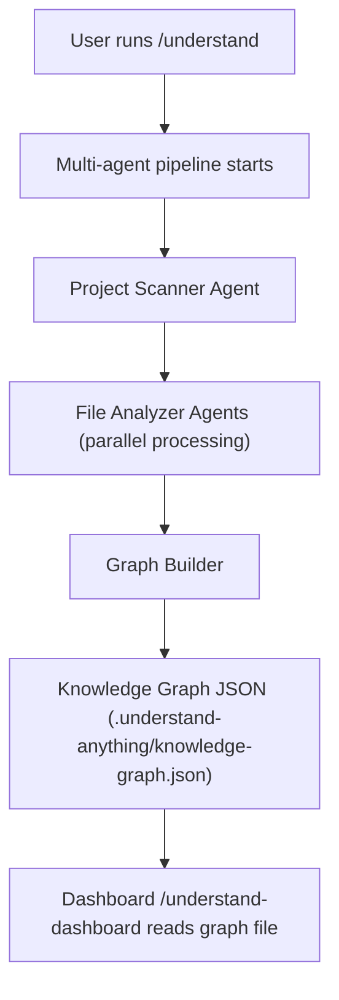
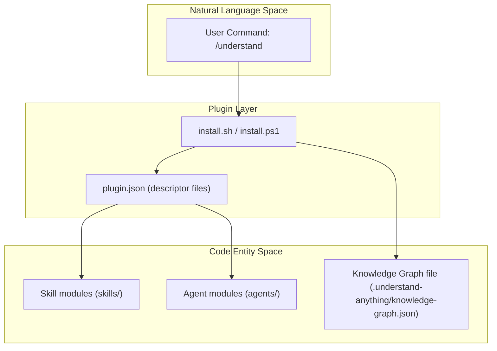

# 시작하기 및 설치

<details>
<summary>관련 소스 파일</summary>

다음 파일들은 이 위키 페이지를 생성하기 위한 맥락으로 사용되었습니다.

- [.claude-plugin/marketplace.json](.claude-plugin/marketplace.json)
- [.claude-plugin/plugin.json](.claude-plugin/plugin.json)
- [.copilot-plugin/plugin.json](.copilot-plugin/plugin.json)
- [.cursor-plugin/plugin.json](.cursor-plugin/plugin.json)
- [.github/workflows/deploy-homepage.yml](.github/workflows/deploy-homepage.yml)
- [CONTRIBUTING.md](CONTRIBUTING.md)
- [README.md](README.md)
- [READMEs/README.es-ES.md](READMEs/README.es-ES.md)
- [READMEs/README.ja-JP.md](READMEs/README.ja-JP.md)
- [READMEs/README.ko-KR.md](READMEs/README.ko-KR.md)
- [READMEs/README.tr-TR.md](READMEs/README.tr-TR.md)
- [READMEs/README.zh-CN.md](READMEs/README.zh-CN.md)
- [READMEs/README.zh-TW.md](READMEs/README.zh-TW.md)
- [homepage/public/images/overview-domain.gif](homepage/public/images/overview-domain.gif)
- [homepage/public/images/overview-structural.gif](homepage/public/images/overview-structural.gif)
- [install.ps1](install.ps1)
- [install.sh](install.sh)
- [understand-anything-plugin/.claude-plugin/plugin.json](understand-anything-plugin/.claude-plugin/plugin.json)
- [understand-anything-plugin/package.json](understand-anything-plugin/package.json)

</details>


이 섹션은 macOS/Linux와 Windows를 포함한 여러 지원 플랫폼에서 **Understand Anything** 플러그인을 설치하고 구성하는 포괄적인 단계별 가이드를 제공합니다. 또한 초기 사용법과 Claude Code, Cursor, GitHub Copilot 등 널리 쓰이는 AI 코딩 환경과의 통합도 다룹니다. 멀티 에이전트 분석 파이프라인을 실행하는 초기 `/understand` 명령을 실행하는 방법을 자세히 설명하고, 설치 스크립트와 플러그인 검색 메커니즘의 핵심 구현 세부 사항을 설명합니다.

---

## 1. 소개

**Understand Anything**은 모든 코드베이스, 지식 베이스, 문서를 분석하여 대화형 지식 그래프로 변환하도록 설계된 AI 기반 플러그인입니다. 여러 AI 플랫폼에서 동작하며, 프로젝트에서 의미론적 구조를 추출하고 지식 그래프를 구축한 뒤 탐색용 대화형 대시보드를 제공하는 멀티 에이전트 파이프라인을 통합합니다.

지원 플랫폼은 다음과 같습니다.

- Claude Code(네이티브 플러그인 마켓플레이스)
- Cursor
- GitHub Copilot(VS Code 확장)
- Copilot CLI
- Codex, OpenCode, Gemini CLI 및 다양한 독점 CLI

이 가이드는 명시적인 설치 지침, 설치 스크립트가 내부적으로 동작하는 방식, 플랫폼별 플러그인 구성 파일 개요를 제공합니다.

---

## 2. macOS/Linux에서 설치

### 2.1. 한 줄 설치 프로그램(`install.sh`)

셸 스크립트 `install.sh`는 macOS/Linux 터미널에서 빠른 설치를 가능하게 합니다. 이 설치 프로그램은 다음을 수행합니다.

- 저장소를 사용자 홈 디렉터리의 `~/.understand-anything/repo`에 클론합니다.
- 관련 플러그인 파일에 대한 플랫폼별 심볼릭 링크를 생성합니다.
- 대화형 선택을 건너뛰기 위한 직접 플랫폼 인자를 지원합니다.
- 업데이트 및 제거 명령을 지원합니다.

#### 설치 명령 예시:

```bash
curl -fsSL https://raw.githubusercontent.com/Lum1104/Understand-Anything/main/install.sh | bash
```

또는 플랫폼을 직접 지정하려면(예: `codex`):

```bash
curl -fsSL https://raw.githubusercontent.com/Lum1104/Understand-Anything/main/install.sh | bash -s codex
```

#### 사용 옵션:

- `--update` : 기존에 클론된 저장소를 최신 상태로 업데이트합니다.
- `--uninstall <platform>` : 지정한 플랫폼에 설치된 symlink를 제거합니다.

#### 설치 흐름:

1. 저장소가 아직 없으면 클론합니다.
2. 선택한 플랫폼과 일치하는 플러그인 디렉터리를 가리키는 심볼릭 링크를 `~/.understand-anything/`에 생성합니다.
3. 사용자에게 터미널 또는 IDE 세션을 다시 시작하라고 알립니다.

*이 스크립트는 여러 AI CLI 전반에서 매끄럽게 통합되도록 이 다단계 설정을 자동화합니다.*

---

## 3. Windows(PowerShell)에서 설치

Windows 사용자는 동등한 작업을 수행하는 `install.ps1`을 실행하는 제공된 PowerShell 한 줄 명령으로 설치할 수 있습니다.

```powershell
iwr -useb https://raw.githubusercontent.com/Lum1104/Understand-Anything/main/install.ps1 | iex
```

이 스크립트는 저장소를 동일한 사용자 로컬 경로에 클론하고, 선택한 플랫폼에 필요에 따라 Windows symlink 또는 junction을 설정합니다.

두 설치 스크립트는 다음을 처리합니다.

- 최신 안정 릴리스 가져오기(작성 시점 기준 `v2.7.6`).
- 환경 및 플러그인 등록 파일 설정.
- 플랫폼별 구성 연결.

---

## 4. 지원 플랫폼 및 플러그인 구성

각 플랫폼은 자동 검색과 통합을 위해 특수 폴더 안의 플러그인 descriptor JSON을 사용합니다.

| 플랫폼      | Descriptor 경로                      | 설명                                                       |
|---------------|------------------------------------|------------------------------------------------------------------|
| Claude Code   | `.claude-plugin/plugin.json`       | 메타데이터, 버전, 키워드가 포함된 네이티브 플러그인입니다.              |
| Cursor        | `.cursor-plugin/plugin.json`        | 저장소가 클론되면 Cursor가 이 파일을 자동으로 감지합니다. |
| VS Code + GitHub Copilot  | `.copilot-plugin/plugin.json`     | 설치 후 VSCode의 GitHub Copilot이 자동으로 검색합니다.  |
| Copilot CLI   | `.copilot-plugin/plugin.json`      | CLI 플러그인 등록에 사용되는 동일한 descriptor입니다.                 |

### plugin.json 구조 예시(공통 요소):

```json
{
  "name": "understand-anything",
  "description": "AI-powered codebase understanding — analyze, visualize, and explain any project",
  "version": "2.7.6",
  "author": {
    "name": "Lum1104"
  },
  "homepage": "https://github.com/Lum1104/Understand-Anything",
  "repository": "https://github.com/Lum1104/Understand-Anything",
  "license": "MIT",
  "keywords": [
    "codebase-analysis",
    "knowledge-graph",
    "architecture",
    "onboarding",
    "dashboard"
  ],
  "skills": "./understand-anything-plugin/skills/",
  "agents": "./understand-anything-plugin/agents/"
}
```

Claude Code와 Cursor에서는 이 `plugin.json`의 존재로 저장소가 자동 등록됩니다.

---

## 5. 첫 `/understand` 명령 실행

설치 후 다음 명령을 실행하여 프로젝트의 초기 분석을 시작합니다.

```bash
/understand
```

이 명령은 다음을 트리거합니다.

- 프로젝트 디렉터리를 스캔하는 멀티 에이전트 파이프라인 실행.
- 파일, 함수, 클래스, 의존성 추출.
- `.understand-anything/knowledge-graph.json`에 저장되는 지식 그래프 구축.
- 선택적 `--language` 매개변수를 존중한 현지화 출력(지원: `en`, `zh`, `zh-TW`, `ja`, `ko`, `ru`).

중국어 콘텐츠를 생성하는 예시는 다음과 같습니다.

```bash
/understand --language zh
```

언어 오버라이드 없이 처음 `/understand`를 실행하면 대화 언어를 감지하고, 영어가 아닐 경우 확인을 요청합니다. 선택 내용은 `.understand-anything/config.json`에 저장됩니다.

---

## 6. 플러그인 명령 호출 흐름 및 데이터 이동

### `/understand` 명령의 단순화된 흐름:



- **Multi-agent pipeline**은 서로 다른 에이전트가 파일 스캔, 소스 코드 구문 분석, 중간 결과 병합 같은 여러 단계에 특화되는 분산 프로세스입니다.
- 이 파이프라인은 코드 엔터티, 관계, 의미론적 요약을 포착하는 구조화된 **Knowledge Graph**를 출력합니다.
- 그래프 파일은 대화형 탐색을 위해 대시보드 UI에서 사용됩니다.

출처: `README.md:104-148`, `.claude-plugin/plugin.json`, `.cursor-plugin/plugin.json`, `.copilot-plugin/plugin.json`.

---

## 7. 설치 스크립트: 구현 개요

### 7.1 `install.sh`(macOS/Linux)

- 저장소를 `~/.understand-anything/repo`에 클론합니다.
- 플랫폼 인자가 제공되지 않으면 대화형 프롬프트를 표시합니다.
- 선택한 플랫폼 이름으로 `~/.understand-anything` 안에 symlink를 생성해 플러그인 소스 폴더에 연결합니다.
- 업데이트 및 제거 플래그를 처리합니다.
- 적절한 권한과 경로 환경 가정을 보장합니다.

### 7.2 `install.ps1`(Windows PowerShell)

- Windows 환경에 맞게 조정된 `install.sh`와 동등한 스크립트입니다.
- 다운로드에는 `Invoke-WebRequest`, symlink에는 `New-Item` 및 `New-Item -ItemType Junction` 또는 `SymbolicLink` 같은 PowerShell 명령을 사용합니다.
- 플랫폼 선택을 유사하게 처리하고 안내를 출력합니다.

---

## 8. 플랫폼-코드 엔터티 매핑 다이어그램

이 다이어그램은 자연어 플랫폼 명령이 저장소 내부의 코드 엔터티 및 파일과 어떻게 대응되는지 보여줍니다.

```mermaid
flowchart LR
  subgraph "Natural Language Space"
    UC["/understand Command"]
    UD["/understand-dashboard Command"]
    US["/understand-skill Commands (chat, diff, explain…)"]
  end

  subgraph "Platform Plugin Layer"
    PC[".claude-plugin/plugin.json"]
    CC[ ".cursor-plugin/plugin.json" ]
    CP[ ".copilot-plugin/plugin.json" ]
  end

  subgraph "Repository Source Code"
    SK[ "understand-anything-plugin/skills/*" ]
    AG[ "understand-anything-plugin/agents/*" ]
    IS[ "install.sh & install.ps1" ]
  end

  UC --> PC
  UD --> PC
  US --> PC

  PC --> SK
  PC --> AG

  CC --> SK
  CC --> AG
  
  CP --> SK
  CP --> AG
  
  IS --> PC
  IS --> CC
  IS --> CP
```

---

## 9. 설치 후: 권장 다음 단계

1. **터미널 또는 IDE 다시 시작**: 플러그인 경로와 symlink가 로드되도록 합니다.
2. **`/understand` 실행**: 프로젝트에서 첫 코드베이스 분석을 시작합니다.
3. **`/understand-dashboard` 실행**: 지식 그래프를 시각화하고 탐색하기 위한 대화형 웹 기반 대시보드를 엽니다.
4. **다른 명령 탐색**: 자연어 Q&A를 위한 `/understand-chat`, 변경 영향 분석을 위한 `/understand-diff`, 심층 분석을 위한 `/understand-explain` 등이 있습니다.
5. **지속적 업데이트 구성**: 선택적으로 post-commit hook을 설정하거나 `/understand --auto-update`를 실행해 증분 그래프 유지 관리를 수행합니다.

---

## 요약

- **macOS/Linux와 Windows용 한 줄 스크립트를 통해 여러 플랫폼에서 설치가 지원됩니다.**
- **플랫폼별 플러그인 descriptor JSON 파일을 통해 지원되는 IDE와 CLI에서 자동 검색이 가능합니다.**
- **`/understand` 명령은 코드 분석을 위한 멀티 에이전트 파이프라인을 실행하여 로컬에 지식 그래프 파일을 생성합니다.**
- **대화형 시각화는 `/understand-dashboard`를 통해 사용할 수 있습니다.**
- **설치 스크립트는 수동 설정을 최소화하기 위해 클론, 링크, 구성을 자동화합니다.**

---

# 부록: 핵심 파일 참조

| 파일명 | 설명 |
|----------|--------------|
| `README.md:104-148` | 빠른 시작 명령과 상위 수준 설치 지침 |
| `.claude-plugin/plugin.json:1-18` | Claude Code 플러그인 descriptor 메타데이터 |
| `.cursor-plugin/plugin.json:1-15` | 자동 검색을 위한 Cursor 플러그인 descriptor |
| `.copilot-plugin/plugin.json:1-14` | VS Code용 GitHub Copilot 플러그인 descriptor |
| `install.sh` | macOS/Linux에서 저장소를 클론하고 symlink를 생성하며 플러그인 설치를 준비하는 셸 스크립트 |
| `install.ps1` | Windows에서 유사한 설치를 수행하는 PowerShell 스크립트 |

---

# 추가 Mermaid 다이어그램

### 플랫폼 호출 명령과 코드 엔터티 연결



---

**출처:**  
`README.md:104-148`  
`.claude-plugin/plugin.json`  
`.cursor-plugin/plugin.json`  
`.copilot-plugin/plugin.json`  
`install.sh`  
`install.ps1`
