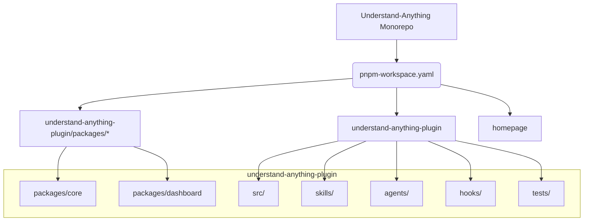
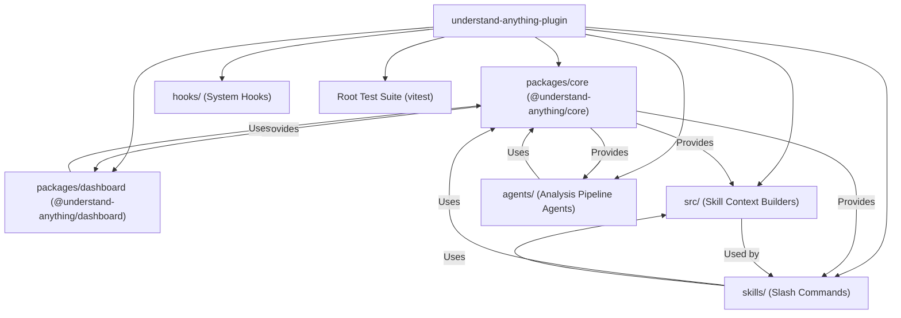
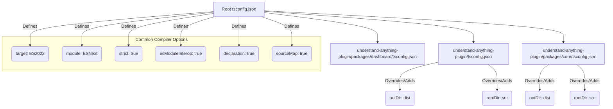

# 저장소 구조 및 모노레포 레이아웃

<details>
<summary>관련 소스 파일</summary>

다음 파일들은 이 위키 페이지를 생성하기 위한 맥락으로 사용되었습니다.

- [.github/workflows/ci.yml](.github/workflows/ci.yml)
- [.gitignore](.gitignore)
- [.npmrc](.npmrc)
- [package.json](package.json)
- [pnpm-workspace.yaml](pnpm-workspace.yaml)
- [tsconfig.json](tsconfig.json)
- [understand-anything-plugin/packages/core/tsconfig.json](understand-anything-plugin/packages/core/tsconfig.json)
- [understand-anything-plugin/packages/core/vitest.config.ts](understand-anything-plugin/packages/core/vitest.config.ts)
- [understand-anything-plugin/tsconfig.json](understand-anything-plugin/tsconfig.json)

</details>


이 페이지는 pnpm workspaces를 사용해 관리되는 Understand Anything 프로젝트의 모노레포 구조를 자세히 설명합니다. 패키지 구성, 핵심 디렉터리, 빌드 프로세스, TypeScript 구성, ESLint 설정을 개괄합니다.

## 모노레포 개요

Understand Anything 프로젝트는 pnpm 모노레포로 구성되어 있어 서로 의존하는 여러 패키지와 애플리케이션을 효율적으로 관리할 수 있습니다. `pnpm-workspace.yaml` 파일은 workspace 루트를 정의합니다 [pnpm-workspace.yaml:1-3]().

```yaml
# pnpm-workspace.yaml
packages:
  - 'understand-anything-plugin/packages/*'
  - 'understand-anything-plugin'
  - 'homepage'
```
출처: [pnpm-workspace.yaml:1-3]()

이 구성은 세 가지 주요 workspace 루트를 나타냅니다.
1.  `understand-anything-plugin/packages/*`: 이 glob 패턴은 `understand-anything-plugin/packages/` 안의 모든 하위 디렉터리를 개별 pnpm 패키지로 포함합니다. 공유 라이브러리와 핵심 구성 요소가 위치하는 곳입니다.
2.  `understand-anything-plugin`: Understand Anything 도구의 기본 애플리케이션 로직과 진입점을 포함할 가능성이 높은 메인 플러그인 디렉터리 자체를 가리킵니다.
3.  `homepage`: 프로젝트의 마케팅 웹사이트를 가리킵니다.

### 다이어그램: 모노레포 Workspace 레이아웃


출처: [pnpm-workspace.yaml:1-3]()

## 핵심 디렉터리 및 패키지

Understand Anything 도구의 주요 기능 구성 요소는 `understand-anything-plugin` 디렉터리 안에 있습니다. 이 디렉터리에는 여러 핵심 하위 디렉터리와 pnpm 패키지가 포함되어 있습니다.

### `packages/core`

이 디렉터리(`understand-anything-plugin/packages/core`)에는 `@understand-anything/core` 패키지가 있습니다. 기본 타입, 스키마 검증, 그래프 구성 로직, 검색 기능, 영속화 메커니즘, 플러그인 아키텍처를 포함하는 공유 TypeScript 라이브러리입니다. 시스템의 다른 부분에 중요한 의존성입니다.

### `packages/dashboard`

이 디렉터리(`understand-anything-plugin/packages/dashboard`)에는 `@understand-anything/dashboard` 패키지가 있습니다. 생성된 Knowledge Graph를 탐색하기 위한 그래픽 인터페이스를 제공하는 React 기반 대화형 시각화 대시보드입니다. 데이터 API 미들웨어가 포함된 Vite 개발 서버를 포함합니다.

### `src/`

`src/` 디렉터리(`understand-anything-plugin/src/`)에는 다양한 스킬을 위한 context를 구축하는 TypeScript 모듈이 포함되어 있습니다. `context-builder`, `diff-analyzer`, `explain-builder` 같은 이러한 모듈은 LLM 상호작용과 사용자 질의에 필요한 관련 정보를 생성하는 데 중요합니다.

### `skills/`

이 디렉터리(`understand-anything-plugin/skills/`)에는 다양한 사용자 대상 슬래시 명령(예: `/understand`, `/understand-dashboard`)의 구현이 들어 있을 가능성이 높습니다. 이러한 스크립트는 특정 작업을 수행하기 위해 core 라이브러리와 다른 구성 요소의 사용을 조율합니다.

### `agents/`

`agents/` 디렉터리(`understand-anything-plugin/agents/`)에는 코드베이스를 KnowledgeGraph로 변환하는 멀티 에이전트 파이프라인의 로직이 포함될 것으로 예상됩니다. 여기에는 `project-scanner`, `file-analyzer` 같은 에이전트가 포함됩니다.

### `hooks/`

`hooks/` 디렉터리(`understand-anything-plugin/hooks/`)는 `PostToolUse`, `SessionStart` 같은 작업의 트리거를 정의하는 `hooks.json` 등 시스템 hook을 관리합니다. 또한 자동 업데이트 메커니즘과도 관련됩니다.

### 루트 테스트 스위트

루트 `package.json`은 `vitest run`을 실행하는 `test` 스크립트를 정의합니다 [package.json:32](). 이 명령은 전체 모노레포에 걸쳐 테스트를 실행하여 모든 구성 요소의 무결성을 보장합니다. 개별 패키지도 `understand-anything-plugin/packages/core/vitest.config.ts`처럼 자체 테스트 구성을 가질 수 있습니다 [understand-anything-plugin/packages/core/vitest.config.ts:1-7]().

### 다이어그램: `understand-anything-plugin` 내부 구조


출처: [pnpm-workspace.yaml:1-3](), [package.json:32](), [understand-anything-plugin/packages/core/vitest.config.ts:1-7]()

## 빌드 명령

모노레포는 빌드를 위해 pnpm의 workspace 기능을 활용합니다.

*   **`pnpm prepare`**: 이 스크립트는 `pnpm install` 이후 자동으로 실행됩니다. 특히 `@understand-anything/core` 패키지를 빌드합니다 [package.json:30](). 이를 통해 core 라이브러리가 항상 빌드되어 다른 패키지에서 사용할 준비가 되어 있도록 보장합니다.
*   **`pnpm build`**: 이 명령은 `pnpm -r build`를 실행합니다 [package.json:31](). 이는 모노레포 안에서 `build` 스크립트를 정의한 모든 패키지의 `build` 스크립트를 실행합니다. 전체 프로젝트를 빌드하는 기본 명령입니다.
*   **`pnpm dev:dashboard`**: 이 스크립트는 특히 `@understand-anything/dashboard` 패키지의 개발 서버를 시작합니다 [package.json:33]().

CI workflow(`.github/workflows/ci.yml`)에도 `core`와 `skill`(`understand-anything-plugin`을 의미)에 대한 명시적인 빌드 단계가 포함되어 있습니다 [.github/workflows/ci.yml:40-45]().

```yaml
# .github/workflows/ci.yml
      - name: Build core
        run: pnpm --filter @understand-anything/core build

      - name: Build skill
        run: pnpm --filter @understand-anything/skill build
```
출처: [package.json:30-33](), [.github/workflows/ci.yml:40-45]()

## TypeScript 구성

이 프로젝트는 TypeScript를 광범위하게 사용합니다. 여러 `tsconfig.json` 파일이 있습니다.

*   **루트 `tsconfig.json`**: 이 파일은 전체 프로젝트에 대한 기본 TypeScript compiler 옵션을 정의합니다 [tsconfig.json:1-16](). 주요 옵션은 다음과 같습니다.
    *   `target: "ES2022"`: ECMAScript 대상 버전을 지정합니다.
    *   `module: "ESNext"`: 모듈 시스템을 지정합니다.
    *   `lib: ["ES2022"]`: 표준 라이브러리 정의를 포함합니다.
    *   `strict: true`: 모든 엄격한 타입 검사 옵션을 활성화합니다.
    *   `esModuleInterop: true`: CommonJS 모듈과의 호환성을 활성화합니다.
    *   `declaration: true`, `declarationMap: true`, `sourceMap: true`: 더 나은 디버깅과 라이브러리 사용을 위해 선언 파일과 소스 맵을 생성합니다.

*   **패키지별 `tsconfig.json`**: `@understand-anything/core` 같은 패키지에는 자체 `tsconfig.json` 파일(예: `understand-anything-plugin/packages/core/tsconfig.json`)이 있습니다 [understand-anything-plugin/packages/core/tsconfig.json:1-19](). 이러한 파일은 일반적으로 루트 구성을 확장하거나 재정의하며, 특정 빌드 출력에 대한 `outDir`과 `rootDir`을 지정합니다. 예를 들어 `packages/core`는 `src`에서 `dist`로 출력합니다 [understand-anything-plugin/packages/core/tsconfig.json:15-16](). `understand-anything-plugin` 루트에도 자체 `tsconfig.json`이 있습니다 [understand-anything-plugin/tsconfig.json:1-19]().

### 다이어그램: TypeScript 구성 상속


출처: [tsconfig.json:1-16](), [understand-anything-plugin/packages/core/tsconfig.json:1-19](), [understand-anything-plugin/tsconfig.json:1-19]()

## ESLint 설정

ESLint는 코드 품질과 일관성을 유지하기 위한 코드 linting에 사용됩니다. 루트 `package.json`은 `eslint .`을 실행하는 `lint` 스크립트를 정의합니다 [package.json:34](). 개발 의존성에는 `@eslint/js`, `eslint`, `globals`, `typescript-eslint`가 포함되어 있어 [package.json:37-41](), TypeScript 지원이 포함된 현대적인 ESLint 설정임을 나타냅니다. CI workflow에도 linting 단계가 포함되어 있습니다 [.github/workflows/ci.yml:38]().

```yaml
# .github/workflows/ci.yml
      - name: Lint
        run: pnpm lint
```
출처: [package.json:34](), [package.json:37-41](), [.github/workflows/ci.yml:38]()

## pnpm 구성

`.npmrc` 파일에는 pnpm 관련 구성이 포함되어 있습니다 [.npmrc:1-2]().
*   `shamefully-hoist=false`: pnpm이 모든 의존성을 루트 `node_modules` 디렉터리로 hoist하지 못하게 하여 더 엄격한 의존성 그래프를 보장하고 "phantom dependencies"를 피합니다.
*   `strict-peer-dependencies=false`: peer dependency 검사를 완화합니다. 이는 모든 패키지에서 peer dependency가 항상 완벽히 정렬되지 않을 수 있는 모노레포에서 유용할 수 있습니다.

루트 `package.json`은 또한 `pnpm.onlyBuiltDependencies`를 지정합니다 [package.json:44-59](). 이 구성은 특정 native module이나 복잡한 의존성이 명시적으로 필요할 때만 빌드되도록 하여 설치 시간을 최적화하고 불필요한 컴파일을 피합니다.

```json
// package.json
  "pnpm": {
    "onlyBuiltDependencies": [
      "esbuild",
      "sharp",
      "tree-sitter-c",
      "tree-sitter-c-sharp",
      "tree-sitter-cpp",
      "tree-sitter-go",
      "tree-sitter-java",
      "tree-sitter-javascript",
      "tree-sitter-php",
      "tree-sitter-python",
      "tree-sitter-ruby",
      "tree-sitter-rust",
      "tree-sitter-typescript"
    ]
  }
```
출처: [.npmrc:1-2](), [package.json:44-59]()

## 무시되는 파일

`.gitignore` 파일은 Git이 무시해야 하는 파일과 디렉터리를 지정합니다 [.gitignore:1-20](). 여기에는 일반적인 빌드 출력(`node_modules`, `dist`), 임시 파일(`.DS_Store`, `*.tsbuildinfo`), 환경 파일(`.env`), 캐시 디렉터리(`coverage/`, `__pycache__/`), 특정 도구 관련 디렉터리(`.claude/`, `.worktrees/`)가 포함됩니다. 또한 `.private/` 디렉터리도 포함되어 있어 민감하거나 로컬 전용인 파일을 위한 위치임을 시사합니다.

출처: [.gitignore:1-20]()
