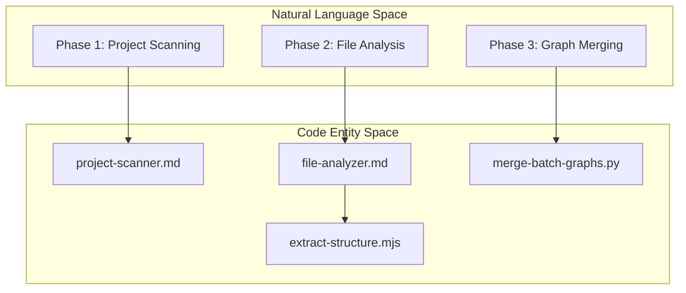
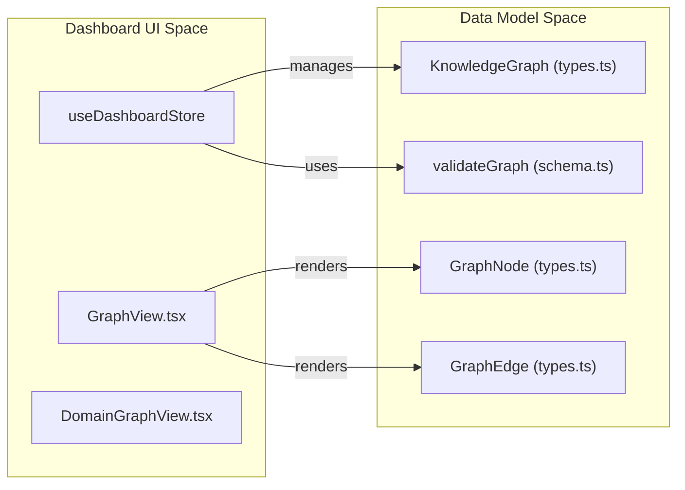

# 용어집

관련 소스 파일

이 wiki 페이지를 생성할 때 다음 파일들이 컨텍스트로 사용되었습니다.

- [CLAUDE.md](CLAUDE.md)
- [README.md](README.md)
- [READMEs/README.es-ES.md](READMEs/README.es-ES.md)
- [READMEs/README.ja-JP.md](READMEs/README.ja-JP.md)
- [READMEs/README.ko-KR.md](READMEs/README.ko-KR.md)
- [READMEs/README.tr-TR.md](READMEs/README.tr-TR.md)
- [READMEs/README.zh-CN.md](READMEs/README.zh-CN.md)
- [READMEs/README.zh-TW.md](READMEs/README.zh-TW.md)
- [install.ps1](install.ps1)
- [install.sh](install.sh)
- [understand-anything-plugin/agents/architecture-analyzer.md](understand-anything-plugin/agents/architecture-analyzer.md)
- [understand-anything-plugin/agents/article-analyzer.md](understand-anything-plugin/agents/article-analyzer.md)
- [understand-anything-plugin/agents/assemble-reviewer.md](understand-anything-plugin/agents/assemble-reviewer.md)
- [understand-anything-plugin/agents/domain-analyzer.md](understand-anything-plugin/agents/domain-analyzer.md)
- [understand-anything-plugin/agents/file-analyzer.md](understand-anything-plugin/agents/file-analyzer.md)
- [understand-anything-plugin/agents/graph-reviewer.md](understand-anything-plugin/agents/graph-reviewer.md)
- [understand-anything-plugin/agents/knowledge-graph-guide.md](understand-anything-plugin/agents/knowledge-graph-guide.md)
- [understand-anything-plugin/agents/project-scanner.md](understand-anything-plugin/agents/project-scanner.md)
- [understand-anything-plugin/agents/tour-builder.md](understand-anything-plugin/agents/tour-builder.md)
- [understand-anything-plugin/hooks/auto-update-prompt.md](understand-anything-plugin/hooks/auto-update-prompt.md)
- [understand-anything-plugin/hooks/hooks.json](understand-anything-plugin/hooks/hooks.json)
- [understand-anything-plugin/packages/core/src/__tests__/change-classifier.test.ts](understand-anything-plugin/packages/core/src/__tests__/change-classifier.test.ts)
- [understand-anything-plugin/packages/core/src/__tests__/domain-persistence.test.ts](understand-anything-plugin/packages/core/src/__tests__/domain-persistence.test.ts)
- [understand-anything-plugin/packages/core/src/__tests__/domain-types.test.ts](understand-anything-plugin/packages/core/src/__tests__/domain-types.test.ts)
- [understand-anything-plugin/packages/core/src/__tests__/fingerprint.test.ts](understand-anything-plugin/packages/core/src/__tests__/fingerprint.test.ts)
- [understand-anything-plugin/packages/core/src/__tests__/plugin-discovery.test.ts](understand-anything-plugin/packages/core/src/__tests__/plugin-discovery.test.ts)
- [understand-anything-plugin/packages/core/src/__tests__/schema.test.ts](understand-anything-plugin/packages/core/src/__tests__/schema.test.ts)
- [understand-anything-plugin/packages/core/src/fingerprint.ts](understand-anything-plugin/packages/core/src/fingerprint.ts)
- [understand-anything-plugin/packages/core/src/persistence/index.ts](understand-anything-plugin/packages/core/src/persistence/index.ts)
- [understand-anything-plugin/packages/core/src/persistence/persistence.test.ts](understand-anything-plugin/packages/core/src/persistence/persistence.test.ts)
- [understand-anything-plugin/packages/core/src/plugins/tree-sitter-plugin.ts](understand-anything-plugin/packages/core/src/plugins/tree-sitter-plugin.ts)
- [understand-anything-plugin/packages/core/src/schema.ts](understand-anything-plugin/packages/core/src/schema.ts)
- [understand-anything-plugin/packages/core/src/types.test.ts](understand-anything-plugin/packages/core/src/types.test.ts)
- [understand-anything-plugin/packages/core/src/types.ts](understand-anything-plugin/packages/core/src/types.ts)
- [understand-anything-plugin/packages/dashboard/src/App.tsx](understand-anything-plugin/packages/dashboard/src/App.tsx)
- [understand-anything-plugin/packages/dashboard/src/components/CustomNode.tsx](understand-anything-plugin/packages/dashboard/src/components/CustomNode.tsx)
- [understand-anything-plugin/packages/dashboard/src/components/GraphView.tsx](understand-anything-plugin/packages/dashboard/src/components/GraphView.tsx)
- [understand-anything-plugin/packages/dashboard/src/components/NodeInfo.tsx](understand-anything-plugin/packages/dashboard/src/components/NodeInfo.tsx)
- [understand-anything-plugin/packages/dashboard/src/store.ts](understand-anything-plugin/packages/dashboard/src/store.ts)
- [understand-anything-plugin/skills/understand/SKILL.md](understand-anything-plugin/skills/understand/SKILL.md)
- [understand-anything-plugin/skills/understand/merge-batch-graphs.py](understand-anything-plugin/skills/understand/merge-batch-graphs.py)
- [understand-anything-plugin/skills/understand/merge-subdomain-graphs.py](understand-anything-plugin/skills/understand/merge-subdomain-graphs.py)

이 페이지는 Understand Anything codebase 전반에서 사용되는 technical term, jargon, domain-specific concept을 정의합니다. onboarding engineer가 abstract concept과 concrete code implementation 사이의 mapping을 이해하기 위한 reference 역할을 합니다.

## Core Concepts

### Knowledge Graph
project를 나타내는 central data structure입니다. node는 entity(file, function, class 등)를 나타내고 edge는 relationship(calls, imports, depends_on)을 나타내는 directed graph입니다.
*   **Implementation:** [understand-anything-plugin/packages/core/src/types.ts:161-175]()의 `KnowledgeGraph` interface로 정의됩니다.
*   **Validation:** [understand-anything-plugin/packages/core/src/schema.ts:182-205]()의 Zod schema를 통해 관리됩니다.

### Node Types
graph 내부 entity는 특정 type으로 categorize됩니다.
*   **Code Entities:** `file`, `function`, `class`, `module`, `concept`.
*   **Infrastructure:** `service`, `resource`, `pipeline`.
*   **Data:** `table`, `endpoint`, `schema`.
*   **Domain:** `domain`, `flow`, `step`.
*   **Knowledge:** `article`, `entity`, `topic`, `claim`, `source`.
*   **Source:** [understand-anything-plugin/packages/core/src/types.ts:7-31]()의 `NodeType` enum에 정의됩니다.

### Edge Categories
Dashboard에서 filtering하기 위해 edge는 logical category로 grouping됩니다.
*   **Structural:** `imports`, `contains`, `inherits`.
*   **Behavioral:** `calls`, `subscribes`.
*   **Data Flow:** `reads_from`, `writes_to`.
*   **Source:** `EDGE_CATEGORY_MAP` [understand-anything-plugin/packages/dashboard/src/store.ts:31-40]()에 mapping됩니다.

---

## Analysis Pipeline Terms

### Multi-Agent Pipeline
specialized LLM agent(예: `file-analyzer`, `architecture-analyzer`)를 사용해 raw code를 Knowledge Graph로 변환하는 process입니다.
*   **Source:** Analysis Pipeline overview [understand-anything-plugin/skills/understand/SKILL.md:23-40]()에 설명되어 있습니다.

### Phase Transitions
analysis는 8개의 distinct phase(0-7)로 나뉩니다.
*   **Phase 1 (Scanner):** File discovery 및 language detection [understand-anything-plugin/agents/project-scanner.md:1-15]().
*   **Phase 2 (Analyzer):** file의 parallel batch processing [understand-anything-plugin/agents/file-analyzer.md:8-25]().
*   **Phase 3 (Merge):** ID canonicalization 및 batch result merge [understand-anything-plugin/skills/understand/merge-batch-graphs.py:3-19]().

### Batching
large codebase를 처리하기 위해 file은 `file-analyzer` agent의 parallel processing용 batch로 grouping됩니다.
*   **Source:** [understand-anything-plugin/agents/file-analyzer.md:31-52]()에 설명된 dispatcher logic이 처리합니다.

### ID Normalization
모든 node가 unique하고 canonical한 string ID(예: `function:src/utils.ts:formatDate`)를 갖도록 보장하는 process입니다.
*   **Implementation:** [understand-anything-plugin/skills/understand/merge-batch-graphs.py:178-205]()의 `normalize_node_id` function.

---

## Technical Mapping: Space Association

다음 diagram은 high-level system concept과 실제 code entity 사이의 gap을 연결합니다.

### Diagram 1: Analysis Pipeline to Code Entities
이 diagram은 analysis의 conceptual phase가 특정 script 및 agent definition에 어떻게 mapping되는지 보여줍니다.

**출처:** [understand-anything-plugin/agents/project-scanner.md:1-10](), [understand-anything-plugin/agents/file-analyzer.md:1-10](), [understand-anything-plugin/skills/understand/merge-batch-graphs.py:1-10]().

### Diagram 2: Dashboard State to Data Models
이 diagram은 Dashboard UI state(Zustand)가 core data type과 어떻게 상호작용하는지 보여줍니다.

**출처:** [understand-anything-plugin/packages/dashboard/src/store.ts:100-110](), [understand-anything-plugin/packages/dashboard/src/components/GraphView.tsx:26-32](), [understand-anything-plugin/packages/core/src/types.ts:161-175](), [understand-anything-plugin/packages/core/src/schema.ts:182-190]().

---

## Dashboard Jargon

### ELK Layout
graph에서 node를 position하기 위해 사용되는 layout engine입니다. Eclipse Layout Kernel(ELK)을 사용합니다.
*   **Implementation:** [understand-anything-plugin/packages/dashboard/src/components/GraphView.tsx:45]()의 `applyElkLayout`.

### Persona-Adaptive UI
user role에 따라 detail level을 변경하는 dashboard의 기능입니다(예: private function 숨김).
*   **Roles:** `non-technical`, `junior`, `experienced` [understand-anything-plugin/packages/dashboard/src/store.ts:12]().

### Focus Mode
visual noise를 줄이기 위해 특정 node와 그 "1-hop" neighbor(direct connection)를 isolate하는 UI state입니다.
*   **Implementation:** [understand-anything-plugin/packages/dashboard/src/store.ts:134]()의 `focusNodeId`.

### Layer Cluster
같은 architectural layer(예: "API Layer")에 속한 node의 visual grouping입니다.
*   **Implementation:** [understand-anything-plugin/packages/dashboard/src/components/GraphView.tsx:19]()의 `LayerClusterNode` component.

---

## Domain & Knowledge Terms

### Karpathy-pattern Wiki
system이 Knowledge Graph로 parse할 수 있는 LLM-readable wiki의 특정 format(`index.md`를 structure로 사용)입니다.
*   **Source:** [README.md:67]()에서 참조됩니다.

### Domain Meta
business domain, business flow, individual step을 설명하는 metadata입니다.
*   **Implementation:** [understand-anything-plugin/packages/core/src/types.ts:177-185]()의 `DomainMeta`에 정의됩니다.

### Fingerprinting
file이 변경되었는지 감지하고 incremental update가 필요한지 결정하는 데 사용되는 hashing mechanism입니다.
*   **Implementation:** [understand-anything-plugin/packages/core/src/fingerprint.ts]()의 `FileFingerprint`.

---

## Abbreviations Table

| Abbreviation | Full Term | Context |
| :--- | :--- | :--- |
| **KG** | Knowledge Graph | primary data output입니다. |
| **PR** | Project Root | 분석된 project의 absolute path입니다. |
| **AST** | Abstract Syntax Tree | structural extraction을 위해 `tree-sitter`가 사용합니다. |
| **RAF** | Request Animation Frame | smooth zooming을 위해 `GraphView`에서 사용됩니다 [understand-anything-plugin/packages/dashboard/src/components/GraphView.tsx:132](). |
| **Zod** | Zod Schema | graph validation에 사용되는 library입니다 [understand-anything-plugin/packages/core/src/schema.ts](). |

**출처:**
- [understand-anything-plugin/packages/core/src/types.ts]()
- [understand-anything-plugin/packages/core/src/schema.ts]()
- [understand-anything-plugin/packages/dashboard/src/store.ts]()
- [understand-anything-plugin/packages/dashboard/src/components/GraphView.tsx]()
- [understand-anything-plugin/skills/understand/merge-batch-graphs.py]()
- [understand-anything-plugin/agents/file-analyzer.md]()
- [understand-anything-plugin/agents/project-scanner.md]()
