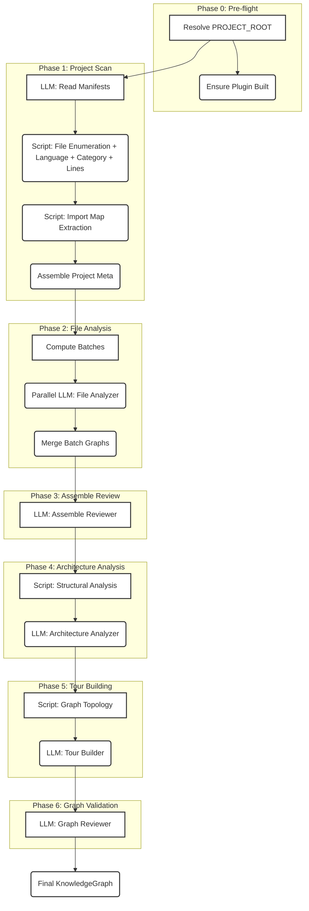
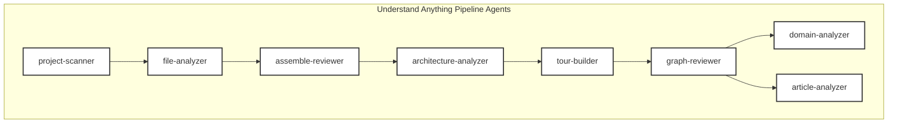
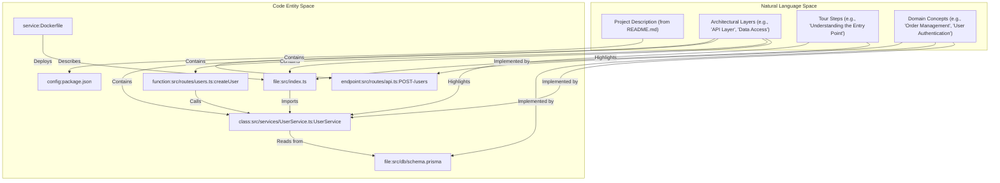
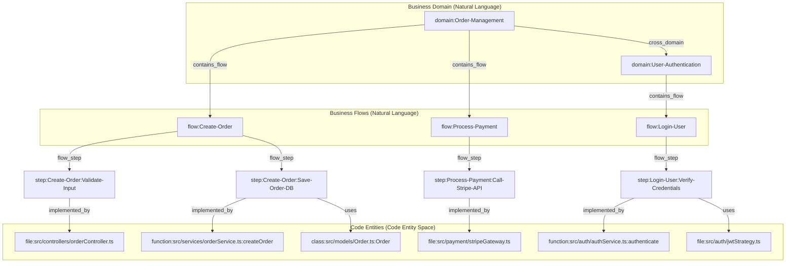

# 분석 파이프라인

관련 소스 파일

다음 파일들은 이 위키 페이지를 생성하기 위한 맥락으로 사용되었습니다.

- [CLAUDE.md](CLAUDE.md)
- [understand-anything-plugin/agents/architecture-analyzer.md](understand-anything-plugin/agents/architecture-analyzer.md)
- [understand-anything-plugin/agents/article-analyzer.md](understand-anything-plugin/agents/article-analyzer.md)
- [understand-anything-plugin/agents/assemble-reviewer.md](understand-anything-plugin/agents/assemble-reviewer.md)
- [understand-anything-plugin/agents/domain-analyzer.md](understand-anything-plugin/agents/domain-analyzer.md)
- [understand-anything-plugin/agents/file-analyzer.md](understand-anything-plugin/agents/file-analyzer.md)
- [understand-anything-plugin/agents/graph-reviewer.md](understand-anything-plugin/agents/graph-reviewer.md)
- [understand-anything-plugin/agents/knowledge-graph-guide.md](understand-anything-plugin/agents/knowledge-graph-guide.md)
- [understand-anything-plugin/agents/project-scanner.md](understand-anything-plugin/agents/project-scanner.md)
- [understand-anything-plugin/agents/tour-builder.md](understand-anything-plugin/agents/tour-builder.md)
- [understand-anything-plugin/skills/understand/SKILL.md](understand-anything-plugin/skills/understand/SKILL.md)
- [understand-anything-plugin/skills/understand/merge-batch-graphs.py](understand-anything-plugin/skills/understand/merge-batch-graphs.py)
- [understand-anything-plugin/skills/understand/merge-subdomain-graphs.py](understand-anything-plugin/skills/understand/merge-subdomain-graphs.py)

Understand Anything 분석 파이프라인은 코드베이스를 풍부한 대화형 KnowledgeGraph로 변환합니다. 이 프로세스는 여러 단계를 조율하는 멀티 에이전트 시스템을 포함하며, deterministic static analysis와 LLM 기반 semantic understanding을 결합합니다. 이 파이프라인은 견고하고 확장 가능하며 다양한 코드베이스를 처리할 수 있도록 설계되었습니다.

이 페이지는 일곱 단계의 상위 수준 개요, 관련 에이전트의 역할, deterministic 처리와 LLM 기반 처리 사이의 전략적 분리를 제공합니다. 각 단계에 대한 자세한 기술 정보는 링크된 하위 페이지를 참조하세요.

## 파이프라인 개요

`/understand` 스킬은 전체 분석 프로세스를 조율하며, 각 단계 전환과 batch 처리 중에 진행 상황을 보고합니다 [understand-anything-plugin/skills/understand/SKILL.md:22-39](). 파이프라인은 pre-flight 검사에서 시작해 완전히 조립되고 검증된 KnowledgeGraph로 마무리되는 일곱 가지 주요 단계로 구성됩니다.

### Deterministic 처리와 LLM 처리

파이프라인의 핵심 설계 원칙은 deterministic algorithms와 Large Language Models(LLMs)의 강점을 모두 활용하는 것입니다.
- **Deterministic steps**는 파일 열거, 언어 감지, 구조 파싱(Tree-sitter 사용), import resolution, graph merging처럼 정밀도, 속도, 일관성이 필요한 작업을 처리합니다. 이러한 단계는 전용 스크립트(예: `scan-project.mjs`, `extract-import-map.mjs`, `merge-batch-graphs.py`)로 구현됩니다 [understand-anything-plugin/agents/project-scanner.md:15-17]().
- **LLM-driven steps**는 의미 이해, 요약, 아키텍처 추론, 교육용 tour 생성이 필요한 작업에 사용됩니다. `file-analyzer`, `architecture-analyzer`, `tour-builder` 같은 에이전트는 이러한 복잡한 작업에 LLM을 활용합니다 [understand-anything-plugin/agents/file-analyzer.md:1-6](), [understand-anything-plugin/agents/architecture-analyzer.md:1-6](), [understand-anything-plugin/agents/tour-builder.md:1-6]().

이 하이브리드 접근 방식은 생성된 KnowledgeGraph의 의미적 풍부함을 극대화하면서 정확성과 효율성을 보장합니다.

## 일곱 단계

분석 파이프라인은 이전 단계의 출력을 기반으로 이어지는 일곱 개의 뚜렷한 단계로 구성됩니다.

출처: [understand-anything-plugin/skills/understand/SKILL.md:41-42]()

### Phase 0: Pre-flight

이 초기 단계는 설정과 환경 검사를 처리합니다. `PROJECT_ROOT`를 해석하고 플러그인의 core 구성 요소가 빌드되어 실행 준비가 되었는지 확인합니다. 또한 일관된 출력 위치를 보장하기 위해 git worktrees를 처리하는 로직도 포함합니다 [understand-anything-plugin/skills/understand/SKILL.md:42-120]().

### Phase 1: Project Scan

프로젝트 스캔 단계는 코드베이스의 인벤토리를 작성합니다. `package.json` 또는 `go.mod` 같은 manifest 파일에 대한 LLM 분석을 통해 서술형 metadata를 얻고, 파일 열거, 언어 감지, 분류, import map 생성을 위한 deterministic scripts를 결합합니다. 이 단계는 포괄적인 `ProjectMeta` 객체와 `importMap`을 생성합니다 [understand-anything-plugin/agents/project-scanner.md:21-22]().

자세한 내용은 [Project Scanner & File Discovery](#2.1)를 참조하세요.

### Phase 2: File Analysis

이 단계에서는 개별 파일을 분석해 구조 및 의미 정보를 추출합니다. 파일은 batch로 그룹화되고 `file-analyzer` subagents에 의해 병렬 처리됩니다. 각 subagent는 deterministic structural extraction(예: Tree-sitter를 통한 functions, classes, call graphs)을 위해 번들된 스크립트를 사용한 뒤, semantic summarization, tagging, complexity assessment를 위해 LLM을 사용합니다 [understand-anything-plugin/agents/file-analyzer.md:11-17](). 그런 다음 모든 batch의 결과가 병합됩니다.

자세한 내용은 [File Analyzer & Batch Processing](#2.2)을 참조하세요.

### Phase 3: Assemble Review

개별 파일 분석이 병합된 후 `assemble-reviewer` 에이전트가 중요한 검토를 수행합니다. 이 LLM 기반 단계는 누락된 nodes나 edges 복구, 생성된 `importMap`을 사용한 cross-batch gaps 보완 등 deterministic merging이 해결할 수 없는 의미론적 문제를 다룹니다 [understand-anything-plugin/agents/assemble-reviewer.md:1-6]().

자세한 내용은 [Graph Assembly & Validation](#2.3)을 참조하세요.

### Phase 4: Architecture Analysis

`architecture-analyzer` 에이전트는 코드베이스 내의 논리적 architectural layers를 식별합니다. 스크립트를 사용해 import graph와 file paths에서 구조적 패턴을 계산한 다음, LLM을 사용해 이러한 패턴을 해석하고 모든 file node를 정확히 하나의 layer에 할당합니다. 이는 프로젝트 구성에 대한 상위 수준 관점을 제공합니다 [understand-anything-plugin/agents/architecture-analyzer.md:1-6]().

자세한 내용은 [Graph Assembly & Validation](#2.3) 및 [Tour Builder & Architecture Analyzer](#2.4)를 참조하세요.

### Phase 5: Tour Building

`tour-builder` 에이전트는 코드베이스를 통과하는 guided learning paths를 설계합니다. 스크립트를 사용해 graph topology(fan-in/fan-out, entry points, dependency chains)를 분석한 다음, LLM을 사용해 5-15단계의 교육적 sequence를 만듭니다. 각 단계는 핵심 nodes와 concepts를 강조하며, 프로젝트를 이해하기 위한 일관된 narrative를 제공합니다 [understand-anything-plugin/agents/tour-builder.md:1-6]().

자세한 내용은 [Tour Builder & Architecture Analyzer](#2.4)를 참조하세요.

### Phase 6: Graph Validation

마지막 단계에는 `graph-reviewer` 에이전트가 포함되며, 이는 조립된 KnowledgeGraph의 정확성, 완전성, 품질을 엄격하게 검증합니다. schema, referential integrity, 기타 품질 지표를 기준으로 체계적인 검사를 수행하고 구조화된 validation report를 제공합니다 [understand-anything-plugin/agents/graph-reviewer.md:1-6]().

자세한 내용은 [Graph Assembly & Validation](#2.3)를 참조하세요.

## 에이전트 역할

파이프라인은 코드베이스를 KnowledgeGraph로 변환하는 과정에서 각각 고유한 역할을 가진 여러 전문 에이전트를 사용합니다.

출처: [CLAUDE.md:17-18]()

- **`project-scanner`**: 코드베이스를 스캔하고, 파일을 열거하며, 언어를 감지하고, `.understandignore` filters를 적용하며, `importMap`과 `ProjectMeta`를 생성합니다 [understand-anything-plugin/agents/project-scanner.md:1-6]().
- **`file-analyzer`**: source files의 batch를 분석하여 Tree-sitter를 통해 구조 데이터를 추출하고 LLM을 사용해 semantic summaries, tags, relationships를 생성합니다 [understand-anything-plugin/agents/file-analyzer.md:1-6]().
- **`assemble-reviewer`**: `file-analyzer` batch에서 병합된 출력을 검토하여 의미론적 문제를 수정하고, 누락된 nodes/edges를 복구하며, cross-batch gaps를 보완합니다 [understand-anything-plugin/agents/assemble-reviewer.md:1-6]().
- **`architecture-analyzer`**: 구조적 패턴과 의미 해석을 기반으로 논리적 architectural layers를 식별하고 file nodes를 해당 layer에 할당합니다 [understand-anything-plugin/agents/architecture-analyzer.md:1-6]().
- **`tour-builder`**: 코드베이스를 통과하는 guided learning tours를 설계하며, 아키텍처와 핵심 concepts를 설명하는 교육적 단계를 만듭니다 [understand-anything-plugin/agents/tour-builder.md:1-6]().
- **`graph-reviewer`**: 사전 정의된 schema와 integrity rules를 기준으로 최종 KnowledgeGraph의 정확성, 완전성, 품질을 검증합니다 [understand-anything-plugin/agents/graph-reviewer.md:1-6]().
- **`domain-analyzer`**: (`/understand-domain` 스킬에서 사용) domains, business flows, process steps를 포함한 비즈니스 도메인 지식을 추출해 `domain-graph.json`을 생성합니다 [understand-anything-plugin/agents/domain-analyzer.md:1-6]().
- **`article-analyzer`**: (`/understand-knowledge` 스킬에서 사용) wiki와 유사한 articles를 파싱해 entities, claims, relationships를 추출하여 knowledge base를 형성합니다.

## 자연어와 코드 엔터티 연결

파이프라인은 자연어 설명과 구체적인 코드 엔터티 사이의 간극을 효과적으로 연결합니다. 이는 상위 수준 concepts와 architectural layers를 특정 files, functions, 기타 코드 요소와 연결함으로써 달성됩니다.

출처: [understand-anything-plugin/agents/knowledge-graph-guide.md:35-54](), [understand-anything-plugin/agents/knowledge-graph-guide.md:56-66]()

`architecture-analyzer`는 file-level nodes(예: `file:src/routes/index.ts`, `config:tsconfig.json`, `document:README.md`, `service:Dockerfile`)를 특정 architectural layers에 할당합니다 [understand-anything-plugin/agents/architecture-analyzer.md:30-37](). 마찬가지로 `tour-builder`는 자연어 tour steps를 그래프 내의 구체적인 `nodeIds`에 연결합니다 [understand-anything-plugin/agents/tour-builder.md:78-87]().

`domain-analyzer`는 business domain concepts(`domain:order-management`, `flow:create-order`, `step:validate-input`)를 이를 구현하는 기반 코드 파일과 함수에 매핑함으로써 이를 한층 확장합니다 [understand-anything-plugin/agents/domain-analyzer.md:48-83]().

출처: [understand-anything-plugin/agents/domain-analyzer.md:39-88](), [understand-anything-plugin/agents/knowledge-graph-guide.md:83-88]()

## Domain 및 Knowledge Graph 스킬

핵심 구조 분석을 넘어, 파이프라인은 도메인 특화 지식과 일반 지식을 추출하기 위한 전문 스킬을 지원합니다.

- **`/understand-domain`**: 이 스킬은 `domain-analyzer` 에이전트를 활용해 코드베이스에서 비즈니스 도메인 지식을 추출합니다. domains, business flows, process steps를 식별하고, 비즈니스 로직이 코드 전체에서 어떻게 흐르는지 매핑하는 `domain-graph.json`을 생성합니다 [understand-anything-plugin/agents/domain-analyzer.md:1-6](). 이 그래프는 `domain`, `flow`, `step` 같은 특정 node types를 사용합니다 [understand-anything-plugin/agents/knowledge-graph-guide.md:52-54]().

- **`/understand-knowledge`**: 이 스킬(`article-analyzer` 에이전트 기반)은 저장소 내의 wiki와 유사한 articles 또는 기타 텍스트 지식 베이스를 파싱하도록 설계되었습니다. entities, claims, relationships를 추출하고 이를 `article`, `entity`, `topic`, `claim`, `source` nodes로 KnowledgeGraph에 통합합니다 [understand-anything-plugin/skills/understand/merge-batch-graphs.py:37-39]().

자세한 내용은 [Domain & Knowledge Graph Skills](#2.5)를 참조하세요.
