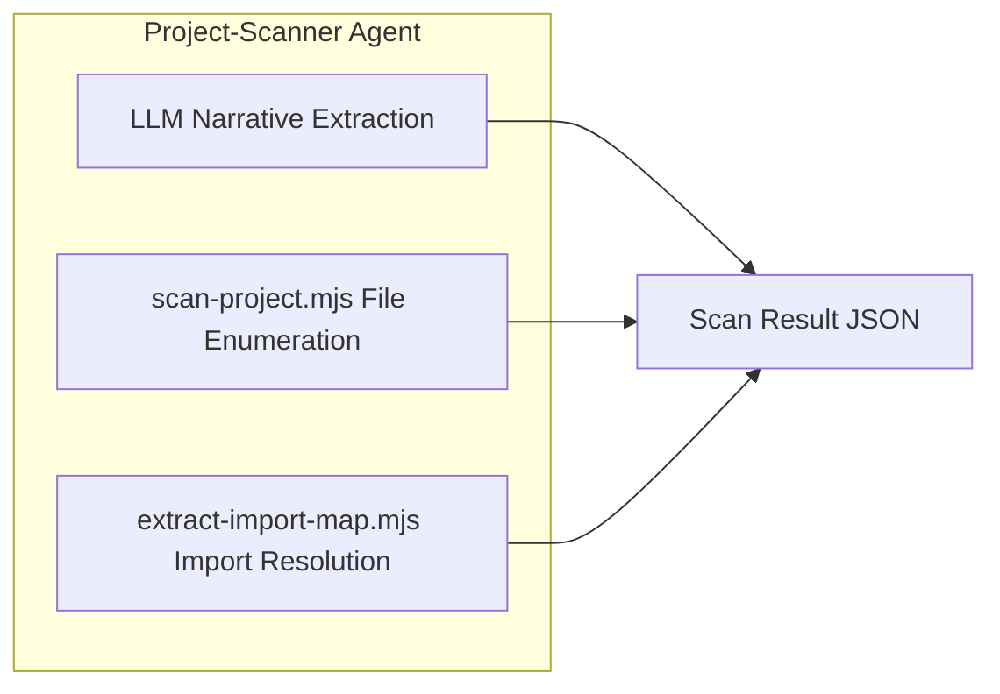
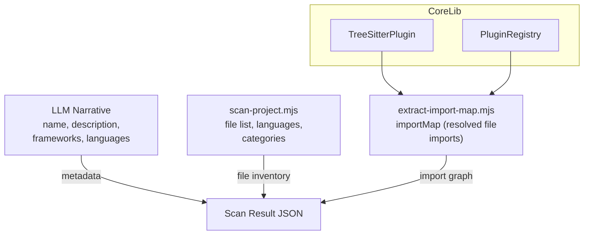

# Project Scanner 및 File Discovery

<details>
<summary>관련 소스 파일</summary>

다음 파일들은 이 위키 페이지를 생성하기 위한 맥락으로 사용되었습니다.

- [CLAUDE.md](CLAUDE.md)
- [tests/skill/understand/test_extract_import_map.test.mjs](tests/skill/understand/test_extract_import_map.test.mjs)
- [understand-anything-plugin/agents/architecture-analyzer.md](understand-anything-plugin/agents/architecture-analyzer.md)
- [understand-anything-plugin/agents/article-analyzer.md](understand-anything-plugin/agents/article-analyzer.md)
- [understand-anything-plugin/agents/assemble-reviewer.md](understand-anything-plugin/agents/assemble-reviewer.md)
- [understand-anything-plugin/agents/domain-analyzer.md](understand-anything-plugin/agents/domain-analyzer.md)
- [understand-anything-plugin/agents/graph-reviewer.md](understand-anything-plugin/agents/graph-reviewer.md)
- [understand-anything-plugin/agents/knowledge-graph-guide.md](understand-anything-plugin/agents/knowledge-graph-guide.md)
- [understand-anything-plugin/agents/project-scanner.md](understand-anything-plugin/agents/project-scanner.md)
- [understand-anything-plugin/agents/tour-builder.md](understand-anything-plugin/agents/tour-builder.md)
- [understand-anything-plugin/packages/core/src/__tests__/ignore-filter.test.ts](understand-anything-plugin/packages/core/src/__tests__/ignore-filter.test.ts)
- [understand-anything-plugin/packages/core/src/ignore-filter.ts](understand-anything-plugin/packages/core/src/ignore-filter.ts)
- [understand-anything-plugin/skills/understand/compute-batches.mjs](understand-anything-plugin/skills/understand/compute-batches.mjs)
- [understand-anything-plugin/skills/understand/extract-import-map.mjs](understand-anything-plugin/skills/understand/extract-import-map.mjs)
- [understand-anything-plugin/skills/understand/scan-project.mjs](understand-anything-plugin/skills/understand/scan-project.mjs)

</details>


이 섹션은 프로젝트 스캔, 파일 탐색, 언어 감지, `.understandignore` 필터링, import map 생성에 초점을 맞춘 Understand Anything 분석 파이프라인의 초기 단계(Phase 0-1)를 문서화합니다. project-scanner 에이전트의 조율, `scan-project.mjs` 스크립트가 수행하는 deterministic file enumeration, 그리고 구문 인식 파싱을 위해 Tree-sitter를 활용하는 `extract-import-map.mjs`를 통한 import resolution을 다룹니다.

---

## 목적과 범위

**Project Scanner & File Discovery** 단계는 이후 분석의 기반 데이터로 사용되는 코드베이스 파일, 언어, 프레임워크, import 관계에 대한 상세하고 구조화된 인벤토리를 준비합니다. 이 단계는 deterministic static analysis scripts와 guided LLM narrative tasks 사이에서 작업을 나눕니다.

- **Deterministic scanning**: 모든 파일을 언어, 범주, 크기, line count, complexity 기준으로 열거하고 분류합니다. `.understandignore`를 통해 파일을 필터링합니다. 이는 `scan-project.mjs`에 구현되어 있습니다.

- **Import map extraction**: Tree-sitter parser ecosystem을 사용해 모든 코드 파일을 파싱하여 raw import paths를 추출한 다음, 언어별 규칙, tsconfig aliases, 파일 시스템 레이아웃을 고려해 이를 프로젝트 내부 경로로 해석합니다. 이는 `extract-import-map.mjs`에 구현되어 있습니다.

- **LLM narrative synthesis**: README와 manifest files를 읽어 프로젝트 이름, 자연어 설명, 감지된 frameworks, 집계된 language sets 같은 상위 수준 프로젝트 metadata를 생성합니다. 이 metadata는 deterministic 결과와 결합되어 전체 scan result를 생성합니다.

---

## Scan Workflow 개요(Phase 0-1)

**project-scanner** 에이전트는 스캔의 Phase 1 안에서 세 가지 주요 단계를 조율합니다.

1. **LLM-driven narrative extraction (Step A)**  
   상위 수준 manifests와 README 파일을 읽어 프로젝트 `name`, 텍스트 `rawDescription`, 소개 snippet(`readmeHead`), 의존성 기반 framework detection, 예비 language signals를 추출합니다. 이 단계는 에이전트의 텍스트 prompt를 사용해 수행되며 파일을 열거하지 않습니다.

2. **Deterministic file enumeration (Step B)**  
   `scan-project.mjs` 스크립트를 실행해 디스크의 모든 파일을 신뢰성 있게 열거하고, `.understandignore` filtering을 적용하며, 확장자 또는 pattern matching을 기반으로 파일 언어를 감지하고, file categories를 할당하며, lines를 세고, project complexity를 추정합니다. 감지된 속성이 포함된 모든 파일의 JSON 파일을 출력합니다.

3. **Import map extraction (Step C)**  
   가져온 Tree-sitter plugins를 사용해 코드 파일을 파싱하고 언어별 import resolution rules를 적용하여 import statements 또는 require calls를 프로젝트 내 실제 파일에 매핑하는 `extract-import-map.mjs` 스크립트를 실행합니다. 이는 각 파일을 resolved imports에 매핑하는 import graph data structure를 생성합니다.

최종 scan result는 이 세 단계의 출력을 병합하여 deterministic file data, import relations, narrative metadata를 이후 파이프라인 단계에서 사용할 수 있도록 결합합니다.



**출처:** `understand-anything-plugin/agents/project-scanner.md:8-90`


---

## 상세 구성 요소

### 1. `project-scanner` 에이전트

- 에이전트의 역할은 파일 열거에서 추측 없이 절대적인 정확도로 프로젝트 파일, 감지된 언어, frameworks, import maps, 추정 complexity의 JSON 인벤토리를 생성하는 것입니다.

- 에이전트는 책임을 나눕니다.
   - LLM은 manifests(`package.json`, `pyproject.toml`, `Cargo.toml`, `go.mod`, `.github/workflows/`, `Dockerfile` 등)와 README를 읽어 narrative fields를 생성합니다.
   - 스크립트는 파일을 열거하고 언어를 deterministic하게 감지하며, 에이전트는 그 출력만 병합합니다.
   
- 추출된 framework detections에는 인기 있는 JavaScript(예: React, Vue), TypeScript, Python(예: Django, FastAPI), Ruby, Go, Rust, JVM, PHP frameworks, 그리고 infrastructure tools(Docker, Terraform, GitHub Actions, GitLab CI)가 포함됩니다.

- 파일별 언어 감지와 category assignment는 `scan-project.mjs` 스크립트의 결과가 권위 있는 기준입니다.

**출처:** `understand-anything-plugin/agents/project-scanner.md:8-89`

---

### 2. File Enumeration 및 Language/Category Detection(`scan-project.mjs`)

- **목적:** deterministic file enumeration, filtering, language detection, file categorization, line counting, complexity estimation을 수행합니다.

- **구현 세부 사항:**
  - 가능하면 열거에 `git ls-files`를 사용하고, 그렇지 않으면 recursive directory walk로 대체합니다.
  - core 라이브러리의 `createIgnoreFilter`를 사용해 `.understandignore` filtering을 적용하며, negation(`!`)과 custom patterns(default ignores를 override)을 존중합니다.
  - 언어 감지는 `project-scanner.md`에 문서화된 공식 mapping과 일치하는 두 canonical maps(extension -> language, filename -> language)를 기반으로 합니다.
  - filename patterns와 location(우선순위 규칙 포함)에 따라 `code`, `config`, `docs`, `infra`, `data`, `script`, `markup` 중 하나의 `fileCategory`를 파일에 할당합니다.
  - project complexity heuristics를 지원하기 위해 각 파일의 lines를 셉니다.
  - project-level complexity를 `small`, `moderate`, `large`, `very-large` 중 하나로 추정합니다.

- **Output shape:**

```json
{
  "scriptCompleted": true,
  "files": [
    { "path": "src/index.ts", "language": "typescript", "sizeLines": 150, "fileCategory": "code" },
    { "path": "README.md", "language": "markdown", "sizeLines": 45, "fileCategory": "docs" },
    { "path": "Dockerfile", "language": "dockerfile", "sizeLines": 22, "fileCategory": "infra" }
  ],
  "totalFiles": 42,
  "filteredByIgnore": 0,
  "estimatedComplexity": "moderate",
  "stats": {
    "filesScanned": 42,
    "byCategory": {
      "code": 28,
      "config": 6,
      "docs": 4,
      "infra": 2,
      "script": 2
    },
    "byLanguage": {
      "typescript": 22,
      "javascript": 6,
      "json": 5,
      "markdown": 4,
      "yaml": 3,
      "shell": 2
    }
  }
}
```

- 파일은 path 기준 lexicographic order로 정렬되어 deterministic output을 보장합니다.

- Resilience: permission errors, malformed files, 사라진 파일은 stderr에 기록되는 warnings와 함께 건너뜁니다.

**출처:** `understand-anything-plugin/skills/understand/scan-project.mjs:1-194`

---

### 3. Import Map Generation(`extract-import-map.mjs`)

- **목적:** source code를 파싱하여 import/require statements를 감지함으로써 코드 파일이 import하는 로컬 파일에 대한 import graph mapping을 구축합니다.

- **접근 방식:**
  - `@understand-anything/core` 패키지의 `PluginRegistry`와 `TreeSitterPlugin`을 사용해 source files를 파싱합니다.
  - Tree-sitter 기반 language extractors를 통해 raw import paths를 추출합니다.
  - 언어별 규칙과 config files를 사용해 raw imports를 절대 project-relative POSIX paths로 해석합니다.
     - TypeScript `tsconfig.json` path aliases, `package.json` exports, Go modules, Rust crates, Node.js resolution semantics를 지원합니다.
     - file extension probing과 directory index resolution(`./foo` -> `foo.ts` 또는 `foo/index.ts`)을 지원합니다.
  - 외부 의존성(`node_modules`의 packages 또는 프로젝트 파일에 속하지 않는 기타 시스템)을 필터링합니다.
  - 파일을 파싱하거나 읽는 데 실패하면 warning을 기록하지만 다른 파일 처리는 계속합니다.

- **Input shape:**

```json
{
  "projectRoot": "/abs/project/root",
  "files": [
    { "path": "src/index.ts", "language": "typescript", "fileCategory": "code" },
    { "path": "README.md", "language": "markdown", "fileCategory": "docs" }
  ]
}
```

- **Output shape:**

```json
{
  "scriptCompleted": true,
  "stats": {
    "filesScanned": 42,
    "filesWithImports": 28,
    "totalEdges": 84
  },
  "importMap": {
    "src/index.ts": ["src/utils.ts", "src/config.ts"],
    "src/utils.ts": []
  }
}
```

- `importMap`은 각 file path를 해당 파일이 참조하는 resolved import paths 배열에 매핑합니다.

---

### 4. Language Detection 및 File Categorization 주요 내용

- **Language detection keys:**
  - `.ts` -> `typescript`, `.py` -> `python`, `.java` -> `java`, `.rb` -> `ruby` 같은 확장자와 `Dockerfile` 같은 특수 파일을 기반으로 합니다.
  - 특정 filename conventions는 확장자보다 우선합니다(예: `Dockerfile.*`, `Makefile`).
  - 특수 사례와 일치하지 않는 unknown 또는 no-extension files는 `"unknown"`으로 표시됩니다.

- **File categories have priority rules:**
  - 예를 들어 `Dockerfile`은 `infra`, `.md` files는 `docs`(`LICENSE`는 `code`로 계산되는 예외), config에 사용되는 JSON/YAML은 `config`, source files(`.ts`, `.js`, `.py`)는 `code`입니다.

**출처:**  
 - `understand-anything-plugin/skills/understand/scan-project.mjs:99-193`  
 - `understand-anything-plugin/agents/project-scanner.md:81-96`

---

## 자연어와 코드 엔터티 공간을 연결하는 Data Flow Diagram

```mermaid
flowchart LR
  subgraph NaturalLanguageSpace
    NL_MD[README.md & Manifest Files]
    NL_LLM[LLM Narrative]
  end

  subgraph DeterministicScripts
    SP[scan-project.mjs]
    EIM[extract-import-map.mjs]
  end

  subgraph CoreLibrary
    TSPlugin[TreeSitterPlugin<br/> (Core)]
    PluginReg[PluginRegistry<br/> (Core)]
  end

  NL_MD --> NL_LLM
  NL_LLM -->|Synthesizes name, description, frameworks, languages| ScanResult
  SP -->|Enumerates files, detects languages/categories, counts lines| ScanResult
  EIM -->|Parses code imports via TreeSitterPlugin| ImportMap
  ImportMap --> ScanResult

  TSPlugin --> EIM
  PluginReg --> EIM
```

**설명:**  
에이전트의 LLM은 텍스트형 프로젝트 metadata(README와 manifests)를 읽어 narrative fields를 생성합니다. 독립적으로 `scan-project.mjs`는 파일을 deterministic하게 열거하고 language와 file categories를 감지합니다. `extract-import-map.mjs`는 core library의 TreeSitterPlugin과 PluginRegistry에 의존해 코드를 파싱하고 imports를 해석합니다. 이 출력들이 함께 병합되어 포괄적인 scan result가 됩니다.

**출처:**  
- `understand-anything-plugin/agents/project-scanner.md:10-90`  
- `understand-anything-plugin/skills/understand/extract-import-map.mjs:1-130`  
- `understand-anything-plugin/skills/understand/scan-project.mjs:1-193`  

---

## 핵심 함수와 클래스

| 구성 요소               | 역할 / 책임                      | 위치 / 참조                  |
|------------------------|--------------------------------------------|-------------------------------------|
| `project-scanner` Agent | Phase 0-1 조율: narrative + scan + import map | `agents/project-scanner.md`            |
| `scan-project.mjs`      | 파일 열거, ignore filter 적용, language/category 감지, lines 계산, complexity 추정 | `skills/understand/scan-project.mjs:1-193`    |
| `extract-import-map.mjs`| Tree-sitter를 사용해 source files를 파싱하고 import paths를 project files로 해석 | `skills/understand/extract-import-map.mjs:1-130`  |
| `TreeSitterPlugin`      | Tree-sitter parsing과 language extraction을 구현하는 core plugin | `@understand-anything/core` (imported)  |
| `PluginRegistry`        | parsers와 extraction logic을 관리하는 registry | `@understand-anything/core` (imported)  |
| `createIgnoreFilter`    | 결합된 .understandignore filters를 생성하는 utility | `@understand-anything/core` (imported)  |

---

## 상호작용 세부 사항

- **File Enumeration**: `scan-project.mjs`는 `git ls-files`를 실행하거나 directory entries를 재귀적으로 열거하고, ignore filtering을 적용한 다음, stats를 수집합니다.

```js
const ignoreFilter = createIgnoreFilter(projectRoot);
// Walk files, apply ignoreFilter(path)
```

- **Language detection**은 extension과 filename을 language IDs에 매핑하는 dictionaries를 통해 수행됩니다(lowercased extensions, case-sensitive filenames).

- **Import Map Extraction**:  
  `extract-import-map.mjs`는 모든 파일을 병렬로 읽고, `TreeSitterPlugin`과 함께 `PluginRegistry`를 사용해 코드를 파싱하며, ASTs를 순회해 imports(ESM, CommonJS, Rust, Go 등)를 추출한 다음, 가장 가까운 `tsconfig.json`과 `package.json` path aliases를 고려해 경로를 해석합니다.

- External package imports는 필터링되므로 import graph에는 project-internal files만 포함됩니다.

- 파일을 읽거나 파싱하는 중 발생하는 errors와 warnings는 처리를 중단하지 않으며 stderr에 warnings를 출력합니다.

---

## `.understandignore` 필터링

필터링된 파일은 계산에 포함되지만 출력에서는 생략됩니다. 필터는 다음과 일치합니다.

- Defaults(common VCS ignores)
- `.understandignore`에 정의된 user patterns

Negation rules(`!`)는 이전에 무시된 파일을 다시 포함합니다.

denylist 또는 read errors로 인해 건너뛴 파일에 대한 warnings는 stderr에 표시됩니다.

---

## 요약

Phase 0-1의 프로젝트 스캔과 파일 탐색은 다음과 같은 hybrid deterministic+LLM 접근 방식입니다.

- **`scan-project.mjs`**는 language 및 category detection, line counting, complexity estimation과 함께 빠르고 deterministic하며 정확한 file enumeration을 수행합니다.

- **`extract-import-map.mjs`**는 Tree-sitter를 통한 source code parsing을 수행해 import relationships를 추출하고 project-aware import map으로 해석합니다.

- **project-scanner agent**는 이러한 deterministic outputs를 project manifests와 README files에서 LLM이 합성한 narrative metadata와 결합해 이후 모든 분석 단계의 기반이 되는 포괄적인 project inventory JSON 파일을 생성합니다.

이 설계는 다양한 언어 ecosystem과 multi-framework layouts를 가진 실제 저장소에 대해 correctness, determinism, scalability, robustness를 강조합니다.

---

## 시각적 요약: 자연어에서 코드 엔터티로, 다시 돌아가기



---

## 참조 및 출처

- `understand-anything-plugin/agents/project-scanner.md:1-90`  
- `understand-anything-plugin/skills/understand/scan-project.mjs:1-193`  
- `understand-anything-plugin/skills/understand/extract-import-map.mjs:1-130`  
- `tests/skill/understand/test_extract_import_map.test.mjs:1-191` (테스트 커버리지가 import map handling을 보여줍니다)
