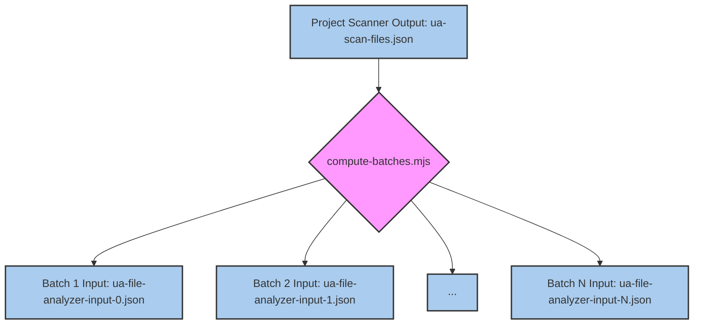
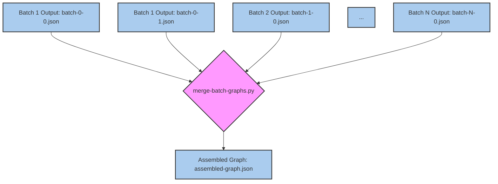

# File Analyzer 및 Batch Processing

<details>
<summary>관련 소스 파일</summary>

다음 파일들은 이 위키 페이지를 생성하기 위한 맥락으로 사용되었습니다.

- [CLAUDE.md](CLAUDE.md)
- [docs/superpowers/plans/2026-05-24-semantic-batching-and-output-chunking-impl.md](docs/superpowers/plans/2026-05-24-semantic-batching-and-output-chunking-impl.md)
- [docs/superpowers/specs/2026-05-24-semantic-batching-and-output-chunking-design.md](docs/superpowers/specs/2026-05-24-semantic-batching-and-output-chunking-design.md)
- [tests/skill/understand/fixtures/scan-result-3-cliques.json](tests/skill/understand/fixtures/scan-result-3-cliques.json)
- [tests/skill/understand/fixtures/scan-result-large-community.json](tests/skill/understand/fixtures/scan-result-large-community.json)
- [tests/skill/understand/test_extract_import_map.test.mjs](tests/skill/understand/test_extract_import_map.test.mjs)
- [understand-anything-plugin/agents/architecture-analyzer.md](understand-anything-plugin/agents/architecture-analyzer.md)
- [understand-anything-plugin/agents/article-analyzer.md](understand-anything-plugin/agents/article-analyzer.md)
- [understand-anything-plugin/agents/assemble-reviewer.md](understand-anything-plugin/agents/assemble-reviewer.md)
- [understand-anything-plugin/agents/domain-analyzer.md](understand-anything-plugin/agents/domain-analyzer.md)
- [understand-anything-plugin/agents/file-analyzer.md](understand-anything-plugin/agents/file-analyzer.md)
- [understand-anything-plugin/agents/graph-reviewer.md](understand-anything-plugin/agents/graph-reviewer.md)
- [understand-anything-plugin/agents/knowledge-graph-guide.md](understand-anything-plugin/agents/knowledge-graph-guide.md)
- [understand-anything-plugin/agents/project-scanner.md](understand-anything-plugin/agents/project-scanner.md)
- [understand-anything-plugin/agents/tour-builder.md](understand-anything-plugin/agents/tour-builder.md)
- [understand-anything-plugin/skills/understand/SKILL.md](understand-anything-plugin/skills/understand/SKILL.md)
- [understand-anything-plugin/skills/understand/compute-batches.mjs](understand-anything-plugin/skills/understand/compute-batches.mjs)
- [understand-anything-plugin/skills/understand/extract-import-map.mjs](understand-anything-plugin/skills/understand/extract-import-map.mjs)
- [understand-anything-plugin/skills/understand/merge-batch-graphs.py](understand-anything-plugin/skills/understand/merge-batch-graphs.py)
- [understand-anything-plugin/skills/understand/merge-subdomain-graphs.py](understand-anything-plugin/skills/understand/merge-subdomain-graphs.py)

</details>


이 페이지는 파일이 batch 단위로 처리되는 방식에 초점을 맞춰 Understand Anything 분석 파이프라인의 Phase 2를 자세히 설명합니다. 파일을 분할하는 `compute-batches.mjs`의 역할, 이러한 batch를 `file-analyzer` subagents에 병렬로 dispatch하는 방식, 그리고 LLM이 부과하는 token limits를 처리하도록 설계된 multi-part output protocol을 다룹니다.

## Phase 2 개요

Phase 2인 "Analyzing files"는 Project Scanner가 생성한 원시 파일 목록을 KnowledgeGraph nodes와 edges의 예비 집합으로 변환하는 중요한 단계입니다. 이 단계는 병렬 처리와 견고한 output handling mechanism을 활용하여 효율성과 확장성을 위해 설계되었습니다.

프로세스는 다음을 포함합니다.
1. **Batch Computation**: 파일을 관리 가능한 batch로 그룹화합니다.
2. **Parallel Analysis**: 이러한 batch를 `file-analyzer` 에이전트에 동시에 dispatch합니다.
3. **Structural Extraction**: 각 `file-analyzer` 에이전트는 deterministic structural analysis를 위해 번들된 스크립트(`extract-structure.mjs`)를 사용합니다.
4. **Semantic Analysis**: 그런 다음 `file-analyzer` 에이전트가 추출된 구조에 대해 LLM 기반 semantic analysis를 수행합니다.
5. **Multi-part Output**: 필요한 경우 큰 출력을 여러 파일로 나누어 처리합니다.

이 단계는 현재 처리 중인 batch를 나타내는 진행 상황 업데이트와 함께 사용자에게 보고됩니다 [understand-anything-plugin/skills/understand/SKILL.md:32-35]().

## `compute-batches.mjs`를 사용한 Batch Computation

`compute-batches.mjs` 스크립트는 Project Scanner의 파일 목록을 가져와 batch로 구성하는 역할을 담당합니다. 주요 목표는 LLM token limits를 준수하면서 개별 `file-analyzer` 에이전트가 효율적으로 처리할 수 있을 만큼 batch를 작게 만들고, 동시에 overhead를 최소화할 만큼 충분히 크게 유지하는 것입니다.

스크립트는 batch를 형성할 때 여러 요소를 고려합니다.
*   **File Size**: 큰 파일은 더 많은 token을 소비하므로 개별 batch로 처리되거나 더 적은 수의 다른 파일과 함께 batch될 수 있습니다.
*   **Language**: 같은 언어의 파일은 언어별 처리 효율을 활용하기 위해 그룹화될 수 있습니다.
*   **Import Relationships**: 서로 import하는 파일은 `file-analyzer` 에이전트에 더 나은 context를 제공하기 위해 가능하면 같은 batch에 유지됩니다. 다만 cross-batch imports는 `neighborMap`을 통해 처리됩니다 [understand-anything-plugin/agents/file-analyzer.md:55-63]().

`compute-batches.mjs`의 출력은 각각 batch를 나타내는 일련의 JSON 파일이며, intermediate directory에 저장됩니다.

### `compute-batches.mjs` Data Flow


Title: `compute-batches.mjs` Data Flow
출처: [understand-anything-plugin/skills/understand/SKILL.md:247-250]()

## File Analyzer Subagents

`compute-batches.mjs`가 생성한 각 batch는 `file-analyzer` subagent로 dispatch됩니다. 이러한 에이전트는 병렬로 동작하여 큰 코드베이스의 분석 속도를 크게 높입니다. `file-analyzer` 에이전트는 [understand-anything-plugin/agents/file-analyzer.md]()에 정의되어 있습니다.

`file-analyzer` 에이전트는 할당된 batch의 각 파일에 대해 두 단계 분석을 수행합니다.

### Phase 1: Structural Extraction (Bundled Script)

첫 번째 단계는 deterministic하며 사전 빌드된 structural extraction script인 `extract-structure.mjs`에 의존합니다. 이 스크립트는 코드 파일에는 `tree-sitter`를, 비코드 파일에는 특화 parser를 사용해 고품질 구조 데이터를 추출합니다 [understand-anything-plugin/agents/file-analyzer.md:27-30]().

`extract-structure.mjs`의 입력은 `projectRoot`, `batchFiles`(`path`, `language`, `sizeLines`, `fileCategory`가 있는 파일 목록), `batchImportData`(batch의 resolved imports)를 포함하는 JSON 파일입니다 [understand-anything-plugin/agents/file-analyzer.md:40-50](). `batchImportData`는 Project Scanner의 Phase 1 동안 `extract-import-map.mjs`가 생성합니다 [understand-anything-plugin/skills/understand/extract-import-map.mjs:1-15]().

이 스크립트는 functions, classes, exports, call graphs, metrics 같은 각 파일의 상세 구조 정보를 포함하는 JSON 파일을 출력합니다 [understand-anything-plugin/agents/file-analyzer.md:83-115](). 비코드 파일의 경우 `sections`, `definitions`, `services`, `endpoints`, `steps`, `resources` 같은 관련 구조 필드를 추출합니다 [understand-anything-plugin/agents/file-analyzer.md:119-129]().

```mermaid
graph TD
    A[Batch Input: ua-file-analyzer-input-<batchIndex>.json] --> B{node extract-structure.mjs};
    B --> C[Extraction Results: ua-file-extract-results-<batchIndex>.json];
    C --> D[File Analyzer Agent (LLM)];

    style A fill:#ace,stroke:#333,stroke-width:2px;
    style B fill:#f9f,stroke:#333,stroke-width:2px;
    style C fill:#ace,stroke:#333,stroke-width:2px;
    style D fill:#ace,stroke:#333,stroke-width:2px;
```
Title: Structural Extraction Data Flow
출처: [understand-anything-plugin/agents/file-analyzer.md:68-74]()

### Phase 2: LLM Semantic Analysis

구조 추출 후 `file-analyzer` 에이전트(LLM)는 이 결과를 semantic analysis의 기반으로 사용합니다. 다음을 생성합니다.
*   **Summaries**: 파일 목적에 대한 간결한 설명입니다.
*   **Tags**: 파일의 내용이나 역할을 설명하는 keywords입니다.
*   **Complexity Ratings**: `simple`, `moderate`, 또는 `complex`입니다 [understand-anything-plugin/agents/file-analyzer.md:19-21]().
*   **Semantic Edges**: 단순 imports를 넘어서는 파일 및 내부 구성 요소 간 관계입니다(예: `calls`, `related`, `inherits`, `implements`) [understand-anything-plugin/agents/file-analyzer.md:19-21]().

에이전트는 cross-batch edges에 대한 신뢰도를 높이기 위해 `neighborMap`이 제공하는 cross-batch context도 고려합니다 [understand-anything-plugin/agents/file-analyzer.md:55-63]().

`file-analyzer` 에이전트의 출력은 해당 batch의 파일에 특화된 KnowledgeGraph의 `nodes`와 `edges`를 포함하는 JSON 객체입니다 [understand-anything-plugin/agents/file-analyzer.md:139-142]().

## Multi-Part Output Protocol

LLM의 잠재적인 token limits를 처리하기 위해, 특히 큰 batch나 자세한 분석의 경우 `file-analyzer` 에이전트는 multi-part output protocol을 사용합니다. 생성된 JSON 출력이 특정 크기를 초과하면 여러 파일로 분할됩니다.

`file-analyzer` 에이전트는 일반적으로 `$PROJECT_ROOT/.understand-anything/intermediate/batch-<batchIndex>-<partIndex>.json` 같은 특정 경로에 출력을 쓰도록 지시됩니다 [understand-anything-plugin/agents/file-analyzer.md:145-146](). `<partIndex>`는 batch당 여러 part를 허용합니다.

이 메커니즘은 단일 batch의 분석이 광범위하더라도 LLM output truncation limits에 걸리지 않고 완전히 캡처될 수 있도록 보장합니다. 이후 단계, 특히 `merge-batch-graphs.py`는 이러한 multi-part outputs를 자연스럽게 읽고 결합하도록 설계되어 있습니다.

## Output Merging

모든 `file-analyzer` 에이전트가 처리를 완료하면 `merge-batch-graphs.py` 스크립트가 호출됩니다. 이 Python 스크립트는 모든 개별 batch outputs(multi-part outputs 포함)를 하나의 일관된 KnowledgeGraph로 결합하는 역할을 담당합니다.

`merge-batch-graphs.py`의 핵심 기능은 다음과 같습니다.
*   **Loading Batches**: intermediate directory의 모든 `batch-*.json` 파일을 순회합니다 [understand-anything-plugin/skills/understand/merge-batch-graphs.py:133-149]().
*   **ID Normalization**: 전체 그래프에서 일관성을 보장하기 위해 node IDs를 canonicalize합니다. 여기에는 double prefixes와 project-name prefixes를 제거하고 legacy prefixes(예: `func:`에서 `function:`으로)를 canonicalize하는 작업이 포함됩니다 [understand-anything-plugin/skills/understand/merge-batch-graphs.py:178-202]().
*   **Complexity Normalization**: 다양한 complexity terms(예: "easy", "hard")를 canonical set(`simple`, `moderate`, `complex`)으로 매핑합니다 [understand-anything-plugin/skills/understand/merge-batch-graphs.py:68-78]().
*   **Edge Direction Normalization**: edge `direction` 값을 `forward`, `backward`, `bidirectional`로 canonicalize합니다 [understand-anything-plugin/skills/understand/merge-batch-graphs.py:115-121]().
*   **Deduplication**: 병합 후 중복 nodes 또는 edges가 없도록 보장합니다.
*   **`tested_by` Linking**: naming conventions와 file paths를 기반으로 test files를 식별하고 해당 테스트가 검증하는 코드에 연결합니다 [understand-anything-plugin/skills/understand/merge-batch-graphs.py:81-106]().
*   **Dangling Edge Dropping**: 존재하지 않는 nodes를 가리키는 edges를 제거하여 해석할 수 없는 targets에 대한 safety net 역할을 합니다 [understand-anything-plugin/agents/file-analyzer.md:65]().

`merge-batch-graphs.py`의 최종 출력은 Phase 3(Graph Assembly & Validation)의 입력으로 사용되는 `assembled-graph.json`입니다 [understand-anything-plugin/skills/understand/merge-batch-graphs.py:17-18]().


Title: Multi-Part Output Merging
출처: [understand-anything-plugin/skills/understand/merge-batch-graphs.py:133-149]()

출처:
- [understand-anything-plugin/skills/understand/SKILL.md:32-35]()
- [understand-anything-plugin/skills/understand/SKILL.md:247-250]()
- [understand-anything-plugin/agents/file-analyzer.md:19-21]()
- [understand-anything-plugin/agents/file-analyzer.md:27-30]()
- [understand-anything-plugin/agents/file-analyzer.md:40-50]()
- [understand-anything-plugin/agents/file-analyzer.md:55-63]()
- [understand-anything-plugin/agents/file-analyzer.md:65]()
- [understand-anything-plugin/agents/file-analyzer.md:68-74]()
- [understand-anything-plugin/agents/file-analyzer.md:83-115]()
- [understand-anything-plugin/agents/file-analyzer.md:119-129]()
- [understand-anything-plugin/agents/file-analyzer.md:139-142]()
- [understand-anything-plugin/agents/file-analyzer.md:145-146]()
- [understand-anything-plugin/skills/understand/extract-import-map.mjs:1-15]()
- [understand-anything-plugin/skills/understand/merge-batch-graphs.py:17-18]()
- [understand-anything-plugin/skills/understand/merge-batch-graphs.py:68-78]()
- [understand-anything-plugin/skills/understand/merge-batch-graphs.py:81-106]()
- [understand-anything-plugin/skills/understand/merge-batch-graphs.py:115-121]()
- [understand-anything-plugin/skills/understand/merge-batch-graphs.py:133-149]()
- [understand-anything-plugin/skills/understand/merge-batch-graphs.py:178-202]()
