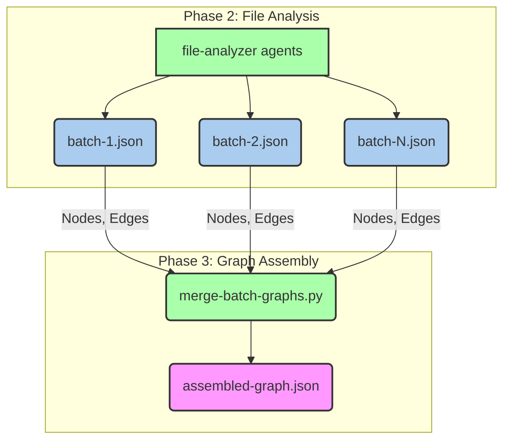
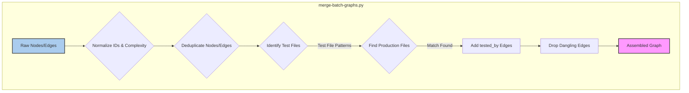
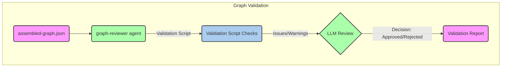
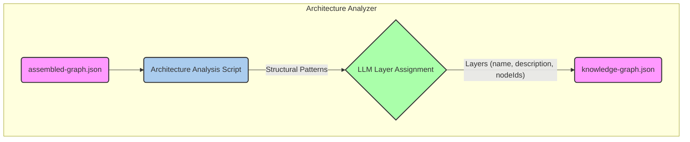

# Graph Assembly 및 Validation

관련 소스 파일

다음 파일들은 이 위키 페이지를 생성하기 위한 맥락으로 사용되었습니다.

- [CLAUDE.md](CLAUDE.md)
- [understand-anything-plugin/agents/architecture-analyzer.md](understand-anything-plugin/agents/architecture-analyzer.md)
- [understand-anything-plugin/agents/article-analyzer.md](understand-anything-plugin/agents/article-analyzer.md)
- [understand-anything-plugin/agents/assemble-reviewer.md](understand-anything-plugin/agents/assemble-reviewer.md)
- [understand-anything-plugin/agents/domain-analyzer.md](understand-anything-plugin/agents/domain-analyzer.md)
- [understand-anything-plugin/agents/file-analyzer.md](understand-anything-plugin/agents/file-analyzer.md)
- [understand-anything-plugin/agents/graph-reviewer.md](understand-anything-plugin/agents/graph-reviewer.md)
- [understand-anything-plugin/agents/knowledge-graph-guide.md](understand-anything-plugin/agents/knowledge-graph-guide.md)
- [understand-anything-plugin/agents/project-scanner.md](understand-anything-plugin/agents/project-scanner.md)
- [understand-anything-plugin/agents/tour-builder.md](understand-anything-plugin/agents/tour-builder.md)
- [understand-anything-plugin/packages/core/src/__tests__/domain-normalize.test.ts](understand-anything-plugin/packages/core/src/__tests__/domain-normalize.test.ts)
- [understand-anything-plugin/packages/core/src/__tests__/normalize-graph.test.ts](understand-anything-plugin/packages/core/src/__tests__/normalize-graph.test.ts)
- [understand-anything-plugin/packages/core/src/analyzer/normalize-graph.ts](understand-anything-plugin/packages/core/src/analyzer/normalize-graph.ts)
- [understand-anything-plugin/packages/core/src/index.ts](understand-anything-plugin/packages/core/src/index.ts)
- [understand-anything-plugin/skills/understand/SKILL.md](understand-anything-plugin/skills/understand/SKILL.md)
- [understand-anything-plugin/skills/understand/merge-batch-graphs.py](understand-anything-plugin/skills/understand/merge-batch-graphs.py)
- [understand-anything-plugin/skills/understand/merge-subdomain-graphs.py](understand-anything-plugin/skills/understand/merge-subdomain-graphs.py)

이 페이지는 원시 batch 처리 graph data가 어떻게 조립, canonicalize, 검증되는지에 초점을 맞춰 Understand Anything 분석 파이프라인의 Phase 3과 Phase 4를 자세히 설명합니다. 여기에는 ID canonicalization, `tested_by` linking, `assemble-reviewer`에 의한 semantic recovery, `graph-reviewer`에 의한 referential integrity checks, `architecture-analyzer`에 의한 architectural layer assignment가 포함됩니다.

## Phase 3: Graph Assembly

개별 파일과 batch가 `file-analyzer` 에이전트에 의해 분석된 후, 그 출력(nodes와 edges)은 하나의 일관된 그래프로 병합됩니다. 이 단계는 주로 `merge-batch-graphs.py` 스크립트를 사용해 초기 통합과 정규화를 수행합니다.

### 3.1. Batch Outputs 병합

`merge-batch-graphs.py` 스크립트는 `file-analyzer` 에이전트가 생성한 모든 `batch-*.json` 파일을 하나의 `assembled-graph.json` 파일로 결합하는 역할을 담당합니다 [understand-anything-plugin/skills/understand/merge-batch-graphs.py:1-19](). 그래프가 일관되고 올바른 형식을 갖추도록 여러 중요한 작업을 처리합니다.

#### Data Flow

Title: Data Flow for Graph Assembly
출처: [understand-anything-plugin/skills/understand/merge-batch-graphs.py:1-19]()

#### ID Canonicalization

병합에서 중요한 단계는 모든 node IDs가 canonical format을 따르도록 보장하는 것입니다. `merge-batch-graphs.py`의 `normalize_node_id` 함수 [understand-anything-plugin/skills/understand/merge-batch-graphs.py:178-209]()는 다음을 수행합니다.
- double prefixes 제거(예: `file:file:src/foo.ts`는 `file:src/foo.ts`가 됨) [understand-anything-plugin/skills/understand/merge-batch-graphs.py:182-187]().
- project-name prefixes 제거(예: `my-project:file:src/foo.ts`는 `file:src/foo.ts`가 됨) [understand-anything-plugin/skills/understand/merge-batch-graphs.py:190-197]().
- legacy prefixes canonicalize(예: `func:`는 `function:`이 됨) [understand-anything-plugin/skills/understand/merge-batch-graphs.py:199]().
- node의 `type`을 기반으로 누락된 prefix 추가(예: `src/foo.ts`는 `file:src/foo.ts`가 됨) [understand-anything-plugin/skills/understand/merge-batch-graphs.py:202-209]().

이를 통해 LLM이 처음에 어떤 방식으로 생성했든 node에 대한 모든 참조가 동일한 canonical ID를 가리키도록 보장합니다. TypeScript의 `normalizeBatchOutput` 함수도 유사한 정규화를 수행합니다 [understand-anything-plugin/packages/core/src/analyzer/normalize-graph.ts:202-211]().

`VALID_NODE_PREFIXES` [understand-anything-plugin/skills/understand/merge-batch-graphs.py:32-39]()와 `TYPE_TO_PREFIX` [understand-anything-plugin/skills/understand/merge-batch-graphs.py:42-66]() mapping은 허용되는 prefixes와 canonical forms를 정의합니다.

#### Complexity Normalization

Node `complexity` 값도 표준 집합인 `"simple"`, `"moderate"`, `"complex"`로 정규화됩니다. `normalize_complexity` 함수 [understand-anything-plugin/skills/understand/merge-batch-graphs.py:212-229]()는 다양한 string aliases(예: "low", "easy"는 "simple"로 매핑)와 numeric scales를 처리합니다. 이를 통해 서로 다른 LLM outputs 사이의 일관성을 보장합니다. TypeScript의 동등한 함수는 `normalizeComplexity`입니다 [understand-anything-plugin/packages/core/src/analyzer/normalize-graph.ts:134-152]().

#### Edge Rewriting 및 Deduplication

Node IDs가 canonicalize된 후 edges는 새로운 canonical IDs를 사용하도록 다시 작성됩니다. 스크립트는 nodes와 edges도 중복 제거하여 최종 그래프에 고유한 entities만 포함되도록 보장합니다. Dangling edges(존재하지 않는 source 또는 target nodes를 참조하는 edges)는 식별되어 제거됩니다 [understand-anything-plugin/skills/understand/merge-batch-graphs.py:300-302]().

#### `tested_by` Linking

`merge-batch-graphs.py` 스크립트에는 code files와 해당 test files 사이의 `tested_by` 관계를 자동으로 추론하는 로직이 포함되어 있습니다. 이는 사전 정의된 patterns를 사용해 file paths와 names를 분석하여 수행됩니다 [understand-anything-plugin/skills/understand/merge-batch-graphs.py:81-106]().

`find_tested_by_target` 함수 [understand-anything-plugin/skills/understand/merge-batch-graphs.py:310-370]()는 test file(예: `foo.test.ts`)을 production counterpart(예: `foo.ts`)와 매칭하려고 시도합니다. 고려 사항은 다음과 같습니다.
- **JS/TS family extensions**: `.ts`, `.tsx`, `.js` 등 [understand-anything-plugin/skills/understand/merge-batch-graphs.py:85-86]()
- **Mirrored production roots**: `src/`, `app/`, `lib/`, 또는 project root [understand-anything-plugin/skills/understand/merge-batch-graphs.py:89]()
- **Test name patterns**: Go/Python의 `_test`, Java/Kotlin/C#의 `Test` 등 [understand-anything-plugin/skills/understand/merge-batch-graphs.py:97-106]()

일치 항목이 발견되면 production file에서 test file로 `tested_by` edge가 추가됩니다.

Title: merge-batch-graphs.py Processing Steps
출처: [understand-anything-plugin/skills/understand/merge-batch-graphs.py:1-19](), [understand-anything-plugin/skills/understand/merge-batch-graphs.py:81-106](), [understand-anything-plugin/skills/understand/merge-batch-graphs.py:310-370]()

### 3.2. `assemble-reviewer`에 의한 Semantic Recovery

초기 programmatic merge 이후 `assemble-reviewer` 에이전트는 `assembled-graph.json`에 대한 semantic review를 수행합니다. 이 LLM 기반 단계는 다음처럼 프로그래밍 방식으로 감지하기 어려운 문제를 잡아내는 것을 목표로 합니다.
- **Missing critical nodes**: 그래프에 있어야 하지만 누락된 중요한 files 또는 functions입니다.
- **Incorrect relationships**: 의미적으로 맞지 않는 edges입니다.
- **Inaccurate summaries/tags**: node의 목적을 잘못 나타내는 descriptions 또는 tags입니다.
- **Inconsistent naming**: 유사한 기능을 가지지만 이름이 서로 다른 nodes입니다.

`assemble-reviewer` 에이전트는 `assembled-graph.json`을 읽고 이러한 의미적 불일치를 식별하여 수정 사항을 제안하거나 추가 분석이 필요한 영역을 표시하도록 설계되었습니다. 그래프가 더 구조적인 검증으로 진행되기 전 quality gate 역할을 합니다.

출처: [understand-anything-plugin/agents/assemble-reviewer.md]()

## Phase 4: Graph Validation 및 Layer Assignment

이 단계는 그래프의 referential integrity와 structural correctness를 보장한 뒤, nodes를 architectural layers에 할당하는 데 초점을 맞춥니다.

### 4.1. `graph-reviewer`에 의한 Referential Integrity Checks

`graph-reviewer` 에이전트는 조립된 그래프를 검증하는 중요한 구성 요소입니다. 그래프가 정의된 schema를 따르고 referential integrity를 유지하는지 보장하기 위해 일련의 deterministic checks를 수행합니다. 이 에이전트는 두 가지 모드로 실행될 수 있습니다.
- **Inline deterministic validation**: 파이프라인 중 스크립트에 의해 수행됩니다.
- **Full LLM graph-reviewer**: `--review` 플래그로 트리거됩니다 [understand-anything-plugin/skills/understand/SKILL.md:16](). 이를 통해 LLM이 스크립트의 발견 사항을 검토하고 결정을 제공할 수 있습니다.

#### Validation Checks

`graph-reviewer`는 다음 검사를 수행합니다 [understand-anything-plugin/agents/graph-reviewer.md:30-103]().

1.  **Schema Validation (Critical)**:
    -   모든 node는 올바른 types와 constraints를 가진 `id`, `type`, `name`, `summary`, `tags`, `complexity`를 가져야 합니다.
    -   Node `type`은 16개의 유효한 types 중 하나여야 합니다(예: `file`, `function`, `class`, `domain`, `flow`, `step`) [understand-anything-plugin/agents/graph-reviewer.md:45-46]().
    -   Node `id`는 prefix conventions(예: `file:`, `function:`)를 따라야 합니다 [understand-anything-plugin/agents/graph-reviewer.md:48-49]().
    -   모든 edge는 올바른 types와 constraints를 가진 `source`, `target`, `type`, `direction`, `weight`를 가져야 합니다.
    -   Edge `type`은 29개의 유효한 types 중 하나여야 합니다(예: `imports`, `calls`, `tested_by`, `contains_flow`) [understand-anything-plugin/agents/graph-reviewer.md:60-61]().
    -   `direction`은 `forward`, `backward`, 또는 `bidirectional`이어야 합니다 [understand-anything-plugin/agents/graph-reviewer.md:56]().

2.  **Referential Integrity (Critical)**:
    -   edges의 모든 `source`와 `target` IDs는 기존 nodes를 참조해야 합니다 [understand-anything-plugin/agents/graph-reviewer.md:65-66]().
    -   layers와 tour steps의 모든 `nodeIds`는 기존 nodes를 참조해야 합니다 [understand-anything-plugin/agents/graph-reviewer.md:67-68]().
    -   Dangling references는 기록됩니다 [understand-anything-plugin/agents/graph-reviewer.md:69]().

3.  **Completeness (Critical/Warning)**:
    -   적어도 하나의 node와 하나의 edge가 존재해야 합니다 [understand-anything-plugin/agents/graph-reviewer.md:73-74]().
    -   Layers와 tour steps의 존재 여부가 검사됩니다(domain graphs에는 warnings) [understand-anything-plugin/agents/graph-reviewer.md:75-79]().

4.  **Layer Coverage (Critical)**:
    -   Structural graphs의 경우 file-level nodes(`file`, `config`, `document` 등)는 정확히 하나의 layer에 나타나야 합니다 [understand-anything-plugin/agents/graph-reviewer.md:82-83]().
    -   빈 layers가 없어야 합니다 [understand-anything-plugin/agents/graph-reviewer.md:85]().

5.  **Uniqueness (Critical)**:
    -   중복 node IDs가 없어야 합니다 [understand-anything-plugin/agents/graph-reviewer.md:89]().

6.  **Tour Validation (Warning)**:
    -   tour steps에서 순차적 `order`, 고유한 `order` 값, `nodeIds` 존재 여부를 검사합니다 [understand-anything-plugin/agents/graph-reviewer.md:92-95]().
    -   Tour step count는 5에서 15 사이여야 합니다 [understand-anything-plugin/agents/graph-reviewer.md:96]().

7.  **Quality Checks (Warning)**:
    -   비어 있거나 중복된 summaries가 없어야 합니다 [understand-anything-plugin/agents/graph-reviewer.md:100]().
    -   self-referencing edges가 없어야 합니다 [understand-anything-plugin/agents/graph-reviewer.md:101]().
    -   orphan nodes(들어오는 edges나 나가는 edges가 없는 nodes)를 식별합니다 [understand-anything-plugin/agents/graph-reviewer.md:102]().

8.  **Non-Code Node Quality Checks (Warning)**:
    -   `document`, `service`, `pipeline`, `table`, `schema`, `domain`, `flow` nodes에 대해 예상 edge types를 가지는지 확인하는 특정 검사를 수행합니다 [understand-anything-plugin/agents/graph-reviewer.md:108-115]().

9.  **Node Type / ID Prefix Consistency (Warning)**:
    -   node의 `type`이 ID prefix와 일치하는지 확인합니다(예: `type: "config"`는 `id`가 `config:`로 시작함을 의미) [understand-anything-plugin/agents/graph-reviewer.md:117-123]().

`graph-reviewer`는 발견된 모든 issues와 warnings를 자세히 설명하는 구조화된 JSON report를 출력합니다 [understand-anything-plugin/agents/graph-reviewer.md:128-139]().

Title: Graph Reviewer Process
출처: [understand-anything-plugin/agents/graph-reviewer.md]()

### 4.2. Architecture Analyzer Layer Assignment

`architecture-analyzer` 에이전트는 코드베이스 내의 논리적 architectural layers를 식별하고 모든 file-level node를 정확히 하나의 layer에 할당하는 역할을 담당합니다. 이는 대시보드에서 프로젝트 구조의 상위 수준 개요를 제공하기 위한 중요한 단계입니다.

#### Two-Phase Approach

다른 에이전트와 유사하게 `architecture-analyzer`는 two-phase approach를 사용합니다.
1.  **Structural Analysis Script**: 스크립트(선호: Node.js)가 file paths와 import/dependency edges에서 deterministic structural patterns를 계산합니다 [understand-anything-plugin/agents/architecture-analyzer.md:23-24]().
2.  **LLM Semantic Interpretation**: LLM은 이러한 structural insights를 사용해 semantic layer assignments를 수행합니다 [understand-anything-plugin/agents/architecture-analyzer.md:24-25]().

#### Script Computations

스크립트는 layer assignment에 정보를 제공하기 위해 여러 metrics를 계산합니다 [understand-anything-plugin/agents/architecture-analyzer.md:52-145]().

-   **Directory Grouping**: 공통 prefix 이후의 top-level directory별로 file nodes를 그룹화합니다 [understand-anything-plugin/agents/architecture-analyzer.md:55-64]().
-   **Node Type Grouping**: file nodes를 `type`별로 그룹화합니다(예: `file`, `config`, `document`) [understand-anything-plugin/agents/architecture-analyzer.md:69-71]().
-   **Import Adjacency Matrix**: 각 파일의 fan-in과 fan-out, 그리고 inter-group dependencies를 계산합니다 [understand-anything-plugin/agents/architecture-analyzer.md:74-77]().
-   **Cross-Category Dependency Analysis**: node type groups 사이의 서로 다른 type edges를 계산합니다(예: `config` nodes가 `file` nodes를 구성) [understand-anything-plugin/agents/architecture-analyzer.md:80-87]().
-   **Inter-Group Import Frequency**: 서로 다른 directory groups 사이의 import edges를 정량화합니다 [understand-anything-plugin/agents/architecture-analyzer.md:90-96]().
-   **Intra-Group Import Density**: directory groups 내부의 cohesion을 측정하여 잠재적 layers를 나타냅니다 [understand-anything-plugin/agents/architecture-analyzer.md:99-102]().
-   **Directory Pattern Matching**: 알려진 architectural patterns에 대해 directory names를 분류합니다(예: `routes` -> `api`, `services` -> `service`) [understand-anything-plugin/agents/architecture-analyzer.md:105-145]().

#### LLM Layer Assignment

LLM은 structural analysis script의 출력을 사용해 다음을 수행합니다.
-   3-10개의 논리적 architecture layers를 식별합니다.
-   모든 file-level node를 정확히 하나의 layer에 할당합니다.
-   각 layer에 대해 `name`과 `description`을 제공합니다. 지정된 언어로 제공될 수도 있습니다 [understand-anything-plugin/agents/architecture-analyzer.md:19-21]().

이 프로세스는 최종 `knowledge-graph.json` 안의 `layers` 배열을 생성하며, 이후 대시보드에서 시각화에 사용됩니다.

Title: Architecture Analyzer Process
출처: [understand-anything-plugin/agents/architecture-analyzer.md]()

출처:
- [understand-anything-plugin/skills/understand/SKILL.md:16]()
- [understand-anything-plugin/skills/understand/merge-batch-graphs.py:1-19]()
- [understand-anything-plugin/skills/understand/merge-batch-graphs.py:32-39]()
- [understand-anything-plugin/skills/understand/merge-batch-graphs.py:42-66]()
- [understand-anything-plugin/skills/understand/merge-batch-graphs.py:81-106]()
- [understand-anything-plugin/skills/understand/merge-batch-graphs.py:178-209]()
- [understand-anything-plugin/skills/understand/merge-batch-graphs.py:212-229]()
- [understand-anything-plugin/skills/understand/merge-batch-graphs.py:300-302]()
- [understand-anything-plugin/skills/understand/merge-batch-graphs.py:310-370]()
- [understand-anything-plugin/packages/core/src/analyzer/normalize-graph.ts:134-152]()
- [understand-anything-plugin/packages/core/src/analyzer/normalize-graph.ts:202-211]()
- [understand-anything-plugin/agents/assemble-reviewer.md]()
- [understand-anything-plugin/agents/graph-reviewer.md:30-103]()
- [understand-anything-plugin/agents/graph-reviewer.md:45-46]()
- [understand-anything-plugin/agents/graph-reviewer.md:48-49]()
