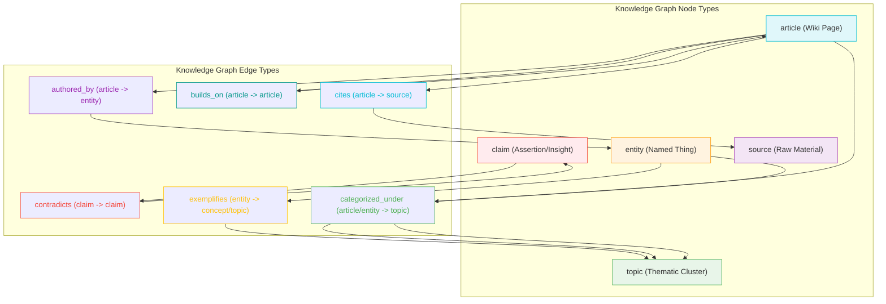

# Domain 및 Knowledge Graph 스킬

<details>
<summary>관련 소스 파일</summary>

다음 파일들은 이 위키 페이지를 생성하기 위한 맥락으로 사용되었습니다.

- [docs/superpowers/plans/2026-04-09-understand-knowledge.md](docs/superpowers/plans/2026-04-09-understand-knowledge.md)
- [docs/superpowers/specs/2026-04-09-understand-knowledge-design.md](docs/superpowers/specs/2026-04-09-understand-knowledge-design.md)
- [understand-anything-plugin/packages/dashboard/src/components/KnowledgeGraphView.tsx](understand-anything-plugin/packages/dashboard/src/components/KnowledgeGraphView.tsx)
- [understand-anything-plugin/skills/understand-domain/SKILL.md](understand-anything-plugin/skills/understand-domain/SKILL.md)
- [understand-anything-plugin/skills/understand-domain/extract-domain-context.py](understand-anything-plugin/skills/understand-domain/extract-domain-context.py)
- [understand-anything-plugin/skills/understand-knowledge/SKILL.md](understand-anything-plugin/skills/understand-knowledge/SKILL.md)
- [understand-anything-plugin/skills/understand-knowledge/merge-knowledge-graph.py](understand-anything-plugin/skills/understand-knowledge/merge-knowledge-graph.py)
- [understand-anything-plugin/skills/understand-knowledge/parse-knowledge-base.py](understand-anything-plugin/skills/understand-knowledge/parse-knowledge-base.py)
- [understand-anything-plugin/src/__tests__/worktree-redirect.test.mjs](understand-anything-plugin/src/__tests__/worktree-redirect.test.mjs)

</details>


이 페이지는 두 가지 전문 스킬인 `/understand-domain`과 `/understand-knowledge`의 구현을 자세히 설명합니다. `/understand-domain` 스킬은 코드베이스에서 비즈니스 도메인 지식을 추출하여 `domain-graph.json` 파일과 `DomainMeta` 구조를 생성합니다. `/understand-knowledge` 스킬은 Karpathy-pattern LLM wiki를 처리하여 markdown 파일을 `article`, `entity`, `claim` nodes로 파싱하고 `knowledge-graph.json` 파일을 생성합니다.

## 2.5.1. /understand-domain: 비즈니스 도메인 추출

`/understand-domain` 스킬은 코드베이스를 분석해 비즈니스 domains, flows, process steps를 식별합니다. 두 가지 모드로 동작할 수 있습니다. 기존 `knowledge-graph.json`이 있으면 여기에서 지식을 파생하거나, 코드베이스의 lightweight scan을 수행합니다. 출력은 대시보드에 표시되는 대화형 horizontal flow graph입니다.

### 작동 방식

이 스킬은 도메인 지식을 추출하고 표현하기 위해 다단계 프로세스를 따릅니다.

1.  **`PROJECT_ROOT` 해결**: 프로젝트의 루트 디렉터리를 결정하고, 생성된 파일의 영속성을 보장하기 위해 Git worktree redirections를 처리합니다 [understand-anything-plugin/skills/understand-domain/SKILL.md:20-43]().
2.  **기존 그래프 감지**: 기존 `knowledge-graph.json`을 확인합니다. 발견되고 `--full` 플래그가 사용되지 않았다면 여기에서 도메인 지식을 파생합니다. 그렇지 않으면 lightweight scan을 수행합니다 [understand-anything-plugin/skills/understand-domain/SKILL.md:90-93]().
3.  **Lightweight Scan (Path 1)**: 기존 지식 그래프를 사용하지 않는 경우 Python 스크립트 `extract-domain-context.py`가 lightweight scan을 수행합니다. 이 스크립트는 file trees, detected entry points, file signatures, code snippets, project metadata를 포함하는 `domain-context.json`을 생성합니다 [understand-anything-plugin/skills/understand-domain/SKILL.md:95-109]().
4.  **Derive from Existing Graph (Path 2)**: `knowledge-graph.json`이 있으면 이 스킬은 이를 읽고 data(nodes, edges, layers, tour steps)를 domain analyzer의 context로 포맷합니다 [understand-anything-plugin/skills/understand-domain/SKILL.md:112-121]().
5.  **Domain Analysis**: 준비된 context(lightweight scan 또는 기존 그래프)를 사용해 `domain-analyzer` 에이전트를 dispatch하여 실제 domain analysis를 수행합니다. 출력은 `domain-analysis.json`에 기록됩니다 [understand-anything-plugin/skills/understand-domain/SKILL.md:124-128]().
6.  **Validate and Save**: `domain-analysis.json` 출력은 graph schema(domain/flow/step types를 지원)에 대해 검증됩니다. 유효한 data는 `domain-graph.json`에 저장되고 intermediate files는 정리됩니다 [understand-anything-plugin/skills/understand-domain/SKILL.md:130-135]().

#### `extract-domain-context.py`

이 Python 스크립트는 lightweight scan 경로에서 deterministic preprocessing 단계를 담당합니다. 도메인 분석과 관련된 코드베이스의 핵심 구조 및 기능 요소를 식별합니다.

**주요 기능:**

*   **Configuration**: file tree depth, files per directory, total files, sampled files, lines per file, entry points에 대한 제한과 source file extensions 및 건너뛸 directories를 정의합니다 [understand-anything-plugin/skills/understand-domain/extract-domain-context.py:24-66]().
*   **`.gitignore` Support**: `.gitignore` 파일을 파싱해 관련 없는 파일과 디렉터리를 scan에서 제외합니다 [understand-anything-plugin/skills/understand-domain/extract-domain-context.py:117-147]().
*   **File Tree Scanning**: `MAX_FILE_TREE_DEPTH`, `MAX_FILES_PER_DIR`, `MAX_FILES_TOTAL`, `SKIP_DIRS`, `.gitignore` patterns를 준수하면서 project directory를 재귀적으로 순회합니다. 관련 source files의 경로를 수집합니다 [understand-anything-plugin/skills/understand-domain/extract-domain-context.py:150-192]().
*   **Entry Point Detection**: HTTP routes, CLI commands, event handlers, cron jobs 같은 일반적인 entry points를 식별하기 위해 사전 정의된 patterns로 source files를 스캔합니다 [understand-anything-plugin/skills/understand-domain/extract-domain-context.py:68-114](). 감지된 각 entry point에 대해 code snippets를 추출합니다 [understand-anything-plugin/skills/understand-domain/extract-domain-context.py:197-249]().
*   **File Signatures**: sampled files에 대해 imports와 exports를 추출하여 dependencies와 interfaces를 이해합니다 [understand-anything-plugin/skills/understand-domain/extract-domain-context.py:252-290]().
*   **Metadata Collection**: `package.json`, `README.md` 등 일반적인 project metadata files에서 정보를 수집합니다 [understand-anything-plugin/skills/understand-domain/extract-domain-context.py:59-66]().
*   **Output**: 수집된 data를 포함하는 `domain-context.json` 파일을 생성하며, 이는 `domain-analyzer` 에이전트의 입력으로 사용됩니다 [understand-anything-plugin/skills/understand-domain/extract-domain-context.py:103-108]().

#### `DomainMeta`

`DomainMeta` interface는 core types의 일부이며 `GraphNode` 객체에 domain-specific metadata를 저장하는 데 사용됩니다.

```typescript
// Optional domain metadata for domain/flow/step nodes
export interface DomainMeta {
  description?: string;
  flowType?: "sequential" | "parallel" | "conditional";
  order?: number;
  inputs?: string[];
  outputs?: string[];
  triggers?: string[];
  involvedActors?: string[];
}
```
출처:
- [understand-anything-plugin/skills/understand-domain/SKILL.md:2-135]()
- [understand-anything-plugin/skills/understand-domain/extract-domain-context.py:1-320]()
- [docs/superpowers/plans/2026-04-09-understand-knowledge.md:115-119]()

### 다이어그램: /understand-domain Flow

```mermaid
graph TD
    subgraph "User Interaction"
        A[User runs /understand-domain] --> B{--full flag?}
    end

    subgraph "Phase 0: Project Setup"
        B -- No --> C[Check for .understand-anything/knowledge-graph.json]
        B -- Yes --> D[Force fresh scan]
        C -- Exists & no --full --> E[Derive from existing graph]
        C -- Not exists or --full --> D
        D --> F[Lightweight scan]
    end

    subgraph "Phase 1: Context Generation"
        F --> G[Run extract-domain-context.py]
        G -- Outputs --> H[domain-context.json]
        E --> I[Read knowledge-graph.json]
        I -- Formats --> J[Structured graph context]
    end

    subgraph "Phase 2: LLM Analysis"
        H --> K[domain-analyzer agent]
        J --> K
        K -- Writes --> L[domain-analysis.json]
    end

    subgraph "Phase 3: Validation & Persistence"
        L --> M[Validate domain-analysis.json]
        M -- Validated --> N[Save to .understand-anything/domain-graph.json]
        N --> O[Clean up intermediate files]
    end

    subgraph "Dashboard Visualization"
        O --> P[Dashboard displays Domain Graph]
    end

    style A fill:#ace,stroke:#333,stroke-width:2px
    style B fill:#f9f,stroke:#333,stroke-width:2px
    style C fill:#f9f,stroke:#333,stroke-width:2px
    style D fill:#f9f,stroke:#333,stroke-width:2px
    style E fill:#afa,stroke:#333,stroke-width:2px
    style F fill:#afa,stroke:#333,stroke-width:2px
    style G fill:#add8e6,stroke:#333,stroke-width:2px
    style H fill:#fff,stroke:#333,stroke-width:2px
    style I fill:#add8e6,stroke:#333,stroke-width:2px
    style J fill:#fff,stroke:#333,stroke-width:2px
    style K fill:#f9c,stroke:#333,stroke-width:2px
    style L fill:#fff,stroke:#333,stroke-width:2px
    style M fill:#add8e6,stroke:#333,stroke-width:2px
    style N fill:#afa,stroke:#333,stroke-width:2px
    style O fill:#add8e6,stroke:#333,stroke-width:2px
    style P fill:#ace,stroke:#333,stroke-width:2px
```
**다이어그램: /understand-domain Flow**
출처:
- [understand-anything-plugin/skills/understand-domain/SKILL.md:2-135]()
- [understand-anything-plugin/skills/understand-domain/extract-domain-context.py:1-320]()

## 2.5.2. /understand-knowledge: Karpathy-pattern Wiki Parsing

`/understand-knowledge` 스킬은 일반적으로 raw sources, wikilinks가 있는 markdown wiki files, schema file로 구성된 Karpathy-pattern LLM wiki를 분석하도록 설계되었습니다. entity extraction, implicit relationships, topic clustering이 포함된 대화형 knowledge graph를 생성합니다.

### Karpathy-pattern Wiki 구조

이 스킬은 다음 특징을 가진 Karpathy LLM wiki pattern을 구체적으로 대상으로 합니다.
*   **Raw sources**: 변경 불가능한 source documents(articles, papers, data files)입니다.
*   **Wiki**: `[[target]]` wikilink syntax를 사용하는 LLM 생성 markdown files입니다.
*   **Schema**: `CLAUDE.md` 또는 `AGENTS.md` 같은 configuration files입니다.
*   **`index.md`**: categories별로 구성된 content catalog입니다.
*   **`log.md`**: 시간순 operation log입니다.

감지 신호에는 `index.md`의 존재와 wikilinks가 있는 여러 `.md` files가 포함됩니다 [understand-anything-plugin/skills/understand-knowledge/SKILL.md:11-20]().

### 작동 방식

이 스킬은 다단계 파이프라인을 실행합니다.

1.  **DETECT**: target directory를 결정하고 `parse-knowledge-base.py`를 실행해 Karpathy format을 감지합니다. 성공하면 `scan-manifest.json`을 생성하고 감지된 articles, sources, topics, wikilinks를 알립니다 [understand-anything-plugin/skills/understand-knowledge/SKILL.md:24-40]().
2.  **SCAN (Deterministic)**: `parse-knowledge-base.py` 스크립트는 article nodes(`.md` files에서), source nodes(`raw/` files에서), topic nodes(`index.md` headings에서), `related` edges(wikilinks에서), `categorized_under` edges(`index.md` sections에서)를 포함한 모든 deterministic extraction을 수행합니다 [understand-anything-plugin/skills/understand-knowledge/SKILL.md:43-49]().
3.  **ANALYZE (LLM-driven)**: implicit knowledge를 추출하기 위해 `article-analyzer` subagents를 batch 단위로 dispatch합니다. 이러한 에이전트는 articles를 처리하고 new nodes(entities, claims)와 edges를 포함하는 `analysis-batch-*.json` 파일을 생성합니다 [understand-anything-plugin/skills/understand-knowledge/SKILL.md:52-72]().
4.  **MERGE**: `merge-knowledge-graph.py` 스크립트는 `scan-manifest.json`과 모든 `analysis-batch-*.json` 파일을 결합합니다. entity deduplication, edge normalization, `index.md` categories 기반 layer building, tour generation을 처리합니다. 결과는 `assembled-graph.json`입니다 [understand-anything-plugin/skills/understand-knowledge/SKILL.md:75-89]().
5.  **SAVE**: `assembled-graph.json`이 검증되어 `knowledge-graph.json`에 저장되고 metadata가 `meta.json`에 기록됩니다. intermediate files는 정리되고 summary가 사용자에게 보고됩니다. 마지막으로 dashboard가 자동으로 트리거됩니다 [understand-anything-plugin/skills/understand-knowledge/SKILL.md:92-125]().

#### `parse-knowledge-base.py`

이 Python 스크립트는 Karpathy-pattern LLM wiki를 위한 deterministic parser입니다. markdown 파일에서 구조 정보를 추출하고 wikilinks를 해석합니다.

**주요 기능:**

*   **Regex Patterns**: wikilinks(`[[target|display]]`), YAML frontmatter, code blocks, headings에 대한 정규식을 정의합니다 [understand-anything-plugin/skills/understand-knowledge/parse-knowledge-base.py:22-29]().
*   **Format Detection**: `detect_format` 함수는 `index.md`, `log.md`, `raw/` directory, schema files(`CLAUDE.md`, `AGENTS.md`)를 확인하여 directory가 Karpathy pattern을 따르는지 식별합니다 [understand-anything-plugin/skills/understand-knowledge/parse-knowledge-base.py:38-69]().
*   **Markdown Extraction Helpers**:
    *   `extract_frontmatter`: YAML frontmatter를 dictionary로 파싱합니다 [understand-anything-plugin/skills/understand-knowledge/parse-knowledge-base.py:76-86]().
    *   `extract_wikilinks`: 모든 `[[target]]` 및 `[[target|display]]` links를 찾습니다 [understand-anything-plugin/skills/understand-knowledge/parse-knowledge-base.py:89-97]().
    *   `extract_headings`: 모든 markdown headings를 level과 text와 함께 추출합니다 [understand-anything-plugin/skills/understand-knowledge/parse-knowledge-base.py:100-105]().
    *   `extract_code_blocks`: fenced code blocks에서 사용된 언어를 식별합니다 [understand-anything-plugin/skills/understand-knowledge/parse-knowledge-base.py:108-111]().
    *   `extract_first_paragraph`: frontmatter와 H1 이후 첫 번째 비어 있지 않은 paragraph에서 간결한 summary를 추출합니다 [understand-anything-plugin/skills/understand-knowledge/parse-knowledge-base.py:114-154]().
    *   `extract_h1`: article의 main H1 heading을 추출합니다 [understand-anything-plugin/skills/understand-knowledge/parse-knowledge-base.py:157-164]().
*   **`index.md` Parsing**: `parse_index` 함수는 `index.md`의 `##` headings에서 categories를 추출하고 각 category 아래의 wikilinks를 연결합니다 [understand-anything-plugin/skills/understand-knowledge/parse-knowledge-base.py:170-194]().
*   **`log.md` Parsing**: `parse_log` 함수는 `log.md`에서 operation timelines를 추출합니다 [understand-anything-plugin/skills/understand-knowledge/parse-knowledge-base.py:201-202]().
*   **Graph Construction**: main `scan` 함수는 parsing을 조율하여 `article`, `entity`, `topic`, `source` nodes와 `related`, `categorized_under` edges를 생성합니다. wikilinks를 node IDs로 해석합니다 [understand-anything-plugin/skills/understand-knowledge/parse-knowledge-base.py:209-400]().
*   **Output**: initial graph structure를 포함하는 `scan-manifest.json`을 intermediate directory에 씁니다 [understand-anything-plugin/skills/understand-knowledge/parse-knowledge-base.py:13-14]().

#### `merge-knowledge-graph.py`

이 Python 스크립트는 deterministic `scan-manifest.json`과 LLM 생성 `analysis-batch-*.json` 파일을 결합합니다.

**주요 기능:**

*   **Canonical Types**: `VALID_NODE_TYPES`와 `VALID_EDGE_TYPES`를 정의하여 schema compliance를 보장합니다. 여기에는 `article`, `entity`, `topic`, `claim`, `source`, `cites`, `contradicts` 같은 knowledge-specific types가 포함됩니다 [understand-anything-plugin/skills/understand-knowledge/merge-knowledge-graph.py:29-48]().
*   **Type Aliases**: 유연한 input parsing과 normalization을 위해 `NODE_TYPE_ALIASES`와 `EDGE_TYPE_ALIASES`를 제공합니다 [understand-anything-plugin/skills/understand-knowledge/merge-knowledge-graph.py:50-66]().
*   **Normalization**: `normalize_node_type`, `normalize_edge_type`, `normalize_entity_name` 함수는 일관된 graph representation과 deduplication을 위해 types와 entity names를 표준화합니다 [understand-anything-plugin/skills/understand-knowledge/merge-knowledge-graph.py:73-85]().
*   **Merge Pipeline**:
    *   `scan-manifest.json`을 base graph로 로드합니다 [understand-anything-plugin/skills/understand-knowledge/merge-knowledge-graph.py:101-104]().
    *   `analysis-batch-*.json` 파일을 순회하며 new nodes와 edges를 처리합니다 [understand-anything-plugin/skills/understand-knowledge/merge-knowledge-graph.py:111-176]().
    *   **Entity Deduplication**: `entity_name_map`을 사용해 duplicate entities를 식별하고 remap합니다(예: "Andrej Karpathy"와 "A. Karpathy"가 하나의 `entity` node가 됨) [understand-anything-plugin/skills/understand-knowledge/merge-knowledge-graph.py:135-143]().
    *   **Edge Validation**: deduplication 이후 edge sources와 targets가 node set에 존재하는지 보장합니다 [understand-anything-plugin/skills/understand-knowledge/merge-knowledge-graph.py:166-175]().
    *   **Edge Deduplication**: redundant edges를 제거합니다 [understand-anything-plugin/skills/understand-knowledge/merge-knowledge-graph.py:178-185]().
*   **Layer and Tour Generation**: `index.md` categories에서 `layers`를 구축하고 section ordering에서 `tour` steps를 만들어 대시보드에 구조화된 navigation을 제공합니다 [understand-anything-plugin/skills/understand-knowledge/merge-knowledge-graph.py:190-226]().
*   **Output**: 최종 `assembled-graph.json`을 intermediate directory에 씁니다 [understand-anything-plugin/skills/understand-knowledge/merge-knowledge-graph.py:230-231]().

#### Knowledge Graph Types

`KnowledgeGraph` schema는 knowledge-specific nodes와 edges를 지원하도록 확장됩니다.

**New Node Types**:
*   `article`: wiki/note page이며, 주요 content unit입니다.
*   `entity`: 이름이 있는 대상(person, tool, paper, organization)입니다.
*   `topic`: 관련 articles를 그룹화하는 thematic cluster입니다.
*   `claim`: 특정 assertion, insight, takeaway입니다.
*   `source`: Raw/reference material입니다.
[docs/superpowers/specs/2026-04-09-understand-knowledge-design.md:39-49]()

**New Edge Types**:
*   `cites`: `article` → `source`(참조하거나 가져옴).
*   `contradicts`: `claim` → `claim`(충돌하거나 동의하지 않음).
*   `builds_on`: `article` → `article`(확장, 정제, 심화).
*   `exemplifies`: `entity` → `concept/topic`(구체적인 예시).
*   `categorized_under`: `article/entity` → `topic`(이 theme에 속함).
*   `authored_by`: `article` → `entity`(작성자 또는 생성자).
[docs/superpowers/specs/2026-04-09-understand-knowledge-design.md:64-70]()

**`KnowledgeMeta` Interface**:
이 interface는 knowledge nodes에 대한 선택적 metadata를 저장합니다.
*   `format`: 감지된 knowledge base format(예: "karpathy").
*   `wikilinks`: article에서 발견된 wikilinks 목록.
*   `backlinks`: 이 article로 연결되는 nodes 목록.
*   `frontmatter`: 추출된 YAML frontmatter.
*   `sourceUrl`: 원본 source의 URL.
*   `confidence`: LLM이 추론한 relationships에 대한 0-1 score.
[docs/superpowers/specs/2026-04-09-understand-knowledge-design.md:75-82]()

이 `KnowledgeMeta`는 `GraphNode`에 선택적 필드로 추가됩니다 [docs/superpowers/plans/2026-04-09-understand-knowledge.md:103-118]().

**Graph-Level `kind` Flag**:
`KnowledgeGraph` interface에는 그래프의 성격을 대시보드에 알리는 `kind` 필드(`"codebase"` 또는 `"knowledge"`)가 포함되어 있으며, 이는 layout과 UI components에 영향을 줍니다 [docs/superpowers/specs/2026-04-09-understand-knowledge-design.md:97-105]().

#### Dashboard Integration

대시보드의 `KnowledgeGraphView` component는 이러한 knowledge graphs를 시각화하도록 설계되었습니다. 렌더링에는 `ReactFlow`를 사용하고, codebase graphs에 사용되는 hierarchical layout과 달리 knowledge graphs에는 force-directed layout을 적용합니다 [understand-anything-plugin/packages/dashboard/src/components/KnowledgeGraphView.tsx:1-19]().

*   **Node Filtering**: `filteredGraph` memo는 `nodeTypeFilters`를 기반으로 nodes를 필터링하며, 특히 knowledge-related node types(`article`, `entity`, `topic`, `claim`, `source`)를 처리합니다 [understand-anything-plugin/packages/dashboard/src/components/KnowledgeGraphView.tsx:121-137]().
*   **Layout Computation**: `computeLayout` 함수는 edge counts와 community(layer) 정보를 고려해 force-directed layout으로 node positions를 계산합니다 [understand-anything-plugin/packages/dashboard/src/components/KnowledgeGraphView.tsx:51-93]().
*   **Custom Node Rendering**: `CustomNode` components가 사용되며, `CustomNodeData`에는 `nodeType`, `summary`, `tags`, search와 tour에 대한 highlighting states가 포함됩니다 [understand-anything-plugin/packages/dashboard/src/components/KnowledgeGraphView.tsx:158-188]().
*   **Edge Styling**: `EDGE_STYLES`는 `cites`, `contradicts`, `builds_on`, `exemplifies` 같은 다양한 knowledge edge types에 대한 visual properties를 정의합니다 [understand-anything-plugin/packages/dashboard/src/components/KnowledgeGraphView.tsx:24-34]().

출처:
- [understand-anything-plugin/skills/understand-knowledge/SKILL.md:1-133]()
- [understand-anything-plugin/skills/understand-knowledge/parse-knowledge-base.py:1-400]()
- [understand-anything-plugin/skills/understand-knowledge/merge-knowledge-graph.py:1-231]()
- [docs/superpowers/specs/2026-04-09-understand-knowledge-design.md:1-109]()
- [docs/superpowers/plans/2026-04-09-understand-knowledge.md:50-132]()
- [understand-anything-plugin/packages/dashboard/src/components/KnowledgeGraphView.tsx:1-200]()

### 다이어그램: /understand-knowledge Pipeline

```mermaid
graph TD
    subgraph "User Interaction"
        A[User runs /understand-knowledge <wiki-directory>] --> B{Target Directory}
    end

    subgraph "Phase 1: DETECT & Initial Scan"
        B --> C[parse-knowledge-base.py]
        C -- Detects Karpathy pattern --> D{Detected Format?}
        D -- No --> E[Error: Not Karpathy Wiki]
        D -- Yes --> F[Generates scan-manifest.json]
        F -- Contains --> G[Initial Graph: Article, Source, Topic Nodes + Wikilinks, Categorized Edges]
    end

    subgraph "Phase 2: ANALYZE (LLM-driven)"
        G --> H[Batch Articles (10-15 per batch)]
        H --> I[Dispatch article-analyzer subagents (up to 3 concurrent)]
        I -- For each batch --> J[Generates analysis-batch-N.json]
        J -- Contains --> K[LLM-inferred Nodes (Entity, Claim) + Edges (Cites, Contradicts, Builds_on, Exemplifies, Authored_by)]
    end

    subgraph "Phase 3: MERGE & Finalize"
        F & J --> L[merge-knowledge-graph.py]
        L -- Performs --> M[Entity Deduplication, Edge Normalization, Layer/Tour Generation]
        M -- Writes --> N[assembled-graph.json]
    end

    subgraph "Phase 4: SAVE & Visualize"
        N --> O[Validate & Save to .understand-anything/knowledge-graph.json]
        O --> P[Write meta.json]
        P --> Q[Clean up intermediate files]
        Q --> R[Auto-trigger /understand-dashboard]
    end

    style A fill:#ace,stroke:#333,stroke-width:2px
    style B fill:#f9f,stroke:#333,stroke-width:2px
    style C fill:#add8e6,stroke:#333,stroke-width:2px
    style D fill:#f9f,stroke:#333,stroke-width:2px
    style E fill:#fcc,stroke:#333,stroke-width:2px
    style F fill:#afa,stroke:#333,stroke-width:2px
    style G fill:#fff,stroke:#333,stroke-width:2px
    style H fill:#f9c,stroke:#333,stroke-width:2px
    style I fill:#f9c,stroke:#333,stroke-width:2px
    style J fill:#afa,stroke:#333,stroke-width:2px
    style K fill:#fff,stroke:#333,stroke-width:2px
    style L fill:#add8e6,stroke:#333,stroke-width:2px
    style M fill:#f9f,stroke:#333,stroke-width:2px
    style N fill:#afa,stroke:#333,stroke-width:2px
    style O fill:#add8e6,stroke:#333,stroke-width:2px
    style P fill:#add8e6,stroke:#333,stroke-width:2px
    style Q fill:#add8e6,stroke:#333,stroke-width:2px
    style R fill:#ace,stroke:#333,stroke-width:2px
```
**다이어그램: /understand-knowledge Pipeline**
출처:
- [understand-anything-plugin/skills/understand-knowledge/SKILL.md:24-125]()
- [understand-anything-plugin/skills/understand-knowledge/parse-knowledge-base.py:1-400]()
- [understand-anything-plugin/skills/understand-knowledge/merge-knowledge-graph.py:1-231]()

### 다이어그램: Knowledge Graph Node and Edge Types


**다이어그램: Knowledge Graph Node and Edge Types**
출처:
- [docs/superpowers/specs/2026-04-09-understand-knowledge-design.md:39-70]()
- [docs/superpowers/plans/2026-04-09-understand-knowledge.md:61-84]()
