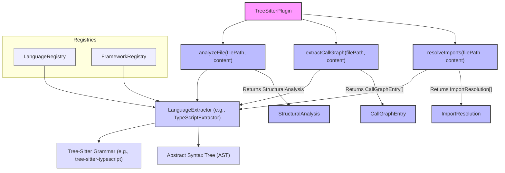

# Core Library (@understand-anything/core)

<details>
<summary>관련 소스 파일</summary>

다음 파일들은 이 위키 페이지를 생성하기 위한 맥락으로 사용되었습니다.

- [understand-anything-plugin/packages/core/src/__tests__/domain-normalize.test.ts](understand-anything-plugin/packages/core/src/__tests__/domain-normalize.test.ts)
- [understand-anything-plugin/packages/core/src/__tests__/domain-persistence.test.ts](understand-anything-plugin/packages/core/src/__tests__/domain-persistence.test.ts)
- [understand-anything-plugin/packages/core/src/__tests__/normalize-graph.test.ts](understand-anything-plugin/packages/core/src/__tests__/normalize-graph.test.ts)
- [understand-anything-plugin/packages/core/src/analyzer/normalize-graph.ts](understand-anything-plugin/packages/core/src/analyzer/normalize-graph.ts)
- [understand-anything-plugin/packages/core/src/index.ts](understand-anything-plugin/packages/core/src/index.ts)
- [understand-anything-plugin/packages/core/src/persistence/index.ts](understand-anything-plugin/packages/core/src/persistence/index.ts)
- [understand-anything-plugin/packages/core/src/persistence/persistence.test.ts](understand-anything-plugin/packages/core/src/persistence/persistence.test.ts)
- [understand-anything-plugin/packages/core/src/types.test.ts](understand-anything-plugin/packages/core/src/types.test.ts)
- [understand-anything-plugin/packages/core/src/types.ts](understand-anything-plugin/packages/core/src/types.ts)

</details>


`@understand-anything/core` 패키지는 전체 Understand Anything 시스템을 위한 핵심 데이터 구조, schema validation, graph construction logic, search capabilities, persistence mechanisms, plugin architecture를 제공하는 기반 TypeScript 라이브러리입니다. 분석 파이프라인부터 대시보드까지 모든 구성 요소에서 사용하는 공통 언어와 계약을 정의합니다.

이 페이지는 core library의 책임에 대한 상위 수준 개요를 제공합니다. 각 하위 시스템에 대한 자세한 정보는 링크된 하위 페이지를 참조하세요.

## KnowledgeGraph Types 및 Schema

Core library는 분석 파이프라인이 생성하는 중심 산출물인 KnowledgeGraph의 canonical data model을 정의합니다. 여기에는 다양한 code, non-code, domain, knowledge entities와 그 관계를 나타내는 포괄적인 `NodeType` 집합(21개 types)과 `EdgeType` 집합(35개 types)이 포함됩니다. `GraphNode`, `GraphEdge`, `Layer`, `TourStep`, `ProjectMeta`, `DomainMeta`, `KnowledgeMeta` 같은 핵심 interfaces는 그래프의 구조를 정합니다.

또한 이 라이브러리는 `sanitizeGraph`, `normalizeGraph`, `autoFixGraph`, `validateGraph` 함수를 포함하는 견고한 Zod 기반 validation pipeline을 구현합니다. 이 파이프라인은 lifecycle의 여러 단계에서 graph data를 정리, 정규화, 검증하여 data integrity를 보장합니다. Alias tables는 complexity levels를 표현하는 다양한 방식처럼 input data의 변형을 처리하는 데 사용됩니다.

자세한 내용은 [KnowledgeGraph Types & Schema](#3.1)를 참조하세요.

출처:
- [understand-anything-plugin/packages/core/src/types.ts:1-116]()
- [understand-anything-plugin/packages/core/src/index.ts:4-12]()
- [understand-anything-plugin/packages/core/src/analyzer/normalize-graph.ts:1-25]()
- [understand-anything-plugin/packages/core/src/analyzer/normalize-graph.ts:113-142]()
- [understand-anything-plugin/packages/core/src/persistence/index.ts:5]()
- [understand-anything-plugin/packages/core/src/persistence/index.ts:94-101]()
- [understand-anything-plugin/packages/core/src/persistence/index.ts:171-178]()
- [understand-anything-plugin/packages/core/src/types.test.ts:1-117]()
- [understand-anything-plugin/packages/core/src/types.test.ts:120-143]()
- [understand-anything-plugin/packages/core/src/__tests__/normalize-graph.test.ts:124-185]()

### KnowledgeGraph 구조
```mermaid
graph TD
    KG[KnowledgeGraph] --> PM[ProjectMeta]
    KG --> GN[GraphNode[]]
    KG --> GE[GraphEdge[]]
    KG --> L[Layer[]]
    KG --> TS[TourStep[]]

    GN --> NT[NodeType]
    GN --> DM[DomainMeta]
    GN --> KM[KnowledgeMeta]
    GE --> ET[EdgeType]

    subgraph "Node Types (NodeType)"
        CodeNodes["file, function, class, module, concept"]
        NonCodeNodes["config, document, service, table, endpoint, pipeline, schema, resource"]
        DomainNodes["domain, flow, step"]
        KnowledgeNodes["article, entity, topic, claim, source"]
    end

    subgraph "Edge Types (EdgeType)"
        Structural["imports, exports, contains, inherits, implements"]
        Behavioral["calls, subscribes, publishes, middleware"]
        DataFlow["reads_from, writes_to, transforms, validates"]
        Dependencies["depends_on, tested_by, configures"]
        Semantic["related, similar_to"]
        InfraSchema["deploys, serves, provisions, triggers, migrates, documents, routes, defines_schema"]
        DomainEdges["contains_flow, flow_step, cross_domain"]
        KnowledgeEdges["cites, contradicts, builds_on, exemplifies, categorized_under, authored_by"]
    end

    NT --> CodeNodes
    NT --> NonCodeNodes
    NT --> DomainNodes
    NT --> KnowledgeNodes

    ET --> Structural
    ET --> Behavioral
    ET --> DataFlow
    ET --> Dependencies
    ET --> Semantic
    ET --> InfraSchema
    ET --> DomainEdges
    ET --> KnowledgeEdges

    style KG fill:#f9f,stroke:#333,stroke-width:2px
    style PM fill:#bbf,stroke:#333,stroke-width:2px
    style GN fill:#bbf,stroke:#333,stroke-width:2px
    style GE fill:#bbf,stroke:#333,stroke-width:2px
    style L fill:#bbf,stroke:#333,stroke-width:2px
    style TS fill:#bbf,stroke:#333,stroke-width:2px
    style NT fill:#ccf,stroke:#333,stroke-width:1px
    style ET fill:#ccf,stroke:#333,stroke-width:1px
    style DM fill:#ccf,stroke:#333,stroke-width:1px
    style KM fill:#ccf,stroke:#333,stroke-width:1px
```
출처:
- [understand-anything-plugin/packages/core/src/types.ts:1-19]()
- [understand-anything-plugin/packages/core/src/types.ts:39-61]()
- [understand-anything-plugin/packages/core/src/types.ts:64-69]()
- [understand-anything-plugin/packages/core/src/types.ts:72-78]()
- [understand-anything-plugin/packages/core/src/types.ts:81-88]()
- [understand-anything-plugin/packages/core/src/types.ts:91-99]()

## GraphBuilder 및 LLM Analyzer

`GraphBuilder` 클래스는 KnowledgeGraph 구성의 중심입니다. `addFile`, `addFileWithAnalysis`, `addNonCodeFileWithAnalysis` 같은 메서드를 제공하여 다양한 source에서 그래프를 점진적으로 구축합니다. 이 프로세스에는 파일에서 semantic information을 추출하기 위해 `buildFileAnalysisPrompt`, `buildProjectSummaryPrompt` 같은 LLM prompt builders를 활용하는 과정이 포함됩니다. `GraphBuilder`는 코드베이스를 구성하고 탐색하는 데 중요한 layer detection과 tour generation 로직도 포함합니다.

자세한 내용은 [GraphBuilder & LLM Analyzer](#3.2)를 참조하세요.

출처:
- [understand-anything-plugin/packages/core/src/index.ts:16]()
- [understand-anything-plugin/packages/core/src/index.ts:18-23]()
- [understand-anything-plugin/packages/core/src/index.ts:40-44]()
- [understand-anything-plugin/packages/core/src/index.ts:47-50]()

## Tree-Sitter Plugin 및 Language Extractors

`TreeSitterPlugin`은 deterministic code analysis를 위한 핵심 구성 요소입니다. Tree-Sitter grammars를 활용해 call graphs(`extractCallGraph`) 추출과 imports 해석(`resolveImports`)을 포함한 코드 파일의 structural analysis를 수행합니다. 이 플러그인은 `LanguageExtractor` interface에 의존하며, TypeScript, Python, Go, Rust, Java, C++, C#, Ruby, PHP 같은 다양한 언어에 대한 구체적 구현을 갖습니다. `LanguageRegistry`와 `FrameworkRegistry`는 이러한 language-specific extractors와 framework-specific analysis rules의 구성 및 검색을 관리합니다.

자세한 내용은 [Tree-Sitter Plugin & Language Extractors](#3.3)를 참조하세요.

출처:
- [understand-anything-plugin/packages/core/src/index.ts:13]()
- [understand-anything-plugin/packages/core/src/index.ts:14-15]()
- [understand-anything-plugin/packages/core/src/index.ts:57-65]()
- [understand-anything-plugin/packages/core/src/types.ts:195-202]()

### Tree-Sitter Plugin Architecture

출처:
- [understand-anything-plugin/packages/core/src/index.ts:13-15]()
- [understand-anything-plugin/packages/core/src/index.ts:57-65]()
- [understand-anything-plugin/packages/core/src/types.ts:169-181]()
- [understand-anything-plugin/packages/core/src/types.ts:183-187]()
- [understand-anything-plugin/packages/core/src/types.ts:189-193]()
- [understand-anything-plugin/packages/core/src/types.ts:195-202]()

## Non-Code Parsers

코드 외에도 `@understand-anything/core`에는 다양한 non-code file types를 위한 parser 모음이 포함되어 있습니다. 이러한 parsers는 Markdown, YAML, JSON, TOML, Dockerfile, SQL, GraphQL, Protobuf, Terraform, Makefile, Shell scripts, environment files 같은 파일에서 structured information을 추출하는 역할을 담당합니다. 추출된 data는 `table`, `service`, `resource` 같은 적절한 `GraphNode` types로 매핑되어 KnowledgeGraph를 infrastructure와 configuration details로 풍부하게 만듭니다.

자세한 내용은 [Non-Code Parsers](#3.4)를 참조하세요.

출처:
- [understand-anything-plugin/packages/core/src/index.ts:104-118]()
- [understand-anything-plugin/packages/core/src/types.ts:123-160]()
- [understand-anything-plugin/packages/core/src/types.ts:175-181]()
- [understand-anything-plugin/packages/core/src/types.test.ts:145-162]()
- [understand-anything-plugin/packages/core/src/types.test.ts:164-178]()
- [understand-anything-plugin/packages/core/src/__tests__/normalize-graph.test.ts:103-117]()

## Search, Persistence 및 Incremental Updates

Core library는 KnowledgeGraph의 검색, 영속화, 증분 업데이트를 위한 견고한 메커니즘을 제공합니다. Fuse.js 기반 fuzzy search를 위한 `SearchEngine`과 cosine similarity를 사용하는 embedding 기반 semantic search를 위한 `SemanticSearchEngine`을 포함합니다.

Persistence layer는 KnowledgeGraph, `AnalysisMeta`, `ProjectConfig`, `FingerprintStore`를 디스크에서 읽고 쓰는 작업을 처리하며, 로컬 디렉터리 구조 유출을 방지하기 위해 저장 전에 absolute file paths가 sanitize(`sanitiseFilePaths`)되도록 보장합니다.

증분 업데이트를 위해 시스템은 file fingerprinting(`FileFingerprint`, `contentHash`)을 사용해 변경을 감지합니다. `change-classifier`(`classifyUpdate`)는 `ChangeLevel`(예: `SKIP`, `PARTIAL_UPDATE`, `ARCHITECTURE_UPDATE`, `FULL_UPDATE`)과 그래프의 `staleness`를 결정하여 전체 코드베이스를 다시 분석하지 않고도 효율적으로 업데이트할 수 있게 합니다.

자세한 내용은 [Search, Persistence & Incremental Updates](#3.5)를 참조하세요.

출처:
- [understand-anything-plugin/packages/core/src/index.ts:2-3]()
- [understand-anything-plugin/packages/core/src/index.ts:32-33]()
- [understand-anything-plugin/packages/core/src/index.ts:35-38]()
- [understand-anything-plugin/packages/core/src/index.ts:80-83]()
- [understand-anything-plugin/packages/core/src/index.ts:84-98]()
- [understand-anything-plugin/packages/core/src/index.ts:100-102]()
- [understand-anything-plugin/packages/core/src/persistence/index.ts:1-11]()
- [understand-anything-plugin/packages/core/src/persistence/index.ts:21-67]()
- [understand-anything-plugin/packages/core/src/persistence/index.ts:69-83]()
- [understand-anything-plugin/packages/core/src/persistence/index.ts:85-105]()
- [understand-anything-plugin/packages/core/src/persistence/index.ts:107-111]()
- [understand-anything-plugin/packages/core/src/persistence/index.ts:113-116]()
- [understand-anything-plugin/packages/core/src/persistence/index.ts:118-121]()
- [understand-anything-plugin/packages/core/src/persistence/index.ts:123-131]()
- [understand-anything-plugin/packages/core/src/persistence/index.ts:133-136]()
- [understand-anything-plugin/packages/core/src/persistence/index.ts:138-147]()
- [understand-anything-plugin/packages/core/src/persistence/persistence.test.ts:1-10]()
- [understand-anything-plugin/packages/core/src/persistence/persistence.test.ts:77-83]()
- [understand-anything-plugin/packages/core/src/persistence/persistence.test.ts:85-91]()
- [understand-anything-plugin/packages/core/src/persistence/persistence.test.ts:117-123]()
- [understand-anything-plugin/packages/core/src/persistence/persistence.test.ts:125-131]()
- [understand-anything-plugin/packages/core/src/persistence/persistence.test.ts:139-143]()
- [understand-anything-plugin/packages/core/src/persistence/persistence.test.ts:157-162]()
- [understand-anything-plugin/packages/core/src/persistence/persistence.test.ts:164-168]()
- [understand-anything-plugin/packages/core/src/persistence/persistence.test.ts:180-184]()
- [understand-anything-plugin/packages/core/src/persistence/persistence.test.ts:186-190]()

## Plugin Registry 및 Discovery

`@understand-anything/core` 패키지는 `PluginRegistry`를 통해 유연한 plugin architecture를 수립합니다. 이 registry는 시스템의 분석 기능을 확장하는 `AnalyzerPlugin` 구현체를 검색하고 관리하는 역할을 담당합니다. `parsePluginConfig`와 `serializePluginConfig` 함수, 그리고 `DEFAULT_PLUGIN_CONFIG`는 plugins의 구성과 영속화를 돕습니다. 이 설계는 third-party developers가 자체 analysis modules를 쉽게 등록하고 통합할 수 있게 하여 시스템의 확장성을 높입니다.

자세한 내용은 [Plugin Registry & Discovery](#3.6)를 참조하세요.

출처:
- [understand-anything-plugin/packages/core/src/index.ts:57]()
- [understand-anything-plugin/packages/core/src/index.ts:73-78]()
- [understand-anything-plugin/packages/core/src/types.ts:195-202]()
- [understand-anything-plugin/packages/core/src/types.test.ts:180-188]()
