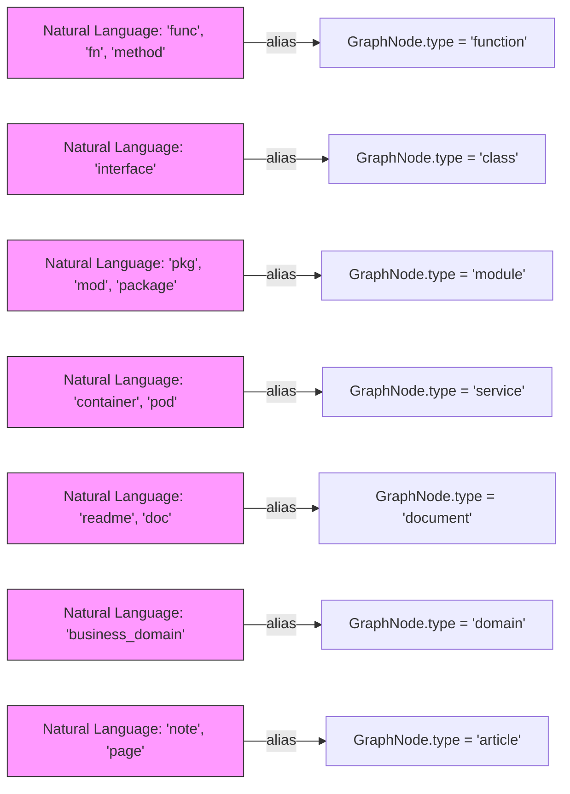
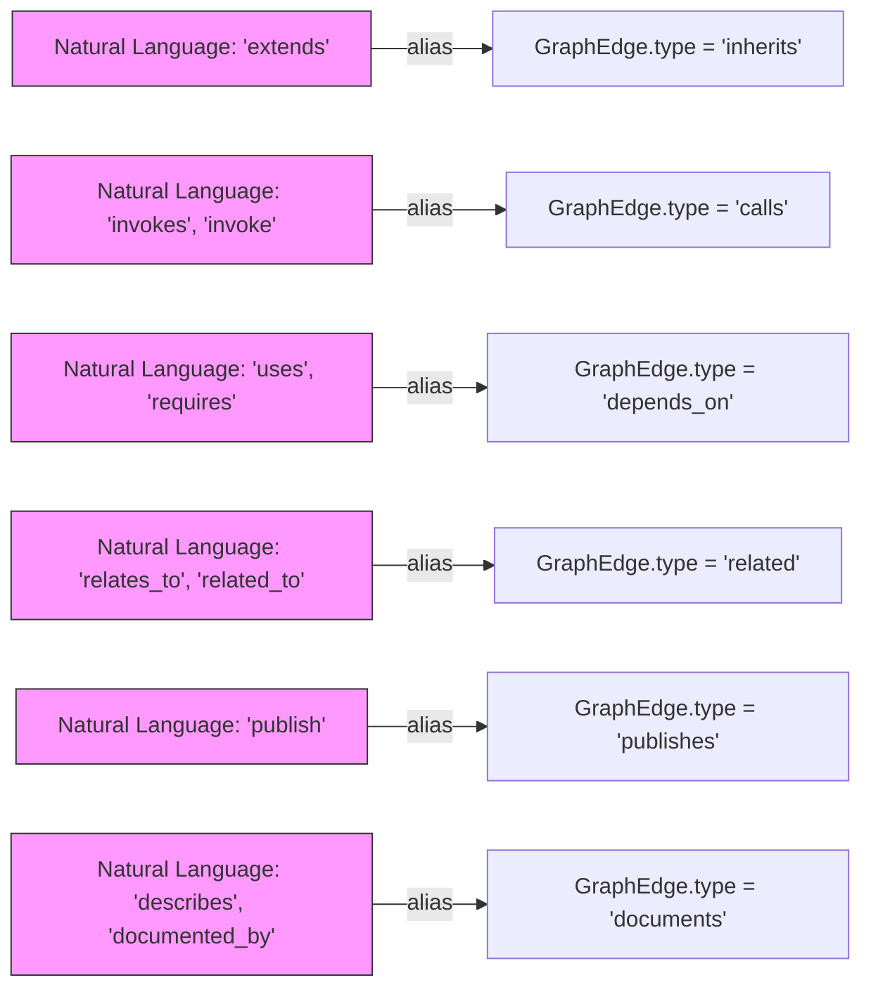

# KnowledgeGraph Types 및 Schema

<details>
<summary>관련 소스 파일</summary>

다음 파일들은 이 위키 페이지를 생성하기 위한 맥락으로 사용되었습니다.

- [understand-anything-plugin/packages/core/src/__tests__/domain-normalize.test.ts](understand-anything-plugin/packages/core/src/__tests__/domain-normalize.test.ts)
- [understand-anything-plugin/packages/core/src/__tests__/domain-persistence.test.ts](understand-anything-plugin/packages/core/src/__tests__/domain-persistence.test.ts)
- [understand-anything-plugin/packages/core/src/__tests__/domain-types.test.ts](understand-anything-plugin/packages/core/src/__tests__/domain-types.test.ts)
- [understand-anything-plugin/packages/core/src/__tests__/normalize-graph.test.ts](understand-anything-plugin/packages/core/src/__tests__/normalize-graph.test.ts)
- [understand-anything-plugin/packages/core/src/__tests__/plugin-discovery.test.ts](understand-anything-plugin/packages/core/src/__tests__/plugin-discovery.test.ts)
- [understand-anything-plugin/packages/core/src/__tests__/schema.test.ts](understand-anything-plugin/packages/core/src/__tests__/schema.test.ts)
- [understand-anything-plugin/packages/core/src/analyzer/normalize-graph.ts](understand-anything-plugin/packages/core/src/analyzer/normalize-graph.ts)
- [understand-anything-plugin/packages/core/src/index.ts](understand-anything-plugin/packages/core/src/index.ts)
- [understand-anything-plugin/packages/core/src/persistence/index.ts](understand-anything-plugin/packages/core/src/persistence/index.ts)
- [understand-anything-plugin/packages/core/src/persistence/persistence.test.ts](understand-anything-plugin/packages/core/src/persistence/persistence.test.ts)
- [understand-anything-plugin/packages/core/src/plugins/tree-sitter-plugin.ts](understand-anything-plugin/packages/core/src/plugins/tree-sitter-plugin.ts)
- [understand-anything-plugin/packages/core/src/schema.ts](understand-anything-plugin/packages/core/src/schema.ts)
- [understand-anything-plugin/packages/core/src/types.test.ts](understand-anything-plugin/packages/core/src/types.test.ts)
- [understand-anything-plugin/packages/core/src/types.ts](understand-anything-plugin/packages/core/src/types.ts)

</details>


이 섹션은 Understand Anything 시스템에서 사용하는 핵심 KnowledgeGraph 데이터 계약을 문서화합니다. 그래프 nodes(NodeType)와 edges(EdgeType)의 canonical types, `GraphNode`, `GraphEdge`, `Layer`, `TourStep` 같은 핵심 interfaces, 그리고 project/domain/knowledge metadata types를 정의합니다. 또한 Zod schemas 기반의 견고한 schema validation pipeline을 다루며, 이 파이프라인은 runtime에서 graph data의 integrity와 consistency를 보장하기 위해 sanitization, normalization(alias resolution 포함), auto-fixing, final validation을 수행합니다.

---

## 1. KnowledgeGraph Data Model 개요

KnowledgeGraph는 codebases, knowledge bases, domain models를 나타내는 구조화된 directed graph입니다. 다음으로 구성됩니다.

- **Nodes(21 distinct types):** files, functions, classes, modules, concepts 같은 code entities, configs, documents, services 같은 non-code entities, domains, flows, steps 같은 domain-specific abstractions, 그리고 articles, topics, claims, sources 같은 knowledge entities를 나타냅니다.

- **Edges(35 distinct types):** structural(imports, inherits), behavioral(calls, publishes), data flow(reads_from, transforms), dependencies(depends_on, tested_by), semantic(related, similar_to), infrastructure(deploys, serves), domain-specific(contains_flow, flow_step), knowledge relationships(cites, contradicts) 같은 관계를 표현합니다.

- **Layers:** architectural layers 또는 기타 classifications에 해당하는 nodes의 논리적 그룹입니다.

- **Tour Steps:** 그래프를 guided exploration 또는 learning하기 위한 ordered sequences입니다.

- **ProjectMeta, DomainMeta, KnowledgeMeta:** project context, domain-specific details, knowledge-related annotations를 설명하는 structured metadata입니다.


### Core TypeScript Interfaces

```ts
// Node types (21 total)
type NodeType =
  | "file" | "function" | "class" | "module" | "concept"
  | "config" | "document" | "service" | "table" | "endpoint"
  | "pipeline" | "schema" | "resource"
  | "domain" | "flow" | "step"
  | "article" | "entity" | "topic" | "claim" | "source";

// Edge types (35 total)
type EdgeType =
  | "imports" | "exports" | "contains" | "inherits" | "implements"  // Structural
  | "calls" | "subscribes" | "publishes" | "middleware"             // Behavioral
  | "reads_from" | "writes_to" | "transforms" | "validates"          // Data flow
  | "depends_on" | "tested_by" | "configures"                        // Dependencies
  | "related" | "similar_to"                                         // Semantic
  | "deploys" | "serves" | "provisions" | "triggers"                 // Infrastructure
  | "migrates" | "documents" | "routes" | "defines_schema"           // Schema/Data
  | "contains_flow" | "flow_step" | "cross_domain"                   // Domain
  | "cites" | "contradicts" | "builds_on" | "exemplifies" | "categorized_under" | "authored_by"; // Knowledge

// GraphNode interface
interface GraphNode {
  id: string;
  type: NodeType;
  name: string;
  filePath?: string;
  lineRange?: [number, number];
  summary: string;
  tags: string[];
  complexity: "simple" | "moderate" | "complex";
  languageNotes?: string;

  domainMeta?: DomainMeta;   // present if node is domain/flow/step type
  knowledgeMeta?: KnowledgeMeta;  // present if node is article/entity/topic/claim/source
}

// GraphEdge interface
interface GraphEdge {
  source: string;
  target: string;
  type: EdgeType;
  direction: "forward" | "backward" | "bidirectional";
  description?: string;
  weight: number; // expected range 0 to 1
}

// Layer grouping interface
interface Layer {
  id: string;
  name: string;
  description: string;
  nodeIds: string[];
}

// TourStep interface for guided graph tours
interface TourStep {
  order: number;
  title: string;
  description: string;
  nodeIds: string[];
  languageLesson?: string;
}

// ProjectMeta describes overall project info
interface ProjectMeta {
  name: string;
  languages: string[];
  frameworks: string[];
  description: string;
  analyzedAt: string;      // ISO date string
  gitCommitHash: string;
}

// DomainMeta optional metadata for domain nodes
interface DomainMeta {
  entities?: string[];
  businessRules?: string[];
  crossDomainInteractions?: string[];
  entryPoint?: string;
  entryType?: "http" | "cli" | "event" | "cron" | "manual";
}

// KnowledgeMeta optional metadata for knowledge nodes
interface KnowledgeMeta {
  wikilinks?: string[];
  backlinks?: string[];
  category?: string;
  content?: string;
}
```

이 typings는 모든 하위 시스템이 소비하고 출력하며 디스크에 영속화하는 graph data의 계약을 형성합니다 [packages/core/src/types.ts:1-100]().

---

## 2. Type Aliases 및 Normalization

### 2.1 Node Type Aliases

사람이 생성하거나 LLM이 생성한 graphs는 node types에 대해 다양한 synonyms 또는 informal aliases를 사용할 수 있습니다. 일관성을 보장하기 위해 aliases를 standard types로 변환하는 canonicalization mapping이 정의되어 있습니다.

- `func`, `fn`, `method` → `function`
- `interface`, `struct` → `class`
- `mod`, `pkg`, `package` → `module`
- Non-code aliases:
  - `container`, `deployment`, `pod` → `service`
  - `doc`, `readme`, `docs` → `document`
  - `job`, `ci` → `pipeline`
  - `route`, `api`, `query`, `mutation` → `endpoint`
  - `setting`, `env`, `configuration` → `config`
  - `infra`, `infrastructure`, `terraform` → `resource`
  - `migration`, `database`, `db`, `view` → `table`
  - `proto`, `protobuf`, `definition`, `typedef` → `schema`
- Domain aliases:
  - `business_domain` → `domain`
  - `business_flow`, `business_process` → `flow`
  - `task`, `business_step` → `step`
- Knowledge aliases:
  - `note`, `page`, `wiki_page` → `article`
  - `person`, `actor`, `organization` → `entity`
  - `tag`, `category`, `theme` → `topic`
  - `assertion`, `decision`, `thesis` → `claim`
  - `reference`, `raw`, `paper` → `source`

### 2.2 Edge Type Aliases

Edges도 마찬가지로 다음 aliases가 있습니다.

- `extends` → `inherits`
- `invokes` → `calls`
- `uses`, `requires` → `depends_on`
- `relates_to`, `related_to` → `related`
- `similar` → `similar_to`
- `import` → `imports`
- `export` → `exports`
- `contain` → `contains`
- `publish` → `publishes`
- `subscribe` → `subscribes`
- `describes` → `documents`, `creates` → `provisions` 같은 non-code aliases와 `has_flow` → `contains_flow` 같은 domain aliases

는 canonical edge types로 정규화됩니다.

### 2.3 Complexity 및 Direction Aliases

- `low`, `easy` 같은 complexity values는 `simple`로 매핑됩니다.
- `to`, `outbound` 같은 direction aliases는 `forward`로 매핑됩니다.
- 기타 일반적인 정규화는 일관된 vocabulary를 유지합니다.

Alias tables는 validation pipeline에서 처리되는 이 자동 normalization을 용이하게 하기 위해 constant records로 중앙 선언됩니다 [packages/core/src/schema.ts:17-146]().

---

## 3. Schema Validation Pipeline

Graph validation pipeline은 Zod library schemas를 구조 검증에 사용하며, 일련의 preprocessing steps로 보강됩니다.

### Pipeline Stages

```mermaid
flowchart TD
  A[Raw Input Graph (JSON)] --> B[sanitizeGraph()]
  B --> C[autoFixGraph()]
  C --> D[normalizeGraph()]
  D --> E[validateGraph()]
  E -->|success| F[Validated KnowledgeGraph]
  E -->|failure| G[Validation Errors / Issues]
```

**Stage details:**

- **sanitizeGraph:** case normalization, nulls 처리, collections(`nodes`, `edges`, `layers`, `tour`)가 arrays임을 보장하는 작업을 통해 입력을 정리하고, strict validation을 위해 graph structure를 준비합니다.

- **autoFixGraph:** heuristics와 defaulting을 적용합니다.
  - 누락된 required fields를 safe defaults로 채웁니다(예: 지정되지 않은 경우 `"file"` type node 할당).
  - edge weights 같은 범위를 벗어난 numeric values를 clamp합니다(항상 0에서 1 사이).
  - `complexity`가 설정되도록 보장합니다(기본값 `"moderate"`).
  - 누락된 identifiers를 추가하거나 수정하고, alias mappings를 사용해 `type` 같은 fields를 canonical values로 정규화합니다.

- **normalizeGraph:** IDs와 references를 canonical normalized forms로 변환합니다. 여기에는 다음이 포함됩니다.
  - node IDs의 경우 prefix가 node type과 일치하도록 보장합니다(예: `func:` → `function:`).
  - normalized node IDs와 일치하도록 edges를 다시 작성합니다.
  - dangling edges 또는 unresolved references가 있는 nodes를 제거합니다.
  - nodes와 edges를 중복 제거합니다.

- **validateGraph:** 모든 fields의 types를 검증하는 formal Zod schema validation을 수행합니다. 사람이 읽을 수 있는 issues와 함께 상세한 success/failure output을 생성합니다.

이 파이프라인은 손상되었거나 불완전하거나 LLM이 생성한 invalid graph data를 방어합니다. 각 단계는 graph를 휴리스틱하게 개선하고 최종적으로 검증하는 데 기여합니다 [packages/core/src/schema.ts:148-330](), [packages/core/src/__tests__/schema.test.ts:3-150]().

---

## 4. KnowledgeGraph Zod Schema

전체 KnowledgeGraph structure를 위한 포괄적인 Zod schema는 다음을 검증합니다.

- project metadata fields와 그 types.
- `nodes`가 `GraphNode`와 일치하는 objects의 non-empty array인지 여부.
- `edges`가 type, direction, numeric weight constraints에 대해 올바른 enum values를 가진 `GraphEdge` objects의 array인지 여부.
- `layers`와 `tour`가 올바른 subfield types를 가진 arrays인지 여부.
- `domainMeta`, `knowledgeMeta` 같은 optional metadata fields의 올바른 사용.

Validation failures에는 missing required fields, invalid enum values, duplicate IDs, dangling references가 포함됩니다.

사용 예시:

```ts
import { validateGraph } from "@understand-anything/core";

const result = validateGraph(graphJson);
if (result.success) {
  // Typed validated KnowledgeGraph available in result.data
} else {
  // Detailed issues in result.issues
}
```

이 견고한 validation approach는 시스템이 항상 well-formed, normalized graphs를 소비하도록 보장합니다 [packages/core/src/schema.ts:4-14, 180-330](), [packages/core/src/__tests__/schema.test.ts:60-150]().

---

## 5. Alias Resolution 및 Data Flows

시스템은 node types, edge types, complexity, direction에 대한 alias tables에 크게 의존하여 지저분하거나 LLM이 생성한 data를 canonical vocabulary로 변환하고, 균일한 downstream processing을 가능하게 합니다.

Validation이 호출되면 incoming graph의 aliases는 먼저 lowercase 처리되고 alias tables를 통해 대체됩니다. 예를 들어 `"func"` 타입의 node는 `"function"`으로 정규화되고, `"extends"` 타입의 edge는 `"inherits"`가 됩니다.

Alias expansion 이후 node와 edge IDs는 type에 따른 prefixing, ID collisions를 피하기 위한 path와 name qualifiers 포함 같은 규칙을 사용해 정규화됩니다(domain에서 flow discriminators가 있는 step nodes에 중요).

### NodeID Normalization Example

```ts
normalizeNodeId("step:create-order:validate", {
  type: "step",
  name: "Validate",
  filePath: "src/validators/order.ts"
});
// Returns: "step:create-order:src/validators/order.ts:validate"
```

이 normalization은 unique consistent IDs를 보장하며 graph merging과 referencing에 중요합니다.

---

## 6. File Persistence 및 Sanitization

Graphs가 디스크에 저장될 때(예: `.understand-anything/knowledge-graph.json`) nodes의 file paths는 project root 밖의 absolute paths가 개발자 환경 세부 정보를 유출하지 않도록 sanitize됩니다.

- node의 `filePath`가 absolute이고 project root 안에 있으면 relative로 변환됩니다.
- absolute이지만 project root 밖에 있으면 basename(file name)만 저장됩니다.
- Relative paths는 그대로 유지됩니다.

이 sanitization은 graph data를 저장하고 공유할 때 privacy concerns를 위해 중요합니다 [packages/core/src/persistence/index.ts:21-67]().

---

## 7. GraphNode 및 GraphEdge 상세 Fields

| Field          | Description                                                                                     | Remarks                             |
|----------------|-------------------------------------------------------------------------------------------------|-----------------------------------|
| `id`           | canonical form(`type:filepath:name` style)의 node 고유 식별자                   | `normalizeNodeId`로 정규화 |
| `type`         | 21개의 canonical `NodeType` strings 중 하나                                                        | validation으로 강제됨             |
| `name`         | 사람이 읽을 수 있는 name 또는 label                                                                   | 필수                          |
| `filePath`     | 선택적 relative file path                                                                    | persistence 시 sanitize됨          |
| `lineRange`     | 선택적 `[startLine, endLine]` integer tuple                                                  | 1-based line numbers              |
| `summary`       | node에 대한 짧은 textual summary 또는 docstring                                                | 필수                          |
| `tags`         | categorization을 위한 tags 배열                                                              | 빈 배열 허용               |
| `complexity`    | `"simple"` | `"moderate"` | `"complex"`                                                          | aliases에서 정규화됨           |
| `languageNotes` | 선택적 language-specific annotations                                                        | 예: TypeScript generics notes    |
| `domainMeta`    | domain, flow, step nodes를 위한 선택적 metadata                                              | domain-specific info 포함     |
| `knowledgeMeta` | knowledge nodes(articles, claims 등)를 위한 선택적 metadata                                | External references, wikilinks    |

| Field      | Description                                                              | Remarks                   |
|------------|--------------------------------------------------------------------------|---------------------------|
| `source`  | source node의 ID                                                    | 필수                  |
| `target`  | target node의 ID                                                    | 필수                  |
| `type`    | 35개의 canonical `EdgeType` strings 중 하나                                  | validation으로 강제됨    |
| `direction` | `"forward"` | `"backward"` | `"bidirectional"`                      | aliases에서 정규화됨   |
| `weight`  | edge strength/confidence를 표현하는 0에서 1 사이의 numeric weight      | autofix 중 clamp됨    |
| `description` | relationship을 자세히 설명하는 선택적 string                     | 선택 사항                  |

---

## 8. 자연어와 코드 엔터티 연결 다이어그램

이 다이어그램들은 alias normalization과 type enums를 활용해 시스템 구성 요소가 자연어 concepts(예: "function", "class", "domain" 같은 nodes)를 내부 code representations에 어떻게 연결하는지 보여줍니다.

### Diagram 1: Node Type Aliases and Canonical Normalization



### Diagram 2: Edge Type Aliases and Canonical Normalization



이 alias mappings는 시스템이 다양한 informal 또는 LLM-inspired labels를 fixed known schema로 견고하게 해석할 수 있도록 합니다 [packages/core/src/schema.ts:17-125]().

---

## 9. 핵심 함수 및 클래스

| Exported Function/Class  | Responsibilities                                                                                              | Source & Lines           |
|-------------------------|--------------------------------------------------------------------------------------------------------------|-------------------------|
| `sanitizeGraph(data)`   | 들어오는 raw graph data를 정리하고, cases를 정규화하며, nulls를 처리하고, arrays가 null이 아님을 보장                 | `schema.ts:148-194`      |
| `autoFixGraph(data)`    | 누락되거나 invalid한 fields(types, complexity, weights)를 자동 수정하고 defaults를 추가                          | `schema.ts:196-310`      |
| `validateGraph(data)`   | 전체 Zod schema validation을 실행하고, issue reports와 함께 success/failure를 반환                              | `schema.ts:330-400`      |
| `normalizeNodeId(id, node)` | node IDs를 충돌을 피하기 위해 well-defined prefixes가 있는 canonical `type:path:name` format으로 변환        | `normalize-graph.ts:31-110` |
| `normalizeComplexity(value)` | complexity string/numeric aliases를 canonical set(`simple`, `moderate`, `complex`)으로 매핑                  | `normalize-graph.ts:134-152` |
| `sanitizeFilePaths(graph, projectRoot)` | 모든 node file paths를 relative로 만들거나 persistence에 적절히 제거하여 info leakage를 방지          | `persistence/index.ts:38-67` |
| `saveGraph(projectRoot, graph)` | path sanitization과 함께 graph JSON을 `.understand-anything/knowledge-graph.json`에 저장               | `persistence/index.ts:69-83` |
| `loadGraph(projectRoot, options)` | validation을 건너뛸 수 있는 option과 함께 디스크에서 graph JSON을 로드하고 검증                                   | `persistence/index.ts:84-105` |

이 함수들은 analysis output → disk → internal usage → visualization에 이르는 lifecycle 전체에서 data consistency를 강제합니다 [packages/core/src/schema.ts]() 및 [packages/core/src/analyzer/normalize-graph.ts](), [packages/core/src/persistence/index.ts]().

---

## 10. Graph Structure Example

Validation 이후의 최소 graph node 및 edge structure 예시는 다음과 같습니다.

```json
{
  "nodes": [
    {
      "id": "file:src/index.ts",
      "type": "file",
      "name": "index.ts",
      "filePath": "src/index.ts",
      "lineRange": [1, 50],
      "summary": "Entry point",
      "tags": ["entry"],
      "complexity": "simple"
    }
  ],
  "edges": [
    {
      "source": "file:src/index.ts",
      "target": "file:src/index.ts",
      "type": "imports",
      "direction": "forward",
      "weight": 0.8
    }
  ],
  "layers": [
    {
      "id": "layer-1",
      "name": "Core",
      "description": "Core layer",
      "nodeIds": ["file:src/index.ts"]
    }
  ],
  "tour": [
    {
      "order": 1,
      "title": "Start here",
      "description": "Begin with the entry point",
      "nodeIds": ["file:src/index.ts"]
    }
  ],
  "project": {
    "name": "test-project",
    "languages": ["typescript"],
    "frameworks": ["vitest"],
    "description": "A test project",
    "analyzedAt": "2026-03-14T00:00:00.000Z",
    "gitCommitHash": "abc123"
  },
  "version": "1.0.0"
}
```

이 구조는 alias resolution과 validation을 적용한 뒤 완전히 type-safe하고 normalized됩니다 [schema.test.ts:11-58]().

---

## 요약

- KnowledgeGraph는 code, domain, knowledge artifacts를 포착하는 풍부하고 typed nodes와 edges로 구성됩니다.
- 21개의 NodeTypes와 35개의 EdgeTypes는 codebase와 knowledge modeling의 넓은 영역을 포괄합니다.
- 자연어 또는 LLM에서 온 aliases는 일관성을 유지하기 위해 canonical types로 정규화됩니다.
- 다단계 Zod 기반 validation pipeline은 모든 graph instance를 sanitize, auto-fix, normalize IDs, validate합니다.
- 영속 파일 형식은 path information leaks를 피하기 위해 sanitize됩니다.
- TypeScript interfaces는 graph data에 대한 강력한 보장을 가능하게 하는 strict typing을 제공합니다.
- Alias tables와 normalization logic은 human/LLM vocabulary를 strict graph schema에 연결합니다.

---

# 부록: 요약 Mermaid 다이어그램 - Core Library의 전체 Graph Data Flow

```mermaid
flowchart TD
  A[Analysis Output (Raw Graph)]
  B[sanitizeGraph()]
  C[autoFixGraph()]
  D[normalizeBatchOutput()]
  E[normalizeGraph()]
  F[validateGraph() with Zod]
  G[KnowledgeGraph (Validated, Typed)]
  H[saveGraph()]
  I[knowledge-graph.json on disk]
  J[loadGraph() + validateGraph()]
  K[Dashboard / UI / Skills]

  A --> B --> C --> D --> E --> F -->|success| G
  G --> H --> I
  I --> J --> F
  G --> K

  subgraph Alias Normalization & ID Canonicalization
    D --> E
  end

  classDef processStyle fill:#eee,stroke:#000,stroke-width:1px;
  class B,C,D,E,F,H,J processStyle;
```

---

# 출처

- `packages/core/src/types.ts:1-100`
- `packages/core/src/schema.ts:17-146,148-330`
- `packages/core/src/__tests__/schema.test.ts:3-150`
- `packages/core/src/analyzer/normalize-graph.ts:31-110,134-152`
- `packages/core/src/persistence/index.ts:21-67,69-105`
- `packages/core/src/__tests__/domain-types.test.ts:1-142`
- `packages/core/src/__tests__/domain-normalize.test.ts:1-47`
