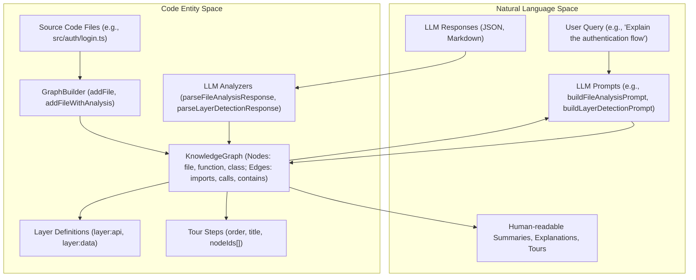

# GraphBuilder 및 LLM Analyzer

<details>
<summary>관련 소스 파일</summary>

다음 파일들은 이 위키 페이지를 생성하기 위한 맥락으로 사용되었습니다.

- [understand-anything-plugin/packages/core/src/__tests__/domain-normalize.test.ts](understand-anything-plugin/packages/core/src/__tests__/domain-normalize.test.ts)
- [understand-anything-plugin/packages/core/src/__tests__/language-lesson.test.ts](understand-anything-plugin/packages/core/src/__tests__/language-lesson.test.ts)
- [understand-anything-plugin/packages/core/src/__tests__/normalize-graph.test.ts](understand-anything-plugin/packages/core/src/__tests__/normalize-graph.test.ts)
- [understand-anything-plugin/packages/core/src/analyzer/graph-builder.test.ts](understand-anything-plugin/packages/core/src/analyzer/graph-builder.test.ts)
- [understand-anything-plugin/packages/core/src/analyzer/graph-builder.ts](understand-anything-plugin/packages/core/src/analyzer/graph-builder.ts)
- [understand-anything-plugin/packages/core/src/analyzer/normalize-graph.ts](understand-anything-plugin/packages/core/src/analyzer/normalize-graph.ts)
- [understand-anything-plugin/packages/core/src/index.ts](understand-anything-plugin/packages/core/src/index.ts)
- [understand-anything-plugin/packages/dashboard/public/knowledge-graph.json](understand-anything-plugin/packages/dashboard/public/knowledge-graph.json)
- [understand-anything-plugin/skills/understand-chat/SKILL.md](understand-anything-plugin/skills/understand-chat/SKILL.md)
- [understand-anything-plugin/skills/understand-diff/SKILL.md](understand-anything-plugin/skills/understand-diff/SKILL.md)
- [understand-anything-plugin/skills/understand-explain/SKILL.md](understand-anything-plugin/skills/understand-explain/SKILL.md)
- [understand-anything-plugin/skills/understand-onboard/SKILL.md](understand-anything-plugin/skills/understand-onboard/SKILL.md)
- [understand-anything-plugin/skills/understand/frameworks/django.md](understand-anything-plugin/skills/understand/frameworks/django.md)

</details>


이 페이지는 KnowledgeGraph를 구성하고 분석에 Large Language Models(LLMs)를 활용하는 핵심 구성 요소를 자세히 설명합니다. 그래프에 nodes와 edges를 채우는 중심 역할을 하는 `GraphBuilder` 클래스와, insights 추출, architectural layers 감지, guided tours 생성을 위한 LLM prompt builders 및 관련 utilities를 다룹니다.

## GraphBuilder: KnowledgeGraph 구성

`GraphBuilder` 클래스 [understand-anything-plugin/packages/core/src/analyzer/graph-builder.ts:60-370]()는 KnowledgeGraph에 nodes와 edges를 추가하기 위한 기본 interface입니다. 내부 nodes와 edges 목록을 관리하고, 고유한 IDs를 보장하며, 감지된 languages를 추적합니다.

### 초기화 및 핵심 속성

`GraphBuilder`는 `projectName`과 `gitHash`로 초기화되며, 이 값들은 최종 `KnowledgeGraph`의 `project` metadata 일부가 됩니다 [understand-anything-plugin/packages/core/src/analyzer/graph-builder.ts:70-74](). 또한 file paths를 기반으로 파일의 언어를 감지하기 위해 `LanguageRegistry`를 사용합니다 [understand-anything-plugin/packages/core/src/analyzer/graph-builder.ts:76-77]().

```typescript
class GraphBuilder {
  private readonly nodes: GraphNode[] = [];
  private readonly edges: GraphEdge[] = [];
  private readonly languages = new Set<string>();
  private readonly nodeIds = new Set<string>();
  private readonly edgeKeys = new Set<string>();
  private readonly projectName: string;
  private readonly gitHash: string;
  private readonly languageRegistry: LanguageRegistry;

  constructor(projectName: string, gitHash: string, languageRegistry?: LanguageRegistry) {
    this.projectName = projectName;
    this.gitHash = gitHash;
    this.languageRegistry = languageRegistry ?? LanguageRegistry.createDefault();
  }
  // ... methods
}
```
출처:
- [understand-anything-plugin/packages/core/src/analyzer/graph-builder.ts:60-74]()

### 파일 및 분석 결과 추가

`GraphBuilder`는 여러 종류의 파일과 관련 분석을 추가하기 위한 여러 메서드를 제공합니다.

#### `addFile(filePath: string, meta: FileMeta)`
이 메서드는 일반 file node를 그래프에 추가합니다. 파일의 언어를 자동으로 감지하고 `"file"` 타입의 node를 생성합니다 [understand-anything-plugin/packages/core/src/analyzer/graph-builder.ts:84-102]().

#### `addFileWithAnalysis(filePath: string, analysis: StructuralAnalysis, meta: FileAnalysisMeta)`
구조 분석(예: Tree-Sitter를 통한 분석)을 거친 코드 파일의 경우, 이 메서드는 file node 자체와 그 안에 포함된 functions 및 classes를 별도 nodes로 추가합니다. 또한 파일을 functions 및 classes에 연결하는 `"contains"` edges를 생성합니다 [understand-anything-plugin/packages/core/src/analyzer/graph-builder.ts:105-177](). `meta` 객체에는 파일과 포함된 entities에 대한 summaries가 포함됩니다.

#### `addNonCodeFile(filePath: string, meta: NonCodeFileMeta)`
이 메서드는 non-code files(예: configuration files, documentation)에 사용됩니다. `meta.nodeType`에 의해 결정되는 타입의 node를 생성합니다(예: `"config"`, `"document"`, `"service"`) [understand-anything-plugin/packages/core/src/analyzer/graph-builder.ts:210-226]().

#### `addNonCodeFileWithAnalysis(filePath: string, meta: NonCodeFileAnalysisMeta)`
`addFileWithAnalysis`와 유사하게, 이 메서드는 구조화된 분석 결과가 있는 non-code files를 처리합니다. definitions(tables, schemas), services, endpoints, steps, resources, sections에 대한 child nodes를 생성하고, `"contains"` edges를 통해 parent non-code file에 연결할 수 있습니다 [understand-anything-plugin/packages/core/src/analyzer/graph-builder.ts:228-320](). `KIND_TO_NODE_TYPE` mapping [understand-anything-plugin/packages/core/src/analyzer/graph-builder.ts:39-57]()은 다양한 definitions(예: `table`, `message`, `route`)에 적절한 node type을 결정하는 데 도움이 됩니다.

### Edges 추가

`GraphBuilder`는 nodes 사이에 다양한 타입의 관계를 추가하는 것을 지원합니다.

*   **`addImportEdge(fromFile: string, toFile: string)`**: 두 file nodes 사이에 `"imports"` edge를 생성합니다 [understand-anything-plugin/packages/core/src/analyzer/graph-builder.ts:179-190]().
*   **`addCallEdge(callerFile: string, callerFunc: string, calleeFile: string, calleeFunc: string)`**: 두 function nodes 사이에 `"calls"` edge를 생성합니다 [understand-anything-plugin/packages/core/src/analyzer/graph-builder.ts:192-208]().
*   **`addEdge(sourceId: string, targetId: string, type: GraphEdge["type"], direction: GraphEdge["direction"], weight: number)`**: 기존 두 nodes 사이에 임의 타입의 edge를 추가하는 generic method입니다 [understand-anything-plugin/packages/core/src/analyzer/graph-builder.ts:322-333]().
*   **`addContainsEdge(parentId: string, childId: string)`**: `"contains"` edge를 추가하기 위한 convenience method입니다 [understand-anything-plugin/packages/core/src/analyzer/graph-builder.ts:335-344]().

### 그래프 빌드

`build()` 메서드 [understand-anything-plugin/packages/core/src/analyzer/graph-builder.ts:346-370]()는 graph construction을 마무리합니다. 추가된 모든 nodes와 edges를 집계하고, 감지된 languages를 포함한 `project` metadata를 채우며, 빈 `layers`와 `tour` 배열을 초기화합니다.

```typescript
// Diagram: GraphBuilder Data Flow
graph TD
    A[GraphBuilder Constructor] --> B{projectName, gitHash, LanguageRegistry}
    B --> C[Internal State: nodes[], edges[], languages Set]

    subgraph Add Operations
        D[addFile(filePath, meta)] --> C
        E[addFileWithAnalysis(filePath, analysis, meta)] --> C
        F[addNonCodeFile(filePath, meta)] --> C
        G[addNonCodeFileWithAnalysis(filePath, meta)] --> C
        H[addImportEdge(from, to)] --> C
        I[addCallEdge(caller, callee)] --> C
        J[addEdge(source, target, type, dir, weight)] --> C
    end

    C --> K[build()]
    K --> L[KnowledgeGraph Object]
    L -- includes --> M[Project Metadata]
    L -- includes --> N[Nodes Array]
    L -- includes --> O[Edges Array]
    L -- includes --> P[Empty Layers Array]
    L -- includes --> Q[Empty Tour Array]
```
출처:
- [understand-anything-plugin/packages/core/src/analyzer/graph-builder.ts:60-370]()
- [understand-anything-plugin/packages/core/src/analyzer/graph-builder.test.ts:6-203]()

### Node ID Normalization

`normalizeNodeId` 함수 [understand-anything-plugin/packages/core/src/analyzer/normalize-graph.ts:64-111]()는 node identifiers의 일관성을 보장하는 데 중요합니다. 이 함수는 bare paths, double-prefixed IDs, project-name-prefixed IDs 같은 다양한 형태의 IDs를 canonical `type:path` format으로 변환합니다. 이는 신뢰할 수 있는 graph traversal과 querying에 중요합니다. 예를 들어 `my-project:file:src/foo.ts`는 `file:src/foo.ts`가 되며 [understand-anything-plugin/packages/core/src/analyzer/normalize-graph.test.ts:35-37](), `src/utils.ts`의 function에 대한 bare `formatDate`는 `func:src/utils.ts:formatDate`가 됩니다 [understand-anything-plugin/packages/core/src/analyzer/normalize-graph.test.ts:53-59]().

`normalizeComplexity` 함수 [understand-anything-plugin/packages/core/src/analyzer/normalize-graph.ts:134-152]()는 다양한 string aliases와 numeric inputs를 처리하여 complexity values를 "simple", "moderate", "complex"로 표준화합니다.

출처:
- [understand-anything-plugin/packages/core/src/analyzer/normalize-graph.ts:64-111]()
- [understand-anything-plugin/packages/core/src/analyzer/normalize-graph.ts:134-152]()
- [understand-anything-plugin/packages/core/src/__tests__/normalize-graph.test.ts:9-122]()
- [understand-anything-plugin/packages/core/src/__tests__/normalize-graph.test.ts:124-184]()

## LLM Analyzer: Prompt Builders 및 Parsers

`@understand-anything/core` 패키지에는 KnowledgeGraph를 풍부하게 하기 위해 LLMs와 상호작용하는 utilities가 포함되어 있습니다. 이들은 주로 `llm-analyzer.ts`, `layer-detector.ts`, `tour-generator.ts`에 있습니다.

### File Analysis Prompt

`buildFileAnalysisPrompt` 함수 [understand-anything-plugin/packages/core/src/analyzer/llm-analyzer.ts:10-12]()는 LLM이 단일 파일을 분석하기 위한 prompt를 생성합니다. 이 prompt에는 일반적으로 파일의 content, path, 그리고 structural information(functions, classes, imports, exports)을 추출하고 summaries를 제공하라는 지침이 포함됩니다. 그런 다음 `parseFileAnalysisResponse` 함수 [understand-anything-plugin/packages/core/src/analyzer/llm-analyzer.ts:13-15]()가 LLM의 JSON 출력을 구조화된 `LLMFileAnalysis` 객체로 처리합니다.

### Project Summary Prompt

`buildProjectSummaryPrompt` 함수 [understand-anything-plugin/packages/core/src/analyzer/llm-analyzer.ts:16-18]()는 LLM이 전체 프로젝트의 상위 수준 요약을 생성하기 위한 prompt를 만듭니다. 이 prompt에는 일반적으로 key files 목록, 해당 summaries, 잠재적으로 전체 graph structure가 포함됩니다. `parseProjectSummaryResponse` 함수 [understand-anything-plugin/packages/core/src/analyzer/llm-analyzer.ts:19-21]()는 LLM 응답에서 구조화된 `LLMProjectSummary`를 추출합니다.

### Layer Detection

Architectural layer detection은 코드베이스를 이해하는 중요한 단계입니다. `layer-detector.ts` 모듈은 필요한 도구를 제공합니다.

*   **`buildLayerDetectionPrompt(graph: KnowledgeGraph)`**: 이 함수 [understand-anything-plugin/packages/core/src/analyzer/layer-detector.ts:10-12]()는 현재 KnowledgeGraph(nodes와 edges)를 제공하고 논리적 architectural layers를 식별하여 nodes를 할당하도록 요청하는 LLM prompt를 구성합니다.
*   **`parseLayerDetectionResponse(response: string)`**: 특정 JSON 형식일 것으로 예상되는 LLM 응답을 파싱하여 `LLMLayerResponse` 객체로 변환합니다 [understand-anything-plugin/packages/core/src/analyzer/layer-detector.ts:13-15]().
*   **`applyLLMLayers(graph: KnowledgeGraph, llmLayers: LLMLayerResponse)`**: LLM에서 감지한 layers를 `KnowledgeGraph` 객체에 통합합니다 [understand-anything-plugin/packages/core/src/analyzer/layer-detector.ts:16-18]().

Framework-specific layer detection rules는 prompts에 주입될 수 있습니다. 예를 들어 Django framework addendum [understand-anything-plugin/skills/understand/frameworks/django.md:48-60]()은 `layer:api`, `layer:data`, `layer:service` 같은 canonical layers를 정의하고, 각 layer에 속하는 file patterns와 node types를 지정합니다.

```mermaid
graph TD
    A[KnowledgeGraph] --> B{buildLayerDetectionPrompt}
    B --> C[LLM]
    C --> D[LLM Response (JSON)]
    D --> E{parseLayerDetectionResponse}
    E --> F[LLMLayerResponse Object]
    F --> G{applyLLMLayers}
    G --> H[KnowledgeGraph with Layers]

    subgraph Framework Specifics
        I[Django Framework Addendum] --> B
        I --> E
    end
```
출처:
- [understand-anything-plugin/packages/core/src/analyzer/llm-analyzer.ts:10-23]()
- [understand-anything-plugin/packages/core/src/analyzer/layer-detector.ts:10-18]()
- [understand-anything-plugin/skills/understand/frameworks/django.md:48-60]()

### Tour Generation

`tour-generator.ts` 모듈은 코드베이스를 안내하는 tours 생성을 지원합니다.

*   **`buildTourGenerationPrompt(graph: KnowledgeGraph)`**: `KnowledgeGraph`를 기반으로 단계별 learning tour를 만들기 위한 LLM prompt를 생성합니다 [understand-anything-plugin/packages/core/src/analyzer/tour-generator.ts:10-12]().
*   **`parseTourGenerationResponse(response: string)`**: LLM의 JSON 응답을 구조화된 tour 객체로 파싱합니다 [understand-anything-plugin/packages/core/src/analyzer/tour-generator.ts:13-15]().
*   **`generateHeuristicTour(graph: KnowledgeGraph)`**: tour generation에 대한 heuristic-based approach를 제공하며, 이는 LLM이 생성한 tours의 fallback 또는 complement로 사용할 수 있습니다 [understand-anything-plugin/packages/core/src/analyzer/tour-generator.ts:16-18](). 일반적으로 Breadth-First Search(BFS) 같은 알고리즘으로 그래프를 순회하고 중요도(예: fan-in count)에 따라 nodes를 ranking합니다.

생성된 tours는 `KnowledgeGraph`의 `tour` 배열에 저장됩니다 [understand-anything-plugin/skills/understand-onboard/SKILL.md:22]().

```mermaid
graph TD
    A[KnowledgeGraph] --> B{buildTourGenerationPrompt}
    B --> C[LLM]
    C --> D[LLM Response (JSON)]
    D --> E{parseTourGenerationResponse}
    E --> F[Tour Object]
    A --> G{generateHeuristicTour}
    G --> F
    F --> H[KnowledgeGraph with Tour]
```
출처:
- [understand-anything-plugin/packages/core/src/analyzer/tour-generator.ts:10-18]()
- [understand-anything-plugin/skills/understand-onboard/SKILL.md:22]()

### Language Lesson

`language-lesson.ts` 모듈은 코드 구성 요소 내의 language-specific concepts를 이해하는 데 도움을 줍니다.

*   **`buildLanguageLessonPrompt(node: GraphNode, edges: GraphEdge[], language: string, languageConfig?: LanguageConfig)`**: 주어진 `GraphNode`와 주변 `GraphEdge`s에 존재하는 language-specific patterns 또는 concepts를 설명하기 위한 LLM prompt를 생성합니다 [understand-anything-plugin/packages/core/src/analyzer/language-lesson.ts:3-6]().
*   **`parseLanguageLessonResponse(response: string)`**: LLM의 응답을 파싱하여 `languageNotes`와 설명이 포함된 `concepts` 목록을 추출합니다 [understand-anything-plugin/packages/core/src/analyzer/language-lesson.ts:7-9]().
*   **`detectLanguageConcepts(node: GraphNode, language: string)`**: node tags와 language를 기반으로 일반적인 language concepts(예: "async/await", "middleware pattern")를 휴리스틱하게 감지합니다 [understand-anything-plugin/packages/core/src/analyzer/language-lesson.ts:10-12]().

출처:
- [understand-anything-plugin/packages/core/src/analyzer/language-lesson.ts:3-12]()
- [understand-anything-plugin/packages/core/src/__tests__/language-lesson.test.ts:3-157]()

## 자연어 공간과 코드 엔터티 공간 연결

LLM analysis components는 사람이 이해할 수 있는 자연어 설명과 KnowledgeGraph 안의 구조화된 code entities 사이의 간극을 연결하도록 설계되었습니다.


출처:
- [understand-anything-plugin/packages/core/src/analyzer/graph-builder.ts]()
- [understand-anything-plugin/packages/core/src/analyzer/llm-analyzer.ts]()
- [understand-anything-plugin/packages/core/src/analyzer/layer-detector.ts]()
- [understand-anything-plugin/packages/core/src/analyzer/tour-generator.ts]()
- [understand-anything-plugin/skills/understand-chat/SKILL.md]()
- [understand-anything-plugin/skills/understand-explain/SKILL.md]()
- [understand-anything-plugin/skills/understand-onboard/SKILL.md]()
- [understand-anything-plugin/skills/understand-diff/SKILL.md]()

여러 명령(`/understand-chat`, `/understand-explain`, `/understand-onboard`, `/understand-diff`)의 `SKILL.md` 파일은 LLM이 `KnowledgeGraph`와 어떻게 상호작용하는지 보여줍니다. 이 파일들은 LLM에 다음을 지시합니다.
*   **Read project metadata**: name, languages, frameworks 같은 `project` 세부 정보를 추출합니다 [understand-anything-plugin/skills/understand-chat/SKILL.md:35-36]().
*   **Search for relevant nodes**: keywords를 사용해 `name`, `summary`, `tags` 기준으로 nodes를 찾습니다 [understand-anything-plugin/skills/understand-chat/SKILL.md:38-42]().
*   **Find connected edges**: context를 이해하기 위해 1-hop relationships(incoming/outgoing calls, imports, dependencies)를 식별합니다 [understand-anything-plugin/skills/understand-chat/SKILL.md:44-48]().
*   **Identify layers**: 어떤 architectural layers가 관련되어 있는지 결정합니다 [understand-anything-plugin/skills/understand-chat/SKILL.md:49]().
*   **Generate structured output**: 추출된 graph data를 기반으로 explanations, onboarding guides, diff analyses를 생성합니다 [understand-anything-plugin/skills/understand-explain/SKILL.md:54-59]().

그래프를 query하고, 관련 subgraphs를 추출하며, 이를 LLM에 제공하는 이 반복 프로세스는 상세하고 context-aware한 analysis와 사람이 읽을 수 있는 insights 생성을 가능하게 합니다.

출처:
- [understand-anything-plugin/skills/understand-chat/SKILL.md:35-56]()
- [understand-anything-plugin/skills/understand-explain/SKILL.md:36-59]()
- [understand-anything-plugin/skills/understand-onboard/SKILL.md:35-52]()
- [understand-anything-plugin/skills/understand-diff/SKILL.md:40-59]()
