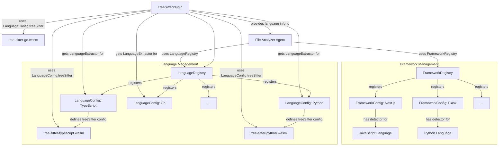

# Tree-Sitter Plugin 및 Language Extractors

<details>
<summary>관련 소스 파일</summary>

다음 파일들은 이 위키 페이지를 생성하기 위한 맥락으로 사용되었습니다.

- [docs/superpowers/plans/2026-04-15-language-extractors-impl.md](docs/superpowers/plans/2026-04-15-language-extractors-impl.md)
- [docs/superpowers/plans/2026-06-03-language-auto-detection.md](docs/superpowers/plans/2026-06-03-language-auto-detection.md)
- [docs/superpowers/specs/2026-06-03-language-auto-detection-design.md](docs/superpowers/specs/2026-06-03-language-auto-detection-design.md)
- [understand-anything-plugin/packages/core/src/__tests__/domain-types.test.ts](understand-anything-plugin/packages/core/src/__tests__/domain-types.test.ts)
- [understand-anything-plugin/packages/core/src/__tests__/framework-registry.test.ts](understand-anything-plugin/packages/core/src/__tests__/framework-registry.test.ts)
- [understand-anything-plugin/packages/core/src/__tests__/language-registry.test.ts](understand-anything-plugin/packages/core/src/__tests__/language-registry.test.ts)
- [understand-anything-plugin/packages/core/src/__tests__/plugin-discovery.test.ts](understand-anything-plugin/packages/core/src/__tests__/plugin-discovery.test.ts)
- [understand-anything-plugin/packages/core/src/__tests__/schema.test.ts](understand-anything-plugin/packages/core/src/__tests__/schema.test.ts)
- [understand-anything-plugin/packages/core/src/languages/configs/c.ts](understand-anything-plugin/packages/core/src/languages/configs/c.ts)
- [understand-anything-plugin/packages/core/src/languages/configs/cpp.ts](understand-anything-plugin/packages/core/src/languages/configs/cpp.ts)
- [understand-anything-plugin/packages/core/src/languages/configs/csharp.ts](understand-anything-plugin/packages/core/src/languages/configs/csharp.ts)
- [understand-anything-plugin/packages/core/src/languages/configs/go.ts](understand-anything-plugin/packages/core/src/languages/configs/go.ts)
- [understand-anything-plugin/packages/core/src/languages/configs/index.ts](understand-anything-plugin/packages/core/src/languages/configs/index.ts)
- [understand-anything-plugin/packages/core/src/languages/configs/java.ts](understand-anything-plugin/packages/core/src/languages/configs/java.ts)
- [understand-anything-plugin/packages/core/src/languages/configs/javascript.ts](understand-anything-plugin/packages/core/src/languages/configs/javascript.ts)
- [understand-anything-plugin/packages/core/src/languages/configs/lua.ts](understand-anything-plugin/packages/core/src/languages/configs/lua.ts)
- [understand-anything-plugin/packages/core/src/languages/configs/php.ts](understand-anything-plugin/packages/core/src/languages/configs/php.ts)
- [understand-anything-plugin/packages/core/src/languages/configs/python.ts](understand-anything-plugin/packages/core/src/languages/configs/python.ts)
- [understand-anything-plugin/packages/core/src/languages/configs/ruby.ts](understand-anything-plugin/packages/core/src/languages/configs/ruby.ts)
- [understand-anything-plugin/packages/core/src/languages/configs/rust.ts](understand-anything-plugin/packages/core/src/languages/configs/rust.ts)
- [understand-anything-plugin/packages/core/src/languages/configs/typescript.ts](understand-anything-plugin/packages/core/src/languages/configs/typescript.ts)
- [understand-anything-plugin/packages/core/src/languages/framework-registry.ts](understand-anything-plugin/packages/core/src/languages/framework-registry.ts)
- [understand-anything-plugin/packages/core/src/languages/frameworks/django.ts](understand-anything-plugin/packages/core/src/languages/frameworks/django.ts)
- [understand-anything-plugin/packages/core/src/languages/frameworks/express.ts](understand-anything-plugin/packages/core/src/languages/frameworks/express.ts)
- [understand-anything-plugin/packages/core/src/languages/frameworks/fastapi.ts](understand-anything-plugin/packages/core/src/languages/frameworks/fastapi.ts)
- [understand-anything-plugin/packages/core/src/languages/frameworks/flask.ts](understand-anything-plugin/packages/core/src/languages/frameworks/flask.ts)
- [understand-anything-plugin/packages/core/src/languages/frameworks/gin.ts](understand-anything-plugin/packages/core/src/languages/frameworks/gin.ts)
- [understand-anything-plugin/packages/core/src/languages/frameworks/nextjs.ts](understand-anything-plugin/packages/core/src/languages/frameworks/nextjs.ts)
- [understand-anything-plugin/packages/core/src/languages/frameworks/rails.ts](understand-anything-plugin/packages/core/src/languages/frameworks/rails.ts)
- [understand-anything-plugin/packages/core/src/plugins/extractors/__tests__/cpp-extractor.test.ts](understand-anything-plugin/packages/core/src/plugins/extractors/__tests__/cpp-extractor.test.ts)
- [understand-anything-plugin/packages/core/src/plugins/extractors/__tests__/csharp-extractor.test.ts](understand-anything-plugin/packages/core/src/plugins/extractors/__tests__/csharp-extractor.test.ts)
- [understand-anything-plugin/packages/core/src/plugins/extractors/__tests__/go-extractor.test.ts](understand-anything-plugin/packages/core/src/plugins/extractors/__tests__/go-extractor.test.ts)
- [understand-anything-plugin/packages/core/src/plugins/extractors/__tests__/java-extractor.test.ts](understand-anything-plugin/packages/core/src/plugins/extractors/__tests__/java-extractor.test.ts)
- [understand-anything-plugin/packages/core/src/plugins/extractors/__tests__/php-extractor.test.ts](understand-anything-plugin/packages/core/src/plugins/extractors/__tests__/php-extractor.test.ts)
- [understand-anything-plugin/packages/core/src/plugins/extractors/__tests__/python-extractor.test.ts](understand-anything-plugin/packages/core/src/plugins/extractors/__tests__/python-extractor.test.ts)
- [understand-anything-plugin/packages/core/src/plugins/extractors/__tests__/rust-extractor.test.ts](understand-anything-plugin/packages/core/src/plugins/extractors/__tests__/rust-extractor.test.ts)
- [understand-anything-plugin/packages/core/src/plugins/extractors/base-extractor.ts](understand-anything-plugin/packages/core/src/plugins/extractors/base-extractor.ts)
- [understand-anything-plugin/packages/core/src/plugins/extractors/cpp-extractor.ts](understand-anything-plugin/packages/core/src/plugins/extractors/cpp-extractor.ts)
- [understand-anything-plugin/packages/core/src/plugins/extractors/csharp-extractor.ts](understand-anything-plugin/packages/core/src/plugins/extractors/csharp-extractor.ts)
- [understand-anything-plugin/packages/core/src/plugins/extractors/go-extractor.ts](understand-anything-plugin/packages/core/src/plugins/extractors/go-extractor.ts)
- [understand-anything-plugin/packages/core/src/plugins/extractors/java-extractor.ts](understand-anything-plugin/packages/core/src/plugins/extractors/java-extractor.ts)
- [understand-anything-plugin/packages/core/src/plugins/extractors/php-extractor.ts](understand-anything-plugin/packages/core/src/plugins/extractors/php-extractor.ts)
- [understand-anything-plugin/packages/core/src/plugins/extractors/python-extractor.ts](understand-anything-plugin/packages/core/src/plugins/extractors/python-extractor.ts)
- [understand-anything-plugin/packages/core/src/plugins/extractors/rust-extractor.ts](understand-anything-plugin/packages/core/src/plugins/extractors/rust-extractor.ts)
- [understand-anything-plugin/packages/core/src/plugins/extractors/types.ts](understand-anything-plugin/packages/core/src/plugins/extractors/types.ts)
- [understand-anything-plugin/packages/core/src/plugins/extractors/typescript-extractor.ts](understand-anything-plugin/packages/core/src/plugins/extractors/typescript-extractor.ts)
- [understand-anything-plugin/packages/core/src/plugins/tree-sitter-plugin.ts](understand-anything-plugin/packages/core/src/plugins/tree-sitter-plugin.ts)
- [understand-anything-plugin/packages/core/src/schema.ts](understand-anything-plugin/packages/core/src/schema.ts)

</details>


이 페이지는 Tree-Sitter parsers를 사용해 코드베이스의 심층 structural analysis를 담당하는 핵심 구성 요소인 `TreeSitterPlugin`을 자세히 설명합니다. 플러그인의 초기화, 파일 분석, call graphs 추출, imports 해석 메서드를 다룹니다. 또한 `LanguageExtractor` interface, TypeScript, Python, Go, Rust, Java, C++, C#, Ruby, PHP 등 다양한 언어별 구현, 그리고 `LanguageRegistry`와 `FrameworkRegistry`를 통해 언어와 프레임워크가 관리되는 방식을 살펴봅니다.

## TreeSitterPlugin

`TreeSitterPlugin`은 Tree-Sitter를 활용해 source code files의 상세 structural analysis를 수행하는 `AnalyzerPlugin`입니다. 각 언어의 Tree-Sitter grammars를 로드하고 특화된 `LanguageExtractor` 구현을 사용하여 다양한 프로그래밍 언어를 지원합니다.

### Initialization (`init`)

`init()` 메서드 [packages/core/src/plugins/tree-sitter-plugin.ts:124-197]()는 `web-tree-sitter` 모듈과 구성된 모든 language grammars를 로드하는 비동기 함수입니다. 동기 분석 메서드를 사용하기 전에 반드시 호출하고 await해야 합니다.

생성 중 language configurations가 제공되면 각 `LanguageConfig`의 `treeSitter` 필드를 기반으로 grammars를 로드합니다 [packages/core/src/plugins/tree-sitter-plugin.ts:134-172](). 구성이 주어지지 않으면 backward compatibility를 위해 TypeScript와 JavaScript grammars를 기본으로 로드합니다 [packages/core/src/plugins/tree-sitter-plugin.ts:174-194](). TypeScript에는 TSX grammar가 있으면 함께 로드하는 특수 처리가 있습니다 [packages/core/src/plugins/tree-sitter-plugin.ts:150-159]().

```mermaid
graph TD
    A[TreeSitterPlugin Constructor] --> B{Configs Provided?};
    B -- Yes --> C[Filter configs with treeSitter field];
    B -- No --> D[Default to TypeScript/JavaScript configs];
    C --> E[Populate this.configs, this.languages, this._extensionToLang];
    D --> E;
    E --> F{Extractors Provided?};
    F -- Yes --> G[Register provided extractors];
    F -- No --> H[Register all builtinExtractors];
    G --> I[TreeSitterPlugin Instance Ready];
    H --> I;

    subgraph Initialization (async init())
        I --> J[Call init()];
        J --> K[Import web-tree-sitter];
        K --> L[Initialize ParserClass];
        L --> M{this.configs.length > 0?};
        M -- Yes --> N[Load grammars from this.configs];
        M -- No --> O[Load legacy TS/JS grammars];
        N --> P[Store loaded languages in this._languages];
        O --> P;
        P --> Q[Set _initialized = true];
        Q --> R[Initialization Complete];
    end
```
**다이어그램: TreeSitterPlugin Initialization Flow**
출처: [packages/core/src/plugins/tree-sitter-plugin.ts:56-96](), [packages/core/src/plugins/tree-sitter-plugin.ts:124-197]()

### File Analysis (`analyzeFile`)

`analyzeFile()` 메서드 [packages/core/src/plugins/tree-sitter-plugin.ts:220-259]()는 file path와 content를 받아 언어를 결정한 다음, 적절한 `LanguageExtractor`를 사용해 structural analysis를 수행합니다. 파일에서 발견된 functions, classes, imports, exports를 포함하는 `StructuralAnalysis` 객체를 반환합니다.

파일의 언어에 대한 extractor를 찾지 못하거나 Tree-Sitter grammar가 로드되지 않은 경우, 해당 파일의 structural analysis를 graceful하게 건너뜁니다 [packages/core/src/plugins/tree-sitter-plugin.ts:226-228]().

### Call Graph Extraction (`extractCallGraph`)

`extractCallGraph()` 메서드 [packages/core/src/plugins/tree-sitter-plugin.ts:261-280]()는 파일 내 function calls를 식별하는 역할을 담당합니다. `analyzeFile`과 유사하게 언어별 extractor를 사용해 AST를 순회하고, 각각 `caller`, `callee`, `lineNumber`를 지정하는 `CallGraphEntry` 객체 목록을 구축합니다.

### Import Resolution (`resolveImports`)

`resolveImports()` 메서드 [packages/core/src/plugins/tree-sitter-plugin.ts:282-301]()는 파일에서 import statements를 추출하고 해당 file paths로 해석하려고 시도합니다. 이는 Knowledge Graph에서 `imports`와 `exports` edges를 구축하는 데 중요합니다. 특정 `LanguageExtractor`의 `resolveImportPath` 메서드에 의존합니다.

```mermaid
graph TD
    A[analyzeFile(filePath, fileContent)] --> B{Get Language Key from filePath};
    B -- No Language --> C[Return empty StructuralAnalysis];
    B -- Language Found --> D{Get Parser for Language};
    D -- No Parser --> C;
    D -- Parser Found --> E[Parse fileContent into AST];
    E --> F{Get LanguageExtractor for Language};
    F -- No Extractor --> C;
    F -- Extractor Found --> G[extractor.extractStructure(rootNode)];
    G --> H[Return StructuralAnalysis];

    I[extractCallGraph(filePath, fileContent)] --> J{Get Language Key from filePath};
    J -- No Language --> K[Return empty CallGraphEntry[]];
    J -- Language Found --> L{Get Parser for Language};
    L -- No Parser --> K;
    L -- Parser Found --> M[Parse fileContent into AST];
    M --> N{Get LanguageExtractor for Language};
    N -- No Extractor --> K;
    N -- Extractor Found --> O[extractor.extractCallGraph(rootNode)];
    O --> P[Return CallGraphEntry[]];

    Q[resolveImports(filePath, fileContent)] --> R{Get Language Key from filePath};
    R -- No Language --> S[Return empty ImportResolution];
    R -- Language Found --> T{Get Parser for Language};
    T -- No Parser --> S;
    T -- Parser Found --> U[Parse fileContent into AST];
    U --> V{Get LanguageExtractor for Language};
    V -- No Extractor --> S;
    V -- Extractor Found --> W[extractor.resolveImportPath(importPath, currentFilePath)];
    W --> X[Return ImportResolution];
```
**다이어그램: TreeSitterPlugin Analysis Methods**
출처: [packages/core/src/plugins/tree-sitter-plugin.ts:220-301]()

## LanguageExtractor Interface

`LanguageExtractor` interface [packages/core/src/plugins/extractors/types.ts:1-10]()는 언어별 코드 분석의 계약을 정의합니다. 각 구현은 다음을 제공해야 합니다.

- `languageIds`: 지원하는 언어의 string identifiers 배열(예: `["typescript", "javascript"]`)입니다.
- `extractStructure(rootNode: TreeSitterNode)`: functions, classes, imports, exports 같은 상위 수준 구조 정보를 추출합니다.
- `extractCallGraph(rootNode: TreeSitterNode)`: function/method call relationships를 추출합니다.
- `resolveImportPath(importPath: string, currentFilePath: string)`: (선택 사항) import string을 canonical file path로 해석합니다.

```typescript
// packages/core/src/plugins/extractors/types.ts
export interface LanguageExtractor {
  readonly languageIds: string[];
  extractStructure(rootNode: TreeSitterNode): StructuralAnalysis;
  extractCallGraph(rootNode: TreeSitterNode): CallGraphEntry[];
  resolveImportPath?(
    importPath: string,
    currentFilePath: string,
  ): string | null;
}
```
출처: [packages/core/src/plugins/extractors/types.ts:1-10]()

## 언어별 Extractor 구현

`Understand-Anything` 코드베이스에는 다양한 인기 프로그래밍 언어를 위한 `LanguageExtractor` 구현 모음이 포함되어 있습니다. 이러한 extractors는 Tree-Sitter가 생성한 Abstract Syntax Tree(AST)를 파싱하고 이를 Knowledge Graph에서 사용하는 `StructuralAnalysis`와 `CallGraphEntry` 형식으로 변환합니다.

`TreeSitterPlugin` 생성자에 custom extractors가 제공되지 않으면 모든 builtin extractors가 기본으로 등록됩니다 [packages/core/src/plugins/tree-sitter-plugin.ts:93-96]().

### TypeScript/JavaScript (`TypeScriptExtractor`)

`TypeScriptExtractor` [packages/core/src/plugins/extractors/typescript-extractor.ts:106-107]()는 TypeScript와 JavaScript를 모두 처리합니다.

- **`extractStructure`**:
    - `function_declaration`, `class_declaration`, `lexical_declaration`, `variable_declaration`, `import_statement`, `export_statement` nodes를 식별합니다 [packages/core/src/plugins/extractors/typescript-extractor.ts:207-234]().
    - function names, parameters, return types를 추출합니다 [packages/core/src/plugins/extractors/typescript-extractor.ts:237-269]().
    - class names, methods, properties를 추출합니다 [packages/core/src/plugins/extractors/typescript-extractor.ts:271-309]().
    - named, namespace, default imports를 포함한 import statements를 파싱합니다 [packages/core/src/plugins/extractors/typescript-extractor.ts:311-329]().
    - `export_statement` nodes에서 exports를 결정합니다 [packages/core/src/plugins/extractors/typescript-extractor.ts:331-379]().
- **`extractCallGraph`**:
    - 현재 function scope를 추적하기 위해 `functionStack`을 유지하며 AST를 순회합니다 [packages/core/src/plugins/extractors/typescript-extractor.ts:134-167]().
    - `call_expression`을 만나면 `caller`(stack에서)와 `callee`(expression에서)를 기록합니다 [packages/core/src/plugins/extractors/typescript-extractor.ts:170-177]().

### Python (`PythonExtractor`)

`PythonExtractor` [packages/core/src/plugins/extractors/python-extractor.ts:100-101]()는 Python을 지원합니다.

- **`extractStructure`**:
    - `function_definition`, `class_definition`, `import_statement` nodes를 처리합니다 [packages/core/src/plugins/extractors/python-extractor.ts:126-148]().
    - function names와 parameters를 추출합니다 [packages/core/src/plugins/extractors/python-extractor.ts:151-169]().
    - class names, methods, properties를 추출합니다 [packages/core/src/plugins/extractors/python-extractor.ts:171-199]().
    - `import_statement`와 `import_from_statement`를 처리해 imports를 포착합니다 [packages/core/src/plugins/extractors/python-extractor.ts:201-229]().
    - top-level functions와 classes에서 exports를 추론합니다 [packages/core/src/plugins/extractors/python-extractor.ts:231-246]().
- **`extractCallGraph`**:
    - recursive walk를 사용해 `function_definition` 또는 `class_definition` scopes 안의 `call` expressions를 식별합니다 [packages/core/src/plugins/extractors/python-extractor.ts:250-289]().

### Go (`GoExtractor`)

`GoExtractor` [packages/core/src/plugins/extractors/go-extractor.ts:100-101]()는 Go를 지원합니다.

- **`extractStructure`**:
    - `function_declaration`, `method_declaration`, `type_declaration`(structs와 interfaces용), `import_declaration`을 처리합니다 [packages/core/src/plugins/extractors/go-extractor.ts:126-150]().
    - function names, parameters, return types를 추출합니다 [packages/core/src/plugins/extractors/go-extractor.ts:153-171]().
    - struct fields와 interface methods를 추출합니다 [packages/core/src/plugins/extractors/go-extractor.ts:173-201]().
    - `import_declaration`을 처리해 imported packages를 얻습니다 [packages/core/src/plugins/extractors/go-extractor.ts:203-219]().
    - identifier visibility(대문자로 시작하는 이름)를 기반으로 exports를 결정합니다 [packages/core/src/plugins/extractors/go-extractor.ts:221-236]().
- **`extractCallGraph`**:
    - function/method scopes 안에서 `call_expression` nodes와 callers를 식별합니다 [packages/core/src/plugins/extractors/go-extractor.ts:240-279]().

### Rust (`RustExtractor`)

`RustExtractor` [packages/core/src/plugins/extractors/rust-extractor.ts:100-101]()는 Rust를 지원합니다.

- **`extractStructure`**:
    - `function_item`, `struct_item`, `enum_item`, `trait_item`, `impl_item`, `use_declaration`을 처리합니다 [packages/core/src/plugins/extractors/rust-extractor.ts:126-150]().
    - function names, parameters, return types를 추출합니다 [packages/core/src/plugins/extractors/rust-extractor.ts:153-171]().
    - struct fields, enum variants, trait methods를 추출합니다 [packages/core/src/plugins/extractors/rust-extractor.ts:173-201]().
    - imports를 위해 `use_declaration`을 처리합니다 [packages/core/src/plugins/extractors/rust-extractor.ts:203-219]().
    - public items(`pub` keyword)에서 exports를 추론합니다 [packages/core/src/plugins/extractors/rust-extractor.ts:221-236]().
- **`extractCallGraph`**:
    - function/method scopes 안에서 `call_expression` nodes와 callers를 식별합니다 [packages/core/src/plugins/extractors/rust-extractor.ts:240-279]().

### Java (`JavaExtractor`)

`JavaExtractor` [packages/core/src/plugins/extractors/java-extractor.ts:100-101]()는 Java를 지원합니다.

- **`extractStructure`**:
    - `class_declaration`, `interface_declaration`, `enum_declaration`, `method_declaration`, `import_declaration`을 처리합니다 [packages/core/src/plugins/extractors/java-extractor.ts:126-150]().
    - method names, parameters, return types를 추출합니다 [packages/core/src/plugins/extractors/java-extractor.ts:153-171]().
    - class fields와 methods를 추출합니다 [packages/core/src/plugins/extractors/java-extractor.ts:173-201]().
    - imports를 위해 `import_declaration`을 처리합니다 [packages/core/src/plugins/extractors/java-extractor.ts:203-219]().
    - public classes, interfaces, methods에서 exports를 추론합니다 [packages/core/src/plugins/extractors/java-extractor.ts:221-236]().
- **`extractCallGraph`**:
    - method scopes 안에서 `method_invocation` nodes와 callers를 식별합니다 [packages/core/src/plugins/extractors/java-extractor.ts:240-279]().

### C++ (`CppExtractor`)

`CppExtractor` [packages/core/src/plugins/extractors/cpp-extractor.ts:124-125]()는 C와 C++를 지원합니다.

- **`extractStructure`**:
    - `function_definition`, `class_specifier`, `struct_specifier`, `namespace_definition`, `#include` directives를 처리합니다 [packages/core/src/plugins/extractors/cpp-extractor.ts:204-228]().
    - complex declarators를 처리하면서 function names, parameters, return types를 추출합니다 [packages/core/src/plugins/extractors/cpp-extractor.ts:39-99]().
    - access specifiers(`public`, `private`, `protected`)를 존중하며 class/struct members(properties와 methods)를 추출합니다 [packages/core/src/plugins/extractors/cpp-extractor.ts:230-300]().
    - `#include` directives를 imports로 매핑합니다 [packages/core/src/plugins/extractors/cpp-extractor.ts:302-318]().
    - non-static top-level functions와 public class/struct members를 exports로 취급합니다 [packages/core/src/plugins/extractors/cpp-extractor.ts:120-123]().
- **`extractCallGraph`**:
    - function scopes 안에서 `call_expression` nodes와 callers를 식별합니다 [packages/core/src/plugins/extractors/cpp-extractor.ts:154-196]().

### C# (`CsharpExtractor`)

`CsharpExtractor` [packages/core/src/plugins/extractors/csharp-extractor.ts:100-101]()는 C#을 지원합니다.

- **`extractStructure`**:
    - `class_declaration`, `interface_declaration`, `struct_declaration`, `enum_declaration`, `method_declaration`, `property_declaration`, `using_directive`를 처리합니다 [packages/core/src/plugins/extractors/csharp-extractor.ts:126-150]().
    - method names, parameters, return types를 추출합니다 [packages/core/src/plugins/extractors/csharp-extractor.ts:153-171]().
    - class/struct/interface members(properties와 methods)를 추출합니다 [packages/core/src/plugins/extractors/csharp-extractor.ts:173-201]().
    - imports를 위해 `using_directive`를 처리합니다 [packages/core/src/plugins/extractors/csharp-extractor.ts:203-219]().
    - public types와 members에서 exports를 추론합니다 [packages/core/src/plugins/extractors/csharp-extractor.ts:221-236]().
- **`extractCallGraph`**:
    - method scopes 안에서 `invocation_expression` nodes와 callers를 식별합니다 [packages/core/src/plugins/extractors/csharp-extractor.ts:240-279]().

### Ruby (`RubyExtractor`)

`RubyExtractor` [packages/core/src/plugins/extractors/ruby-extractor.ts:100-101]()는 Ruby를 지원합니다.

- **`extractStructure`**:
    - `method_declaration`, `class_declaration`, `module_declaration`, 그리고 `require`/`load`/`include`/`extend`용 `call` expressions를 처리합니다 [packages/core/src/plugins/extractors/ruby-extractor.ts:126-150]().
    - method names와 parameters를 추출합니다 [packages/core/src/plugins/extractors/ruby-extractor.ts:153-171]().
    - class/module methods와 properties를 추출합니다 [packages/core/src/plugins/extractors/ruby-extractor.ts:173-201]().
    - 다양한 import-like mechanisms(`require`, `load`, `include`, `extend`)를 처리합니다 [packages/core/src/plugins/extractors/ruby-extractor.ts:203-219]().
    - public methods와 class/module definitions에서 exports를 추론합니다 [packages/core/src/plugins/extractors/ruby-extractor.ts:221-236]().
- **`extractCallGraph`**:
    - method scopes 안에서 `call` expressions와 callers를 식별합니다 [packages/core/src/plugins/extractors/ruby-extractor.ts:240-279]().

### PHP (`PhpExtractor`)

`PhpExtractor` [packages/core/src/plugins/extractors/php-extractor.ts:115-116]()는 PHP를 지원합니다.

- **`extractStructure`**:
    - `function_definition`, `class_declaration`, `interface_declaration`, `namespace_use_declaration`을 처리합니다 [packages/core/src/plugins/extractors/php-extractor.ts:148-176]().
    - function names, parameters(`$` prefix 포함), return types를 추출합니다 [packages/core/src/plugins/extractors/php-extractor.ts:37-64]().
    - class/interface names, methods, properties를 추출합니다 [packages/core/src/plugins/extractors/php-extractor.ts:200-228]().
    - grouped uses를 포함해 imports를 위해 `namespace_use_declaration`을 처리합니다 [packages/core/src/plugins/extractors/php-extractor.ts:67-88]().
    - public classes, interfaces, top-level functions를 exports로 취급합니다 [packages/core/src/plugins/extractors/php-extractor.ts:109-112]().
- **`extractCallGraph`**:
    - `function_call_expression`, `member_call_expression`, `scoped_call_expression` nodes와 callers를 식별합니다 [packages/core/src/plugins/extractors/php-extractor.ts:191-233]().

출처:
- [packages/core/src/plugins/tree-sitter-plugin.ts:93-96]()
- [packages/core/src/plugins/extractors/typescript-extractor.ts:106-107]()
- [packages/core/src/plugins/extractors/typescript-extractor.ts:207-234]()
- [packages/core/src/plugins/extractors/typescript-extractor.ts:237-269]()
- [packages/core/src/plugins/extractors/typescript-extractor.ts:271-309]()
- [packages/core/src/plugins/extractors/typescript-extractor.ts:311-329]()
- [packages/core/src/plugins/extractors/typescript-extractor.ts:331-379]()
- [packages/core/src/plugins/extractors/typescript-extractor.ts:134-167]()
- [packages/core/src/plugins/extractors/typescript-extractor.ts:170-177]()
- [packages/core/src/plugins/extractors/python-extractor.ts:100-101]()
- [packages/core/src/plugins/extractors/python-extractor.ts:126-148]()
- [packages/core/src/plugins/extractors/python-extractor.ts:151-169]()
- [packages/core/src/plugins/extractors/python-extractor.ts:171-199]()
- [packages/core/src/plugins/extractors/python-extractor.ts:201-229]()
- [packages/core/src/plugins/extractors/python-extractor.ts:231-246]()
- [packages/core/src/plugins/extractors/python-extractor.ts:250-289]()
- [packages/core/src/plugins/extractors/go-extractor.ts:100-101]()
- [packages/core/src/plugins/extractors/go-extractor.ts:126-150]()
- [packages/core/src/plugins/extractors/go-extractor.ts:153-171]()
- [packages/core/src/plugins/extractors/go-extractor.ts:173-201]()
- [packages/core/src/plugins/extractors/go-extractor.ts:203-219]()
- [packages/core/src/plugins/extractors/go-extractor.ts:221-236]()
- [packages/core/src/plugins/extractors/go-extractor.ts:240-279]()
- [packages/core/src/plugins/extractors/rust-extractor.ts:100-101]()
- [packages/core/src/plugins/extractors/rust-extractor.ts:126-150]()
- [packages/core/src/plugins/extractors/rust-extractor.ts:153-171]()
- [packages/core/src/plugins/extractors/rust-extractor.ts:173-201]()
- [packages/core/src/plugins/extractors/rust-extractor.ts:203-219]()
- [packages/core/src/plugins/extractors/rust-extractor.ts:221-236]()
- [packages/core/src/plugins/extractors/rust-extractor.ts:240-279]()
- [packages/core/src/plugins/extractors/java-extractor.ts:100-101]()
- [packages/core/src/plugins/extractors/java-extractor.ts:126-150]()
- [packages/core/src/plugins/extractors/java-extractor.ts:153-171]()
- [packages/core/src/plugins/extractors/java-extractor.ts:173-201]()
- [packages/core/src/plugins/extractors/java-extractor.ts:203-219]()
- [packages/core/src/plugins/extractors/java-extractor.ts:221-236]()
- [packages/core/src/plugins/extractors/java-extractor.ts:240-279]()
- [packages/core/src/plugins/extractors/cpp-extractor.ts:124-125]()
- [packages/core/src/plugins/extractors/cpp-extractor.ts:204-228]()
- [packages/core/src/plugins/extractors/cpp-extractor.ts:39-99]()
- [packages/core/src/plugins/extractors/cpp-extractor.ts:230-300]()
- [packages/core/src/plugins/extractors/cpp-extractor.ts:302-318]()
- [packages/core/src/plugins/extractors/cpp-extractor.ts:154-196]()
- [packages/core/src/plugins/extractors/csharp-extractor.ts:100-101]()
- [packages/core/src/plugins/extractors/csharp-extractor.ts:126-150]()
- [packages/core/src/plugins/extractors/csharp-extractor.ts:153-171]()
- [packages/core/src/plugins/extractors/csharp-extractor.ts:173-201]()
- [packages/core/src/plugins/extractors/csharp-extractor.ts:203-219]()
- [packages/core/src/plugins/extractors/csharp-extractor.ts:221-236]()
- [packages/core/src/plugins/extractors/csharp-extractor.ts:240-279]()
- [packages/core/src/plugins/extractors/ruby-extractor.ts:100-101]()
- [packages/core/src/plugins/extractors/ruby-extractor.ts:126-150]()
- [packages/core/src/plugins/extractors/ruby-extractor.ts:153-171]()
- [packages/core/src/plugins/extractors/ruby-extractor.ts:173-201]()
- [packages/core/src/plugins/extractors/ruby-extractor.ts:203-219]()
- [packages/core/src/plugins/extractors/ruby-extractor.ts:221-236]()
- [packages/core/src/plugins/extractors/ruby-extractor.ts:240-279]()
- [packages/core/src/plugins/extractors/php-extractor.ts:115-116]()
- [packages/core/src/plugins/extractors/php-extractor.ts:148-176]()
- [packages/core/src/plugins/extractors/php-extractor.ts:37-64]()
- [packages/core/src/plugins/extractors/php-extractor.ts:200-228]()
- [packages/core/src/plugins/extractors/php-extractor.ts:67-88]()
- [packages/core/src/plugins/extractors/php-extractor.ts:109-112]()
- [packages/core/src/plugins/extractors/php-extractor.ts:191-233]()

## LanguageRegistry 및 FrameworkRegistry

`LanguageRegistry`와 `FrameworkRegistry`는 시스템 내에서 지원 언어와 프레임워크를 관리하는 중심 요소입니다. 언어별 구성과 framework definitions에 접근하는 표준화된 방식을 제공합니다.

### LanguageRegistry

`LanguageRegistry` [packages/core/src/languages/language-registry.ts:1-10]()는 `LanguageConfig` 객체 모음을 보유하는 singleton class입니다. 각 `LanguageConfig`는 `id`, `name`, `extensions`, `aliases`, 그리고 WASM grammars를 로드하기 위한 핵심 `treeSitter` configuration 같은 속성을 정의합니다.

- **`registerLanguage(config: LanguageConfig)`**: 새 language configuration을 registry에 추가합니다 [packages/core/src/languages/language-registry.ts:12-14]().
- **`getLanguage(id: string)`**: ID로 `LanguageConfig`를 가져옵니다 [packages/core/src/languages/language-registry.ts:16-18]().
- **`getLanguageByExtension(ext: string)`**: file extension을 기반으로 language config를 찾습니다 [packages/core/src/languages/language-registry.ts:20-26]().
- **`getAllLanguages()`**: 등록된 모든 language configurations를 반환합니다 [packages/core/src/languages/language-registry.ts:28-30]().

Registry는 `packages/core/src/languages/configs/index.ts`의 default language configurations 집합으로 채워집니다. 여기에는 다음이 포함됩니다.
- TypeScript [packages/core/src/languages/configs/typescript.ts]()
- JavaScript [packages/core/src/languages/configs/javascript.ts]()
- Python [packages/core/src/languages/configs/python.ts]()
- Go [packages/core/src/languages/configs/go.ts]()
- Rust [packages/core/src/languages/configs/rust.ts]()
- Java [packages/core/src/languages/configs/java.ts]()
- C++ [packages/core/src/languages/configs/cpp.ts]()
- C# [packages/core/src/languages/configs/csharp.ts]()
- Ruby [packages/core/src/languages/configs/ruby.ts]()
- PHP [packages/core/src/languages/configs/php.ts]()
- C [packages/core/src/languages/configs/c.ts]()
- Lua [packages/core/src/languages/configs/lua.ts]()

### FrameworkRegistry

`FrameworkRegistry` [packages/core/src/languages/framework-registry.ts:1-10]()는 `LanguageRegistry`와 유사하지만 `FrameworkConfig` 객체를 관리합니다. 각 `FrameworkConfig`는 framework의 `id`, `name`, `language`, 그리고 프로젝트가 이 framework를 사용하는지 식별하는 `detector` 함수를 정의합니다.

- **`registerFramework(config: FrameworkConfig)`**: 새 framework configuration을 추가합니다 [packages/core/src/languages/framework-registry.ts:12-14]().
- **`getFramework(id: string)`**: ID로 `FrameworkConfig`를 가져옵니다 [packages/core/src/languages/framework-registry.ts:16-18]().
- **`getAllFrameworks()`**: 등록된 모든 framework configurations를 반환합니다 [packages/core/src/languages/framework-registry.ts:20-22]().

Default framework configurations에는 다음이 포함됩니다.
- Next.js [packages/core/src/languages/frameworks/nextjs.ts]()
- Express [packages/core/src/languages/frameworks/express.ts]()
- Flask [packages/core/src/languages/frameworks/flask.ts]()
- Django [packages/core/src/languages/frameworks/django.ts]()
- FastAPI [packages/core/src/languages/frameworks/fastapi.ts]()
- Gin [packages/core/src/languages/frameworks/gin.ts]()
- Rails [packages/core/src/languages/frameworks/rails.ts]()


**다이어그램: Language and Framework Registries in Action**
출처:
- [packages/core/src/languages/language-registry.ts:1-10]()
- [packages/core/src/languages/language-registry.ts:12-14]()
- [packages/core/src/languages/language-registry.ts:16-18]()
- [packages/core/src/languages/language-registry.ts:20-26]()
- [packages/core/src/languages/language-registry.ts:28-30]()
- [packages/core/src/languages/configs/index.ts]()
- [packages/core/src/languages/configs/typescript.ts]()
- [packages/core/src/languages/configs/javascript.ts]()
- [packages/core/src/languages/configs/python.ts]()
- [packages/core/src/languages/configs/go.ts]()
- [packages/core/src/languages/configs/rust.ts]()
- [packages/core/src/languages/configs/java.ts]()
- [packages/core/src/languages/configs/cpp.ts]()
- [packages/core/src/languages/configs/csharp.ts]()
- [packages/core/src/languages/configs/ruby.ts]()
- [packages/core/src/languages/configs/php.ts]()
- [packages/core/src/languages/configs/c.ts]()
- [packages/core/src/languages/configs/lua.ts]()
- [packages/core/src/languages/framework-registry.ts:1-10]()
- [packages/core/src/languages/framework-registry.ts:12-14]()
- [packages/core/src/languages/framework-registry.ts:16-18]()
- [packages/core/src/languages/framework-registry.ts:20-22]()
- [packages/core/src/languages/frameworks/nextjs.ts]()
- [packages/core/src/languages/frameworks/express.ts]()
- [packages/core/src/languages/frameworks/flask.ts]()
- [packages/core/src/languages/frameworks/django.ts]()
- [packages/core/src/languages/frameworks/fastapi.ts]()
- [packages/core/src/languages/frameworks/gin.ts]()
- [packages/core/src/languages/frameworks/rails.ts]()
