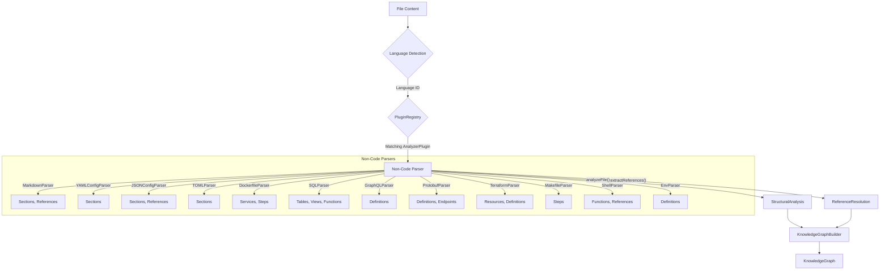
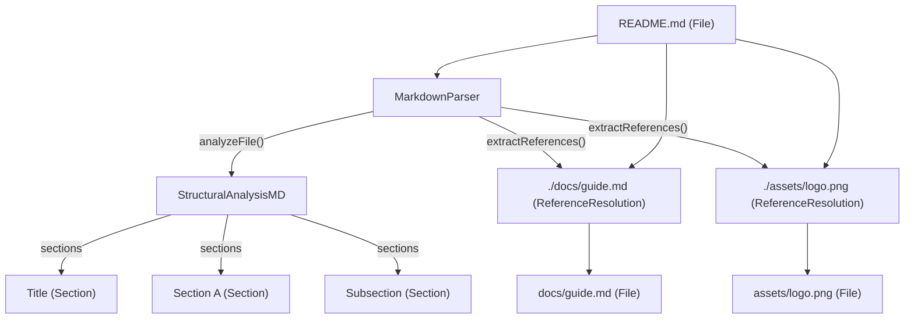
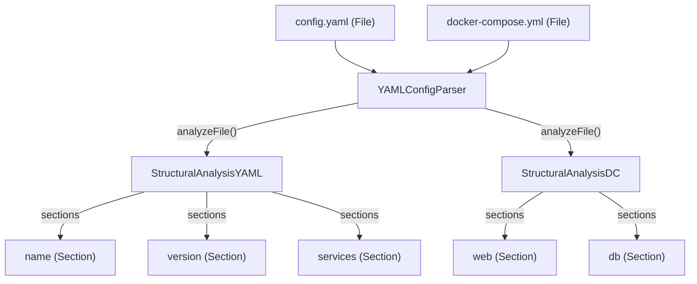
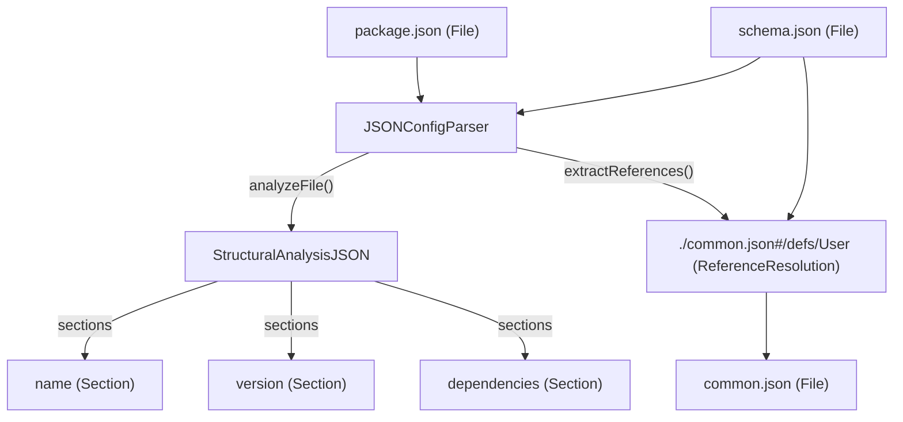
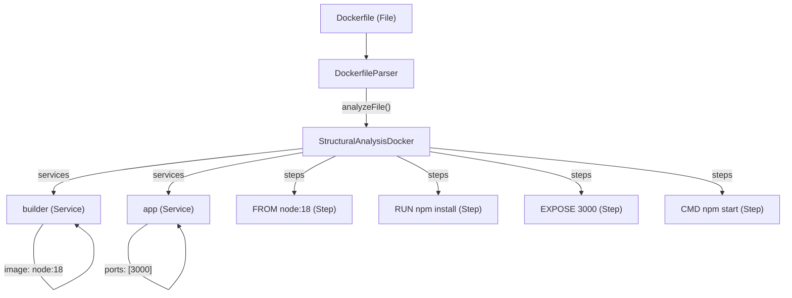
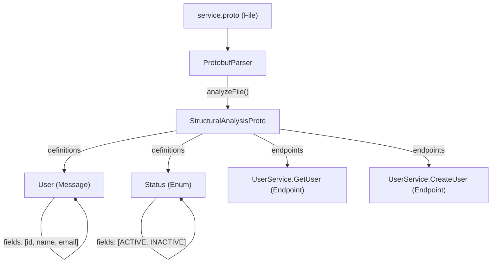
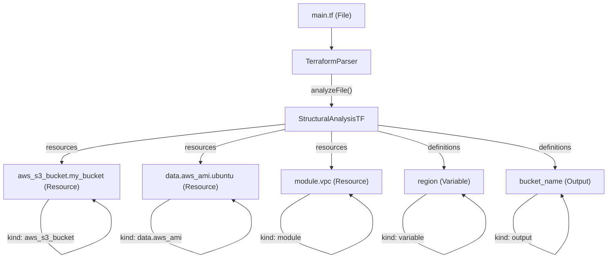
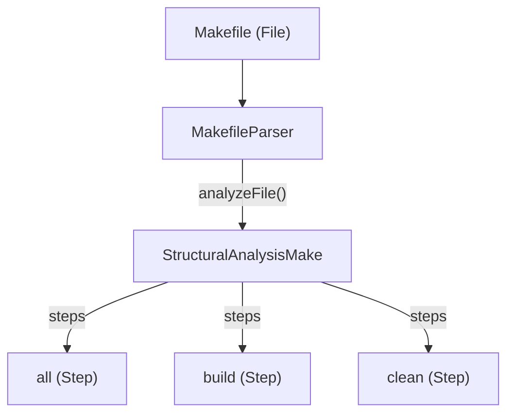
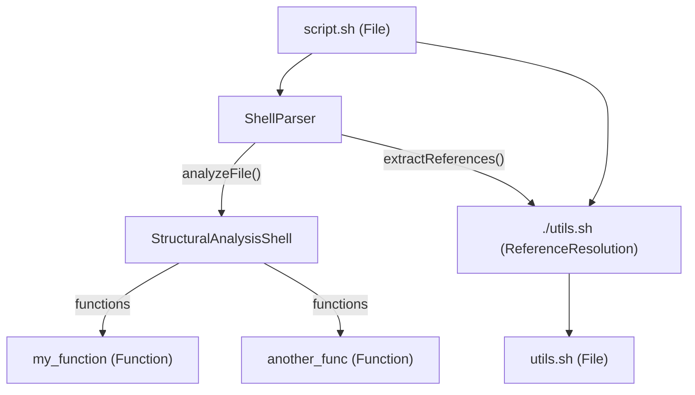
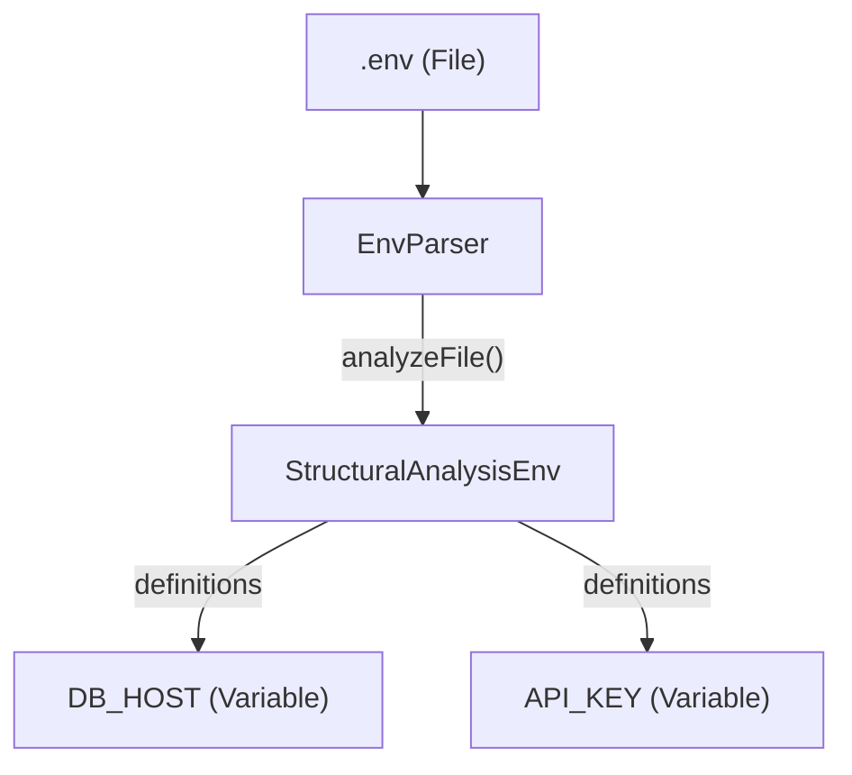

# 비코드 파서

관련 소스 파일

이 wiki 페이지를 생성할 때 다음 파일들이 컨텍스트로 사용되었습니다.

- [understand-anything-plugin/packages/core/src/__tests__/parsers.test.ts](understand-anything-plugin/packages/core/src/__tests__/parsers.test.ts)
- [understand-anything-plugin/packages/core/src/plugins/parsers/dockerfile-parser.ts](understand-anything-plugin/packages/core/src/plugins/parsers/dockerfile-parser.ts)
- [understand-anything-plugin/packages/core/src/plugins/parsers/env-parser.ts](understand-anything-plugin/packages/core/src/plugins/parsers/env-parser.ts)
- [understand-anything-plugin/packages/core/src/plugins/parsers/index.ts](understand-anything-plugin/packages/core/src/plugins/parsers/index.ts)
- [understand-anything-plugin/packages/core/src/plugins/parsers/json-parser.ts](understand-anything-plugin/packages/core/src/plugins/parsers/json-parser.ts)
- [understand-anything-plugin/packages/core/src/plugins/parsers/makefile-parser.ts](understand-anything-plugin/packages/core/src/plugins/parsers/makefile-parser.ts)
- [understand-anything-plugin/packages/core/src/plugins/parsers/markdown-parser.ts](understand-anything-plugin/packages/core/src/plugins/parsers/markdown-parser.ts)
- [understand-anything-plugin/packages/core/src/plugins/parsers/protobuf-parser.ts](understand-anything-plugin/packages/core/src/plugins/parsers/protobuf-parser.ts)
- [understand-anything-plugin/packages/core/src/plugins/parsers/shell-parser.ts](understand-anything-plugin/packages/core/src/plugins/parsers/shell-parser.ts)
- [understand-anything-plugin/packages/core/src/plugins/parsers/terraform-parser.ts](understand-anything-plugin/packages/core/src/plugins/parsers/terraform-parser.ts)
- [understand-anything-plugin/packages/core/src/plugins/parsers/toml-parser.ts](understand-anything-plugin/packages/core/src/plugins/parsers/toml-parser.ts)
- [understand-anything-plugin/packages/core/src/plugins/parsers/yaml-parser.ts](understand-anything-plugin/packages/core/src/plugins/parsers/yaml-parser.ts)
- [understand-anything-plugin/skills/understand/languages/css.md](understand-anything-plugin/skills/understand/languages/css.md)
- [understand-anything-plugin/skills/understand/languages/dockerfile.md](understand-anything-plugin/skills/understand/languages/dockerfile.md)
- [understand-anything-plugin/skills/understand/languages/graphql.md](understand-anything-plugin/skills/understand/languages/graphql.md)
- [understand-anything-plugin/skills/understand/languages/html.md](understand-anything-plugin/skills/understand/languages/html.md)
- [understand-anything-plugin/skills/understand/languages/json.md](understand-anything-plugin/skills/understand/languages/json.md)
- [understand-anything-plugin/skills/understand/languages/markdown.md](understand-anything-plugin/skills/understand/languages/markdown.md)
- [understand-anything-plugin/skills/understand/languages/protobuf.md](understand-anything-plugin/skills/understand/languages/protobuf.md)
- [understand-anything-plugin/skills/understand/languages/shell.md](understand-anything-plugin/skills/understand/languages/shell.md)
- [understand-anything-plugin/skills/understand/languages/sql.md](understand-anything-plugin/skills/understand/languages/sql.md)
- [understand-anything-plugin/skills/understand/languages/terraform.md](understand-anything-plugin/skills/understand/languages/terraform.md)
- [understand-anything-plugin/skills/understand/languages/yaml.md](understand-anything-plugin/skills/understand/languages/yaml.md)

이 페이지는 여러 비코드 파일 형식에서 구조적 정보를 추출하는 `@understand-anything/core` 패키지 내부의 파서 하위 시스템을 자세히 설명합니다. 이 파서들은 `AnalyzerPlugin` 인터페이스를 구현하며, 설정 파일, 문서, 기타 도메인 특화 언어 안에서 섹션, 서비스, 리소스, 정의, 단계 같은 핵심 엔티티를 식별하도록 설계되었습니다. 이렇게 추출된 정보는 이후 KnowledgeGraph를 풍부하게 만드는 데 사용됩니다.

## 비코드 파서 개요

`understand-anything` 플러그인은 비코드 파일을 위한 특화 파서 집합을 사용합니다. 이 파서들은 전통적인 프로그래밍 언어 문법을 따르지는 않지만 가치 있는 아키텍처 또는 설정 데이터를 담고 있는 파일들의 구조와 관계를 이해하는 데 중요합니다. 각 파서는 `AnalyzerPlugin` 인터페이스 [understand-anything-plugin/packages/core/src/types.js]()를 따르는 클래스로 구현되며, `analyzeFile` 및 `extractReferences` 메서드를 제공합니다.

`registerAllParsers` 함수 [understand-anything-plugin/packages/core/src/plugins/parsers/index.ts]()는 이 모든 파서를 `PluginRegistry` [understand-anything-plugin/packages/core/src/__tests__/parsers.test.ts:14-15]()에 등록하는 역할을 합니다. 이를 통해 시스템은 파일의 언어 또는 확장자를 기준으로 적절한 파서를 동적으로 선택할 수 있습니다.

지원되는 비코드 파일 형식은 다음과 같습니다.

*   **Markdown**: 제목과 로컬 파일/이미지 참조를 추출합니다.
*   **YAML**: 최상위 키를 추출하고 다양한 YAML 계열 형식을 처리합니다.
*   **JSON/JSONC**: 최상위 키와 `$ref` 참조를 추출하며, 주석과 후행 쉼표를 지원합니다.
*   **TOML**: 최상위 키를 추출합니다.
*   **Dockerfile**: 다단계 빌드 스테이지, 노출 포트, 명령어를 추출합니다.
*   **SQL**: 테이블, 뷰, 함수 정의를 추출합니다.
*   **GraphQL**: type, query, mutation, subscription 정의를 추출합니다.
*   **Protobuf**: RPC 메서드를 포함하여 message, enum, service 정의를 추출합니다.
*   **Terraform**: resource, data, module, variable, output 블록을 추출합니다.
*   **Makefile**: 빌드 target을 추출합니다.
*   **Shell**: 함수 정의와 `source` 참조를 추출합니다.
*   **Env**: 환경 변수 정의를 추출합니다.

### 파서 아키텍처

각 파서 클래스는 `name`, `languages`, `analyzeFile`, 그리고 선택적으로 `extractReferences` 메서드를 정의하는 `AnalyzerPlugin` 인터페이스를 구현합니다.

*   `name`: 파서의 고유 식별자입니다.
*   `languages`: 이 파서가 처리할 수 있는 언어 식별자 배열입니다(예: "markdown", "yaml", "json"). 이 식별자들은 일반적으로 파일 스캔 중 `LanguageRegistry`가 결정합니다.
*   `analyzeFile(filePath: string, content: string)`: 이 메서드는 파일 내용에 대한 구조 분석을 수행하고 `StructuralAnalysis` 객체를 반환합니다. 이 객체는 `sections`, `services`, `resources`, `definitions`, `steps`, `functions`, `classes`, `imports`, `exports`를 포함할 수 있습니다. 비코드 파서에서는 보통 `sections`, `services`, `resources`, `definitions`, `steps`에 초점을 둡니다.
*   `extractReferences(filePath: string, content: string)`: 이 선택적 메서드는 현재 파일 안에서 다른 파일 또는 엔티티에 대한 참조를 식별하고 추출합니다.

**다이어그램: 비코드 파서 데이터 흐름**
출처: [understand-anything-plugin/packages/core/src/types.js](), [understand-anything-plugin/packages/core/src/__tests__/parsers.test.ts:14-15]()

## Markdown Parser

`MarkdownParser` [understand-anything-plugin/packages/core/src/plugins/parsers/markdown-parser.ts:8-78]()는 Markdown 파일(`.md`) 분석을 담당합니다.

### 기능

*   **제목 추출**: ATX 스타일 제목(`#`, `##` 등)을 식별하고 이름, 레벨, 줄 범위를 추출합니다 [understand-anything-plugin/packages/core/src/plugins/parsers/markdown-parser.ts:41-69](). fenced code block 내부의 제목은 올바르게 무시합니다 [understand-anything-plugin/packages/core/src/plugins/parsers/markdown-parser.ts:45-60]().
*   **로컬 참조 추출**: 로컬 파일과 이미지 참조(예: `[link](./path/to/file.md)`, ``)를 추출합니다 [understand-anything-plugin/packages/core/src/plugins/parsers/markdown-parser.ts:24-38](). 외부 URL은 명시적으로 건너뜁니다.

### 그래프 노드로의 매핑

*   **제목**: `StructuralAnalysis` 결과 안의 `SectionInfo` 객체로 매핑됩니다. 일반적으로 KnowledgeGraph에서 `Section` 노드가 됩니다.
*   **로컬 참조**: `ReferenceResolution` 객체로 매핑되며, `File` 노드 사이에 `references` edge를 형성할 수 있습니다.

**다이어그램: Markdown Parser 출력**
출처: [understand-anything-plugin/packages/core/src/plugins/parsers/markdown-parser.ts:8-78](), [understand-anything-plugin/packages/core/src/__tests__/parsers.test.ts:17-86]()

## YAML Parser

`YAMLConfigParser` [understand-anything-plugin/packages/core/src/plugins/parsers/yaml-parser.ts:14-106]()는 YAML 파일(`.yaml`, `.yml`)과 다양한 YAML 계열 형식을 처리합니다.

### 기능

*   **최상위 키 추출**: YAML 내용을 파싱하여 최상위 키를 섹션으로 추출합니다 [understand-anything-plugin/packages/core/src/plugins/parsers/yaml-parser.ts:35-60](). 일반 키와 따옴표로 감싼 키를 모두 지원합니다.
*   **배열 루트 문서 처리**: 루트가 배열인 YAML 문서의 경우 각 배열 항목마다 섹션을 생성하며, `name`, `id`, `kind` 필드를 사용해 이름을 붙이려고 시도합니다 [understand-anything-plugin/packages/core/src/plugins/parsers/yaml-parser.ts:62-80]().
*   **유연한 오류 처리**: `yaml` 라이브러리 파싱이 실패할 경우 regex 기반 추출로 fallback하는 처리가 포함되어 있습니다 [understand-anything-plugin/packages/core/src/plugins/parsers/yaml-parser.ts:81-99]().
*   **언어 지원**: `yaml`, `kubernetes`, `docker-compose`, `github-actions`, `openapi` 언어 ID를 명시적으로 지원합니다 [understand-anything-plugin/packages/core/src/plugins/parsers/yaml-parser.ts:16-22]().

### 그래프 노드로의 매핑

*   **최상위 키/배열 항목**: `SectionInfo` 객체로 매핑되며, KnowledgeGraph에서 `Section` 노드가 됩니다. `docker-compose.yml`에서는 서비스, `github-actions`에서는 job 또는 trigger를 나타낼 수 있습니다.

**다이어그램: YAML Parser 출력**
출처: [understand-anything-plugin/packages/core/src/plugins/parsers/yaml-parser.ts:14-106](), [understand-anything-plugin/packages/core/src/__tests__/parsers.test.ts:88-126]()

## JSON / JSONC Parser

`JSONConfigParser` [understand-anything-plugin/packages/core/src/plugins/parsers/json-parser.ts:69-136]()는 JSON(`.json`) 및 JSONC(`.jsonc`) 파일을 처리합니다.

### 기능

*   **JSONC 지원**: `stripJsoncSyntax` 함수 [understand-anything-plugin/packages/core/src/plugins/parsers/json-parser.ts:11-59]()는 JSONC 내용을 전처리하여 줄 주석(`//`), 블록 주석(`/* ... */`), 후행 쉼표를 제거함으로써 `JSON.parse`에 유효한 형태로 만듭니다.
*   **최상위 키 추출**: 최상위 키를 섹션으로 추출합니다 [understand-anything-plugin/packages/core/src/plugins/parsers/json-parser.ts:106-130]().
*   **$ref 참조 추출**: JSON Schema와 OpenAPI 명세에서 흔히 발견되는 `$ref` 값을 식별하고 `schema` 유형 참조로 추출합니다 [understand-anything-plugin/packages/core/src/plugins/parsers/json-parser.ts:88-102](). `#`로 시작하는 내부 `$ref`는 건너뜁니다.
*   **언어 지원**: `json`, `jsonc`, `json-schema`, `openapi` 언어 ID를 지원합니다 [understand-anything-plugin/packages/core/src/plugins/parsers/json-parser.ts:74-74]().

### 그래프 노드로의 매핑

*   **최상위 키**: `SectionInfo` 객체로 매핑되며, `Section` 노드가 됩니다. `package.json`에서는 `name`, `version`, `dependencies`일 수 있습니다.
*   **$ref 참조**: `referenceType: "schema"`를 가진 `ReferenceResolution` 객체로 매핑되어 `references` edge를 형성합니다.

**다이어그램: JSON/JSONC Parser 출력**
출처: [understand-anything-plugin/packages/core/src/plugins/parsers/json-parser.ts:69-136](), [understand-anything-plugin/packages/core/src/__tests__/parsers.test.ts:128-190]()

## TOML Parser

`TOMLParser` [understand-anything-plugin/packages/core/src/plugins/parsers/toml-parser.ts]()는 TOML 파일(`.toml`)을 처리합니다(`parsers.test.ts`에서 추론했으며 전체 구현은 제공되지 않았습니다).

### 기능

*   **최상위 키 추출**: 최상위 키와 테이블 이름을 섹션으로 추출합니다.

### 그래프 노드로의 매핑

*   **최상위 키/테이블**: `SectionInfo` 객체로 매핑되며, `Section` 노드가 됩니다.

출처: [understand-anything-plugin/packages/core/src/__tests__/parsers.test.ts:5]()

## Dockerfile Parser

`DockerfileParser` [understand-anything-plugin/packages/core/src/plugins/parsers/dockerfile-parser.ts:8-86]()는 Dockerfile을 분석합니다.

### 기능

*   **다단계 빌드 스테이지 추출**: `FROM` 지시문을 식별하여 빌드 스테이지를 구분하고, 기본 이미지와 스테이지 이름(`AS`로 alias가 지정된 경우)을 추출합니다 [understand-anything-plugin/packages/core/src/plugins/parsers/dockerfile-parser.ts:24-67]().
*   **EXPOSE 포트 추출**: `EXPOSE` 지시문을 수집하고 올바른 빌드 스테이지와 연결합니다 [understand-anything-plugin/packages/core/src/plugins/parsers/dockerfile-parser.ts:49-59]().
*   **명령어 단계 추출**: 개별 Dockerfile 명령어(예: `RUN`, `COPY`, `CMD`)를 단계로 추출합니다 [understand-anything-plugin/packages/core/src/plugins/parsers/dockerfile-parser.ts:72-85]().

### 그래프 노드로의 매핑

*   **빌드 스테이지**: `ServiceInfo` 객체로 매핑되며, KnowledgeGraph에서 `Service` 노드가 됩니다. 이 노드들은 이미지 이름과 노출 포트를 포함합니다.
*   **명령어**: `StepInfo` 객체로 매핑되며, `Step` 노드가 됩니다.

**다이어그램: Dockerfile Parser 출력**
출처: [understand-anything-plugin/packages/core/src/plugins/parsers/dockerfile-parser.ts:8-86](), [understand-anything-plugin/packages/core/src/__tests__/parsers.test.ts:200-240]()

## SQL Parser

`SQLParser` [understand-anything-plugin/packages/core/src/plugins/parsers/sql-parser.ts]()는 SQL 파일(`.sql`)을 처리합니다(`parsers.test.ts`에서 추론했으며 전체 구현은 제공되지 않았습니다).

### 기능

*   **정의 추출**: `CREATE TABLE`, `CREATE VIEW`, `CREATE FUNCTION` 문을 추출합니다.

### 그래프 노드로의 매핑

*   **테이블/뷰/함수**: `DefinitionInfo` 객체로 매핑되며, KnowledgeGraph에서 `Table`, `View`, 또는 `Function` 노드가 됩니다.

출처: [understand-anything-plugin/packages/core/src/__tests__/parsers.test.ts:8]()

## GraphQL Parser

`GraphQLParser` [understand-anything-plugin/packages/core/src/plugins/parsers/graphql-parser.ts]()는 GraphQL 스키마 파일(`.graphql`, `.gql`)을 처리합니다(`parsers.test.ts`에서 추론했으며 전체 구현은 제공되지 않았습니다).

### 기능

*   **정의 추출**: `type`, `input`, `enum`, `interface`, `union`, `scalar`, `query`, `mutation`, `subscription` 정의를 추출합니다.

### 그래프 노드로의 매핑

*   **정의**: `DefinitionInfo` 객체로 매핑되며, KnowledgeGraph에서 `Type`, `Query`, `Mutation`, `Subscription` 등의 노드가 됩니다.

출처: [understand-anything-plugin/packages/core/src/__tests__/parsers.test.ts:9]()

## Protobuf Parser

`ProtobufParser` [understand-anything-plugin/packages/core/src/plugins/parsers/protobuf-parser.ts:8-141]()는 Protocol Buffer 정의 파일(`.proto`)을 분석합니다.

### 기능

*   **Message 정의 추출**: `message` 블록을 식별하고 이름과 필드를 추출합니다 [understand-anything-plugin/packages/core/src/plugins/parsers/protobuf-parser.ts:28-44]().
*   **Enum 정의 추출**: `enum` 블록을 식별하고 이름과 값을 추출합니다 [understand-anything-plugin/packages/core/src/plugins/parsers/protobuf-parser.ts:47-60]().
*   **Service RPC 메서드 추출**: `service` 블록을 식별하고 `rpc` 메서드를 endpoint로 추출합니다 [understand-anything-plugin/packages/core/src/plugins/parsers/protobuf-parser.ts:66-87]().

### 그래프 노드로의 매핑

*   **Message/Enum**: `DefinitionInfo` 객체로 매핑되며, `Message` 또는 `Enum` 노드가 됩니다. 해당 필드/값은 이 노드들의 `fields`로 저장됩니다.
*   **RPC 메서드**: `EndpointInfo` 객체로 매핑되며, 일반적으로 `method: "rpc"`와 `path: "ServiceName.MethodName"`을 가진 `Endpoint` 노드가 됩니다.

**다이어그램: Protobuf Parser 출력**
출처: [understand-anything-plugin/packages/core/src/plugins/parsers/protobuf-parser.ts:8-141](), [understand-anything-plugin/packages/core/src/__tests__/parsers.test.ts:280-319]()

## Terraform Parser

`TerraformParser` [understand-anything-plugin/packages/core/src/plugins/parsers/terraform-parser.ts:8-130]()는 Terraform 설정 파일(`.tf`)을 분석합니다.

### 기능

*   **Resource 추출**: `resource` 블록을 식별하고 type과 name(예: `aws_s3_bucket.my_bucket`)을 추출합니다 [understand-anything-plugin/packages/core/src/plugins/parsers/terraform-parser.ts:28-42]().
*   **Data Source 추출**: `data` 블록을 식별하고 type과 name(예: `data.aws_ami.ubuntu`)을 추출합니다 [understand-anything-plugin/packages/core/src/plugins/parsers/terraform-parser.ts:45-59]().
*   **Module 추출**: `module` 블록을 식별하고 이름을 추출합니다 [understand-anything-plugin/packages/core/src/plugins/parsers/terraform-parser.ts:62-72]().
*   **Variable 및 Output 추출**: `variable`과 `output` 블록을 식별하고 이름을 추출합니다 [understand-anything-plugin/packages/core/src/plugins/parsers/terraform-parser.ts:81-111]().

### 그래프 노드로의 매핑

*   **Resources/Data Sources/Modules**: `ResourceInfo` 객체로 매핑되며, `Resource` 노드가 됩니다. `kind` 필드는 `resource.type`, `data.type`, `module`을 구분합니다.
*   **Variables/Outputs**: `DefinitionInfo` 객체로 매핑되며, `Variable` 또는 `Output` 노드가 됩니다.

**다이어그램: Terraform Parser 출력**
출처: [understand-anything-plugin/packages/core/src/plugins/parsers/terraform-parser.ts:8-130](), [understand-anything-plugin/packages/core/src/__tests__/parsers.test.ts:321-360]()

## Makefile Parser

`MakefileParser` [understand-anything-plugin/packages/core/src/plugins/parsers/makefile-parser.ts:8-50]()는 Makefile을 분석합니다.

### 기능

*   **Target 추출**: 빌드 target(예: `all`, `clean`, `build`)과 해당 줄 범위를 식별합니다 [understand-anything-plugin/packages/core/src/plugins/parsers/makefile-parser.ts:23-49](). 특수 Make target(`.PHONY` 등)과 변수 할당은 걸러냅니다.

### 그래프 노드로의 매핑

*   **Targets**: `StepInfo` 객체로 매핑되며, KnowledgeGraph에서 `Step` 노드가 됩니다.

**다이어그램: Makefile Parser 출력**
출처: [understand-anything-plugin/packages/core/src/plugins/parsers/makefile-parser.ts:8-50](), [understand-anything-plugin/packages/core/src/__tests__/parsers.test.ts:362-390]()

## Shell Parser

`ShellParser` [understand-anything-plugin/packages/core/src/plugins/parsers/shell-parser.ts:8-86]()는 shell script(`.sh`, `.bash`, `jenkinsfile`)를 분석합니다.

### 기능

*   **함수 추출**: shell 함수 정의(`name() {`와 `function name {` 문법 모두)를 식별하고 이름과 줄 범위를 추출합니다 [understand-anything-plugin/packages/core/src/plugins/parsers/shell-parser.ts:41-85](). 중괄호를 정확히 매칭하고 여러 줄 정의를 처리하는 로직을 포함합니다.
*   **Source 참조 추출**: 다른 shell script를 참조하는 `source` 또는 `.` 명령을 추출합니다 [understand-anything-plugin/packages/core/src/plugins/parsers/shell-parser.ts:25-38]().

### 그래프 노드로의 매핑

*   **함수**: `FunctionInfo` 객체로 매핑되며, `Function` 노드가 됩니다.
*   **Source 참조**: `referenceType: "file"`을 가진 `ReferenceResolution` 객체로 매핑되어 `references` edge를 형성합니다.

**다이어그램: Shell Parser 출력**
출처: [understand-anything-plugin/packages/core/src/plugins/parsers/shell-parser.ts:8-86](), [understand-anything-plugin/packages/core/src/__tests__/parsers.test.ts:392-431]()

## Env Parser

`EnvParser` [understand-anything-plugin/packages/core/src/plugins/parsers/env-parser.ts:8-41]()는 `.env` 파일을 분석합니다.

### 기능

*   **변수 추출**: `KEY=value` 할당을 식별하고 변수 이름을 추출합니다 [understand-anything-plugin/packages/core/src/plugins/parsers/env-parser.ts:23-38](). 주석과 빈 줄은 건너뜁니다.

### 그래프 노드로의 매핑

*   **변수**: `DefinitionInfo` 객체로 매핑되며, `Variable` 노드가 됩니다.

**다이어그램: Env Parser 출력**
출처: [understand-anything-plugin/packages/core/src/plugins/parsers/env-parser.ts:8-41](), [understand-anything-plugin/packages/core/src/__tests__/parsers.test.ts:433-455]()
