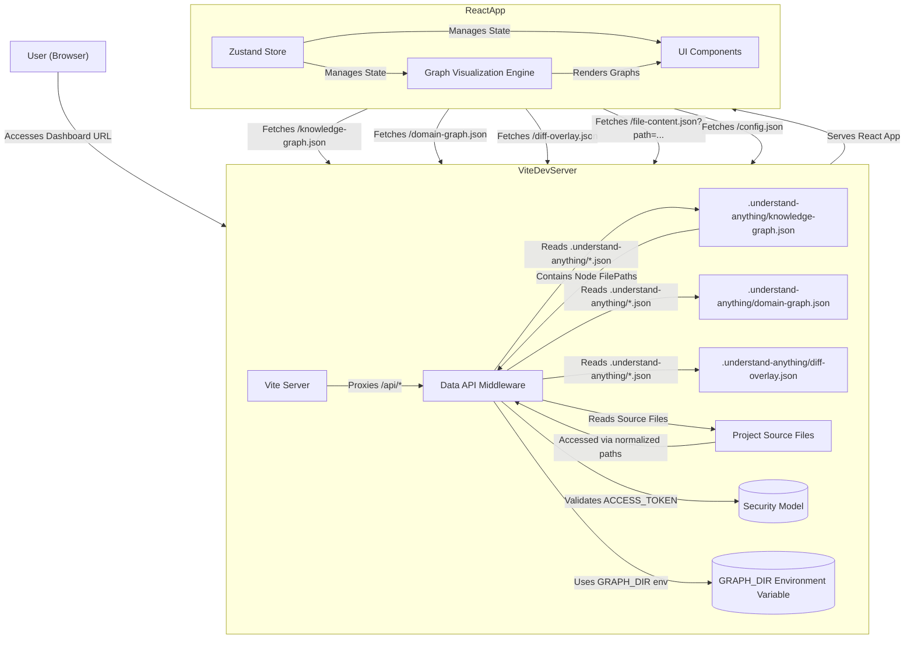

# Dashboard (@understand-anything/dashboard)

관련 소스 파일

이 wiki 페이지를 생성할 때 다음 파일들이 컨텍스트로 사용되었습니다.

- [homepage/package.json](homepage/package.json)
- [pnpm-lock.yaml](pnpm-lock.yaml)
- [understand-anything-plugin/packages/dashboard/package.json](understand-anything-plugin/packages/dashboard/package.json)
- [understand-anything-plugin/packages/dashboard/src/components/CodeViewer.tsx](understand-anything-plugin/packages/dashboard/src/components/CodeViewer.tsx)
- [understand-anything-plugin/packages/dashboard/src/components/KeyboardShortcutsHelp.tsx](understand-anything-plugin/packages/dashboard/src/components/KeyboardShortcutsHelp.tsx)
- [understand-anything-plugin/packages/dashboard/src/components/LayerLegend.tsx](understand-anything-plugin/packages/dashboard/src/components/LayerLegend.tsx)
- [understand-anything-plugin/packages/dashboard/src/components/LearnPanel.tsx](understand-anything-plugin/packages/dashboard/src/components/LearnPanel.tsx)
- [understand-anything-plugin/packages/dashboard/src/components/SearchBar.tsx](understand-anything-plugin/packages/dashboard/src/components/SearchBar.tsx)
- [understand-anything-plugin/packages/dashboard/src/hooks/useKeyboardShortcuts.ts](understand-anything-plugin/packages/dashboard/src/hooks/useKeyboardShortcuts.ts)
- [understand-anything-plugin/packages/dashboard/src/index.css](understand-anything-plugin/packages/dashboard/src/index.css)
- [understand-anything-plugin/packages/dashboard/src/themes/presets.ts](understand-anything-plugin/packages/dashboard/src/themes/presets.ts)
- [understand-anything-plugin/packages/dashboard/src/utils/__tests__/smoke.test.ts](understand-anything-plugin/packages/dashboard/src/utils/__tests__/smoke.test.ts)
- [understand-anything-plugin/packages/dashboard/vite.config.ts](understand-anything-plugin/packages/dashboard/vite.config.ts)
- [understand-anything-plugin/pnpm-workspace.yaml](understand-anything-plugin/pnpm-workspace.yaml)
- [understand-anything-plugin/skills/understand-dashboard/SKILL.md](understand-anything-plugin/skills/understand-dashboard/SKILL.md)

`@understand-anything/dashboard` 패키지는 Understand Anything 분석 pipeline이 생성한 KnowledgeGraph를 시각화하기 위한 React 기반 대화형 web interface를 제공합니다. 사용자가 codebase를 탐색하고 이해할 수 있도록 다양한 graph view, 검색 기능, code viewing, guided tour를 제공합니다. 이 페이지는 dashboard의 아키텍처, development server, security model에 대한 상위 수준 개요와 구성 요소 및 기능의 상세 문서로 이어지는 하위 페이지 링크를 제공합니다.

dashboard는 React와 Vite로 구축된 single-page application이며, Zustand로 상태를 관리하고 React Flow, ELK.js, D3-force 같은 graph visualization library를 활용합니다. graph data와 file content를 제공하는 data API 역할의 local Vite development server와 통신합니다.

## 아키텍처 개요

dashboard는 local Vite development server에서 데이터를 가져오는 client-side React application으로 구성됩니다. 이 server는 React app의 static asset을 제공할 뿐 아니라 여러 data API endpoint를 노출하는 middleware도 포함합니다. 이러한 아키텍처 덕분에 dashboard는 lightweight frontend로 유지되면서도 잠재적으로 민감한 codebase 정보에 안전하게 접근하고 표시할 수 있습니다.

핵심 구성 요소는 다음과 같습니다.
- **Data API Middleware가 포함된 Vite Dev Server**: graph data(`/knowledge-graph.json`, `/domain-graph.json`, `/diff-overlay.json`), file content(`/file-content.json`), configuration(`/config.json`) 요청을 처리합니다. `ACCESS_TOKEN`을 사용하는 security model을 강제합니다.
- **React Application**: UI rendering, state management, data API와의 상호작용을 담당하는 frontend입니다.
- **Graph Visualization Engine**: `@xyflow/react`(React Flow), `elkjs`, `d3-force` 같은 library를 사용해 다양한 graph view를 render하고 layout합니다.
- **Zustand Store**: loaded graph, selected nodes, navigation history, search results, UI settings를 포함한 dashboard의 global state를 관리합니다.
- **UI Components**: 검색, code viewing, filtering, theming, 기타 interactive element를 위한 React component 모음입니다.

출처: [understand-anything-plugin/packages/dashboard/vite.config.ts:1-24](), [understand-anything-plugin/packages/dashboard/src/components/CodeViewer.tsx:26-28]()

## Dashboard Server 및 Data API

dashboard는 graph data와 file content를 제공하기 위한 custom middleware를 포함하도록 설정된 Vite development server에서 실행됩니다. 이 server는 `/understand-dashboard` skill [understand-anything-plugin/skills/understand-dashboard/SKILL.md:80-80]()을 통해 시작됩니다. 중요한 security 기능은 server startup 시 생성되는 one-time token인 `ACCESS_TOKEN` [understand-anything-plugin/packages/dashboard/vite.config.ts:12-12]()이며, 모든 data endpoint에 접근하려면 URL에 포함되어야 합니다. 이를 통해 local codebase 정보에 대한 무단 접근을 방지합니다.

server는 몇 가지 핵심 API endpoint를 노출합니다.
- `/knowledge-graph.json`: main KnowledgeGraph를 제공합니다.
- `/domain-graph.json`: Domain Graph를 제공합니다.
- `/diff-overlay.json`: code change를 시각화하기 위한 데이터를 제공합니다.
- `/file-content.json`: dashboard가 `CodeViewer`에 표시할 특정 source file의 내용을 가져올 수 있게 합니다 [understand-anything-plugin/packages/dashboard/src/components/CodeViewer.tsx:26-28]().
- `/config.json`: dashboard configuration을 제공합니다.

`GRAPH_DIR` environment variable [understand-anything-plugin/skills/understand-dashboard/SKILL.md:105-105]()은 생성된 graph file이 들어 있는 `.understand-anything/` 디렉터리의 위치를 찾는 데 사용됩니다. server는 이러한 파일을 찾기 위해 `graphFileCandidates` 전략 [understand-anything-plugin/packages/dashboard/vite.config.ts:15-23]()을 사용합니다. 경로 정리와 검증은 `normalizeGraphPath` [understand-anything-plugin/packages/dashboard/vite.config.ts:34-53]() 및 `graphFilePathSet` [understand-anything-plugin/packages/dashboard/vite.config.ts:55-70]()이 수행하여, 분석된 graph에 명시적으로 포함되어 있고 project root 내부에 있는 파일에만 접근할 수 있도록 보장합니다.

server middleware, security model, file access logic에 대한 자세한 설명은 [Dashboard Server & Data API](#4.1)를 참조하세요.
출처: [understand-anything-plugin/packages/dashboard/vite.config.ts:1-24](), [understand-anything-plugin/packages/dashboard/src/components/CodeViewer.tsx:26-28](), [understand-anything-plugin/skills/understand-dashboard/SKILL.md:80-80](), [understand-anything-plugin/skills/understand-dashboard/SKILL.md:105-105]()

## Graph Visualization Engine

dashboard의 주요 기능은 복잡한 graph structure를 시각화하는 것입니다. core rendering engine으로 `@xyflow/react`(React Flow)를 사용하며, 정교한 graph layout을 위한 `elkjs`와 force-directed layout을 위한 `d3-force`로 보강됩니다. 특히 Domain Graph View에서 이를 사용합니다. visualization engine은 높은 수준의 architecture 이해를 위한 "overview"와 특정 component를 자세히 살펴보기 위한 "layer-detail" view라는 두 가지 주요 navigation level을 지원합니다. 또한 edge aggregation, lazy container expansion, viewport locking을 처리하여 매끄러운 user experience를 제공합니다.

graph가 render, layout, navigate되는 방식에 대한 심층 설명은 [Graph Visualization Engine](#4.2)을 참조하세요.
출처: [pnpm-lock.yaml:128-147]()

## Domain Graph View 및 Force Layout

`DomainGraphView`는 business domain과 관련 flow 및 step에 초점을 맞춘 특화된 visualization입니다. D3 force-directed layout(`applyForceLayout`)을 사용해 `DomainClusterNode`, `FlowNode`, `StepNode` component를 배치하며, domain 내부의 관계와 cluster를 강조합니다. 이 view는 domain graph에 대한 overview(`buildDomainOverview`)와 상세 관점(`buildDomainDetail`)을 모두 제공합니다.

Domain Graph View, 해당 component, layout algorithm에 대한 자세한 정보는 [Domain Graph View & Force Layout](#4.3)에서 확인할 수 있습니다.
출처: [pnpm-lock.yaml:131-132]()

## Dashboard State Management (Zustand Store)

dashboard의 interactive 특성은 견고한 state management에 크게 의존합니다. `useDashboardStore` [understand-anything-plugin/packages/dashboard/src/components/CodeViewer.tsx:65]()(Zustand store)는 loaded `KnowledgeGraph`, `DomainGraph`, selected nodes, navigation history, persona filtering, detail levels(file vs. class), focus mode, diff overlay state, search integration을 포함한 모든 application state를 중앙화합니다. 또한 강력한 검색 기능을 제공하기 위해 `@understand-anything/core`의 `SearchEngine`과 `SemanticSearchEngine`을 연결합니다.

dashboard state, action, 서로 다른 UI element와의 상호작용에 대한 종합 가이드는 [Dashboard State Management (Zustand Store)](#4.4)를 참조하세요.
출처: [understand-anything-plugin/packages/dashboard/package.json:29-29](), [understand-anything-plugin/packages/dashboard/src/components/CodeViewer.tsx:65]()

## UI Components 및 Panels

dashboard는 탐색과 이해를 쉽게 하기 위해 설계된 풍부한 UI component 집합을 제공합니다. 주요 component는 다음과 같습니다.
- `CustomNode`: graph에서 다양한 node type을 render하기 위한 base component입니다.
- `NodeInfo`: 선택된 node에 대한 상세 정보를 표시합니다.
- `SearchBar`: fuzzy 및 semantic search 기능을 제공합니다 [understand-anything-plugin/packages/dashboard/src/components/SearchBar.tsx:25-31]().
- `LearnPanel`: project tour step을 따라 사용자를 안내합니다 [understand-anything-plugin/packages/dashboard/src/components/LearnPanel.tsx:6-16]().
- `LayerLegend`: architectural layer의 color-coding을 설명합니다 [understand-anything-plugin/packages/dashboard/src/components/LayerLegend.tsx:19-22]().
- `CodeViewer`: syntax highlighting과 line range highlighting으로 source code를 표시합니다 [understand-anything-plugin/packages/dashboard/src/components/CodeViewer.tsx:59-64]().
- `FileExplorer`, `PersonaSelector`, `FilterPanel`, `PathFinderModal`, `ExportMenu`, `WarningBanner`, `DiffToggle`, `OnboardingOverlay`, mobile layout component.

이 component들은 React로 구축되고 Tailwind CSS로 style되며, glassmorphism effect를 포함하는 경우가 많습니다.

각 UI component와 해당 기능에 대한 자세한 분석은 [UI Components & Panels](#4.5)를 참조하세요.
출처: [understand-anything-plugin/packages/dashboard/src/components/CodeViewer.tsx:59-64](), [understand-anything-plugin/packages/dashboard/src/components/LearnPanel.tsx:6-16](), [understand-anything-plugin/packages/dashboard/src/components/LayerLegend.tsx:19-22](), [understand-anything-plugin/packages/dashboard/src/components/SearchBar.tsx:25-31]()

## Theming 및 Internationalization

dashboard는 유연한 theming system을 제공하고 internationalization을 지원합니다. theme system은 `ThemeContext`와 `ThemeEngine`을 중심으로 구축되어 있으며, `dark-gold`, `dark-ocean`, `dark-forest`, `light-minimal` 같은 다양한 preset을 허용합니다 [understand-anything-plugin/packages/dashboard/src/themes/presets.ts:26-170](). dynamic styling에는 CSS variable [understand-anything-plugin/packages/dashboard/src/index.css:6-86]()을 사용하고, glassmorphism utility [understand-anything-plugin/packages/dashboard/src/index.css:118-130]()도 포함합니다. `ThemePicker` component를 통해 사용자는 theme을 전환할 수 있습니다.

Internationalization(i18n)이 지원되며, English(`en`), Simplified Chinese(`zh`), Traditional Chinese(`zh-TW`), Japanese(`ja`), Korean(`ko`), Russian(`ru`) locale을 제공하여 전 세계 사용자가 dashboard에 접근할 수 있도록 합니다.

dashboard의 외형과 언어를 customising하는 방법에 대한 자세한 내용은 [Theming & Internationalization](#4.6)을 참조하세요.
출처: [understand-anything-plugin/packages/dashboard/src/index.css:6-86](), [understand-anything-plugin/packages/dashboard/src/index.css:118-130](), [understand-anything-plugin/packages/dashboard/src/themes/presets.ts:26-170]()
