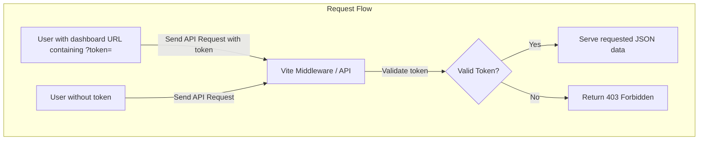
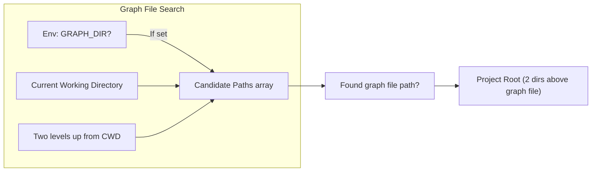
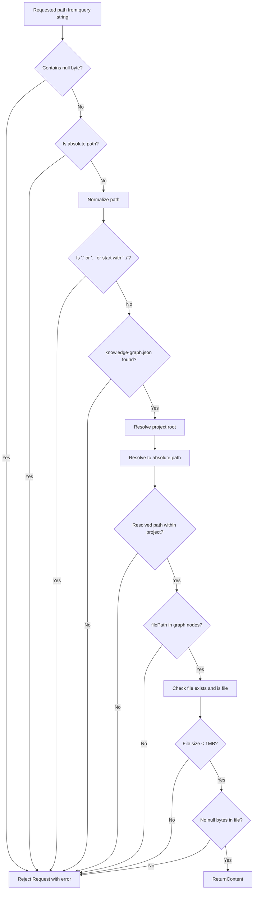
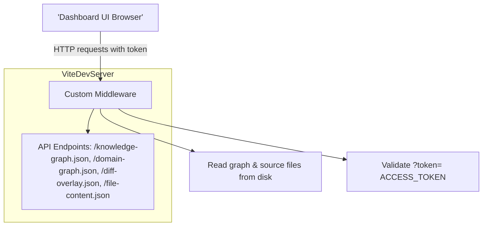
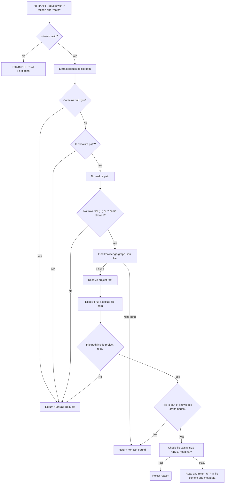
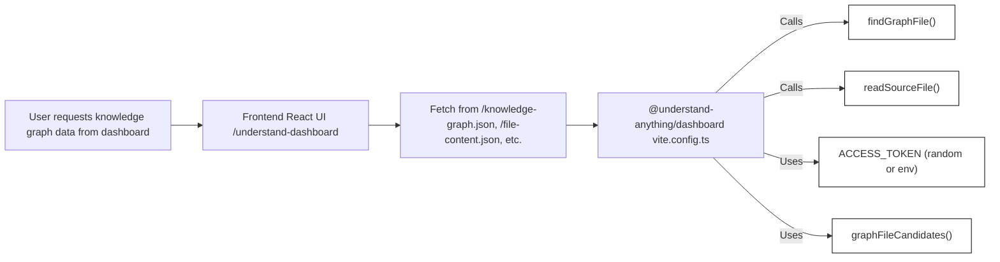

# Dashboard Server 및 Data API

<details>
<summary>관련 소스 파일</summary>

이 wiki 페이지를 생성할 때 다음 파일들이 컨텍스트로 사용되었습니다.

- [homepage/package.json](homepage/package.json)
- [pnpm-lock.yaml](pnpm-lock.yaml)
- [understand-anything-plugin/packages/dashboard/package.json](understand-anything-plugin/packages/dashboard/package.json)
- [understand-anything-plugin/packages/dashboard/src/components/TokenGate.tsx](understand-anything-plugin/packages/dashboard/src/components/TokenGate.tsx)
- [understand-anything-plugin/packages/dashboard/src/utils/__tests__/smoke.test.ts](understand-anything-plugin/packages/dashboard/src/utils/__tests__/smoke.test.ts)
- [understand-anything-plugin/packages/dashboard/vite.config.ts](understand-anything-plugin/packages/dashboard/vite.config.ts)
- [understand-anything-plugin/skills/understand-dashboard/SKILL.md](understand-anything-plugin/skills/understand-dashboard/SKILL.md)

</details>


이 섹션은 `@understand-anything/dashboard` 패키지 내부의 Vite development server에 포함된 핵심 middleware server 기능을 문서화합니다. 분석된 project knowledge graph와 source code content를 시각화하는 데 사용되는 dashboard data API endpoint를 제공하는 방식을 다룹니다. 여기에는 security 및 path sanitization model, project graph directory의 lifecycle과 discovery process, 적절한 graph file을 로드하기 위한 search strategy가 포함됩니다.

---

## 4.1.1 목적과 범위

dashboard server는 Vite dev server 위의 custom middleware로 구현되며, REST와 유사한 data API를 제공합니다. 이 API는 다음과 같은 여러 중요한 JSON endpoint를 노출합니다.

- `/knowledge-graph.json` — 전체 project knowledge graph
- `/domain-graph.json` — business domain data graph
- `/diff-overlay.json` — 변경된 node를 강조하는 differential overlay
- `/file-content.json` — preview용 raw source file content
- `/config.json` — runtime configuration

middleware는 민감한 graph data 접근을 제한하기 위해 **Access Token security model**을 적용합니다. 또한 무단 file access를 방지하기 위해 path normalization과 엄격한 sanitization을 구현합니다. middleware는 environment와 working directory를 기준으로 관련 `.understand-anything/knowledge-graph.json` 및 관련 파일을 찾기 위해 최적화된 **graph file candidate search strategy**를 사용합니다.

---

## 4.1.2 ACCESS_TOKEN Security Model

민감한 knowledge graph data를 보호하기 위해 server는 API request에 `ACCESS_TOKEN` query parameter를 요구합니다. 이 token은 server startup 시 process runtime마다 한 번 생성되는 무작위 16-byte hex string입니다. 다음 중 하나로 결정됩니다.

- environment variable `UNDERSTAND_ACCESS_TOKEN`으로 제공됨
- 또는 server 시작 시 Node의 `crypto.randomBytes(16).toString('hex')`를 사용해 무작위 생성됨

그 다음 server는 dashboard UI가 사용할 수 있도록 이 token을 `?token=...` query parameter로 자동 포함한 URL로 열립니다. `/knowledge-graph.json` 또는 `/diff-overlay.json` 같은 endpoint에 대한 모든 API request는 이 token을 요구하며, token이 없으면 HTTP 403 Forbidden을 반환합니다.

token 요구 사항은 middleware request handler에서 강제되며, 인증되지 않은 접근 시도는 거부됩니다.

이 gating mechanism은 knowledge graph data가 민감한 project source code reference와 내부 architecture information을 포함할 수 있으므로 보호된 상태로 유지되도록 보장합니다.



**출처:** `packages/dashboard/vite.config.ts:9-12, 179-199` `packages/dashboard/src/components/TokenGate.tsx:1-79`


---

## 4.1.3 GRAPH_DIR Lifecycle 및 Graph File Discovery

knowledge graph와 관련 JSON file은 target project directory 안의 `.understand-anything` folder에 위치할 것으로 예상됩니다. 이 project directory의 위치는 dashboard server 시작 전에 environment variable `GRAPH_DIR`을 설정하여 customising할 수 있습니다.

middleware는 `graphFileCandidates()` 함수를 사용해 요청된 graph file(예: `knowledge-graph.json`, `domain-graph.json`, `diff-overlay.json`)이 존재할 수 있는 candidate absolute file path의 정렬된 목록을 생성합니다.

```ts
function graphFileCandidates(fileName: string): string[] {
  const graphDir = process.env.GRAPH_DIR;
  return [
    ...(graphDir ? [path.resolve(graphDir, `.understand-anything/${fileName}`)] : []),
    path.resolve(process.cwd(), `.understand-anything/${fileName}`),
    path.resolve(process.cwd(), `../../../.understand-anything/${fileName}`),
  ];
}
```

이 search는 다음 우선순위를 따릅니다.

1. `GRAPH_DIR`이 설정되어 있으면 그 위치를 먼저 확인합니다.
2. 현재 working directory의 `.understand-anything` 아래를 확인합니다.
3. 두 directory level 위를 확인합니다(예: monorepo scenario).

이 candidate 중 처음 존재하는 path가 active graph file로 선택되며, 이는 `findGraphFile()`을 사용해 찾습니다. project root는 graph file path의 두 directory 위로 추론됩니다.

이 lifecycle 덕분에 여러 dashboard를 root-relative로 실행하거나 서로 다른 monorepo level에서 실행할 수 있습니다.



**출처:** `packages/dashboard/vite.config.ts:15-33`


---

## 4.1.4 Path Sanitization 및 Validation Pipeline

UI가 source code file의 content(`/file-content.json?path=...`)를 요청할 때 server는 directory traversal과 무단 접근을 방지하기 위해 요청된 file path를 신중하게 sanitise합니다.

`readSourceFile(url)`의 path sanitization pipeline 단계는 다음과 같습니다.

1. **Query extraction:** `path` query parameter를 추출합니다. 누락되었거나 null byte를 포함하면 거부합니다.
2. **Absolute path disallowed:** `path`가 absolute path이면 거부합니다.
3. **Normalization:** `path.normalize()`으로 path를 normalize합니다.
4. **No parent directories allowed:** normalized path가 `"."`, `".."`이거나 `../`로 시작하면 거부합니다.
5. **Graph presence check:** project의 `knowledge-graph.json`이 발견되는지 검증합니다.
6. **Project root resolution and path resolution:** 요청 path를 project root 기준으로 resolve합니다.
7. **Revalidation:** path가 project root 내부에 유지되며 parent가 아닌지 다시 확인합니다.
8. **File inclusion:** 요청된 normalized relative path가 knowledge graph JSON 내부 node의 `filePath`로 존재하는지 확인합니다.
9. **File size and type checks:** file이 존재하고, regular file이며, 1 MB보다 크지 않고, binary가 아니어야 합니다(buffer에 null byte가 없어야 함).
10. **Return content:** 모든 검사를 통과하면 UTF-8 content, 감지된 language, line count, file size를 JSON으로 반환합니다.

이 엄격한 pipeline은 server가 graph 밖의 임의 file이나 system file을 제공하지 못하게 합니다. preview size를 제한하고 원치 않는 binary를 필터링합니다.



**출처:** `packages/dashboard/vite.config.ts:114-177`


---

## 4.1.5 Graph File Candidates Search Strategy

`graphFileCandidates` 함수는 위치 environment에 대응하는 주어진 이름의 graph file이 존재할 수 있는 potential file path의 정렬된 배열을 생성합니다.

file name별로 검색되는 일반적인 candidate(예: `knowledge-graph.json`)는 다음을 포함합니다.

- environment variable `GRAPH_DIR`이 설정된 경우, 그 directory 안의 `.understand-anything/knowledge-graph.json`
- 현재 working directory(process.cwd()) 안의 `.understand-anything/knowledge-graph.json`
- 현재 working directory보다 두 directory 위에 위치한 `.understand-anything/knowledge-graph.json`(monorepo 또는 일반적이지 않은 directory layout용)

이 search는 요청된 모든 graph file에 대해 이 순서를 따릅니다. 처음 존재하는 path가 선택됩니다.

```ts
function graphFileCandidates(fileName: string): string[] {
  const graphDir = process.env.GRAPH_DIR;
  return [
    ...(graphDir ? [path.resolve(graphDir, `.understand-anything/${fileName}`)] : []),
    path.resolve(process.cwd(), `.understand-anything/${fileName}`),
    path.resolve(process.cwd(), `../../../.understand-anything/${fileName}`),
  ];
}
```

이 설계는 node environment configuration 또는 다양한 working directory에서 dashboard server를 실행하는 방식으로 유연한 deployment와 사용 편의성을 제공합니다.

**출처:** `packages/dashboard/vite.config.ts:15-24`


---

## 4.1.6 핵심 함수 및 데이터 흐름 요약

다음은 data serving workflow의 주요 함수와 역할을 요약한 것입니다.

| Function                  | Role/Description                                                  | Defined in                          |
|---------------------------|-----------------------------------------------------------------|-----------------------------------|
| `graphFileCandidates()`    | `GRAPH_DIR` 및 cwd를 기준으로 주어진 graph file name에 대한 가능한 absolute candidate path의 정렬된 목록을 반환합니다 | `vite.config.ts:15-24`             |
| `findGraphFile()`          | graph file 후보 중 처음 존재하는 path를 찾습니다    | `vite.config.ts:26-28`             |
| `projectRootFromGraphFile()` | 찾은 graph file path에서 마지막 두 path segment를 제거해 project root directory를 추론합니다 | `vite.config.ts:30-32`             |
| `normalizeGraphPath()`     | project 내부 file path를 정리하고 제한하며, invalid 또는 외부 path를 거부합니다 | `vite.config.ts:34-52`             |
| `graphFilePathSet()`       | `knowledge-graph.json`을 parse하여 graph node에 존재하는 safe relative file path set을 만듭니다 | `vite.config.ts:55-70`             |
| `readSourceFile()`         | 엄격한 validation pipeline으로 `/file-content.json` request를 처리하고 안전한 경우 file content를 반환합니다 | `vite.config.ts:114-177`           |
| `detectLanguage()`         | source preview에 사용되는 file extension으로 programming language를 추론합니다 | `vite.config.ts:72-102`            |
| `sendJson()`               | HTTP status와 함께 JSON response를 보냅니다                            | `vite.config.ts:104-108`           |
| `rejectFileRequest()`      | error message와 HTTP status code로 거부하기 위한 helper입니다         | `vite.config.ts:109-112`           |

middleware는 이 함수들을 통합하여 graph JSON file과 source preview를 안전하고 sanitised되며 성능 좋게 제공합니다.

---

## 4.1.7 Vite Middleware Setup 및 API Endpoints

`vite.config.ts` file은 Vite server의 `configureServer` lifecycle 내부에 custom middleware hook을 정의합니다.

- `/knowledge-graph.json`, `/domain-graph.json`, `/diff-overlay.json`, `/file-content.json`, `/config.json` API endpoint 요청을 intercept합니다.
- JSON graph data file의 경우 `findGraphFile`로 graph file을 찾고, access token validation(`accessToken` query param이 startup 시 생성된 token과 일치)을 강제합니다.
- file content preview의 경우 `readSourceFile()` 함수가 호출되어 검증하고 응답합니다.
- server는 기본적으로 port 5173에서 localhost(`127.0.0.1`)에만 bind되어 의도치 않은 LAN 접근을 방지합니다.
- token query parameter가 포함된 dashboard URL로 browser tab을 엽니다.

이 접근 방식은 React dashboard frontend가 development 또는 preview 중 필요한 데이터를 HTTP를 통해 이 endpoint들에서 안전하게 가져올 수 있게 합니다.



**출처:** `packages/dashboard/vite.config.ts:179-248`


---

## 4.1.8 Security 및 Path Sanitization Pipeline Diagram



**출처:** `packages/dashboard/vite.config.ts:114-177`


---

## 4.1.9 자연어 개념을 코드 엔티티에 매핑

dashboard server는 user-facing dashboard UI 및 command-line invocation의 "Natural Language Space"와 data API를 처리하는 정확한 code entity를 연결합니다.



이 다이어그램은 UI에서 middleware를 거쳐 graph file discovery, token security, source file reading을 관리하는 core function으로 이어지는 직접 호출 흐름을 보여줍니다.

**출처:** `packages/dashboard/vite.config.ts:9-28,114-177`


---

## 4.1.10 Dashboard Server 핵심 Configuration 요소

| Config Setting                  | Default / Mechanism                     | Description                                           |
|--------------------------------|---------------------------------------|-------------------------------------------------------|
| `UNDERSTAND_ACCESS_TOKEN`       | env var 또는 server start 시 무작위 16-byte hex token | `?token` query param으로 필요한 security token       |
| `GRAPH_DIR`                    | env var 또는 cwd를 통해 추론            | `.understand-anything` folder를 포함하는 root directory를 지정 |
| Server host                   | `"127.0.0.1"`                          | 보안을 위해 localhost에만 bind                   |
| Server port                   | `5173`(또는 다음 사용 가능한 port)             | dashboard용 기본 HTTP server port                  |
| Max file preview size           | 1MB (1024 * 1024 bytes)               | source code file preview에 허용되는 최대 크기          |
| Max binary file rejection       | null byte를 포함하는 file은 거부 | binary data를 code preview로 제공하지 않도록 방지          |

**출처:** `packages/dashboard/vite.config.ts:9-190`


---

# 요약

dashboard의 Vite dev server middleware는 분석된 project의 knowledge graph 및 관련 file을 제공하기 위해 HTTP 기반으로 신중하게 보호된 REST JSON API를 노출합니다. runtime마다 생성되는 **ACCESS_TOKEN**을 사용해 접근을 gate하고, 무단 또는 위험한 file access를 방지하는 엄격한 **path sanitization and validation** pipeline을 강제합니다. graph discovery strategy는 `GRAPH_DIR` environment variable fallback hierarchy를 사용해 `.understand-anything` project metadata를 안정적으로 찾습니다.

이러한 mechanism은 React dashboard UI가 development 또는 runtime preview 중에 정확성과 보안을 유지하면서 상세한 visualization과 source preview를 제공할 수 있게 하며, 분석된 project knowledge(code entity space)를 user interaction(natural language space)과 연결합니다.

---

**출처:**  
`understand-anything-plugin/packages/dashboard/vite.config.ts:1-248`  
`understand-anything-plugin/packages/dashboard/src/components/TokenGate.tsx:1-79`  
`understand-anything-plugin/skills/understand-dashboard/SKILL.md:1-106`
