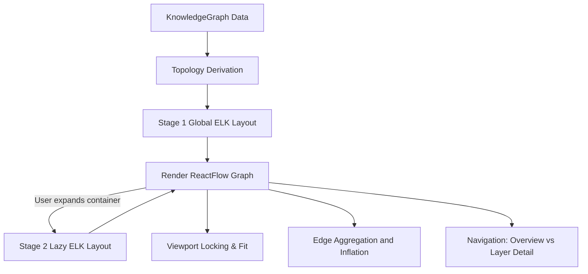
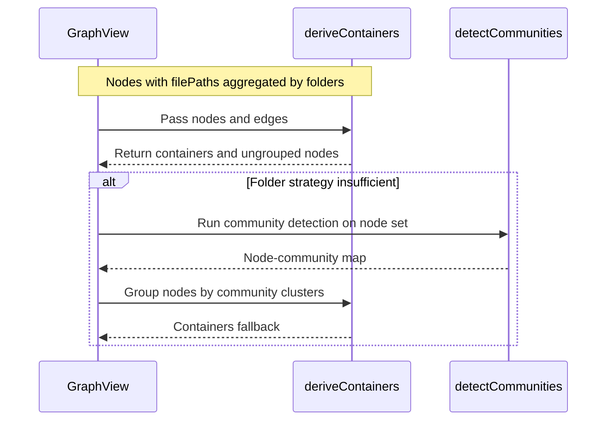
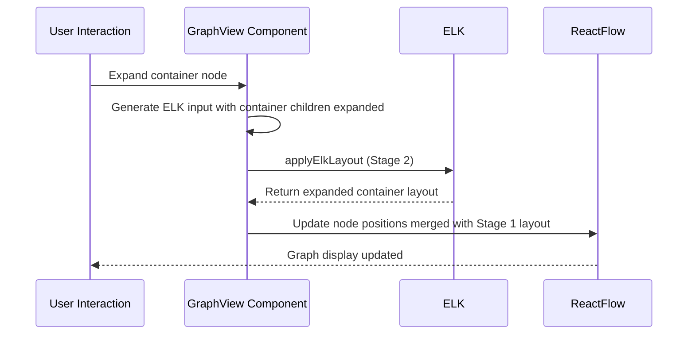
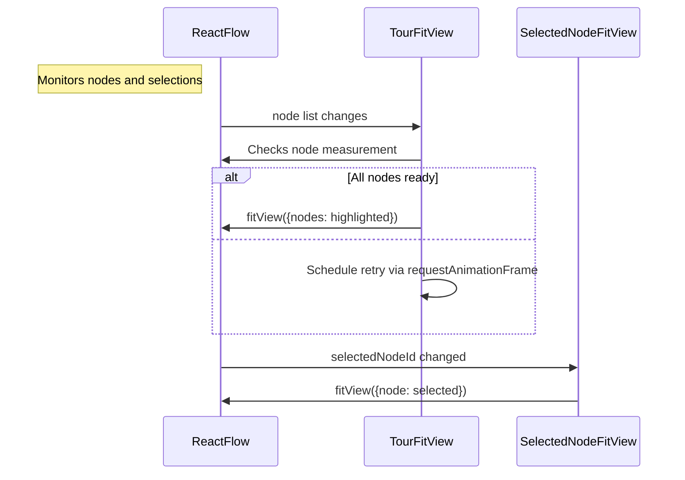
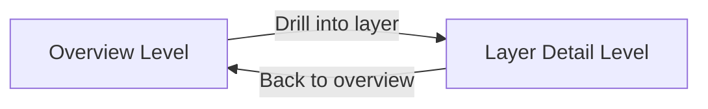

# Graph Visualization Engine

<details>
<summary>관련 소스 파일</summary>

이 wiki 페이지를 생성할 때 다음 파일들이 컨텍스트로 사용되었습니다.

- [docs/superpowers/plans/2026-05-03-graph-layout-scaling.md](docs/superpowers/plans/2026-05-03-graph-layout-scaling.md)
- [docs/superpowers/specs/2026-05-03-graph-layout-scaling-design.md](docs/superpowers/specs/2026-05-03-graph-layout-scaling-design.md)
- [understand-anything-plugin/packages/core/src/analyzer/layer-detector.ts](understand-anything-plugin/packages/core/src/analyzer/layer-detector.ts)
- [understand-anything-plugin/packages/dashboard/src/App.tsx](understand-anything-plugin/packages/dashboard/src/App.tsx)
- [understand-anything-plugin/packages/dashboard/src/components/Breadcrumb.tsx](understand-anything-plugin/packages/dashboard/src/components/Breadcrumb.tsx)
- [understand-anything-plugin/packages/dashboard/src/components/ContainerNode.tsx](understand-anything-plugin/packages/dashboard/src/components/ContainerNode.tsx)
- [understand-anything-plugin/packages/dashboard/src/components/CustomNode.tsx](understand-anything-plugin/packages/dashboard/src/components/CustomNode.tsx)
- [understand-anything-plugin/packages/dashboard/src/components/DomainClusterNode.tsx](understand-anything-plugin/packages/dashboard/src/components/DomainClusterNode.tsx)
- [understand-anything-plugin/packages/dashboard/src/components/DomainGraphView.tsx](understand-anything-plugin/packages/dashboard/src/components/DomainGraphView.tsx)
- [understand-anything-plugin/packages/dashboard/src/components/GraphView.tsx](understand-anything-plugin/packages/dashboard/src/components/GraphView.tsx)
- [understand-anything-plugin/packages/dashboard/src/components/LayerClusterNode.tsx](understand-anything-plugin/packages/dashboard/src/components/LayerClusterNode.tsx)
- [understand-anything-plugin/packages/dashboard/src/components/NodeInfo.tsx](understand-anything-plugin/packages/dashboard/src/components/NodeInfo.tsx)
- [understand-anything-plugin/packages/dashboard/src/components/PortalNode.tsx](understand-anything-plugin/packages/dashboard/src/components/PortalNode.tsx)
- [understand-anything-plugin/packages/dashboard/src/components/WarningBanner.tsx](understand-anything-plugin/packages/dashboard/src/components/WarningBanner.tsx)
- [understand-anything-plugin/packages/dashboard/src/store.ts](understand-anything-plugin/packages/dashboard/src/store.ts)
- [understand-anything-plugin/packages/dashboard/src/utils/__tests__/containers.test.ts](understand-anything-plugin/packages/dashboard/src/utils/__tests__/containers.test.ts)
- [understand-anything-plugin/packages/dashboard/src/utils/__tests__/edgeAggregation.test.ts](understand-anything-plugin/packages/dashboard/src/utils/__tests__/edgeAggregation.test.ts)
- [understand-anything-plugin/packages/dashboard/src/utils/__tests__/elk-layout.test.ts](understand-anything-plugin/packages/dashboard/src/utils/__tests__/elk-layout.test.ts)
- [understand-anything-plugin/packages/dashboard/src/utils/containers.ts](understand-anything-plugin/packages/dashboard/src/utils/containers.ts)
- [understand-anything-plugin/packages/dashboard/src/utils/edgeAggregation.ts](understand-anything-plugin/packages/dashboard/src/utils/edgeAggregation.ts)
- [understand-anything-plugin/packages/dashboard/src/utils/elk-layout.ts](understand-anything-plugin/packages/dashboard/src/utils/elk-layout.ts)
- [understand-anything-plugin/packages/dashboard/src/utils/layout.ts](understand-anything-plugin/packages/dashboard/src/utils/layout.ts)
- [understand-anything-plugin/packages/dashboard/src/utils/layout.worker.ts](understand-anything-plugin/packages/dashboard/src/utils/layout.worker.ts)
- [understand-anything-plugin/packages/dashboard/src/utils/louvain.ts](understand-anything-plugin/packages/dashboard/src/utils/louvain.ts)

</details>


이 섹션은 Understand-Anything Dashboard의 **Graph Visualization Engine**을 기술적으로 깊이 다룹니다. 이 engine은 `GraphView` React component를 중심으로 하며, ELK(Eclipse Layout Kernel) 기반의 정교한 two-stage layout lifecycle을 orchestration합니다. topology derivation strategy, ELK의 layered algorithm을 사용하는 Stage 1 global layout, lazy container expansion을 가능하게 하는 Stage 2 incremental layout phase를 자세히 설명합니다. 또한 이 engine은 시각적 명확성을 최적화하기 위한 viewport locking mechanism, edge aggregation 및 inflation 기법, overview와 layer-detail level을 지원하는 navigation paradigm도 포함합니다.

---

## 1. 아키텍처 개요

**Graph Visualization Engine**은 `@xyflow/react`를 통한 ReactFlow와 ELK를 긴밀하게 통합하여 복잡한 knowledge graph를 render합니다. 핵심 React component는 `GraphView`이며, raw knowledge graph data를 풍부한 interactive graph visualization으로 변환하는 역할을 담당합니다. layout 정확도와 interactivity 사이의 performance tradeoff를 갖는 multi-phase rendering lifecycle을 구현하여, 큰 graph도 responsiveness를 해치지 않고 대화형으로 탐색할 수 있게 합니다.

### 상위 수준 흐름

- **Topology Derivation:** normalized knowledge graph의 input node와 edge를 처리하고, container 및 layer로 grouping한 뒤 ELK-compatible input으로 변환합니다.
- **Stage 1 Layout (Global):** ELK가 container와 cluster를 최소한으로 expand한 global layered layout을 계산합니다.
- **Stage 2 Layout (Lazy Expansion):** 새로 노출된 internal child를 layout하기 위해 업데이트된 ELK call로 container를 incrementally expand합니다.
- **Viewport Locking & Fitting:** deliberate polling과 fit strategy를 사용해 user navigation과 highlighted tour node에 맞춰 viewport를 부드럽게 조정합니다.
- **Edge Aggregation/Inflation:** container와 layer를 가로지르는 edge를 aggregation하여 visual clutter를 줄이고, intra-container edge는 full rendering합니다.
- **Navigation Modes:** 두 navigation level(`overview`, `layer-detail`)이 사용자가 macro architectural snapshot을 보는지, detailed subgraph로 drill down하는지를 결정합니다.



**출처:**  
`packages/dashboard/src/components/GraphView.tsx:1-179`  
`packages/dashboard/src/utils/layout.ts:190-230`  
`packages/dashboard/src/utils/elk-layout.ts`  
`packages/dashboard/src/utils/edgeAggregation.ts`

---

## 2. GraphView Component

`packages/dashboard/src/components/GraphView.tsx`에 위치한 `GraphView` React component는 Engine의 시각적 중심축입니다.

### 책임

- dashboard store를 통해 knowledge graph를 subscribe합니다.
- folder 및 community heuristic을 기반으로 node의 container grouping을 derive합니다.
- node, container, edge를 나타내는 `ElkInput` struct를 준비합니다.
- **two-stage** ELK layout call을 trigger합니다.  
  - **Stage 1:** container가 collapsed 또는 minimally expanded된 full graph입니다.  
  - **Stage 2:** 사용자가 drill in할 때 특정 container를 lazy expansion합니다.
- `TourFitView`, `SelectedNodeFitView` 같은 helper로 interactive viewport fitting, panning, zooming을 관리합니다.
- custom component로 서로 다른 node type을 render합니다.  
  - ordinary code/config/data node에는 `CustomNode`.  
  - architectural layer에는 `LayerClusterNode`.  
  - cross-layer connection point 표현에는 `PortalNode`.  
  - nested node cluster grouping에는 `ContainerNode`.

---

### 핵심 데이터 흐름과 클래스

| Class/Function               | Purpose                                                                                     |
|-----------------------------|---------------------------------------------------------------------------------------------|
| `deriveContainers(nodes, edges)` | source file path 또는 community detection fallback을 기준으로 node를 container로 grouping합니다.    |
| `nodesToElkInput(nodes, edges, dims, options)` | ReactFlow node와 edge를 ELK-compatible layered layout input으로 변환합니다.                |
| `applyElkLayout(elkInput)`  | layering constraint 안에서 node coordinate를 계산하기 위한 ELK 비동기 호출입니다.            |
| `aggregateContainerEdges(edges, nodeToContainer)` | edge를 intra-container(전체로 그림)와 aggregated inter-container edge로 bucket화합니다.     |
| React components `CustomNode`, `ContainerNode` | 특화된 rendering과 interaction을 가진 visual node입니다.                                |
| Hooks: `useDashboardStore`  | node selection, expanded container, viewport control을 위한 global state management입니다.           |
| `TourFitView` & `SelectedNodeFitView` | guided tour 또는 selection과 관련된 node로 자동 pan/zoom하는 effect입니다.        |

component는 container가 expand 또는 collapse될 때 incremental layout update를 위해 stage 간 ELK position을 유지하고 merge합니다.

---

### Two-Stage ELK Layout Lifecycle 설명

1. **Topology Derivation:**  
   knowledge graph의 node 및 edge set을 처리해 hierarchical topology를 형성합니다.
   - Container는 folder structure 기준으로 node를 grouping하거나, modularity를 위한 fallback으로 Louvain community detection을 사용합니다.
   - Layer는 graph assembly 중 할당되는 architectural strata입니다.
   - Layer port와 portal node는 inter-layer connection을 표현하도록 계산됩니다.

2. **Stage 1 Global Layout:**  
   initial ELK layout pass는 global overview를 제공하도록 node, container(collapsed), layer를 배치합니다.  
   사용되는 constraint와 option은 다음과 같습니다.  
   - Algorithm: Layered  
   - Direction: DOWN  
   - 가독성을 위해 node spacing 설정.

3. **Stage 2 Lazy Container Expansion:**  
   사용자가 container로 drill in하면, 해당 container의 child가 expand된 상태로 ELK가 비동기 trigger됩니다.  
   stage 1의 layout은 stage 2 output과 merge되어 global context를 보존하면서 expanded container의 detailed internals를 보여줍니다.  
   이 stateful merge는 computation과 visual flicker를 줄입니다.

4. **Viewport Locking and Fitting:**  
   - **TourFitView:** highlighted tour node 주변으로 viewport를 부드럽게 fit하기 전에 ReactFlow internal node를 polling하여 measured dimension을 확인합니다(container 내부 child가 준비되도록 보장).  
   - **SelectedNodeFitView:** jitter를 피하기 위한 debouncing과 함께 user-selected node에 viewport를 center합니다.

5. **Edge Aggregation and Inflation:**  
   clutter를 줄이기 위해 container 또는 layer boundary를 가로지르는 edge가 aggregation됩니다.  
   - Intra-container edge는 full drawing됩니다.  
   - Inter-container edge는 count 및 edge-type summary와 함께 aggregation됩니다.  
   - Portal node는 expansion 시 hidden edge를 드러내는 gateway 역할을 합니다.

6. **Overview vs Layer-Detail Navigation:**  
   engine은 다음 사이의 toggle을 지원합니다.  
   - **Overview:** architectural summary를 위한 collapsed container, layer cluster, portal입니다.  
   - **Layer Detail:** 특정 layer로 drill-down하여 node와 expanded container를 보여줍니다. 사용자는 incrementally explore할 수 있습니다.

---

### Mermaid Diagram: `GraphView`의 Component 및 Data Flow

```mermaid
graph LR
  KG[KnowledgeGraph] -->|nodes, edges| Topology[Topology Derivation: deriveContainers()]
  Topology --> ElkInput[ELK Input Construction: nodesToElkInput()]
  ElkInput -->|Stage 1 Layout| Stage1[ELK Layout Stage 1: applyElkLayout()]
  Stage1 --> ReactFlowGraph[Render ReactFlow Graph]
  ReactFlowGraph -->|User expands container| RequestStage2[Trigger Stage 2 Expansion]
  RequestStage2 --> ElkInputExpanded[ELK Input with Expanded Container Children]
  ElkInputExpanded -->|Stage 2 Layout| Stage2[ELK Layout Stage 2: applyElkLayout()]
  Stage2 --> ReactFlowGraph
  ReactFlowGraph --> Viewport[Viewport Control (TourFitView, SelectedNodeFitView)]
  ReactFlowGraph --> EdgeAgg[Edge Aggregation & Inflation]
  ReactFlowGraph --> Navigation[Navigation Modes (Overview, Layer Detail)]
```

---

## 3. Topology Derivation 및 Container Grouping

layout의 첫 번째 중요한 단계는 container grouping을 derive하는 것입니다. 이는 `packages/dashboard/src/utils/containers.ts`에 위치한 utility function `deriveContainers(nodes, edges)`에서 일어납니다. 전략은 두 가지입니다.

- **Folder-based grouping:**  
  기본 접근 방식은 file path에서 Longest Common Prefix(LCP)를 제거한 뒤 첫 번째 folder segment 기준으로 node를 grouping합니다. file path가 없는 node는 기본 `"~"` container에 들어갑니다.

- **Community detection fallback:**  
  folder grouping이 충분한 modularization을 만들지 못하는 경우(예: container가 너무 적거나 지나치게 불균형한 경우), Louvain community detection을 node 간 link에 대해 실행하여 논리적으로 clustered container를 생성합니다. 이 fallback은 folder heuristic에 덜 적합한 graph structure를 처리합니다.

child node가 하나뿐인 container는 불필요한 hierarchy inflation을 피하기 위해 suppress됩니다(즉, 단일 child는 ungrouped로 처리됨).



**출처:**  
`packages/dashboard/src/components/GraphView.tsx:53-79` (호출)  
`packages/dashboard/src/utils/containers.ts`  
`packages/dashboard/src/utils/louvain.ts`

---

## 4. Stage 1: Global ELK Layout

핵심 layout engine은 ELK의 `layered` algorithm을 사용해 edge crossing을 최소화하고 node를 ordered layer로 배치하는 hierarchical top-down graph layout을 생성합니다.

### 구현 세부사항

- ELK input은 ReactFlow node와 edge로부터 만들어지며, heuristic `NODE_WIDTH`/`NODE_HEIGHT` 또는 사전 계산된 size의 size dimension으로 보강됩니다.
- Layout option은 node spacing(`nodeNodeBetweenLayers`, `nodeNode`), orthogonal edge routing, direction(`DOWN`), padding을 설정합니다.
- `applyElkLayout(elkInput)`은 비동기 ELK call을 수행하고 node position을 반환합니다.
- stage 1 layout에는 collapsed container node와 cross-layer edge의 hidden boundary를 표시하는 portal node가 포함됩니다.

### Position Merging

- ELK의 initial position은 `mergeElkPositions(nodes, elkResult)`를 사용해 ReactFlow node에 적용됩니다.
- Stage 1은 incremental expansion을 위한 안정적인 layout foundation을 형성합니다.

```mermaid
graph TD
  Subgraph ELK Input Construction
  Nodes[Nodes & Containers] --> ElkInputStructure[Build ElkInput]
  Edges[Graph Edges] --> ElkInputStructure
  end
  ElkInputStructure --> ELK[applyElkLayout()]
  ELK --> Positions[Node & Container Positions]
  Positions --> ReactFlow[ReactFlow render]
```

**출처:**  
`packages/dashboard/src/utils/layout.ts:190-230`  
`packages/dashboard/src/components/GraphView.tsx:41-45, 175-220`  
`packages/dashboard/src/utils/elk-layout.ts`

---

## 5. Stage 2: Lazy Container Expansion

큰 graph를 효율적으로 처리하고 interactive exploration을 가능하게 하기 위해 global layout의 container는 lazy expansion될 수 있습니다.

### 메커니즘

- 사용자가 container node로 drill in하면, stage 1 layout에서 이전에 없었거나 collapsed였던 content가 fetch 및 integrate됩니다.
- 해당 container를 root로 하는 subgraph에 대해 새로운 ELK input graph가 생성됩니다.
- 비동기 ELK layout call은 container 내부 position을 update하고, 바깥쪽 global graph context는 보존합니다.
- 업데이트된 layout은 이전 stage의 결과와 merge되어 visual display를 동적으로 갱신합니다.

이를 통해 다음이 가능해집니다.

- fully expanded된 큰 graph를 layout하는 작업량과 latency를 줄입니다.
- 일관된 hierarchical mental map을 유지합니다.
- container 내부 detail을 incrementally reveal합니다.

### Code Highlights

- `GraphView`는 expansion state를 관리하고 Stage 2를 비동기 trigger합니다.
- Stage 2에서 반환된 position은 `mergeElkPositions`로 original layout과 merge됩니다.
- `containerLayoutCache`는 expanded container의 ELK position을 저장합니다.



**출처:**  
`packages/dashboard/src/components/GraphView.tsx:86-170`  
`packages/dashboard/src/utils/elk-layout.ts`  
`packages/dashboard/src/utils/layout.ts`  
`packages/dashboard/src/utils/containers.ts`

---

## 6. Viewport Locking 및 Fitting Strategies

engine은 node selection과 guided tour 중 usability를 높이기 위해 adaptive viewport control을 구현합니다.

### TourFitView

- dashboard store의 `tourHighlightedNodeIds`를 watch합니다.
- ReactFlow internal node를 polling하여 dimension을 사용할 수 있는지 확인합니다(Stage 2 expansion보다 늦을 수 있음).
- 모든 highlighted node가 measured size를 갖게 되면 `fitView()`를 호출하여 viewport를 zoom 및 pan하고 node들이 tight하게 frame되도록 합니다.
- fallback timer(~4s)는 node가 끝내 materialize되지 않는 경우(예: filter로 제외됨)에도 사용자가 stuck되지 않도록 보장합니다.

### SelectedNodeFitView

- `selectedNodeId` 변경을 listen합니다.
- 새로 선택된 node로 viewport를 smooth transition과 함께 자동 center합니다.

### 구현 참고

- 둘 다 effect와 ref를 사용하는 React component이며, `<ReactFlow>` 내부에 배치되어 ReactFlow internal API(`useReactFlow()`, `useNodes()`)를 활용합니다.
- 이 subsystem들은 graph layout이 비동기 update될 때 사용자의 focus가 유지되거나 지능적으로 조정되도록 보장합니다.



**출처:**  
`packages/dashboard/src/components/GraphView.tsx:95-179`  

---

## 7. Edge Aggregation 및 Inflation

큰 graph는 일반적으로 container 또는 layer를 가로지르는 edge가 많아 visual clutter가 생깁니다. engine은 aggregation 기법을 사용합니다.

### Intra-container edges

- 유지되며 전체로 그려집니다.
- 사용자는 상세한 intra-container relationship을 검사할 수 있습니다.

### Inter-container edges

- container pair와 direction 기준으로 aggregation됩니다.
- 두 container 사이의 여러 edge는 하나의 "fat" edge로 통합됩니다.
- metadata에는 aggregated count와 distinct edge type이 포함됩니다.

### Portal Nodes

- cross-container 또는 cross-layer connection point를 나타냅니다.
- 사용자가 inter-layer dependency를 식별하고 navigate하도록 돕습니다.

### 구현 세부사항

- `aggregateContainerEdges(edges, nodeToContainer)`는 edge를 partition합니다.
- `aggregateLayerEdges(graph)`는 layer를 가로지르는 edge를 aggregation합니다.
- `computePortals`는 portal node와 layer별 connection count를 식별합니다.
- container 또는 layer mapping endpoint가 없는 edge는 조용히 drop됩니다.

```mermaid
graph TD
  E[All Graph Edges] --> Agg[aggregateContainerEdges()]
  Agg --> IntraEdges[Intra-Container Edges (drawn fully)]
  Agg --> InterAggEdges[Aggregated Inter-Container Edges]
  InterAggEdges --> PortalNodes[Portal Nodes]
  PortalNodes --> ReactFlow[Render PortalNodes]
  IntraEdges --> ReactFlow
```

**출처:**  
`packages/dashboard/src/utils/edgeAggregation.ts:15-210`  
`packages/dashboard/src/components/GraphView.tsx` (48-52행에서 호출)

---

## 8. Navigation Levels: Overview vs Layer Detail

Engine은 사용자가 서로 다른 granularity에서 graph structure를 이해하도록 돕기 위해 두 navigation level을 지원합니다.

| Level          | Description                                | UI Features                                         |
|----------------|--------------------------------------------|----------------------------------------------------|
| **Overview**   | collapsed layer와 container가 있는 global architecture입니다. | layer cluster를 보여주고, container는 collapsed되며, portal은 visible입니다. 사용자는 high-level dependency를 봅니다. |
| **Layer Detail** | 특정 architectural layer의 detailed exploration입니다. | container를 lazy expansion할 수 있고, node와 edge가 full detail로 표시됩니다. 세밀한 inspection을 위한 zoom 및 viewport control을 포함합니다.|

store state(`navigationLevel`, `activeLayerId`)가 어느 level이 보일지 제어합니다. layer로 drill in하는 등의 user-driven action은 layout refresh와 함께 transition을 trigger하여 smooth visual continuity를 보장합니다.



**출처:**  
`packages/dashboard/src/store.ts` (navigation level의 state management)  
`packages/dashboard/src/components/GraphView.tsx`  
`packages/dashboard/src/utils/edgeAggregation.ts`

---

## 9. Natural Language Space를 Code Entity에 매핑

이 engine의 개념을 codebase에 연결하기 위해 아래에 두 가지 diagram을 제시합니다.

### Diagram 1: User Perspective에서 Code Entity로

```mermaid
graph TD
  NL[User explores >] -->|Overview| OverviewComp[GraphView (overview mode)]
  NL -->|Layer Detail| LayerDetailComp[GraphView (layer-detail mode)]

  subgraph Code Entities
    GV[GraphView.tsx] --> Nodes[ReactFlow Nodes]
    Nodes --> CustomNode[CustomNode.tsx]
    Nodes --> ContainerNode[ContainerNode.tsx]
    Nodes --> LayerClusterNode[LayerClusterNode.tsx]
    Nodes --> PortalNode[PortalNode.tsx]
    LayoutUtils[utils/layout.ts] --> ElkLayout[utils/elk-layout.ts]
    EdgeAggUtils[utils/edgeAggregation.ts] --> EdgeAggregationProcess
    Store[store.ts] --> NavigationState
  end

  OverviewComp -->|Uses| Nodes
  OverviewComp -->|Calls| LayoutUtils
  LayerDetailComp -->|Calls| LayoutUtils
  GV -->|Invokes| EdgeAggUtils
  GV -->|Reads/Writes| Store
```

### Diagram 2: Layout Lifecycle

```mermaid
flowchart TD
  Start[Raw KnowledgeGraph] --> DeriveContainers[deriveContainers()]
  DeriveContainers --> ElkInput[nodesToElkInput()]
  ElkInput --> ElkStage1[applyElkLayout(Stage 1)]
  ElkStage1 --> Render1[Render ReactFlow Stage 1]
  Render1 --> UserAction[User expands container?]
  UserAction -->|Yes| ElkInputStage2[nodesToElkInput with expanded container]
  ElkInputStage2 --> ElkStage2[applyElkLayout(Stage 2)]
  ElkStage2 --> Render2[Render ReactFlow merged positions]
  Render2 --> ViewportFit[TourFitView & SelectedNodeFitView]
  ElkStage1 --> EdgeAgg[aggregateContainerEdges()]
  EdgeAgg --> Render1
```

---

# 요약

Understand-Anything dashboard의 Graph Visualization Engine은 ReactFlow 기반 graph rendering과 ELK layered layout algorithm을 결합하며, 이를 smart two-stage lifecycle로 실행합니다.

- **Topology derivation**은 node를 container와 layer로 cluster합니다.
- **Stage 1 layout**은 architectural overview를 위한 global collapsed graph를 생성합니다.
- **Stage 2 layout**은 detail을 드러내기 위해 container를 on demand로 lazy expansion하며 incremental refinement를 수행합니다.
- **Viewport locking**은 node를 navigate하고 highlight할 때 smooth user experience를 보장합니다.
- **Edge aggregation**은 inter-container connection을 통합하여 visual clarity를 개선합니다.
- Navigation은 flexible exploration을 위해 **overview**와 **layer detail** 사이를 toggle합니다.

이 설계는 복잡한 codebase knowledge graph를 이해하고 탐색하는 데 필수적인 scalability, responsiveness, rich interactivity의 균형을 맞춥니다.

---

### 추가 자료

- `GraphView` component source: `packages/dashboard/src/components/GraphView.tsx`[1-179]()
- ELK layout utilities: `packages/dashboard/src/utils/elk-layout.ts`  
- Edge aggregation: `packages/dashboard/src/utils/edgeAggregation.ts`  
- Container derivation methods: `packages/dashboard/src/utils/containers.ts`  
- Store and navigation state: `packages/dashboard/src/store.ts`

---

*4.2. Graph Visualization Engine 끝*
