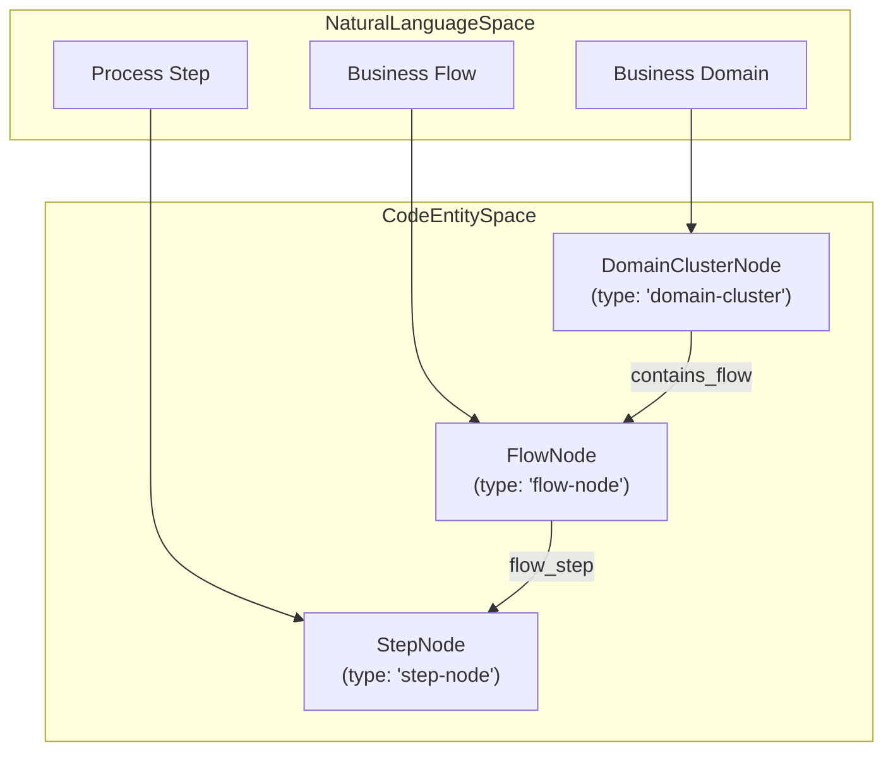
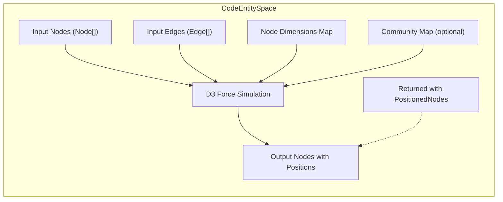
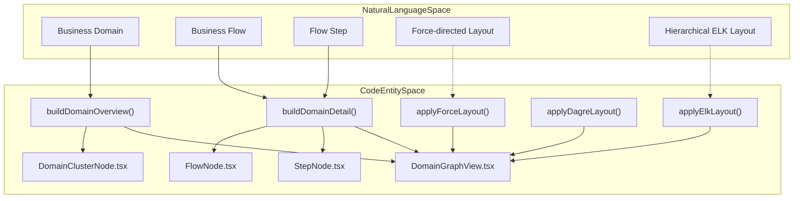
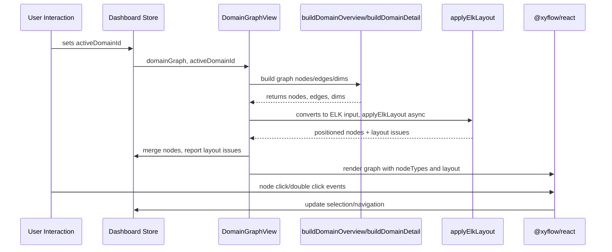

# Domain Graph View 및 Force Layout

<details>
<summary>관련 소스 파일</summary>

이 wiki 페이지를 생성할 때 다음 파일들이 컨텍스트로 사용되었습니다.

- [understand-anything-plugin/packages/dashboard/src/components/ContainerNode.tsx](understand-anything-plugin/packages/dashboard/src/components/ContainerNode.tsx)
- [understand-anything-plugin/packages/dashboard/src/components/DomainClusterNode.tsx](understand-anything-plugin/packages/dashboard/src/components/DomainClusterNode.tsx)
- [understand-anything-plugin/packages/dashboard/src/components/DomainGraphView.tsx](understand-anything-plugin/packages/dashboard/src/components/DomainGraphView.tsx)
- [understand-anything-plugin/packages/dashboard/src/components/FlowNode.tsx](understand-anything-plugin/packages/dashboard/src/components/FlowNode.tsx)
- [understand-anything-plugin/packages/dashboard/src/components/StepNode.tsx](understand-anything-plugin/packages/dashboard/src/components/StepNode.tsx)
- [understand-anything-plugin/packages/dashboard/src/components/WarningBanner.tsx](understand-anything-plugin/packages/dashboard/src/components/WarningBanner.tsx)
- [understand-anything-plugin/packages/dashboard/src/utils/__tests__/elk-layout.test.ts](understand-anything-plugin/packages/dashboard/src/utils/__tests__/elk-layout.test.ts)
- [understand-anything-plugin/packages/dashboard/src/utils/elk-layout.ts](understand-anything-plugin/packages/dashboard/src/utils/elk-layout.ts)
- [understand-anything-plugin/packages/dashboard/src/utils/layout.ts](understand-anything-plugin/packages/dashboard/src/utils/layout.ts)

</details>


이 페이지는 Understand Anything 프로젝트의 dashboard 하위 시스템에서 Domain Graph visualization의 구현 세부사항을 문서화합니다. **DomainGraphView** component와 주요 construction function인 `buildDomainOverview`, `buildDomainDetail`, 핵심 node component(`DomainClusterNode`, `FlowNode`, `StepNode`), D3 기반 force-directed layout(`applyForceLayout`), 그리고 deprecated된 Dagre layout fallback을 다룹니다. 이러한 component와 utility 사이의 기술적 구현, data flow, interaction을 자세히 설명합니다.

---

## 4.3.1 목적과 범위

domain graph view는 analysis pipeline이 생성한 knowledge graph 안에서 business domain structure, 그 안에 포함된 flow, detailed flow step을 시각화합니다. 이는 drill-down level, selection, navigation을 지원하는 interactive layered graph representation입니다.

이 visualization은 node와 edge rendering에 React component(`@xyflow/react`)를 활용하고, 기본적으로 node positioning에는 ELK layout engine을 비동기적으로 사용합니다. 특정 use case를 위해 D3 force-directed layout이 alternate force layout strategy로 제공되며, 이전의 synchronous Dagre layout fallback은 deprecated되었습니다.

---

## 4.3.2 DomainGraphView: Overview 및 Detail Construction

### Components and Node Types

- **DomainGraphView**는 domain graph visualization을 orchestration하는 main React component입니다.
- 서로 다른 graph entity level을 나타내는 세 가지 specialized node component를 사용합니다.
  - `DomainClusterNode`: business domain cluster node를 나타냅니다.
  - `FlowNode`: domain 내부의 flow를 나타냅니다.
  - `StepNode`: flow 내부의 개별 step을 나타냅니다.

이들은 `nodeTypes` mapping을 통해 ReactFlow에 등록됩니다.

```typescript
const nodeTypes = {
  "domain-cluster": DomainClusterNode,
  "flow-node": FlowNode,
  "step-node": StepNode,
};
```

각 node component는 label, summary, count, selection 및 navigation을 위한 clickable behavior 같은 detail을 render하기 위해 typed data props를 받습니다. 또한 이 node들은 ReactFlow에서 사용하는 incoming 및 outgoing graph edge용 handle을 노출합니다.

### Domain Overview Graph 구축 (`buildDomainOverview`)

이 함수는 cross-domain edge로 연결된 business domain의 high-level graph를 생성합니다.

- type이 `"domain"`인 graph node를 filtering합니다.
- `"contains_flow"` type edge를 사용해 domain별 associated flow 수를 계산합니다.
- 적절한 sizing 및 metadata(entities, business rules, flow count)를 가진 **DomainClusterFlowNode** ReactFlow node를 구성합니다.
- `"cross_domain"` type edge를 filtering하여 cross-domain relationship을 표시합니다.
- edge style을 설정하여 시각적으로 구분합니다(accent color, dashed stroke, animation).

결과 node 및 edge collection과 sizing을 위한 dimension map이 layout용으로 반환됩니다.

### Domain Detail Graph 구축 (`buildDomainDetail`)

이 함수는 사용자가 선택한 domain에 대한 detailed graph를 생성하며, 다음을 보여줍니다.

- domain에 포함된 flow(`"contains_flow"` edge를 통해).
- 해당 flow에 속한 step(`"flow_step"` edge를 통해).
- step order 및 count 같은 metadata를 추출하고 mapping합니다.
- flow에는 `FlowNode` node를, step에는 `StepNode` node를 구성합니다.
- step edge는 `"flow_step"` edge에서 구성됩니다.
- flow와 step의 size dimension이 layout용으로 설정됩니다.

이를 통해 domain overview에서 flow-step granularity로 drill-down할 수 있습니다.



### DomainGraphViewInner 내부 Runtime Lifecycle

- React state가 현재 보고 있는 active domain을 관리합니다.
- domain이 active가 아니면 `buildDomainOverview`, domain id가 있으면 `buildDomainDetail`을 memoized call하여 graph data를 구축합니다.
- 이 structural data에는 node, edge, dimension map이 포함됩니다.
- graph는 `nodesToElkInput`을 사용해 node/edge를 ELK layout input format으로 변환합니다.
- `applyElkLayout`은 ELK로 hierarchical layout을 비동기 수행합니다.
- 완료되면 positioned node coordinate가 ReactFlow node에 다시 merge됩니다.
- ELK의 layout issue(warning/error)는 표시를 위해 global dashboard state로 전달됩니다.

---

## 4.3.3 DomainClusterNode, FlowNode, StepNode Components

### DomainClusterNode

- border, background, navigation을 위한 interactive selection/double-click dispatch로 시각적으로 style된 domain node를 나타냅니다.
- label, summary, 처음 최대 5개의 entity, flow count를 표시합니다.
- edge 연결을 위한 clickable handle을 좌우에 포함합니다.
- 선택되면 highlight됩니다.

### FlowNode

- domain 내부의 flow를 나타냅니다.
- optional entry point/type metadata, name, summary, step count를 표시합니다.
- click 시 interactive selection을 포함합니다.
- 좌우 edge connection handle을 제공합니다.
- selected state에 대해 distinct styling을 가집니다.

### StepNode

- flow 내부의 step을 나타냅니다.
- order number, name, summary, source file path를 표시합니다.
- domain 및 flow node보다 더 작은 node footprint를 가집니다.
- selection과 handle은 다른 node와 유사합니다.

모든 component는 re-render를 최적화하기 위해 React memoization을 사용합니다.

---

## 4.3.4 Force-Directed Layout (`applyForceLayout`)

프로젝트는 특히 community structure를 가진 knowledge graph에 적합한 flexible graph layout을 위해 D3의 `d3-force` library를 기반으로 구축된 force-directed layout을 지원합니다.

### 주요 기능:

- Node는 ID와 optional community label을 가진 `ForceNode` object로 모델링됩니다.
- Link는 source/target ID를 참조하는 `SimulationLinkDatum` object에 mapping됩니다.
- 설정 가능한 physics force:
  - **Link force:** 연결된 node를 target distance로 유지합니다.
  - **Charge force:** node 간 repulsion이며, graph size를 기준으로 scaling됩니다.
  - **Centering force:** node를 center(0,0) 쪽으로 끌어당깁니다.
  - **Collide force:** node dimension과 padding을 기준으로 node overlap을 방지합니다.
- Optional **community clustering** force:
  - 같은 community cluster에 속한 node는 지정된 circle segment 쪽으로 끌립니다.
  - community 수가 circle 주변에 균등하게 배치되는 cluster center를 결정합니다.
- simulation은 node count에 따라 고정 tick 수(100-300)만큼 synchronously 실행된 뒤 멈춥니다.
- resulting node position은 centering coordinate를 bounding-box style coordinate로 변환하기 위해 node width/height의 절반만큼 offset됩니다.
- Edge는 변경되지 않습니다.

### Usage

`applyForceLayout`은 다음을 받습니다.

- `nodes`: ReactFlow nodes array.
- `edges`: ReactFlow edges array.
- `nodeDimensions` map: 각 node의 sizing.
- `communityMap`(optional): node ID에서 community index로의 mapping.

computed position이 포함된 updated node와 변경되지 않은 edge를 반환합니다.



---

## 4.3.5 Deprecated Dagre Layout (`applyDagreLayout`)

dashboard는 이전에 작은 graph의 synchronous layout을 위해 Dagre를 사용했습니다.

- rank 기반 directed graph layering으로 node를 positioning했습니다.
- 기본 node dimension은 280x120입니다.
- spacing은 더 큰 graph에 대해 scale up됩니다.
- Dagre가 계산한 coordinate를 중심으로 node를 positioning했습니다.
- Edge는 추가 layout metadata 없이 설정됩니다.

이 layout은 deprecated되었고 removal 예정이며, ELK 또는 D3 force layout으로 대체되었습니다.

---

## 4.3.6 ELK Layout Integration

`DomainGraphView`의 현재 기본 domain graph layout은 ELK(Eclipse Layout Kernel) layout engine을 비동기적으로 사용합니다.

- DomainGraphView는 graph node와 edge를 ELK input format(`nodesToElkInput`)으로 변환합니다.
- `applyElkLayout`을 호출하여 hierarchical/orthogonal layout을 수행합니다.
- ELK result는 `mergeElkPositions`를 사용해 다시 merge됩니다.
- ELK의 repair 및 layout phase에서 발생하는 layout issue(missing node sizes, orphan edges, cycles)는 dashboard의 `WarningBanner` UI component를 통해 표시됩니다.

ELK integration은 node group과 layered view를 지원하면서 깔끔한 directed graph layout을 생성하는 데 도움을 줍니다.

---

## 4.3.7 요약 Mermaid Diagram: Natural Language에서 Code Entity로의 Mapping



---

## 4.3.8 DomainGraphView Component의 Data Flow



---

## 4.3.9 References and Code Citations

- `buildDomainOverview`, `buildDomainDetail`, nodeTypes registration을 포함한 DomainGraphView component:  
  `packages/dashboard/src/components/DomainGraphView.tsx:1-213`  
- Domain node component `DomainClusterNode`:  
  `packages/dashboard/src/components/DomainClusterNode.tsx:1-67`  
- Flow node component `FlowNode`:  
  `packages/dashboard/src/components/FlowNode.tsx:1-53`  
- Step node component `StepNode`:  
  `packages/dashboard/src/components/StepNode.tsx:1-54`  
- D3 force-directed layout function `applyForceLayout` 및 deprecated Dagre fallback `applyDagreLayout`:  
  `packages/dashboard/src/utils/layout.ts:1-189`  
- async layout call을 포함한 ELK layout utility 및 repair logic:  
  `packages/dashboard/src/utils/elk-layout.ts:1-245`

---

이 포괄적인 설명은 engineer가 Understand Anything의 dashboard module 안에서 domain graph visualization의 architecture, main component, layout strategy, data transformation flow를 이해할 수 있도록 합니다.
