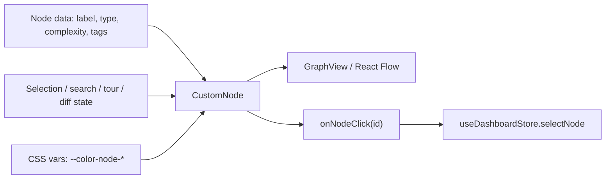
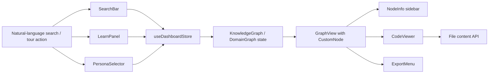

# UI Components 및 Panels

관련 소스 파일

이 DeepWiki 페이지를 재구성할 때 다음 파일들이 컨텍스트로 제공되었습니다.

- [understand-anything-plugin/packages/dashboard/scripts/benchmark-aggregations.mjs](understand-anything-plugin/packages/dashboard/scripts/benchmark-aggregations.mjs)
- [understand-anything-plugin/packages/dashboard/src/App.tsx](understand-anything-plugin/packages/dashboard/src/App.tsx)
- [understand-anything-plugin/packages/dashboard/src/components/CodeViewer.tsx](understand-anything-plugin/packages/dashboard/src/components/CodeViewer.tsx)
- [understand-anything-plugin/packages/dashboard/src/components/CustomNode.tsx](understand-anything-plugin/packages/dashboard/src/components/CustomNode.tsx)
- [understand-anything-plugin/packages/dashboard/src/components/DiffToggle.tsx](understand-anything-plugin/packages/dashboard/src/components/DiffToggle.tsx)
- [understand-anything-plugin/packages/dashboard/src/components/DomainGraphView.tsx](understand-anything-plugin/packages/dashboard/src/components/DomainGraphView.tsx)
- [understand-anything-plugin/packages/dashboard/src/components/ExportMenu.tsx](understand-anything-plugin/packages/dashboard/src/components/ExportMenu.tsx)
- [understand-anything-plugin/packages/dashboard/src/components/FileExplorer.tsx](understand-anything-plugin/packages/dashboard/src/components/FileExplorer.tsx)
- [understand-anything-plugin/packages/dashboard/src/components/FilterPanel.tsx](understand-anything-plugin/packages/dashboard/src/components/FilterPanel.tsx)
- [understand-anything-plugin/packages/dashboard/src/components/GraphView.tsx](understand-anything-plugin/packages/dashboard/src/components/GraphView.tsx)
- [understand-anything-plugin/packages/dashboard/src/components/KeyboardShortcutsHelp.tsx](understand-anything-plugin/packages/dashboard/src/components/KeyboardShortcutsHelp.tsx)
- [understand-anything-plugin/packages/dashboard/src/components/LayerLegend.tsx](understand-anything-plugin/packages/dashboard/src/components/LayerLegend.tsx)
- [understand-anything-plugin/packages/dashboard/src/components/LearnPanel.tsx](understand-anything-plugin/packages/dashboard/src/components/LearnPanel.tsx)
- [understand-anything-plugin/packages/dashboard/src/components/MobileBottomNav.tsx](understand-anything-plugin/packages/dashboard/src/components/MobileBottomNav.tsx)
- [understand-anything-plugin/packages/dashboard/src/components/MobileDrawer.tsx](understand-anything-plugin/packages/dashboard/src/components/MobileDrawer.tsx)
- [understand-anything-plugin/packages/dashboard/src/components/MobileLayout.tsx](understand-anything-plugin/packages/dashboard/src/components/MobileLayout.tsx)
- [understand-anything-plugin/packages/dashboard/src/components/NodeInfo.tsx](understand-anything-plugin/packages/dashboard/src/components/NodeInfo.tsx)
- [understand-anything-plugin/packages/dashboard/src/components/NodeTooltip.tsx](understand-anything-plugin/packages/dashboard/src/components/NodeTooltip.tsx)
- [understand-anything-plugin/packages/dashboard/src/components/OnboardingOverlay.tsx](understand-anything-plugin/packages/dashboard/src/components/OnboardingOverlay.tsx)
- [understand-anything-plugin/packages/dashboard/src/components/PathFinderModal.tsx](understand-anything-plugin/packages/dashboard/src/components/PathFinderModal.tsx)
- [understand-anything-plugin/packages/dashboard/src/components/PersonaSelector.tsx](understand-anything-plugin/packages/dashboard/src/components/PersonaSelector.tsx)
- [understand-anything-plugin/packages/dashboard/src/components/ProjectOverview.tsx](understand-anything-plugin/packages/dashboard/src/components/ProjectOverview.tsx)
- [understand-anything-plugin/packages/dashboard/src/components/SearchBar.tsx](understand-anything-plugin/packages/dashboard/src/components/SearchBar.tsx)
- [understand-anything-plugin/packages/dashboard/src/components/WarningBanner.tsx](understand-anything-plugin/packages/dashboard/src/components/WarningBanner.tsx)
- [understand-anything-plugin/packages/dashboard/src/contexts/I18nContext.tsx](understand-anything-plugin/packages/dashboard/src/contexts/I18nContext.tsx)
- [understand-anything-plugin/packages/dashboard/src/hooks/useIsMobile.ts](understand-anything-plugin/packages/dashboard/src/hooks/useIsMobile.ts)
- [understand-anything-plugin/packages/dashboard/src/hooks/useKeyboardShortcuts.ts](understand-anything-plugin/packages/dashboard/src/hooks/useKeyboardShortcuts.ts)
- [understand-anything-plugin/packages/dashboard/src/index.css](understand-anything-plugin/packages/dashboard/src/index.css)
- [understand-anything-plugin/packages/dashboard/src/locales/en.ts](understand-anything-plugin/packages/dashboard/src/locales/en.ts)
- [understand-anything-plugin/packages/dashboard/src/locales/ja.ts](understand-anything-plugin/packages/dashboard/src/locales/ja.ts)
- [understand-anything-plugin/packages/dashboard/src/locales/ko.ts](understand-anything-plugin/packages/dashboard/src/locales/ko.ts)
- [understand-anything-plugin/packages/dashboard/src/locales/ru.ts](understand-anything-plugin/packages/dashboard/src/locales/ru.ts)
- [understand-anything-plugin/packages/dashboard/src/locales/zh-TW.ts](understand-anything-plugin/packages/dashboard/src/locales/zh-TW.ts)
- [understand-anything-plugin/packages/dashboard/src/locales/zh.ts](understand-anything-plugin/packages/dashboard/src/locales/zh.ts)
- [understand-anything-plugin/packages/dashboard/src/store.ts](understand-anything-plugin/packages/dashboard/src/store.ts)
- [understand-anything-plugin/packages/dashboard/src/themes/presets.ts](understand-anything-plugin/packages/dashboard/src/themes/presets.ts)
- [understand-anything-plugin/packages/dashboard/src/utils/__tests__/filters.test.ts](understand-anything-plugin/packages/dashboard/src/utils/__tests__/filters.test.ts)
- [understand-anything-plugin/packages/dashboard/src/utils/__tests__/layerStats.test.ts](understand-anything-plugin/packages/dashboard/src/utils/__tests__/layerStats.test.ts)
- [understand-anything-plugin/packages/dashboard/src/utils/filters.ts](understand-anything-plugin/packages/dashboard/src/utils/filters.ts)
- [understand-anything-plugin/packages/dashboard/src/utils/layerStats.ts](understand-anything-plugin/packages/dashboard/src/utils/layerStats.ts)
- [understand-anything-plugin/packages/dashboard/src/utils/layout.ts](understand-anything-plugin/packages/dashboard/src/utils/layout.ts)
- [understand-anything-plugin/pnpm-workspace.yaml](understand-anything-plugin/pnpm-workspace.yaml)

이 섹션은 Understand Anything 시스템의 React 기반 interactive dashboard를 구성하는 주요 UI component와 panel을 문서화합니다. 이 component들은 사용자가 codebase에서 도출된 knowledge graph를 navigate, explore, search, filter하고 학습할 수 있게 합니다. 여기서 다루는 component에는 graph visualization node, informational sidebar, search utility, guided learning tour, legend, code viewer, file explorer, persona selector, filter, path-finding modal dialog, export menu, warning banner, diff toggle, onboarding overlay, mobile layout component가 포함됩니다.

---

## 개요 및 범위

dashboard는 React와 TypeScript로 구현되어 있으며 graph visualization에는 `@xyflow/react`를 사용합니다. UI component는 dashboard의 Zustand store와 통합되어 있으며, 이 store는 loaded knowledge graph, selected node, filter, search mode, user persona, navigation history, diff mode, UI presentation state 같은 state를 관리합니다. 사용자에게 표시되는 text의 internationalization은 `I18nContext`를 통해 관리됩니다.

초기 bundle 성능을 개선하기 위해 많은 무거운 panel은 main app entry에서 lazy loading됩니다. component, store, rendering logic 사이의 interaction은 Understand Anything dashboard user experience의 backbone을 형성합니다.

---

## 1. Graph Visualization Nodes: `CustomNode`

`CustomNode`는 graph view에서 개별 node를 render하는 primary React component입니다. `GraphView` React Flow visualization 안에서 사용됩니다.

### 구현 핵심

- file, function, class, module, concept 같은 node type에 따라 node를 render합니다.
- node type을 나타내기 위해 vertical colored bar를 사용하며, 색상은 CSS variable과 동기화됩니다.
- node type, complexity, summary text, shortened/truncated label을 표시합니다.
- selection, search highlighting, guided-tour highlighting, diff overlay state에 따라 styling이 달라집니다.
- callback prop을 통한 click handling을 지원합니다.
- 불필요한 rerender를 줄이기 위해 memoization을 사용합니다.

### Data Flow

- Node prop은 label, node type, complexity, highlight flag, diff state, tag 같은 data를 전달합니다.
- component는 tooltip과 label에 localized string을 사용합니다.
- styling logic은 node state에서 CSS class를 동적으로 조합합니다.
- click 시 component는 node id를 parent callback으로 emit하고, parent callback은 dashboard selection state를 update합니다.

### Diagram: Node Rendering 및 Interaction Flow

---

## 2. Node Information Panel: `NodeInfo`

`NodeInfo`는 현재 선택된 node에 대한 상세 정보를 표시하는 sidebar panel입니다.

### 주요 기능

- node type별로 색상이 지정된 type badge를 표시합니다.
- wikilink, backlink, category 같은 category별로 grouping된 edge를 표시하며, 관련 node로 navigate하는 button을 제공합니다.
- knowledge node의 경우 관련 knowledge claim과 backlink를 표시합니다.
- domain node의 경우 entity, business rule, domain, flow step을 navigation support와 함께 나열합니다.
- 여러 detail level을 지원하고 graph의 active view mode에 맞게 조정됩니다.

### Data Flow

- Zustand store에서 selected node와 graph context를 읽습니다.
- loaded graph node와 edge를 query하여 related-node list를 구축합니다.
- UI text에는 localized string을 사용합니다.
- 사용자가 관련 entity를 클릭하면 navigation action을 dispatch합니다.

---

## 3. Search Bar: `SearchBar`

search bar는 graph content에 대해 fuzzy text search와 semantic search mode를 모두 지원합니다.

### 구현 참고

- store의 current search query, search results, search mode에 연결됩니다.
- query 및 mode 변경 update를 dispatch합니다.
- Fuse.js 기반 search engine을 통한 fuzzy matching을 지원합니다.
- embedding/search infrastructure를 사용할 수 있는 경우 semantic similarity search를 지원합니다.
- dropdown에 result를 표시하고 keyboard navigation을 지원합니다.

---

## 4. Guided Tour Panel: `LearnPanel`

`LearnPanel`은 curated node를 사용해 knowledge graph를 단계별로 안내하는 guided tour를 제공합니다.

### 핵심

- 초기 dashboard bundle 증가를 피하기 위해 lazy loading됩니다.
- active step과 highlighted node를 포함한 store의 tour state를 사용합니다.
- 사용자가 tour step을 navigate하고 contextual explanation을 읽을 수 있게 합니다.
- highlighted node로 pan 및 zoom하여 graph viewport를 동기화합니다.

---

## 5. Layer Legend: `LayerLegend`

`LayerLegend`는 graph의 layer와 color code 의미를 설명합니다.

- structural graph view에서 architectural layer의 설명을 표시합니다.
- node color와 edge category의 의미를 표시합니다.
- 사용자가 graph organization이 codebase structure에 어떻게 mapping되는지 해석하도록 돕습니다.

---

## 6. Code Viewer: `CodeViewer`

`CodeViewer`는 selected node와 연결된 source code를 syntax highlighting 및 line-range support와 함께 표시합니다.

### 구현 세부사항

- theme-aware rendering과 함께 syntax highlighting을 사용합니다.
- inline sidebar와 expandable modal dialog라는 두 presentation mode를 지원합니다.
- API를 통해 file content를 안전하게 가져오기 위해 access token을 받거나 사용합니다.
- source content를 비동기 fetch하고 file extension 또는 metadata를 기준으로 language mode를 선택합니다.
- selected graph node에 location metadata가 있으면 line range를 highlight합니다.
- loading, error, fallback language-detection state를 처리합니다.

### Data Flow

- dashboard store에서 selected node와 file metadata를 읽습니다.
- selected node 또는 path가 변경되면 file content를 fetch합니다.
- file path, file size 또는 preview metadata, highlighted source range를 표시합니다.
- close 및 expand event를 지원하여 visibility를 제어합니다.

---

## 7. File Explorer: `FileExplorer`

`FileExplorer`는 graph layer 또는 file node에서 도출된 project file의 tree view를 표시합니다.

- project structure를 folder와 file로 구성합니다.
- file selection을 허용하며, 이는 selected graph node를 update하거나 graph view를 focus할 수 있습니다.
- 관련이 있는 경우 filter 및 persona state를 반영합니다.

---

## 8. Persona Selector: `PersonaSelector`

`PersonaSelector`는 beginner, builder, architect-style view 같은 user persona 사이를 전환할 수 있게 합니다.

- persona selection은 visible node와 edge에 적용되는 filtering logic에 영향을 줍니다.
- UI는 persona를 변경하기 위한 toggle button 또는 selector를 제공합니다.
- persona state는 중앙에 저장되어 다른 panel도 일관되게 adapt할 수 있습니다.

---

## 9. Filter Panel: `FilterPanel`

`FilterPanel`은 graph element를 표시하거나 숨기기 위한 세밀한 control을 제공합니다.

- store-managed filter state를 사용합니다.
- node type, edge type, complexity, layer별 filtering을 지원합니다.
- panel open/close는 store의 UI state를 update합니다.
- filter 변경은 graph rendering, search result, export, statistics view로 전파됩니다.

---

## 10. Path Finder Modal: `PathFinderModal`

`PathFinderModal`은 사용자가 node 사이의 shortest path 또는 conceptual connection을 찾도록 돕습니다.

- source node와 target node를 위한 interactive input을 제공합니다.
- node 및 edge highlight와 함께 path result를 표시합니다.
- lazy loading되며 main graph view 위에 overlay될 수 있습니다.

---

## 11. Export Menu: `ExportMenu`

`ExportMenu`는 active filter와 persona context를 존중하면서 현재 graph view를 SVG, PNG, JSON 형식으로 export할 수 있게 합니다.

### 구현 핵심

- React Flow instance를 사용해 node 및 edge coordinate와 appearance를 capture합니다.
- graph node와 edge를 수동으로 그려 clean SVG representation을 생성합니다.
- raster export를 위해 canvas를 통해 SVG를 PNG로 변환합니다.
- active filter와 persona에 따라 filtered JSON export를 serialize합니다.
- blob download와 menu open/close logic을 처리합니다.
- graph data, filter, persona, React Flow instance state에 대한 store selector를 사용합니다.

---

## 12. Warning Banner: `WarningBanner`

`WarningBanner`는 layout 또는 data-validation issue를 non-blocking banner로 표시합니다.

- dashboard state에서 validation output 또는 graph layout issue를 읽습니다.
- 사용자가 possible inconsistency를 이해할 수 있도록 warning을 눈에 띄게 표시합니다.
- 가능한 경우 dismiss 또는 reload-style action을 지원합니다.

---

## 13. Diff Toggle: `DiffToggle`

`DiffToggle`은 diff overlay mode를 enable 또는 disable하며, 이 mode는 graph node와 edge에 change 또는 affected state를 annotate합니다.

- store의 boolean diff-mode property와 interface합니다.
- graph node가 diff glow/highlight state로 rerender되도록 합니다.
- accessible toggle control을 제공합니다.

---

## 14. Onboarding Overlay: `OnboardingOverlay`

`OnboardingOverlay`는 dashboard 사용법을 안내하는 first-visit 또는 forced onboarding modal입니다.

### 구현 세부사항

- parent state와 persistence logic에 의해 제어됩니다.
- 여러 step을 포함하며, 각 step은 title, body, optional hint를 가집니다.
- Escape key로 닫힙니다.
- next, previous, skip, finish를 위한 navigation button을 제공합니다.
- dashboard theme과 일관된 animated 또는 glassmorphic styling을 사용합니다.

---

## 15. Mobile Layout Components

mobile-specific layout component는 dashboard UI를 더 작은 screen에 맞게 조정합니다.

- `MobileLayout`: mobile에 최적화된 drawer navigation, bottom navigation, panel toggle을 관리합니다.
- `MobileDrawer` 및 `MobileBottomNav`: supporting sliding menu 및 tab-bar interaction을 제공합니다.
- `useIsMobile`: responsive breakpoint를 감지하여 layout behavior를 전환합니다.

이 component들은 dashboard가 다양한 device form factor에서 계속 사용할 수 있도록 보장합니다.

---

## Data Flow 및 Interaction Summary

### Dashboard Store Centralization

Zustand store는 UI state의 central hub 역할을 합니다.

- Loaded knowledge graph 및 domain graph data.
- Selected node 및 navigation history.
- Search query, search results, search mode.
- Panel open/close flag.
- Filter, persona, diff mode toggle.
- Export operation을 위한 React Flow instance reference.

### Diagram: Natural Language에서 Code Entity Space로

---

## 추가 구현 세부사항

### Lazy Loading 및 Suspense

main app component에서 `LearnPanel`, `CodeViewer`, `PathFinderModal`, `OnboardingOverlay` 같은 무거운 panel은 bundle size와 initial load time을 최적화하기 위해 React `Suspense` fallback과 함께 lazy-loaded됩니다.

### Theming 및 Internationalization

component는 color와 style variable을 위해 theme context를 사용하고, localized text string을 위해 i18n context를 사용하여 UI가 user language와 theme preference에 맞게 adapt할 수 있게 합니다.

### Interaction Handling

대부분의 component는 node selection, search update, filter toggle, persona change, panel visibility update 같은 selector와 dispatcher function을 통해 store와 상호작용합니다. 이를 통해 cross-component behavior가 synchronized 상태로 유지됩니다.

### Export Functionality

export logic은 clean scalable diagram을 위해 React Flow node와 edge에서 SVG representation을 수동으로 생성합니다. PNG export는 생성된 SVG를 canvas를 통해 변환합니다. JSON export는 전체 unfiltered graph가 아니라 filtered graph state를 serialize합니다.

---

## UI Components 요약 표

| Component | Purpose | Key Props / Store Interaction | Lazy Loaded | File Path |
| --- | --- | --- | --- | --- |
| `CustomNode` | styling과 interaction이 있는 개별 graph node를 render합니다 | Node data, click handler, selection/search/diff flags | No | `understand-anything-plugin/packages/dashboard/src/components/CustomNode.tsx` |
| `NodeInfo` | selected node detail과 related node를 보여주는 sidebar입니다 | Selected node, graph edges, navigation actions | No | `understand-anything-plugin/packages/dashboard/src/components/NodeInfo.tsx` |
| `SearchBar` | fuzzy 및 semantic search를 지원하는 search input입니다 | Search query, mode, results | No | `understand-anything-plugin/packages/dashboard/src/components/SearchBar.tsx` |
| `LearnPanel` | step-by-step highlight가 있는 guided tour interface입니다 | Tour step, highlighted nodes, viewport actions | Yes | `understand-anything-plugin/packages/dashboard/src/components/LearnPanel.tsx` |
| `LayerLegend` | layer color와 node category를 설명합니다 | Layer and node type metadata | No | `understand-anything-plugin/packages/dashboard/src/components/LayerLegend.tsx` |
| `CodeViewer` | syntax highlighting이 있는 source-code preview입니다 | Selected node path, file fetch API, line ranges | Yes | `understand-anything-plugin/packages/dashboard/src/components/CodeViewer.tsx` |
| `FileExplorer` | file tree navigation panel입니다 | File/folder graph nodes, selection, filters | No | `understand-anything-plugin/packages/dashboard/src/components/FileExplorer.tsx` |
| `PersonaSelector` | filtering에 영향을 주는 user persona를 전환합니다 | Persona setter and current persona state | No | `understand-anything-plugin/packages/dashboard/src/components/PersonaSelector.tsx` |
| `FilterPanel` | node, edge, layer, complexity를 filter합니다 | Filter state and toggle actions | No | `understand-anything-plugin/packages/dashboard/src/components/FilterPanel.tsx` |
| `PathFinderModal` | entity 사이의 graph path를 찾습니다 | Source/target nodes, modal open state | Yes | `understand-anything-plugin/packages/dashboard/src/components/PathFinderModal.tsx` |
| `ExportMenu` | graph를 SVG, PNG, JSON으로 export합니다 | React Flow instance, filters, persona, graph state | No | `understand-anything-plugin/packages/dashboard/src/components/ExportMenu.tsx` |
| `WarningBanner` | validation 또는 layout warning을 표시합니다 | Warning/layout issue state | No | `understand-anything-plugin/packages/dashboard/src/components/WarningBanner.tsx` |
| `DiffToggle` | diff overlay visual state를 toggle합니다 | Diff-mode boolean setter | No | `understand-anything-plugin/packages/dashboard/src/components/DiffToggle.tsx` |
| `OnboardingOverlay` | step이 있는 first-time onboarding modal입니다 | Visibility, step state, dismiss callbacks | Yes | `understand-anything-plugin/packages/dashboard/src/components/OnboardingOverlay.tsx` |
| `MobileLayout` | mobile device를 위한 responsive layout 및 navigation입니다 | Drawer state, active panel, mobile breakpoint | No | `understand-anything-plugin/packages/dashboard/src/components/MobileLayout.tsx` |

---

## 상세 Component 설명

### CustomNode

`CustomNode`는 structural knowledge graph에서 graph node를 render하는 React Flow node component입니다. node type을 나타내는 colored left bar, node type과 complexity의 text label, truncated summary preview, selection, search highlighting, tour highlighting, diff change 같은 state를 반영하는 dynamic CSS class 같은 visual decoration을 처리합니다. interaction은 주로 entity를 선택하거나 drill into하기 위해 prop으로 전달된 `onClick` handler를 통해 발생합니다.

### NodeInfo

`NodeInfo` panel은 현재 selected node에 대한 detailed information을 보여줍니다. `CustomNode`와 matching되는 색상의 node type badge, 논리적으로 grouped edge relationship, knowledge 또는 domain detail의 rich preview, related node 및 domain hierarchy를 traverse하기 위한 navigation button을 포함합니다. text string은 dashboard i18n context를 통해 localized됩니다.

### SearchBar

`SearchBar`는 fuzzy text matching과 semantic search를 위한 mode가 있는 search input을 제공합니다. store와 상호작용하여 search query를 적용하고 graph 전반의 highlighted search result를 update합니다.

### LearnPanel

`LearnPanel`은 knowledge graph의 multi-step guided tour를 제공합니다. 현재 tour step과 관련된 node를 highlight하고 graph view를 pan 또는 zoom할 수 있습니다. user action 또는 onboarding flow에 의해 trigger되며 store state로 제어됩니다.

### CodeViewer

`CodeViewer`는 API를 통해 file을 비동기 load하는 syntax-highlighted source-code viewer입니다. sidebar와 modal presentation을 지원하고 selected graph node가 설명하는 line segment를 highlight할 수 있습니다. loading 및 error state를 graceful하게 처리합니다.

### ExportMenu

`ExportMenu`는 현재 graph view의 visual export를 생성합니다. SVG export는 node와 edge에 대한 scalable vector graphic을 생성합니다. PNG export는 canvas를 통해 SVG를 rasterize합니다. JSON export는 active filter와 persona context를 사용해 filtered graph representation을 serialize합니다. menu는 UI state와 outside-click handling을 통해 열리고 닫힙니다.

### OnboardingOverlay

`OnboardingOverlay`는 첫 방문 시 또는 URL parameter로 강제된 경우 표시됩니다. title과 hint가 있는 localized onboarding step sequence를 포함합니다. navigation control은 forward/backward step switching과 final dismissal을 허용합니다.

---

## 요약

Understand Anything dashboard의 UI component와 panel은 긴밀하게 통합된 ecosystem을 형성합니다. 각 component는 centralized Zustand store와 interface하여 user input과 system state change에 반응하고, 생성된 code knowledge graph를 탐색하기 위한 interactive experience를 제공합니다. `CustomNode`, `NodeInfo`, `CodeViewer` 같은 specialized component는 search bar, legend, filter panel, export menu, onboarding overlay 같은 supporting utility와 함께 작동합니다.

dashboard architecture는 lazy loading, theme integration, internationalization, responsive mobile layout, visualization/data fetching/state management 분리를 통해 scalability와 modularity를 지원합니다.
