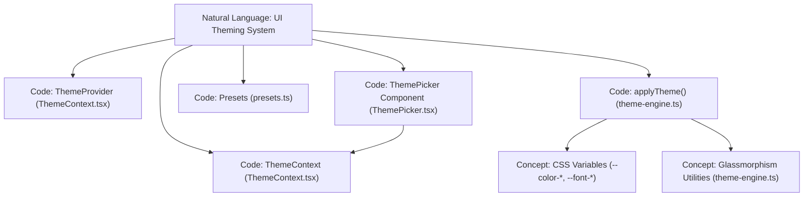
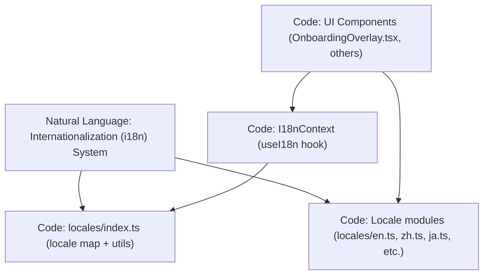

# Theming 및 Internationalization

<details>
<summary>관련 소스 파일</summary>

이 wiki 페이지를 생성할 때 다음 파일들이 컨텍스트로 사용되었습니다.

- [understand-anything-plugin/packages/dashboard/src/components/OnboardingOverlay.tsx](understand-anything-plugin/packages/dashboard/src/components/OnboardingOverlay.tsx)
- [understand-anything-plugin/packages/dashboard/src/components/ThemePicker.tsx](understand-anything-plugin/packages/dashboard/src/components/ThemePicker.tsx)
- [understand-anything-plugin/packages/dashboard/src/locales/en.ts](understand-anything-plugin/packages/dashboard/src/locales/en.ts)
- [understand-anything-plugin/packages/dashboard/src/locales/index.ts](understand-anything-plugin/packages/dashboard/src/locales/index.ts)
- [understand-anything-plugin/packages/dashboard/src/locales/ja.ts](understand-anything-plugin/packages/dashboard/src/locales/ja.ts)
- [understand-anything-plugin/packages/dashboard/src/locales/ko.ts](understand-anything-plugin/packages/dashboard/src/locales/ko.ts)
- [understand-anything-plugin/packages/dashboard/src/locales/ru.ts](understand-anything-plugin/packages/dashboard/src/locales/ru.ts)
- [understand-anything-plugin/packages/dashboard/src/locales/zh-TW.ts](understand-anything-plugin/packages/dashboard/src/locales/zh-TW.ts)
- [understand-anything-plugin/packages/dashboard/src/locales/zh.ts](understand-anything-plugin/packages/dashboard/src/locales/zh.ts)
- [understand-anything-plugin/packages/dashboard/src/themes/ThemeContext.tsx](understand-anything-plugin/packages/dashboard/src/themes/ThemeContext.tsx)
- [understand-anything-plugin/packages/dashboard/src/themes/index.ts](understand-anything-plugin/packages/dashboard/src/themes/index.ts)
- [understand-anything-plugin/packages/dashboard/src/themes/theme-engine.ts](understand-anything-plugin/packages/dashboard/src/themes/theme-engine.ts)
- [understand-anything-plugin/packages/dashboard/src/themes/types.ts](understand-anything-plugin/packages/dashboard/src/themes/types.ts)
- [understand-anything-plugin/skills/understand/locales/en.md](understand-anything-plugin/skills/understand/locales/en.md)
- [understand-anything-plugin/skills/understand/locales/ja.md](understand-anything-plugin/skills/understand/locales/ja.md)
- [understand-anything-plugin/skills/understand/locales/ko.md](understand-anything-plugin/skills/understand/locales/ko.md)
- [understand-anything-plugin/skills/understand/locales/ru.md](understand-anything-plugin/skills/understand/locales/ru.md)
- [understand-anything-plugin/skills/understand/locales/zh-TW.md](understand-anything-plugin/skills/understand/locales/zh-TW.md)
- [understand-anything-plugin/skills/understand/locales/zh.md](understand-anything-plugin/skills/understand/locales/zh.md)

</details>


이 섹션은 Understand Anything dashboard에 구현된 포괄적인 theming 및 internationalization(i18n) 시스템을 문서화합니다. theme context와 engine의 설계 및 구현 세부사항, 사용 가능한 theme preset, CSS variable architecture, glassmorphism용 utility, interactive ThemePicker component, locale management와 translation resource를 포함한 multilingual support infrastructure를 다룹니다.

---

## 1. Theme System Overview

theme system은 color, accent, typography를 포함한 dashboard 외형을 동적으로 변경할 수 있게 하여 customisable UI experience를 보장합니다. 이는 state management를 위한 React context 및 hook과 runtime CSS variable update를 결합하여 구현됩니다.

### 주요 구성 요소:

- **ThemeContext & ThemeProvider**: 현재 theme configuration을 보관하고 theme preset, accent color, heading font를 update하는 setter를 노출하는 React context입니다.
- **ThemeEngine**: active theme config를 기준으로 `<html>` root element의 CSS variable을 update합니다.
- **Theme Presets**: `dark-gold`, `dark-ocean`, `dark-forest`, `light-minimal` 같은 predefined color palette입니다.
- **ThemePicker Component**: 선택 가능한 theme preset, accent color swatch, heading font option을 제공하는 UI widget입니다.
- **CSS Variable Architecture**: `--color-root`, `--color-surface`, `--color-accent`, `--font-heading` 같은 variable을 사용해 visual style을 정의합니다.
- **Glassmorphism Utilities**: translucent "glass" effect를 위한 CSS color overlay와 border style입니다.

---

## 2. ThemeContext & ThemeProvider

**ThemeContext**는 React component tree 전체에서 theme state와 control을 공유하기 위해 생성됩니다.

- 노출 항목:
  - `config`: presetId, accentId, headingFont를 포함한 현재 theme configuration입니다.
  - `preset`: config에서 도출된 전체 preset object입니다.
  - theme을 update하기 위한 `setPreset(presetId)`, `setAccent(accentId)`, `setHeadingFont(font)` 함수입니다.
  
- **ThemeProvider**는 내부적으로 `config` state를 유지하며 다음에서 초기화합니다.
  - LocalStorage에 저장된 theme config(key: `"ua-theme"`)
  - optional fallback `metaTheme` prop
  - `DEFAULT_THEME_CONFIG`의 기본 fallback preset config

- `config` 변경 시 **ThemeProvider**는 `applyTheme`을 호출하여 CSS variable을 update하고, persistence를 위해 config를 localStorage에 다시 저장합니다.

- 저장된 user preference와 최신 theme preset 사이의 consistency를 보장합니다.

### LocalStorage Handling

- **loadFromLocalStorage**는 저장된 theme JSON을 parse하고 validate합니다.
- **saveToLocalStorage**는 현재 config를 serialize하며, quota exceeded 같은 exception을 처리합니다.
  
```tsx
// Simplified use of ThemeContext and ThemeProvider usage pattern:
const { config, preset, setPreset, setAccent, setHeadingFont } = useTheme();
```

출처: [packages/dashboard/src/themes/ThemeContext.tsx:1-107]()

---

## 3. Theme Engine 및 CSS Variable Application

**ThemeEngine**은 root document element의 CSS custom property를 조작하여 active theme의 color와 style을 runtime에 적용하는 역할을 담당합니다.

### `applyTheme(config: ThemeConfig)` Workflow

1. `getPreset(config.presetId)`를 통해 전체 preset을 가져옵니다.
2. `getAccent(preset, config.accentId)`를 통해 active accent swatch를 가져옵니다.
3. preset의 `colors` object에 정의된 base color를 `--color-root`, `--color-surface` 같은 property로 적용합니다.
4. accent color(`--color-accent`, `--color-accent-dim`, `--color-accent-bright`)를 적용합니다.
5. accent base color에서 추가 CSS color를 programmatically derive합니다. 여기에는 border color, glassmorphism background 및 border overlay, scrollbar thumb color, glow effect, edge color가 포함됩니다. derivation은 RGB conversion과 opacity adjustment를 사용하며, light theme과 dark theme을 구분합니다.
6. theme variant를 target하는 CSS selector를 위해 `<html>`에 `data-theme` attribute(`"dark"` 또는 `"light"`)를 적용합니다.
7. `headingFont` config(`serif`, `sans`, `mono`)를 기준으로 `--font-heading`을 update하여 heading의 font family를 설정합니다.

### ThemeEngine이 설정하는 주요 CSS Variable:

| CSS Variable                | Description                              |
|-----------------------------|----------------------------------------|
| --color-root                | 기본 background/root color              |
| --color-surface             | card 또는 elevated surface background    |
| --color-accent              | 주요 accent color                       |
| --color-accent-dim          | 희미한 accent                          |
| --color-accent-bright       | highlight용 밝은 accent            |
| --color-border-subtle       | accent에서 도출된 subtle border color|
| --color-border-medium       | 중간 opacity border color             |
| --glass-bg                  | Glassmorphism background(translucent) |
| --glass-bg-heavy            | 더 강한 glassmorphism background        |
| --glass-border              | Glassmorphism border                     |
| --color-edge                | graph line용 edge color               |
| --scrollbar-thumb          | Scrollbar thumb color                     |
| --glow-accent               | Accent glow                            |
| --font-heading              | heading용 font-family                  |

derivation과 application은 theme config가 변경되거나 처음 설정될 때마다 발생합니다.

출처: [packages/dashboard/src/themes/theme-engine.ts:1-66](), [packages/dashboard/src/themes/ThemeContext.tsx:33-69]()

---

## 4. Theme Presets 및 Accent Swatches

시스템에는 background color, surface tone, text color, accent swatch를 결합한 여러 predefined theme **preset**이 포함되어 있습니다.

사용 가능한 preset(`presets.ts`에 완전히 정의됨):

- **dark-gold**: 따뜻한 gold/yellow accent를 가진 dark theme.
- **dark-ocean**: 차가운 blue/cyan accent를 가진 dark theme.
- **dark-forest**: deep green accent를 가진 dark theme.
- **light-minimal**: light themed, minimalistic color palette.

각 preset은 다음을 정의합니다.

- `id`: preset identifier string.
- `name`: 사람이 읽을 수 있는 preset name.
- `isDark`: dark theme vs light theme을 나타내는 boolean flag.
- `colors`: CSS variable로 사용되는 fixed color name에서 hex value로의 map.
- `defaultAccentId`: 기본 accent color swatch id.
- `accentSwatches`: 자체 id와 hex value를 가진 사용 가능한 accent color swatch 배열.

사용자는 preset과 accent color를 독립적으로 전환할 수 있습니다.

출처: [packages/dashboard/src/themes/ThemeContext.tsx:12-13](), [packages/dashboard/src/themes/index.ts:1-6]()

---

## 5. Glassmorphism Utilities

theme system은 accent color에서 도출된 CSS variable을 사용해 translucent overlay와 border를 적용하는 **glassmorphism** styling을 지원합니다. 여기에는 다음이 포함됩니다.

- translucent card surface용 background overlay(`--glass-bg`, `--glass-bg-heavy`).
- 부분 transparency를 가진 border color(`--glass-border`, `--glass-border-heavy`).
- light 또는 dark theme에 맞게 조정되는 subtle transparency effect.

이들은 accent RGB color와 theme darkness를 기준으로 `deriveFromAccent`에서 동적으로 계산되어 contrast와 harmony를 보장합니다.

출처: [packages/dashboard/src/themes/theme-engine.ts:10-30]()

---

## 6. ThemePicker Component

**ThemePicker**는 사용자가 다음을 선택할 수 있는 dropdown UI를 제공하는 interactive React component입니다.

- 사용 가능한 목록의 theme preset.
- 현재 preset option 중 accent color swatch.
- heading font style(`serif`, `sans`, `mono`).

### 기능:

- `useTheme()` hook을 사용해 theme setting을 읽고 update합니다.
- preset과 accent swatch를 위해 시각적으로 구분되는 color sample dot을 render합니다.
- keyboard 및 mouse event를 지원합니다.
  - button click으로 열고 닫습니다.
  - outside click 또는 Escape key press로 닫습니다.
- 현재 선택된 option에 highlight style을 적용합니다.
- 모든 static label과 tooltip에 i18n context의 translation을 사용합니다.
- styling에는 Tailwind CSS utility class를 사용하며, current theme의 CSS variable로 보강됩니다.

### Interaction Flow

- preset button click 시: `setPreset(presetId)`를 호출하여 preset을 전환하고 accent를 preset default로 reset합니다.
- accent swatch click 시: `setAccent(accentId)`를 호출하여 accent color를 update합니다.
- heading font button click 시: `setHeadingFont(font)`를 호출하여 font를 update합니다.

이 component는 일반적으로 dashboard header 또는 settings UI에 embedded됩니다.

출처: [packages/dashboard/src/components/ThemePicker.tsx:1-181](), [packages/dashboard/src/themes/ThemeContext.tsx:6-106]()

---

## 7. Internationalization (i18n) System

i18n system은 Understand Anything dashboard UI가 여러 언어를 지원할 수 있게 합니다.

### Supported Locales

- `en` (English)
- `zh` (Simplified Chinese)
- `zh-TW` (Traditional Chinese)
- `ja` (Japanese)
- `ko` (Korean)
- `ru` (Russian)

### Structure

- 각 locale은 dashboard UI section(예: `common`, `nodeInfo`, `themePicker`, `onboarding` 등)별로 string을 구성한 nested translation object를 export하는 module입니다.
- Locale module은 `packages/dashboard/src/locales/`에 위치합니다(예: `en.ts`, `zh.ts`, `ja.ts` 등).
- 다음을 export하는 index module이 있습니다.
  - locale key(예: `"en"`)에서 locale object로의 전체 map.
  - Utility functions:
    - English fallback과 함께 locale object를 가져오는 `getLocale(key)`.
    - input language string(예: `"zh-cn"`, `"chinese"`, `"ja"`)을 app에서 사용하는 올바른 locale key로 normalize하는 `resolveLocaleKey(lang)`.

### Usage

- React component는 `useI18n()` hook(`I18nContext`에서 제공)을 사용해 현재 locale의 translation string에 접근합니다.
- app은 사용자의 preferred language를 감지하거나 선택할 수 있게 하고, 해당 locale data를 load합니다.
- 예: onboarding overlay는 step title과 button에 translated string을 사용합니다.

---

## 8. i18n Usage Example: OnboardingOverlay

이 component는 translation support가 있는 first-visit onboarding modal을 render합니다.

- `useI18n()` hook을 사용해 `t.onboarding` 및 `t.common`을 통해 localized text에 접근합니다.
- button, step, header, hint의 text element는 현재 locale에 따라 변경됩니다.
- i18n context를 기반으로 여러 언어를 seamless하게 지원합니다.

출처: [packages/dashboard/src/components/OnboardingOverlay.tsx:1-131](), [packages/dashboard/src/locales/index.ts:1-36]()

---

## 9. Natural Language 및 Code Entity Space Association Diagrams

### Diagram 1: Theme System Natural Language에서 Code Entity로



### Diagram 2: Internationalization Natural Language에서 Code Entity로



---

## 10. Summary Table: Theme 및 Internationalization 주요 파일

| Feature                  | Primary File                                    | Lines / Key Exports                           | Description                                   |
|--------------------------|------------------------------------------------|----------------------------------------------|-----------------------------------------------|
| ThemeContext & Provider  | packages/dashboard/src/themes/ThemeContext.tsx | 1-107 (ThemeProvider, useTheme)               | theme state와 persistence를 관리하는 React context |
| ThemeEngine (CSS Var Update) | packages/dashboard/src/themes/theme-engine.ts  | 1-66 (applyTheme, hexToRgb)                   | theme을 CSS variable 및 glass effect에 적용 |
| ThemePicker UI Component | packages/dashboard/src/components/ThemePicker.tsx | 1-181 (ThemePicker component)                  | preset, accent, font를 선택하는 dropdown UI |
| Internationalization Locales | packages/dashboard/src/locales/*.ts           | ~All lines                                     | UI string용 locale translation object |
| Locale Utils & Map       | packages/dashboard/src/locales/index.ts        | 1-36 (locales map, getLocale, resolveLocaleKey) | locale retrieval 및 language key resolution |
| Onboarding usage example | packages/dashboard/src/components/OnboardingOverlay.tsx | 1-131 (uses useI18n hook for translations)  | i18n string을 사용하는 example component |

---

# References

- React Context와 Hook은 theme state management의 핵심을 형성합니다.
- 모든 theme update는 `<html>`의 CSS custom property를 통해 동작합니다.
- Accent color는 rgba overlay를 사용한 많은 derived visual effect를 구동합니다.
- User preference는 `"ua-theme"` 아래 `localStorage`에 persisted됩니다.
- Locale은 모든 UI text를 포괄하는 flat JSON-like object structure입니다.
- Locale resolution은 다양한 language identifier를 supported key로 normalize합니다.

---

출처:

- [packages/dashboard/src/themes/ThemeContext.tsx:1-107]()
- [packages/dashboard/src/themes/theme-engine.ts:1-66]()
- [packages/dashboard/src/components/ThemePicker.tsx:1-181]()
- [packages/dashboard/src/locales/index.ts:1-36]()
- [packages/dashboard/src/locales/en.ts:1-229]()
- [packages/dashboard/src/locales/zh.ts:1-276]()
- [packages/dashboard/src/locales/zh-TW.ts:1-278]()
- [packages/dashboard/src/locales/ja.ts:1-269]()
- [packages/dashboard/src/locales/ko.ts:1-274]()
- [packages/dashboard/src/locales/ru.ts:1-280]()
- [packages/dashboard/src/components/OnboardingOverlay.tsx:1-131]()
