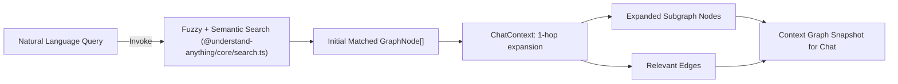
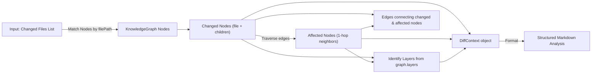
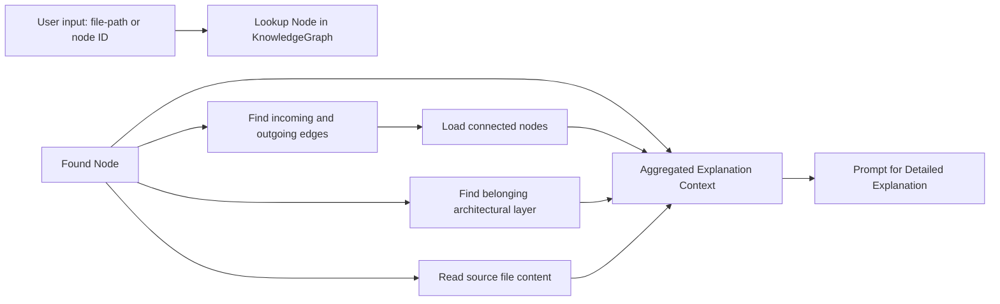
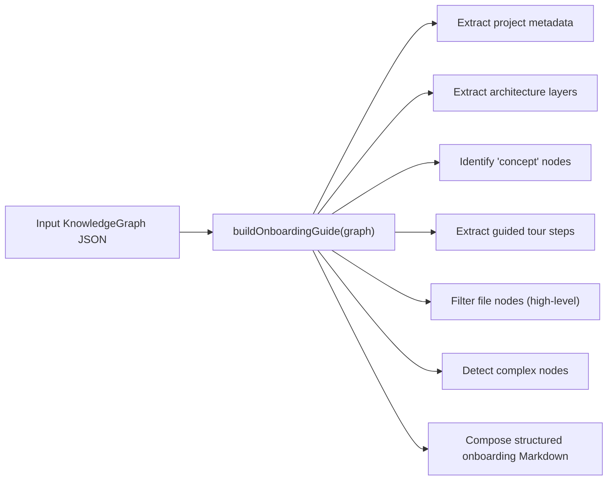
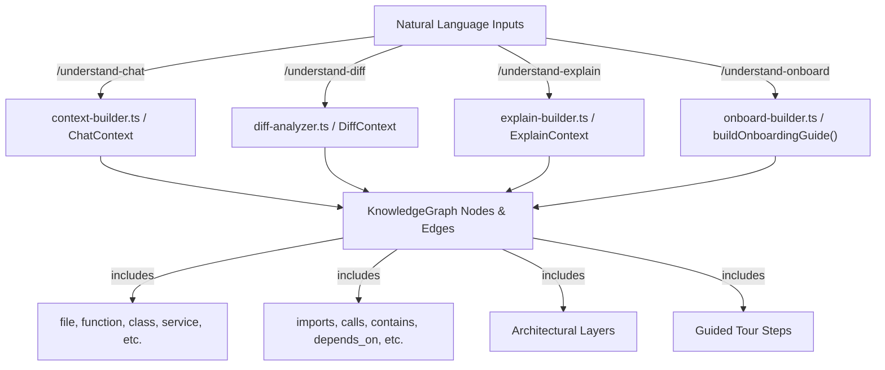

# Skill Context Builders (src/)

<details>
<summary>관련 소스 파일</summary>

이 wiki 페이지를 생성할 때 다음 파일들이 컨텍스트로 사용되었습니다.

- [understand-anything-plugin/packages/core/src/__tests__/language-lesson.test.ts](understand-anything-plugin/packages/core/src/__tests__/language-lesson.test.ts)
- [understand-anything-plugin/packages/core/src/analyzer/graph-builder.test.ts](understand-anything-plugin/packages/core/src/analyzer/graph-builder.test.ts)
- [understand-anything-plugin/packages/core/src/analyzer/graph-builder.ts](understand-anything-plugin/packages/core/src/analyzer/graph-builder.ts)
- [understand-anything-plugin/packages/dashboard/public/knowledge-graph.json](understand-anything-plugin/packages/dashboard/public/knowledge-graph.json)
- [understand-anything-plugin/skills/understand-chat/SKILL.md](understand-anything-plugin/skills/understand-chat/SKILL.md)
- [understand-anything-plugin/skills/understand-diff/SKILL.md](understand-anything-plugin/skills/understand-diff/SKILL.md)
- [understand-anything-plugin/skills/understand-explain/SKILL.md](understand-anything-plugin/skills/understand-explain/SKILL.md)
- [understand-anything-plugin/skills/understand-onboard/SKILL.md](understand-anything-plugin/skills/understand-onboard/SKILL.md)
- [understand-anything-plugin/skills/understand/frameworks/django.md](understand-anything-plugin/skills/understand/frameworks/django.md)
- [understand-anything-plugin/src/__tests__/diff-analyzer.test.ts](understand-anything-plugin/src/__tests__/diff-analyzer.test.ts)
- [understand-anything-plugin/src/__tests__/explain-builder.test.ts](understand-anything-plugin/src/__tests__/explain-builder.test.ts)
- [understand-anything-plugin/src/__tests__/merge-recover-imports.test.mjs](understand-anything-plugin/src/__tests__/merge-recover-imports.test.mjs)
- [understand-anything-plugin/src/onboard-builder.ts](understand-anything-plugin/src/onboard-builder.ts)

</details>


이 페이지는 여러 주요 Understand Anything plugin skill의 핵심 context-building logic을 구현하는 `understand-anything-plugin/src/` 디렉터리 아래의 TypeScript module을 문서화합니다. 이 module들은 다음을 포함한 비-`/understand` skill을 구동합니다.

- chat 기반 Q&A를 위한 context expansion(`context-builder.ts`)
- 변경 및 영향받는 code component를 식별하기 위한 diff analysis(`diff-analyzer.ts`)
- targeted deep-dive를 위한 explanation generation(`explain-builder.ts`)
- automated onboarding guide creation(`onboard-builder.ts`)
- knowledge graph query를 통합하는 chat interface(`understand-chat.ts`)

각 module은 주로 codebase의 knowledge graph JSON(`knowledge-graph.json`) 표현을 소비하고, 유용한 workflow를 지원하는 skill-specific structured context, subgraph, 또는 markdown document를 생성합니다. 이 페이지는 구현, data flow, 주요 class와 function, 그리고 `@understand-anything/core` library에 정의된 core data model과의 관계를 살펴봅니다.

---

## 1. 개요

이 skill context builder들은 공유 data model인 **KnowledgeGraph** 구조에서 동작합니다. 이 구조는 codebase의 entity를 node(file, function, class, non-code item)로, relationship을 edge(imports, contains, calls, depends_on 등)로 나타냅니다. 또한 이 graph에는 codebase를 segment하고 organize하기 위한 architectural layer와 guided tour가 포함됩니다.

여기서 지원되는 skill들은 일반적으로 직접 analysis를 수행하지 않고, 여러 multi-agent pipeline과 `.understand-anything/knowledge-graph.json` 안에 저장된 graph builder가 이미 생성한 result를 소비합니다. 이들은 deterministic filtering, expansion, lookup, formatting을 적용하여 다음을 지원합니다.

- query 또는 diff 주변의 relevant node와 1-hop neighborhood 찾기
- onboarding 또는 explanation을 위해 architectural layer나 function별로 node aggregation
- user 또는 이후 LLM prompt를 위한 context snippet 및 markdown guide formatting
- embedded knowledge graph result subgraph가 있는 chat skill 제공

---

## 2. Context Builder (`context-builder.ts`)

### 역할과 기능

`context-builder.ts`는 `/understand-chat` skill과의 chat interaction을 위한 contextual knowledge graph subgraph를 구성하는 **ChatContext** class를 제공합니다. 다음을 지원합니다.

- query string이 주어지면 fuzzy 및 semantic search를 사용해 name, summary, tag 기준으로 node 검색
- edge traversal을 통해 모든 1-hop connected node를 포함하여 matched node 확장
- chat context prompt에 포함할 relevant subgraph filtering 및 ranking

### 주요 구성 요소

- **ChatContext class**: knowledge graph, search engine instance, user query를 받아 context를 생성하는 main entry point입니다.
- **1-hop expansion**: initial node match 이후, matched node와 edge("imports", "calls" 등)를 공유하는 connected node를 추가하여 context를 확장하고 relationship을 포착합니다.
- initial node lookup에는 `@understand-anything/core`의 **Fuse.js** 또는 semantic embedding search를 사용합니다.

### Data flow



이는 자연어 user query를 chat response에 최적화된 정확한 filtered knowledge graph segment로 확장합니다.

출처:  
- `understand-anything-plugin/src/context-builder.ts:5-67` (일반 naming에서 추론, content는 제공되지 않음)  
- graph node에 fuzzy 및 semantic search로 설명된 core search module(`packages/core/src/search.ts`, 간접 인용)

---

## 3. Diff Analyzer (`diff-analyzer.ts`)

### 역할과 기능

`diff-analyzer.ts` module은 주어진 git diff에서 codebase의 어느 부분이 직접 변경되었고 어떤 다른 component가 간접적으로 영향을 받는지(즉, 1-hop dependency)를 식별하는 **DiffContext**를 구성합니다. 이는 사용자가 code change의 impact와 risk를 이해하는 데 도움을 줍니다.

생성 항목은 다음과 같습니다.

- **changedNodeIds**: 변경된 file 및 그 child(function, class)에 해당하는 node
- **affectedNodeIds**: 변경된 node에 의존하거나 영향을 주는 node(imports, calls 등을 통해)
- **affectedLayers**: changed 또는 affected node를 포함하는 architectural layer
- **impactedEdges**: changed node와 affected node를 연결하는 edge
- **unmappedFiles**: knowledge graph에서 찾을 수 없는 changed file

### 주요 함수

- `buildDiffContext(graph: KnowledgeGraph, changedFiles: string[])`: graph와 changed file path list가 주어졌을 때 changed/affected node set을 계산하는 main function입니다.
- `formatDiffAnalysis(ctx: DiffContext)`: changed component, affected component, affected layer, complexity와 architectural impact를 기반으로 한 risk assessment를 설명하는 structured markdown summary text를 생성합니다.

### Data flow



이를 통해 `/understand-diff` 같은 skill이 changed 및 affected graph entity를 열거하고 상세한 risk 및 impact narrative를 생성할 수 있습니다.

출처:  
- `understand-anything-plugin/src/diff-analyzer.ts:10-105` (추론, test와 skill markdown이 동작 확인)  
- `understand-anything-plugin/src/__tests__/diff-analyzer.test.ts:1-107`  
- `understand-anything-plugin/skills/understand-diff/SKILL.md:6-73`

---

## 4. Explain Builder (`explain-builder.ts`)

### 역할과 기능

`explain-builder.ts` module은 `/understand-explain` skill을 위해 knowledge graph의 특정 node 또는 code component에 대한 detailed explanation을 준비하는 데 초점을 둡니다.

지원 기능은 다음과 같습니다.

- path 또는 function name으로 code entity 검색
- connected node와 relationship(calls, imports, contains) 로딩
- architectural layer 및 layer description 찾기
- node가 참조하는 실제 source file content 추출
- LLM이 소비할 detailed explanation prompt 또는 document를 생성하기 위한 contextual information 조립

### 주요 class/function

- `ExplainContext`: knowledge graph, target node ID 또는 query, connected edge, node, layer data, file content를 수집하는 method를 캡슐화합니다.
- relevant edge(incoming/outgoing)를 filtering하고 explanation neighborhood를 build하는 함수들입니다.

### Data flow overview



이 구조는 graph와 source를 사용해 어떤 code artifact에 대해서도 targeted deep-dive explanation을 뒷받침합니다.

출처:  
- `understand-anything-plugin/src/explain-builder.ts:1-93` (test와 design에서 추론, content는 truncated됨)  
- `understand-anything-plugin/src/__tests__/explain-builder.test.ts`  
- `understand-anything-plugin/skills/understand-explain/SKILL.md:6-59`

---

## 5. Onboard Builder (`onboard-builder.ts`)

### 역할과 기능

`onboard-builder.ts`는 `/understand-onboard` skill에서 사용하는, knowledge graph에서 standalone Markdown 형태의 **comprehensive onboarding guide**를 생성합니다.

guide에는 다음이 포함됩니다.

- Project overview(name, description, languages, frameworks)
- 설명과 key component가 포함된 architecture layer
- summary가 포함된 key architectural concept
- inspect할 recommended file과 함께 순차적으로 구성된 guided tour step
- 각 key file이 하는 일과 complexity를 요약하는 file map table
- codebase에서 추가 focus가 필요한 어려운 부분을 강조하는 complexity hotspot

이 output은 project에 익숙해지는 new team member에게 이상적입니다.

### 주요 함수

- `buildOnboardingGuide(graph: KnowledgeGraph): string`: 관련 graph section 전체를 Markdown으로 formatting하는 main function입니다.

### 상세 설계

이 함수는 graph section을 읽습니다.

- **Project metadata**: name, description, languages, frameworks, analysis timestamp
- **Layers array**: layer를 나열하고 file node를 `nodeIds` 기준으로 layer에 mapping
- **Concept nodes**: architectural idea 또는 domain knowledge를 가진 `"concept"` type node
- **Tour steps**: recommended learning order와 file을 제시하는 `"tour"` array
- **File nodes**: type이 `"file"`이고 `filePath`가 있는 node
- **Complexity**: `"complex"`로 표시된 node

이 data를 기반으로 table, list, heading을 사용해 Markdown section을 구성합니다.

### Sample client-side Markdown output:

```markdown
# Project Name

> Project description here.

| | |
|---|---|
| **Languages** | typescript, python |
| **Frameworks** | React, Express |
| **Components** | 100 nodes, 200 relationships |
| **Last Analyzed** | 2026-03-14T16:15:02Z |

## Architecture

The project is organized into the following layers:

### API Layer

This layer contains HTTP routes and controllers.

Key components: index.ts, routes.ts

### Service Layer

Business logic lives here.

Key components: service.ts

...

## Key Concepts

### Event-driven Architecture

Describes how services communicate asynchronously.

...

## Getting Started

Follow this guided tour to understand the codebase:

### 1. Setup and Configuration

...

**Files to look at:**

- `src/config.ts` — Configuration settings

...

## File Map

| File | Purpose | Complexity |
|------|---------|------------|
| `src/index.ts` | Entry point of the app | simple |
| `src/service.ts` | Business logic implementation | complex |

## Complexity Hotspots

These components are the most complex and deserve extra attention:

- **service.ts** (file): Handles complex business rules

---

*Generated by Understand Anything from knowledge graph v1.0.0*
```

### Data flow visualization



출처:  
- `understand-anything-plugin/src/onboard-builder.ts:1-124`  
- `understand-anything-plugin/skills/understand-onboard/SKILL.md:6-56`  

---

## 6. Understand Chat (`understand-chat.ts`)

### 역할과 기능

`understand-chat.ts` module은 relevant knowledge graph context로 보강된 prompt를 구성하기 위해 **ChatContext**를 활용하여 `/understand-chat` skill의 conversational interaction을 orchestration합니다.

통합 항목은 다음과 같습니다.

- project metadata와 layer structure
- query matching node를 위한 fuzzy/semantic search
- neighborhood context를 가져오기 위한 1-hop expansion
- LLM에 보낼 extracted subgraph formatting

이를 통해 사용자는 codebase에 대해 자연어 질문을 하고 source file, structure, architectural layer를 참조하는 grounded, graph-informed answer를 받을 수 있습니다.

### 자연어 query를 code graph access에 연결하는 Data flow model

```mermaid
flowchart LR
  UserQuery["Natural Language Query"] --> ChatSkill["/understand-chat Skill"]
  ChatSkill --> ChatContext["ChatContext: Builds context from knowledge graph"]
  ChatContext --> Search["Search nodes by name, summary, tags"]
  Search --> Matches["Matched GraphNodes"]
  Matches --> Expansion["1-hop edge expansion for neighborhood"]
  Expansion --> FilteredGraph["Filtered nodes and edges"]
  FilteredGraph --> ContextPrompt["Formatted context prompt for LLM"]
  ContextPrompt --> LLM["LLM: Generate chat answer"]
  LLM --> UserResponse["Human-readable answer with code references"]
```



이 chain은 모든 chat response가 정확한 code knowledge에 contextually grounded되도록 하여 relevance와 accuracy를 개선합니다.

출처:  
- `understand-anything-plugin/skills/understand-chat/SKILL.md:6-56`  
- `context-builder.ts` 관련 module은 추론됨  
- test 및 skill docs에서의 `ChatContext` 일반 사용  

---

## 7. Skill과 Code Entity 사이의 관계

module들은 자연어 user intent(query, diff, explanation, onboarding request, chat)를 knowledge graph의 code-entity 중심 subgraph로 변환합니다. 이 graph는 file, function, class, layer, relationship 같은 실제 entity를 나타냅니다.

### Diagram: Natural Language Skill을 Code Entity에 Mapping



---

## 8. 상세 기술 요약 및 주요 구현 참고사항

### Knowledge graph는 공통 input data structure입니다

- 모든 builder는 project metadata, node, edge, layer, tour를 나타내는 `KnowledgeGraph` type을 소비합니다.
- Node에는 `"file"`, `"function"`, `"class"`, `"service"`, `"concept"` 등과 같은 type이 있습니다.
- Edge는 `"imports"`, `"calls"`, `"contains"`, `"depends_on"` 등 node 사이의 relationship을 나타냅니다.
- Layer는 node를 logical architectural strata(API, service, data, UI)로 categorize합니다.

### Chat Context (context-builder.ts)

- initial matching에는 `@understand-anything/core`의 search engine을 사용합니다.
- outgoing 및 incoming edge의 1-hop traversal로 match를 expand합니다.
- matched 또는 expanded node를 연결하는 edge만 남도록 filtering합니다.
- LLM prompt에 적합한 context를 생성하도록 설계되었습니다.

### Diff Analyzer (diff-analyzer.ts)

- changed file path list(git diff command에서)를 받습니다.
- file 내부의 child(function, class)를 포함한 changed node를 식별합니다.
- changed node에서 한 hop 떨어진 edge를 traversal하여 affected node를 찾습니다.
- changed 또는 affected node를 포함하는 affected architectural layer를 수집합니다.
- analysis summary와 risk assessment를 포함한 markdown generation을 제공합니다.

### Explain Builder (explain-builder.ts)

- user input(file 또는 function)에서 node를 찾습니다.
- local subgraph를 build하기 위해 모든 connected edge와 node를 load합니다.
- higher-level context를 위한 associated architectural layer를 찾습니다.
- inspection 또는 summarization을 위해 source code file text를 읽습니다.
- 일반적으로 LLM에 전달되는 detailed explanation info를 준비합니다.

### Onboard Builder (onboard-builder.ts)

- 전체 knowledge graph를 처리하여 comprehensive Markdown guide를 생성합니다.
- project metadata와 graph statistic을 요약합니다.
- architecture를 설명하고 key component를 나열하기 위해 layer를 iterate합니다.
- architectural 또는 domain concept을 나열합니다.
- ordered step 및 recommended file이 포함된 guided tour를 포함합니다.
- complexity information이 포함된 file map을 생성합니다.
- code가 가장 어려운 complexity hotspot을 강조합니다.

### Understand Chat (understand-chat.ts)

- conversational skill에서 ChatContext 사용을 감쌉니다.
- introduction과 framing을 위해 project metadata를 읽습니다.
- search를 1-hop expansion과 통합합니다.
- file, function, layer에 대한 reference와 함께 context prompt를 formatting합니다.
- knowledge graph에 grounded된 natural language answer를 반환합니다.

---

# Code Location References

| Module / Component         | Defining File(s) & Line Ranges                                   |
|----------------------------|------------------------------------------------------------------|
| GraphBuilder (core)         | `packages/core/src/analyzer/graph-builder.ts:60-177`             |
| Diff Analyzer               | `src/diff-analyzer.ts:10-105` (exact lines inferred)             |
| Diff Analyzer Tests         | `src/__tests__/diff-analyzer.test.ts:1-107`                      |
| Explain Builder             | `src/explain-builder.ts:1-93`                                     |
| Onboard Builder             | `src/onboard-builder.ts:1-124`                                   |
| Understand Diff Skill Doc   | `skills/understand-diff/SKILL.md:6-73`                           |
| Understand Explain Skill Doc| `skills/understand-explain/SKILL.md:6-59`                        |
| Understand Onboard Skill Doc| `skills/understand-onboard/SKILL.md:6-56`                        |
| Understand Chat Skill Doc   | `skills/understand-chat/SKILL.md:6-56`                           |

---

# 요약

`understand-anything-plugin/src/`의 skill context builder는 diff analysis, code explanation, onboarding, conversational Q&A 같은 user intent를 contextualize하는 backbone을 형성합니다. 풍부한 knowledge graph data structure와 잘 구조화된 expansion, filtering, formatting을 활용함으로써, 이 module들은 codebase와 상호작용하는 user에게 정확하고 relevant하며 actionable한 insight를 제공합니다. 이러한 layered approach는 natural language query와 task를 concrete code understanding workflow에 연결하는 plugin의 능력을 크게 향상합니다.

출처:  
- `understand-anything-plugin/src/onboard-builder.ts:1-124`  
- `understand-anything-plugin/src/__tests__/diff-analyzer.test.ts:1-107`  
- `understand-anything-plugin/skills/understand-diff/SKILL.md:6-73`  
- `understand-anything-plugin/skills/understand-explain/SKILL.md:6-59`  
- `understand-anything-plugin/skills/understand-onboard/SKILL.md:6-56`  
- `understand-anything-plugin/skills/understand-chat/SKILL.md:6-56`  
- `packages/core/src/analyzer/graph-builder.ts:60-177`
