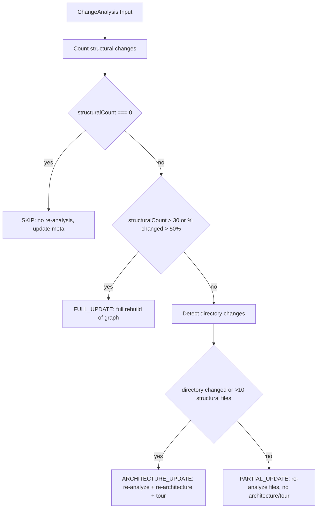

# Auto-Update 및 Hooks

<details>
<summary>관련 소스 파일</summary>

이 wiki 페이지를 생성할 때 다음 파일들이 컨텍스트로 사용되었습니다.

- [eslint.config.mjs](eslint.config.mjs)
- [scripts/generate-large-graph.mjs](scripts/generate-large-graph.mjs)
- [understand-anything-plugin/hooks/auto-update-prompt.md](understand-anything-plugin/hooks/auto-update-prompt.md)
- [understand-anything-plugin/hooks/hooks.json](understand-anything-plugin/hooks/hooks.json)
- [understand-anything-plugin/packages/core/src/__tests__/change-classifier.test.ts](understand-anything-plugin/packages/core/src/__tests__/change-classifier.test.ts)
- [understand-anything-plugin/packages/core/src/__tests__/fingerprint.test.ts](understand-anything-plugin/packages/core/src/__tests__/fingerprint.test.ts)
- [understand-anything-plugin/packages/core/src/change-classifier.ts](understand-anything-plugin/packages/core/src/change-classifier.ts)
- [understand-anything-plugin/packages/core/src/fingerprint.ts](understand-anything-plugin/packages/core/src/fingerprint.ts)
- [understand-anything-plugin/packages/core/src/plugins/extractors/ruby-extractor.ts](understand-anything-plugin/packages/core/src/plugins/extractors/ruby-extractor.ts)
- [understand-anything-plugin/packages/core/src/plugins/parsers/graphql-parser.ts](understand-anything-plugin/packages/core/src/plugins/parsers/graphql-parser.ts)
- [understand-anything-plugin/packages/core/src/plugins/parsers/sql-parser.ts](understand-anything-plugin/packages/core/src/plugins/parsers/sql-parser.ts)
- [understand-anything-plugin/skills/understand/build-fingerprints.mjs](understand-anything-plugin/skills/understand/build-fingerprints.mjs)

</details>


이 페이지는 Understand Anything의 auto-update 및 hooks 하위 시스템을 문서화합니다. `hooks.json`에 정의된 hooks system, `auto-update-prompt.md` script가 구동하는 incremental auto-update workflow, fingerprint 기반 change detection mechanism, 그리고 knowledge graph에 대한 incremental update action을 결정하기 위해 `classifyUpdate`에서 사용하는 decision matrix를 자세히 설명합니다.

---

## 1. Hooks System Overview

Understand Anything은 coding session lifecycle 또는 post-tool execution 중 외부 event에 의해 trigger되는 task를 자동화하기 위해 hooks system을 사용합니다. 이 system은 다음 위치의 JSON file에서 설정됩니다.

- `understand-anything-plugin/hooks/hooks.json`

### Hook Types

여기서 관련된 hook은 다음과 같습니다.

- **PostToolUse**: 특정 CLI tool 또는 command 실행 후 trigger됩니다.
- **SessionStart**: user session 시작 시 trigger됩니다.

### Auto-Update용 Hook Commands

이 hook 안에서는 조건부 Bash command가 Git commit(commit, merge, cherry-pick, rebase)이 발생했는지 또는 session이 outdated knowledge graph로 시작되었는지 감지합니다. `.understand-anything/config.json`에서 `autoUpdate`가 `true`로 설정되어 있고 knowledge graph metadata file이 존재하면, user confirmation 없이 internal auto-update mechanism이 자동 실행됩니다.

hooks.json의 관련 command는 다음과 같습니다.

- **PostToolUse** hook은 tool input에 git action이 포함되어 있는지 확인하고 다음 조건에서 auto-update prompt를 호출하는 command를 실행합니다.

  - `.understand-anything/config.json`이 존재하고 `"autoUpdate": true`를 포함합니다.
  - `.understand-anything/knowledge-graph.json`이 존재합니다.

- **SessionStart** hook은 현재 Git HEAD commit hash와 `.understand-anything/meta.json`에 저장된 hash를 비교하는 command를 실행합니다. 서로 다르면 auto-update prompt를 trigger하여 incremental update를 수행하도록 촉구합니다.

**참고:** 두 경우 모두 command는 plugin이 `auto-update-prompt.md` 안의 instruction을 읽고 실행해야 하며, user confirmation을 묻지 않고 transparent하게 update를 수행하라고 지시하는 message를 출력합니다.

```json
{
  "hooks": {
    "PostToolUse": [
      {
        "matcher": "Bash",
        "hooks": [
          {
            "type": "command",
            "command": "printf '%s' \"$TOOL_INPUT\" | grep -qE 'git\\s+(commit|merge|cherry-pick|rebase)' && [ -f .understand-anything/config.json ] && grep -q '\"autoUpdate\".*true' .understand-anything/config.json && [ -f .understand-anything/knowledge-graph.json ] && echo \"[understand-anything] Commit detected with auto-update enabled. You MUST read the file at ${CLAUDE_PLUGIN_ROOT}/hooks/auto-update-prompt.md and execute its instructions to incrementally update the knowledge graph. Do not ask the user for confirmation — just do it.\" || true"
          }
        ]
      }
    ],
    "SessionStart": [
      {
        "hooks": [
          {
            "type": "command",
            "command": "[ -f .understand-anything/config.json ] && grep -q '\"autoUpdate\".*true' .understand-anything/config.json && [ -f .understand-anything/meta.json ] && [ -f .understand-anything/knowledge-graph.json ] && [ \"$(node -p \"JSON.parse(require('fs').readFileSync('.understand-anything/meta.json','utf8')).gitCommitHash\")\" != \"$(git rev-parse HEAD 2>/dev/null)\" ] && echo \"[understand-anything] Knowledge graph is stale. You MUST read the file at ${CLAUDE_PLUGIN_ROOT}/hooks/auto-update-prompt.md and execute its instructions to check for structural changes and update the graph. Do not ask the user for confirmation — just do it.\" || true"
          }
        ]
      }
    ]
  }
}
```

출처: `understand-anything-plugin/hooks/hooks.json` [2-25]()

---

## 2. Auto-Update Incremental Workflow

knowledge graph에 대한 incremental update를 수행하는 실제 logic은 다음 파일에 설명된 internal, non-user-facing script에 encoded되어 있습니다.

- `understand-anything-plugin/hooks/auto-update-prompt.md`

이 script는 위 hook에 의해 trigger됩니다. 목표는 code structural change를 deterministic하게 감지하고 필요할 때만 비용이 큰 analysis를 실행하여 expensive LLM token usage를 최소화하는 것입니다.

### Key Principles

- **Cost Efficiency:** change가 cosmetic(formatting, internal logic)이면 LLM token을 전혀 사용하지 않습니다.
- **Deterministic Structural Fingerprinting:** structural change(functions, classes, imports, exports)를 정확하게 감지합니다.
- **Incremental Update Decisions:** change classification matrix를 사용해 skip, partial update, full rebuild 여부를 결정합니다.
- **No User Confirmation:** update process는 interruption 없이 자동으로 실행됩니다.

### Workflow Phases

workflow는 여러 phase로 진행됩니다.

#### Phase 0 — Pre-Flight Checks (Zero Token Cost)

- 필수 file인 knowledge graph(`knowledge-graph.json`)와 metadata(`meta.json`) 존재 여부를 검증합니다.
- 현재 Git HEAD commit을 확인합니다. 마지막 analysis 이후 변경이 없고 `--force` flag도 없으면 즉시 중지합니다.
- 마지막으로 분석된 commit과 HEAD 사이의 changed file을 감지합니다.
  - changed file이 없으면 새 commit으로 `meta.json`을 update하고 중지합니다.
- recognized source file extension으로 changed file을 filtering합니다.
  - 남는 file이 없으면 `meta.json`을 update하고 중지합니다.
- `.understandignore` exclusion을 적용하여 update를 잘못 trigger하는 user-excluded file을 제거합니다.
  - plugin의 internal ignore logic을 import하는 `ignore-filter.mjs` utility script를 사용합니다.
  - 여기서 제외된 file은 fingerprint comparison 전에 제거됩니다.
  - 모든 changed file이 제외되면 metadata를 update하고 중지합니다.
- temporary data를 위해 `.understand-anything/intermediate` 아래에 intermediate directory를 준비합니다.

#### Phase 1 — Structural Fingerprint Check (Zero LLM Tokens)

- deterministic Node.js script(`fingerprint-check.mjs`)를 실행하며, 이 script는 다음을 수행합니다.

  - `.understand-anything/fingerprints.json`에서 저장된 fingerprint를 읽습니다.
  - changed source file마다:
    - 현재 file content를 읽습니다.
    - SHA-256 content hash를 계산합니다.
    - content hash가 변경되지 않았으면 → `NONE`으로 분류합니다.
    - 아니면 regex를 통해 structural element(functions, classes, imports, exports)를 추출합니다.
    - 저장된 fingerprint와 비교합니다.
      - structural element가 동일하면 → `COSMETIC`으로 분류합니다.
      - 아니면 → `STRUCTURAL`로 분류합니다.
  - 새로 추가되거나 삭제된 file은 자동으로 `STRUCTURAL`입니다.
  - file-level classification을 기반으로 전체 update action decision을 생성합니다.
    - `SKIP`, `PARTIAL_UPDATE`, `ARCHITECTURE_UPDATE`, 또는 `FULL_UPDATE`.
  - 상세 JSON summary를 `.understand-anything/intermediate/change-analysis.json`에 씁니다.

#### Phase 2 — Update Action Decision & Reporting

- change analysis JSON을 읽습니다.
- decision gate를 적용합니다.

| Action               | Behavior                                                                                  |
|----------------------|-------------------------------------------------------------------------------------------|
| `SKIP`               | metadata commit hash를 update하고 "Zero tokens spent"를 report한 뒤 중지합니다.                            |
| `FULL_UPDATE`         | major structural change를 report하고 `/understand --full` 실행을 권장한 뒤 중지합니다.                 |
| `ARCHITECTURE_UPDATE`| architecture-level re-analysis를 실행하고 tour를 rebuild하며 metadata를 update합니다.                      |
| `PARTIAL_UPDATE`      | changed file만 re-analyze하고 architecture 및 tour를 보존하며 metadata를 update합니다.          |

- non-SKIP case에서는 pipeline이 knowledge graph를 그에 맞춰 incrementally update합니다.

### Incremental Update Benefits

이 접근 방식은 trivial 또는 cosmetic edit가 expensive LLM token을 낭비하지 않도록 하고, 큰 change가 적절한 수준의 rebuild를 trigger하도록 하여 최신 정확성을 효율적으로 유지합니다.

---

## 3. Fingerprint-Based Change Detection

incremental update의 핵심에는 source file의 구조를 포착하는 deterministic fingerprinting system이 있습니다.

### Fingerprint Types

core package에 구현되어 있습니다.

- `FileFingerprint`: file path, content hash, 그리고 functions, classes, imports, exports를 포함한 structural element를 포착합니다.
- `FunctionFingerprint`, `ClassFingerprint`, `ImportFingerprint`: 각 structural element의 detail을 나타냅니다.
- `ChangeLevel`: change category를 열거합니다: `"NONE" | "COSMETIC" | "STRUCTURAL"`.

### Fingerprint Extraction

- `extractFileFingerprint` 함수는 다음 방식으로 fingerprint를 생성합니다.

  - 전체 file content의 SHA-256 hash를 계산합니다.
  - function signature, class, import statement, declared export를 기록합니다.
  - structural element의 line count를 계산합니다.

이 extraction은 parser와 language extractor의 structured analysis result를 사용합니다.

### Fingerprint Comparison

- `compareFingerprints` 함수는 두 `FileFingerprint`(old 및 new)에 대해 작동하여 change를 분류합니다.

```typescript
type ChangeLevel = "NONE" | "COSMETIC" | "STRUCTURAL";

function compareFingerprints(oldFp: FileFingerprint, newFp: FileFingerprint): FileChangeResult;
```

- 반환값:

  - content hash가 정확히 일치하면 `NONE`.
  - content가 다르지만 structure(functions/classes/imports/exports)가 일치하면 `COSMETIC`.
  - function/class가 추가/삭제되었거나, signature가 변경되었거나, imports/exports가 변경되었거나, significant line count difference가 발생하면 `STRUCTURAL`.

- 무엇이 변경되었는지 설명하기 위해 사람이 읽을 수 있는 detail을 누적합니다.

이 comparison은 conservative합니다. structural data가 부족하면 true change를 놓치지 않기 위해 `STRUCTURAL` classification으로 이어집니다.

### Change Analysis Summary

- `analyzeChanges` 함수는 전체 diff에 걸친 file-level result를 aggregate합니다.

  - change type별 file list(`newFiles`, `deletedFiles`, `structurallyChangedFiles`, `cosmeticOnlyFiles`, `unchangedFiles`)를 나열합니다.
  - 이 aggregated analysis는 이후 update action classification에 사용됩니다.

---

## 4. Update Decision Matrix: classifyUpdate()

fingerprint 기반 change analysis를 기준으로 knowledge graph를 어떻게 update할지 결정하는 logic은 다음 파일에 통합되어 있습니다.

- `understand-anything-plugin/packages/core/src/change-classifier.ts`

### `classifyUpdate` Function

```typescript
export function classifyUpdate(
  analysis: ChangeAnalysis,
  totalFilesInGraph: number,
  allKnownFiles: string[] = []
): UpdateDecision;
```

#### Decision Matrix Summary

| Condition                                                                    | Action               | Re-analysis Detail               | Rebuild Architecture | Rebuild Tour      | Reason Description                                        |
| ---------------------------------------------------------------------------- | -------------------- | ------------------------------- | -------------------- | ----------------- | ---------------------------------------------------------|
| structural change 없음(cosmetic 또는 unchanged file만 있음)                     | `SKIP`               | 없음                            | 아니요                   | 아니요                | structural 또는 impactful change가 없습니다.                       |
| structural change가 30개 file 초과 또는 전체 file의 50% 초과                       | `FULL_UPDATE`        | structurally changed + new 전체  | 예                  | 예               | 대규모 change이며 full rebuild가 권장됩니다.            |
| structural change가 directory structure에 영향을 주거나 10개 file 초과                  | `ARCHITECTURE_UPDATE`| structurally changed + new 전체  | 예                  | 예               | directory change로 인해 architecture re-analysis가 필요합니다. |
| 같은 directory 내 structural change가 10개 file 이하                         | `PARTIAL_UPDATE`     | Structurally changed + new files| 아니요                   | 아니요                | localized change이며 partial incremental update가 가능합니다.   |

#### Directory Structure Change Detection

- `detectDirectoryChanges` helper를 사용해 new 또는 deleted file이 top-level source directory를 도입하거나 제거하는지 확인합니다.
- top-level directory는 root 뒤의 첫 directory segment입니다.
- new 또는 deleted file이 baseline에 알려지지 않은 directory에 있으면 architecture update로 flag합니다.

#### Output Structure: `UpdateDecision`

```typescript
interface UpdateDecision {
  action: "SKIP" | "PARTIAL_UPDATE" | "ARCHITECTURE_UPDATE" | "FULL_UPDATE";
  filesToReanalyze: string[]; // input for incremental re-analysis
  rerunArchitecture: boolean;
  rerunTour: boolean;
  reason: string; // human-readable explanation of decision
}
```

### Example Decision Flow



출처:  
- `understand-anything-plugin/packages/core/src/change-classifier.ts` [1-143]()  
- `understand-anything-plugin/packages/core/src/__tests__/change-classifier.test.ts` [1-183]()  

---

## 5. Data Flow and Execution Diagram

아래는 hooks의 Git commit detection에서 시작해 file change filtering과 fingerprint comparison을 거쳐 incremental update workflow를 구동하는 classification decision에 이르는 lifecycle을 보여주는 상세 flow diagram입니다.

```mermaid
flowchart TD
  subgraph "Natural Language Space"
    H[hooks.json PostToolUse / SessionStart Hooks]
    U[auto-update-prompt.md Workflow]
  end

  subgraph "File System & Git"
    F1[.understand-anything/meta.json]
    F2[.understand-anything/knowledge-graph.json]
    F3[.understand-anything/fingerprints.json]
    F4[Source Files (git diff)]
    IG[.understandignore]
  end

  subgraph "Node.js Scripts"
    I1[Ignore Filter Script \n(./ignore-filter.mjs)]
    I2[Fingerprint-Check Script \n(./fingerprint-check.mjs)]
    BF[build-fingerprints.mjs]
  end

  subgraph "Code Entities"
    C1[FingerprintStore Interface]
    C2[classifyUpdate() Function]
  end

  H -->|trigger on commit/session| U
  U --> F1
  U --> F2
  U --> F3
  U --> F4
  F4 -->|list changed files| I1
  IG --> I1
  I1 -->|filtered files| I2
  F3 --> I2
  I2 -->|change analysis JSON| C1
  C1 --> C2
  C2 -->|Update decision| U
```

---

## 6. Key Classes and Functions

### `classifyUpdate`

- 역할: aggregated structural change analysis와 project context가 주어졌을 때 update action category를 결정합니다.
- Input: `ChangeAnalysis`(file-level change detail), graph 내 전체 file 수, 알려진 file path.
- Output: update strategy와 affected file이 포함된 `UpdateDecision`.

### Fingerprint Extraction & Comparison

- `extractFileFingerprint(filePath, content, analysis)`:
  - parsed structural analysis를 lightweight하고 comparable한 fingerprint로 변환합니다.
- `compareFingerprints(oldFingerprint, newFingerprint)`:
  - detailed comparison을 수행하고 change level 및 detail을 반환합니다.

### Fingerprint Store

- `FingerprintStore`:
  - file별 fingerprint와 git commit hash 같은 metadata를 보관합니다.
  - `.understand-anything/fingerprints.json`에 persisted됩니다.
- 전체 `/understand` 실행 중 다음을 통해 생성됩니다.
  - 모든 file을 parse하고 fingerprint를 생성하기 위해 `TreeSitterPlugin` 및 `PluginRegistry` 같은 core class를 사용하는 `build-fingerprints.mjs`.

---

## 7. 요약

Understand Anything의 Auto-Update 및 Hooks system은 knowledge graph를 위한 정교하고 deterministic한 incremental update mechanism을 제공합니다. Git commit detection hook과 internal auto-update prompt script를 통해 다음을 수행합니다.

- changed file을 식별하고 ignore filter를 적용합니다.
- fingerprinting system을 사용해 structural level에서 change를 분류합니다.
- configurable decision matrix를 사용해 knowledge graph를 skip, partial update, full rebuild 중 어떻게 처리할지 결정합니다.
- 불필요한 LLM token usage를 최소화하여 cost-efficient update를 가능하게 합니다.
- 명시적인 user interaction 없이 모든 단계를 transparent하게 자동화합니다.

이 설계는 active development 중 knowledge graph를 최신 상태로 유지하는 데 accuracy, performance, usability의 균형을 맞춥니다.

---

## References & Sources

- `understand-anything-plugin/hooks/hooks.json` [2-25]()  
- `understand-anything-plugin/hooks/auto-update-prompt.md` [1-147]()  
- `understand-anything-plugin/packages/core/src/change-classifier.ts` [1-143]()  
- `understand-anything-plugin/packages/core/src/__tests__/change-classifier.test.ts` [1-183]()  
- `understand-anything-plugin/packages/core/src/fingerprint.ts` [1-275]()  
- `understand-anything-plugin/skills/understand/build-fingerprints.mjs` [1-91]()
