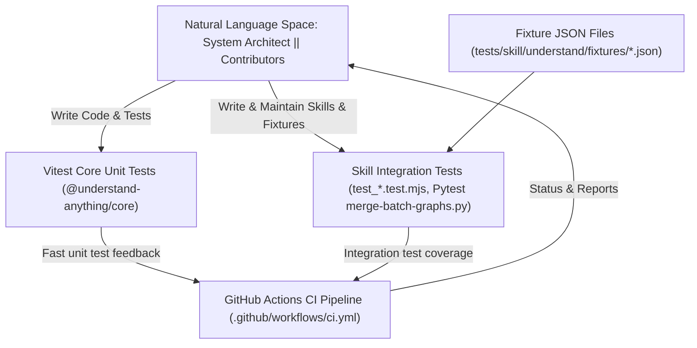
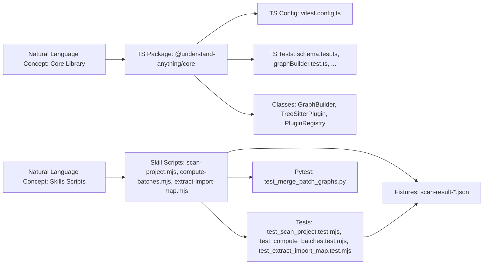

# Testing 및 CI

관련 소스 파일

이 wiki 페이지를 생성할 때 다음 파일들이 컨텍스트로 사용되었습니다.

- [.github/ISSUE_TEMPLATE/bug_report.yml](.github/ISSUE_TEMPLATE/bug_report.yml)
- [.github/ISSUE_TEMPLATE/config.yml](.github/ISSUE_TEMPLATE/config.yml)
- [.github/ISSUE_TEMPLATE/feature_request.yml](.github/ISSUE_TEMPLATE/feature_request.yml)
- [.github/ISSUE_TEMPLATE/question.yml](.github/ISSUE_TEMPLATE/question.yml)
- [.github/PULL_REQUEST_TEMPLATE.md](.github/PULL_REQUEST_TEMPLATE.md)
- [.github/workflows/ci.yml](.github/workflows/ci.yml)
- [CODE_OF_CONDUCT.md](CODE_OF_CONDUCT.md)
- [SECURITY.md](SECURITY.md)
- [package.json](package.json)
- [tests/skill/understand/fixtures/scan-result-merge-respects-non-mergeable.json](tests/skill/understand/fixtures/scan-result-merge-respects-non-mergeable.json)
- [tests/skill/understand/fixtures/scan-result-non-code.json](tests/skill/understand/fixtures/scan-result-non-code.json)
- [tests/skill/understand/fixtures/scan-result-singletons.json](tests/skill/understand/fixtures/scan-result-singletons.json)
- [tests/skill/understand/test_compute_batches.test.mjs](tests/skill/understand/test_compute_batches.test.mjs)
- [tests/skill/understand/test_merge_batch_graphs.py](tests/skill/understand/test_merge_batch_graphs.py)
- [tests/skill/understand/test_scan_project.test.mjs](tests/skill/understand/test_scan_project.test.mjs)
- [understand-anything-plugin/packages/core/vitest.config.ts](understand-anything-plugin/packages/core/vitest.config.ts)

이 섹션은 Understand Anything codebase에서 사용하는 testing 및 continuous integration(CI) 전략의 상위 수준 개요를 제공합니다. project 전반에서 사용되는 여러 test suite, 그 목적, 그리고 GitHub Actions CI pipeline과의 통합 방식을 설명합니다. 각 testing aspect에 대한 자세한 문서는 끝에 연결된 child page에서 확인할 수 있습니다.

---

## Testing Strategy Overview

Understand Anything project는 다양한 component 전반의 robustness, correctness, maintainability를 보장하기 위해 multi-layered testing approach를 사용합니다. 여기에는 다음이 포함됩니다.

- **Core Unit Tests**: [Vitest](https://vitest.dev/) testing framework를 사용해 TypeScript로 작성됩니다. core library `@understand-anything/core`에 초점을 맞추며 schema validation, graph construction, language extractor logic, plugin, 기타 low-level functionality를 다룹니다.

- **Skill Integration Tests**: Integration test는 `scan-project.mjs`, `compute-batches.mjs`, `extract-import-map.mjs`처럼 analysis pipeline의 핵심 부분을 이루는 skill script를 대상으로 합니다. 대부분 JavaScript module(`.mjs`)로 작성되며, Python 기반 `merge-batch-graphs.py`에는 `pytest`가 사용됩니다.

- **Fixtures**: JSON fixture file은 다양한 scenario와 codebase snapshot을 simulate하는 데 광범위하게 사용됩니다. 이 fixture들은 integration test를 구동하며 batch merging, import map extraction, code/non-code file의 복잡한 interaction이 올바르게 동작하도록 보장하는 regression guard 역할을 합니다.

- **Continuous Integration (CI) Pipeline**: project는 `.github/workflows/ci.yml`에 설정된 GitHub Actions를 사용하여 모든 pull request 및 `main` push에서 linting, building, test 실행을 자동화합니다. 이를 통해 failure를 조기에 포착하고 code health를 유지합니다.

이 전략은 빠르고 집중된 unit testing과 현실적인 integration scenario, CI를 통한 자동 enforcement의 균형을 맞춥니다.

---

## Core Unit Tests with Vitest

core package인 `@understand-anything/core`는 graph building, parser, schema validation, language extractor, fingerprinting, plugin management를 위한 foundational logic을 담고 있습니다. 그 correctness는 주로 robust한 Vitest suite를 통해 검증됩니다.

주요 초점은 다음과 같습니다.

- **Schema Validation Tests**: knowledge graph의 복잡한 type schema가 예상 constraint를 강제하는지 보장합니다.

- **GraphBuilder Tests**: graph의 incremental construction 및 merging behavior를 검증합니다.

- **TreeSitterPlugin & Extractor Tests**: language-specific parsing 및 extraction routine을 검증합니다.

- **Fingerprinting and Change Classifier**: file-change detection과 staleness heuristic이 올바르게 동작하는지 확인합니다.

- **Persistence Layer Tests**: knowledge graph와 domain meta의 read/write를 확인합니다.

이 unit test suite는 headless execution을 위해 `vitest run`을 실행하는 `pnpm --filter @understand-anything/core test` script로 동작합니다. development 중 실행이 빠르며 parallel 및 watch mode를 지원합니다.

예시 test case와 coverage를 포함한 추가 세부사항은 child page [Core Package Tests](#7.1)를 참조하세요.

---

## Skill Integration Tests

skill script는 static analysis와 LLM intelligence를 결합하여 codebase analysis의 core phase를 orchestration합니다.

- `scan-project.mjs`: file을 enumerate하고, language를 detect하며, initial import map을 build합니다.

- `compute-batches.mjs`: import connectivity를 기준으로 file을 analysis batch로 segment합니다.

- `extract-import-map.mjs`: file 사이의 import relation map을 생성합니다.

- `merge-batch-graphs.py`: batch graph를 merge하고 graph canonicalization을 수행하는 Python script입니다.

이 script들의 integration test는 higher-level workflow를 검증합니다. 이 test들은 controlled fixture에서 실제 skill command를 실행하고 output correctness를 검증합니다.

- 대부분의 integration test는 `.test.mjs` file의 ES module로 작성되며 Mocha/Vitest-like syntax를 사용합니다.

- graph merging script는 Python의 `pytest` test(`test_merge_batch_graphs.py`)로 테스트됩니다.

- JSON fixture file은 code와 non-code file이 섞인 복잡한 case, singleton batch, batch merging edge case를 포함한 다양한 repository state를 simulate합니다.

integration test는 root `pnpm test` command를 통해 실행되며, 필요에 따라 node 및 Python environment를 활용합니다.

integration test structure, fixture data, example scenario에 대한 포괄적인 세부사항은 child page [Skill Integration Tests](#7.2)를 참조하세요.

---

## Fixture Files

fixture는 analysis pipeline의 deterministic testing에서 중요한 역할을 합니다. 예시는 다음과 같습니다.

- `scan-result-singletons.json`: 많은 isolated TypeScript file이 몇 개의 batch로 merge될 것으로 예상되는 상황을 simulate합니다.

- `scan-result-non-code.json`: infra, config, document file 처리를 exercise하는 code 및 non-code file의 혼합을 포함합니다.

- `scan-result-merge-respects-non-mergeable.json`: non-mergeable로 표시된 작은 batch(예: Dockerfile)가 잘못 merge되지 않도록 보장하는 regression test입니다.

이 fixture들은 다양한 complexity, language, import structure, edge case를 가진 codebase의 curated snapshot을 나타내며, 신뢰할 수 있는 regression coverage를 가능하게 합니다.

---

## Continuous Integration (CI) Pipeline

project는 다음 상황에서 linting, building, test 실행을 자동화하도록 GitHub Actions를 설정합니다.

- Pull request(contributor에게 early feedback 제공).

- `main`에 대한 direct push(master branch가 stable하게 유지되도록 보장).

CI workflow(`.github/workflows/ci.yml`)는 다음을 수행합니다.

1. code를 checkout합니다.

2. pnpm과 Node.js(v22)를 설치합니다.

3. `pnpm install`로 dependency를 설치합니다.

4. `pnpm lint`로 lint를 실행합니다.

5. core 및 skill package를 build합니다.

6. core unit test와 skill integration test를 실행합니다.

workflow는 같은 branch의 outdated run을 cancel하는 concurrency setting을 사용하여 runner time을 절약하고 명확한 최신 status를 제공합니다.

이 CI setup은 quality gate가 지속적으로 강제되도록 보장하여 건강하고 maintainable한 codebase를 지원합니다.

---

## Testing & CI Diagram

---

## Bridging Natural Language Concepts to Code Entities

이 다이어그램은 core 및 skill package testing에 초점을 맞춰 high-level system component와 concrete code artifact 사이의 연결을 보여줍니다.

---

## Summary

- **core logic**은 **Vitest unit test**로 검증되며, 개별 component와 knowledge graph 및 analyzer의 correctness에 초점을 둡니다.

- end-to-end analysis function을 제공하는 **skill script**는 `.mjs`(JavaScript) 및 Python `pytest`의 **integration test**로 검증됩니다.

- **Fixture file**은 복잡한 repository state를 simulate하여 test가 현실적인 scenario와 regression case를 다루도록 보장합니다.

- **GitHub Actions**는 PR과 push에서 linting, building, test execution을 자동화하여 quality를 지속적으로 강제합니다.

더 깊은 technical detail, test code example, diagnostic strategy는 다음 specialized child page를 참조하세요.

- [Core Package Tests](#7.1) — core package용 Vitest test suite의 상세 문서입니다.

- [Skill Integration Tests](#7.2) — skill script integration test, fixture usage, Python test와의 interaction에 대한 포괄적 개요입니다.

---

## Sources

- `package.json` (lines 29-43) — test script 및 dependency  
- `.github/workflows/ci.yml` (lines 1-51) — CI pipeline config  
- `tests/skill/understand/test_merge_batch_graphs.py` (entire file) — batch graph merge용 python integration test  
- `tests/skill/understand/test_scan_project.test.mjs` (entire file) — scan-project skill용 integration test  
- `tests/skill/understand/test_compute_batches.test.mjs` (entire file) — compute-batches skill용 integration test  
- `tests/skill/understand/test_extract_import_map.test.mjs` (entire file) — extract-import-map skill용 integration test  
- `tests/skill/understand/fixtures/*.json` — integration test에서 사용하는 fixture file  
- `understand-anything-plugin/packages/core/vitest.config.ts` — core package test용 vitest configuration
