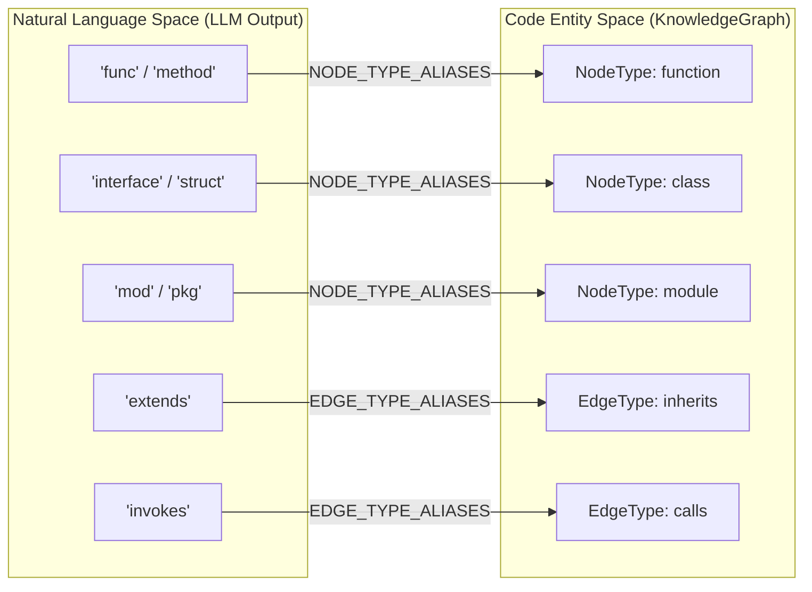
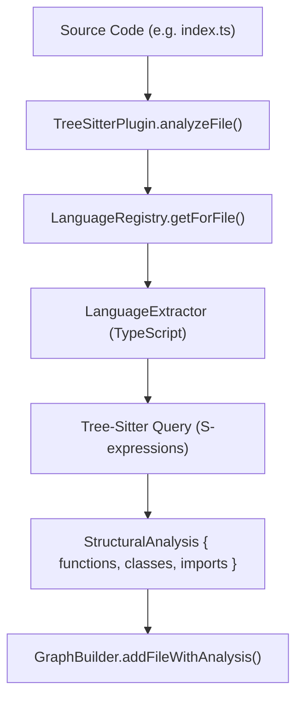

# Core Package Tests

관련 소스 파일

이 wiki 페이지를 생성할 때 다음 파일들이 컨텍스트로 사용되었습니다.

- [understand-anything-plugin/hooks/auto-update-prompt.md](understand-anything-plugin/hooks/auto-update-prompt.md)
- [understand-anything-plugin/hooks/hooks.json](understand-anything-plugin/hooks/hooks.json)
- [understand-anything-plugin/packages/core/src/__tests__/change-classifier.test.ts](understand-anything-plugin/packages/core/src/__tests__/change-classifier.test.ts)
- [understand-anything-plugin/packages/core/src/__tests__/domain-types.test.ts](understand-anything-plugin/packages/core/src/__tests__/domain-types.test.ts)
- [understand-anything-plugin/packages/core/src/__tests__/fingerprint.test.ts](understand-anything-plugin/packages/core/src/__tests__/fingerprint.test.ts)
- [understand-anything-plugin/packages/core/src/__tests__/ignore-filter.test.ts](understand-anything-plugin/packages/core/src/__tests__/ignore-filter.test.ts)
- [understand-anything-plugin/packages/core/src/__tests__/ignore-generator.test.ts](understand-anything-plugin/packages/core/src/__tests__/ignore-generator.test.ts)
- [understand-anything-plugin/packages/core/src/__tests__/language-lesson.test.ts](understand-anything-plugin/packages/core/src/__tests__/language-lesson.test.ts)
- [understand-anything-plugin/packages/core/src/__tests__/plugin-discovery.test.ts](understand-anything-plugin/packages/core/src/__tests__/plugin-discovery.test.ts)
- [understand-anything-plugin/packages/core/src/__tests__/plugin-registry.test.ts](understand-anything-plugin/packages/core/src/__tests__/plugin-registry.test.ts)
- [understand-anything-plugin/packages/core/src/__tests__/schema.test.ts](understand-anything-plugin/packages/core/src/__tests__/schema.test.ts)
- [understand-anything-plugin/packages/core/src/analyzer/graph-builder.test.ts](understand-anything-plugin/packages/core/src/analyzer/graph-builder.test.ts)
- [understand-anything-plugin/packages/core/src/analyzer/graph-builder.ts](understand-anything-plugin/packages/core/src/analyzer/graph-builder.ts)
- [understand-anything-plugin/packages/core/src/analyzer/language-lesson.ts](understand-anything-plugin/packages/core/src/analyzer/language-lesson.ts)
- [understand-anything-plugin/packages/core/src/fingerprint.ts](understand-anything-plugin/packages/core/src/fingerprint.ts)
- [understand-anything-plugin/packages/core/src/ignore-filter.ts](understand-anything-plugin/packages/core/src/ignore-filter.ts)
- [understand-anything-plugin/packages/core/src/ignore-generator.ts](understand-anything-plugin/packages/core/src/ignore-generator.ts)
- [understand-anything-plugin/packages/core/src/plugins/discovery.ts](understand-anything-plugin/packages/core/src/plugins/discovery.ts)
- [understand-anything-plugin/packages/core/src/plugins/registry.ts](understand-anything-plugin/packages/core/src/plugins/registry.ts)
- [understand-anything-plugin/packages/core/src/plugins/tree-sitter-plugin.test.ts](understand-anything-plugin/packages/core/src/plugins/tree-sitter-plugin.test.ts)
- [understand-anything-plugin/packages/core/src/plugins/tree-sitter-plugin.ts](understand-anything-plugin/packages/core/src/plugins/tree-sitter-plugin.ts)
- [understand-anything-plugin/packages/core/src/schema.ts](understand-anything-plugin/packages/core/src/schema.ts)
- [understand-anything-plugin/packages/dashboard/public/knowledge-graph.json](understand-anything-plugin/packages/dashboard/public/knowledge-graph.json)
- [understand-anything-plugin/skills/understand-chat/SKILL.md](understand-anything-plugin/skills/understand-chat/SKILL.md)
- [understand-anything-plugin/skills/understand-diff/SKILL.md](understand-anything-plugin/skills/understand-diff/SKILL.md)
- [understand-anything-plugin/skills/understand-explain/SKILL.md](understand-anything-plugin/skills/understand-explain/SKILL.md)
- [understand-anything-plugin/skills/understand-onboard/SKILL.md](understand-anything-plugin/skills/understand-onboard/SKILL.md)
- [understand-anything-plugin/skills/understand/frameworks/django.md](understand-anything-plugin/skills/understand/frameworks/django.md)

`@understand-anything/core` 패키지는 unit testing suite에 **Vitest**를 사용합니다. 이 test들은 KnowledgeGraph schema의 integrity, Tree-Sitter를 통한 structural analysis의 정확성, incremental update fingerprint의 신뢰성, plugin registry system의 correctness를 보장합니다.

## Schema Validation 및 Normalization

schema test는 Zod 기반 validation pipeline을 검증합니다. 이 pipeline은 일관되지 않은 LLM output을 canonical graph structure로 normalize하여 "Natural Language to Code Entity" mapping을 처리하기 때문에 중요합니다.

### 구현 세부사항
`validateGraph` 함수는 3단계 process를 수행합니다.
1.  **Sanitize**: null을 제거하고 enum string을 lowercase로 변환합니다 [packages/core/src/schema.ts:148-194]().
2.  **Auto-Fix**: 범위를 벗어난 값(예: edge weight)을 clamp하고 누락된 required field를 default로 채웁니다 [packages/core/src/schema.ts:196-221]().
3.  **Normalize**: `func` 또는 `struct` 같은 LLM alias를 canonical type(`function`, `class`)으로 mapping합니다 [packages/core/src/schema.ts:17-125]().

### Alias Mapping Diagram
이 diagram은 LLM이 사용하는 다양한 natural language term과 엄격한 `NodeType` 및 `EdgeType` 공간 사이의 gap을 system이 어떻게 연결하는지 보여줍니다.

**Diagram: Entity Alias Normalization**

출처: [packages/core/src/schema.ts:17-125](), [packages/core/src/__tests__/schema.test.ts:122-232]()

## GraphBuilder Tests

`GraphBuilder` test는 node와 edge가 올바르게 instantiate되고 link되는지 보장합니다. builder는 file analysis를 assembly하는 동안 referential integrity를 유지하는 역할을 담당합니다.

*   **File Analysis**: `addFileWithAnalysis`가 `file` node를 올바르게 만들고, `contains` edge를 통해 child `function` 및 `class` node에 link하는지 검증합니다 [packages/core/src/analyzer/graph-builder.ts:105-177]().
*   **Edge Deduplication**: `addImportEdge`와 `addCallEdge`가 내부 `edgeKeys` set을 확인하여 duplicate edge를 방지하는지 확인합니다 [packages/core/src/analyzer/graph-builder.ts:179-208]().
*   **Non-Code Mapping**: `KIND_TO_NODE_TYPE` mapping을 검증하여 non-code file의 "route"가 `endpoint` node가 되도록 보장합니다 [packages/core/src/analyzer/graph-builder.ts:39-58]().

출처: [packages/core/src/analyzer/graph-builder.ts:60-225](), [packages/core/src/analyzer/graph-builder.test.ts]()

## Tree-Sitter 및 Language Extractors

`TreeSitterPlugin` test는 LLM을 사용하지 않는 deterministic code structure extraction에 초점을 둡니다.

### Data Flow
1.  **Initialization**: `init()`은 등록된 language의 WASM grammar를 load합니다 [packages/core/src/plugins/tree-sitter-plugin.ts:124-197]().
2.  **Extraction**: `analyzeFile()`은 file extension을 기준으로 올바른 `LanguageExtractor`를 식별합니다 [packages/core/src/plugins/tree-sitter-plugin.ts:105-118]().
3.  **Querying**: tree-sitter query를 사용해 definition(functions, classes)과 reference(imports, calls)를 찾습니다.

**Diagram: Structural Extraction Pipeline**

출처: [packages/core/src/plugins/tree-sitter-plugin.ts:31-118](), [packages/core/src/plugins/tree-sitter-plugin.test.ts]()

## Plugin Registry 및 Discovery

`PluginRegistry`는 `AnalyzerPlugin` 구현체의 lifecycle을 관리합니다. test는 다음을 검증합니다.
*   **Priority**: 같은 language에 대해 나중에 등록된 plugin이 우선합니다 [packages/core/src/__tests__/plugin-registry.test.ts:85-92]().
*   **Delegation**: `analyzeFile` 및 `resolveImports` call이 해당 file의 language를 지원하는 plugin으로 올바르게 route됩니다 [packages/core/src/plugins/registry.ts:56-66]().
*   **Discovery**: `PluginDiscovery` test는 third-party plugin이 configuration string을 통해 load될 수 있는지 보장합니다 [packages/core/src/plugins/discovery.ts]().

출처: [packages/core/src/plugins/registry.ts:11-81](), [packages/core/src/__tests__/plugin-registry.test.ts:1-182]()

## Fingerprinting 및 Change Classification

이 test들은 file change가 LLM re-analysis를 요구하는지 결정하는 `auto-update-prompt.md` logic을 구동합니다.

*   **Fingerprint Tests**: `SHA-256` hash와 structural regex match(functions/classes)가 올바르게 계산되고 비교되는지 검증합니다 [hooks/auto-update-prompt.md:98-122]().
*   **Change Classifier**: escalation logic을 검증합니다.
    *   **COSMETIC**: 내부 logic만 변경됨. re-analysis 없음 [hooks/auto-update-prompt.md:133]().
    *   **STRUCTURAL**: 새 function/class 또는 변경된 imports. `PARTIAL_UPDATE` trigger [hooks/auto-update-prompt.md:134]().
    *   **ARCHITECTURE_UPDATE**: 새 directory 또는 10개 초과 structural change [hooks/auto-update-prompt.md:119]().

출처: [packages/core/src/fingerprint.ts](), [packages/core/src/__tests__/change-classifier.test.ts](), [hooks/auto-update-prompt.md:94-146]()

## Ignore Filter 및 Generator

*   **IgnoreFilter**: `.understandignore` logic을 test하여 `.gitignore` semantics를 따르고 큰 directory(예: `node_modules`, `dist`)를 graph에서 제외하는지 보장합니다 [packages/core/src/ignore-filter.ts]().
*   **IgnoreGenerator**: project에서 감지된 language와 framework를 기반으로 initial `.understandignore` file을 자동 생성하는 logic을 test합니다 [packages/core/src/ignore-generator.ts]().

출처: [packages/core/src/__tests__/ignore-filter.test.ts](), [packages/core/src/__tests__/ignore-generator.test.ts]()
