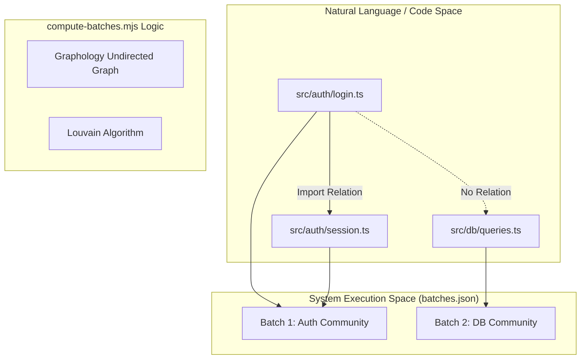
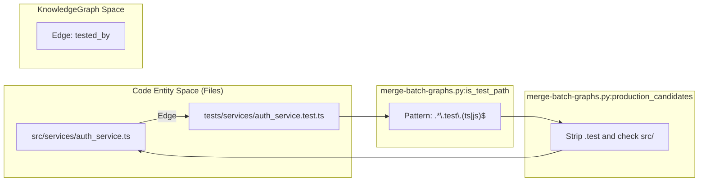

# Skill Integration Tests

관련 소스 파일

이 wiki 페이지를 생성할 때 다음 파일들이 컨텍스트로 사용되었습니다.

- [docs/superpowers/plans/2026-05-24-semantic-batching-and-output-chunking-impl.md](docs/superpowers/plans/2026-05-24-semantic-batching-and-output-chunking-impl.md)
- [docs/superpowers/specs/2026-05-24-semantic-batching-and-output-chunking-design.md](docs/superpowers/specs/2026-05-24-semantic-batching-and-output-chunking-design.md)
- [tests/skill/understand/fixtures/scan-result-3-cliques.json](tests/skill/understand/fixtures/scan-result-3-cliques.json)
- [tests/skill/understand/fixtures/scan-result-large-community.json](tests/skill/understand/fixtures/scan-result-large-community.json)
- [tests/skill/understand/fixtures/scan-result-merge-respects-non-mergeable.json](tests/skill/understand/fixtures/scan-result-merge-respects-non-mergeable.json)
- [tests/skill/understand/fixtures/scan-result-non-code.json](tests/skill/understand/fixtures/scan-result-non-code.json)
- [tests/skill/understand/fixtures/scan-result-singletons.json](tests/skill/understand/fixtures/scan-result-singletons.json)
- [tests/skill/understand/test_compute_batches.test.mjs](tests/skill/understand/test_compute_batches.test.mjs)
- [tests/skill/understand/test_merge_batch_graphs.py](tests/skill/understand/test_merge_batch_graphs.py)
- [tests/skill/understand/test_scan_project.test.mjs](tests/skill/understand/test_scan_project.test.mjs)

이 페이지는 analysis pipeline의 Phase 0부터 Phase 2.5까지 사용되는 core skill script의 integration test suite를 문서화합니다. 이 test들은 system의 deterministic component인 file discovery, semantic batching, import mapping, graph merging이 다양한 project topology와 language 전반에서 올바르게 동작하는지 보장합니다.

## Integration Testing Strategy 개요

integration test는 `understand-anything-plugin/skills/understand/`에 위치한 standalone script를 대상으로 합니다. 이 script들은 일반적으로 plugin host(예: Claude Code, Cursor)를 통해 `/understand` slash command가 호출합니다.

| Test File | Target Script | Primary Responsibility |
| :--- | :--- | :--- |
| `test_scan_project.test.mjs` | `scan-project.mjs` | file enumeration, language detection, ignore filtering을 검증합니다. |
| `test_compute_batches.test.mjs` | `compute-batches.mjs` | Louvain community detection과 non-code file grouping을 검증합니다. |
| `test_extract_import_map.test.mjs` | `extract-import-map.mjs` | Tree-Sitter를 사용한 cross-file dependency resolution을 검증합니다. |
| `test_merge_batch_graphs.py` | `merge-batch-graphs.py` | ID canonicalization과 deterministic `tested_by` linking을 검증합니다. |

출처: [docs/superpowers/plans/2026-05-24-semantic-batching-and-output-chunking-impl.md:9-11](), [understand-anything-plugin/package.json:54-57]()

---

## 1. Project Scanner Tests (`test_scan_project.test.mjs`)

`scan-project.mjs` script는 Phase 0(Discovery)을 담당합니다. test는 scanner가 file language를 올바르게 식별하고 `.understandignore` 또는 `.gitignore` rule을 존중하는지 검증합니다.

### 구현 세부사항
test suite는 각 test case마다 isolated project tree를 만들기 위해 `mkdtempSync`를 사용합니다 [tests/skill/understand/test_scan_project.test.mjs:28-45](). 두 가지 discovery path를 exercise합니다.
1. **Git Path:** initialized repository에서 high-performance enumeration을 위해 `git ls-files`를 사용합니다 [tests/skill/understand/test_scan_project.test.mjs:35-43]().
2. **Walker Path:** non-git environment를 위한 recursive directory walker fallback입니다.

### 주요 Assertions
* **Language Mapping:** `.tsx` 같은 extension은 `typescript`, `.py`는 `python`, `.rs`는 `rust`로 mapping되는지 보장합니다 [tests/skill/understand/test_scan_project.test.mjs:107-162]().
* **Ignore Logic:** ignore pattern에 나열된 file이 `scan-result.json` output에서 제외되는지 검증합니다 [tests/skill/understand/test_scan_project.test.mjs:203-210]().

출처: [tests/skill/understand/test_scan_project.test.mjs:16-20](), [tests/skill/understand/test_scan_project.test.mjs:63-77]()

---

## 2. Semantic Batching Tests (`test_compute_batches.test.mjs`)

Phase 1.5는 단순 count 기반 batching을 **Louvain Community Detection**으로 대체하는 `compute-batches.mjs`를 도입합니다. 이를 통해 logical coupling이 높은 file(예: `auth/login.ts`와 `auth/session.ts`)이 같은 LLM context에서 분석되도록 보장합니다.

### Data Flow: Scan에서 Batches로
아래 diagram은 test suite가 "Code Entity Space"(imports)에서 "System Execution Space"(batches)로의 전환을 어떻게 검증하는지 보여줍니다.

**Bridge: Import Topology to Batch Assignment**

출처: [docs/superpowers/specs/2026-05-24-semantic-batching-and-output-chunking-design.md:94-105](), [tests/skill/understand/test_compute_batches.test.mjs:44-62]()

### Size Enforcement 및 Fallbacks
test는 large community(35-file cap 초과)가 LLM output overflow를 방지하기 위해 split되는지 검증합니다 [tests/skill/understand/test_compute_batches.test.mjs:94-108](). Louvain algorithm이 실패하면 pipeline continuity를 보장하기 위해 script가 alphabetical chunking으로 fallback해야 합니다 [docs/superpowers/specs/2026-05-24-semantic-batching-and-output-chunking-design.md:144-148]().

---

## 3. Import Extraction Tests (`test_extract_import_map.test.mjs`)

이 suite는 `@understand-anything/core`의 `TreeSitterPlugin`을 사용해 project-wide dependency graph를 build하는 `extract-import-map.mjs` script를 검증합니다.

### 테스트되는 주요 기능
* **Cross-Language Resolution:** TS의 `import`, JS의 `require`, Rust의 `use`, Python의 `import/from` 처리.
* **Alias Resolution:** `tsconfig.json` 또는 `package.json` path를 사용하여 `import { x } from '@/utils'`를 올바르게 resolve합니다.
* **Symbol Exports:** script가 `neighborMap`을 위해 top-level exported function과 class를 추출하는지 검증합니다 [docs/superpowers/specs/2026-05-24-semantic-batching-and-output-chunking-design.md:122-127]().

출처: [docs/superpowers/specs/2026-05-24-semantic-batching-and-output-chunking-design.md:83-85](), [tests/skill/understand/test_compute_batches.test.mjs:118-153]()

---

## 4. Graph Merger Tests (`test_merge_batch_graphs.py`)

`merge-batch-graphs.py` script는 여러 `file-analyzer` subagent의 JSON output을 단일 `KnowledgeGraph`로 aggregate하는 Python 기반 utility입니다.

### Deterministic Linker: `tested_by`
이 test suite에서 가장 중요한 부분은 `IsTestPathTests`와 `ProductionCandidatesTests` class입니다. 이들은 production code를 해당 test file과 link하는 데 사용되는 heuristic을 검증합니다.

**Bridge: File Naming to Semantic Relationship**

출처: [tests/skill/understand/test_merge_batch_graphs.py:65-148](), [tests/skill/understand/test_merge_batch_graphs.py:151-190]()

### Test Scenarios
| Scenario | Logic Validated |
| :--- | :--- |
| **JS/TS Siblings** | `X.ts`를 `X.test.ts`에 link합니다 [tests/skill/understand/test_merge_batch_graphs.py:68-84](). |
| **Python Prefixes** | `app/logic.py`를 `tests/test_logic.py`에 link합니다 [tests/skill/understand/test_merge_batch_graphs.py:99-101](). |
| **Go Suffixes** | `util.go`를 `util_test.go`에 link합니다 [tests/skill/understand/test_merge_batch_graphs.py:94-96](). |
| **Java/Maven** | `src/main/.../Bar.java`를 `src/test/.../BarTest.java`에 link합니다 [tests/skill/understand/test_merge_batch_graphs.py:103-107](). |

출처: [tests/skill/understand/test_merge_batch_graphs.py:43-45](), [tests/skill/understand/test_merge_batch_graphs.py:154-189]()

---

## 5. Fixture JSON Files

integration test는 전체 file system 없이 다양한 repository structure를 simulate하는 synthetic `scan-result-*.json` fixture로 구동됩니다.

* **`scan-result-3-cliques.json`**: Louvain detection이 세 개의 disjoint cluster(Auth, API, DB)를 식별하는지 test합니다 [tests/skill/understand/fixtures/scan-result-3-cliques.json:1-31]().
* **`scan-result-large-community.json`**: community splitting logic을 test하는 데 사용되는 40-node complete graph입니다 [tests/skill/understand/fixtures/scan-result-large-community.json:1-253]().
* **`scan-result-non-code.json`**: Dockerfile, CI workflow, SQL migration이 specialized batch로 grouping되는지 검증합니다 [tests/skill/understand/fixtures/scan-result-non-code.json:1-38]().
* **`scan-result-merge-respects-non-mergeable.json`**: infrastructure file(Dockerfile 등)이 generic "misc" batch로 pooled되지 않도록 보장하는 regression test입니다 [tests/skill/understand/fixtures/scan-result-merge-respects-non-mergeable.json:1-233]().

출처: [docs/superpowers/plans/2026-05-24-semantic-batching-and-output-chunking-impl.md:22-26](), [tests/skill/understand/test_compute_batches.test.mjs:189-195]()
