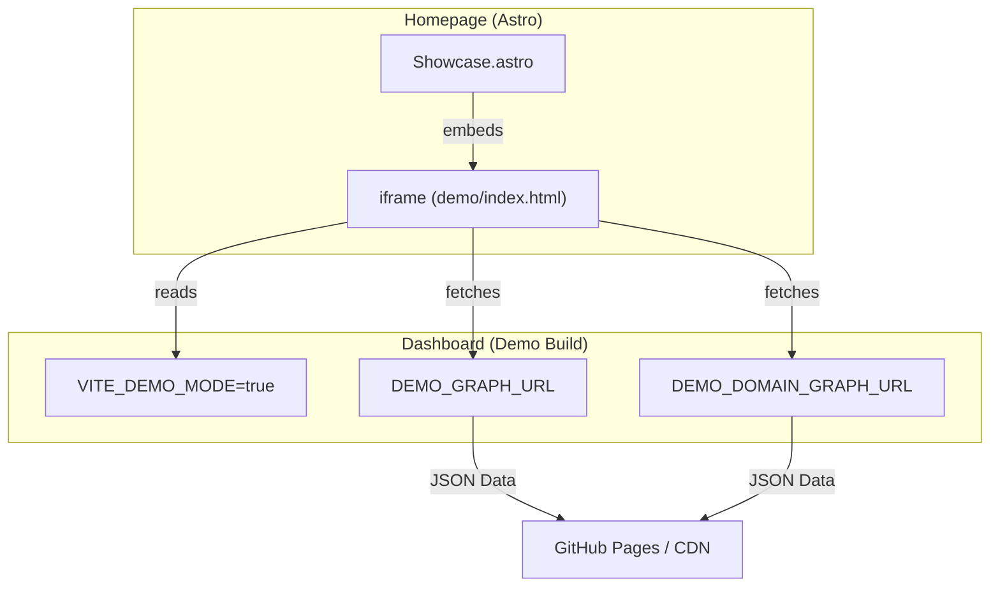
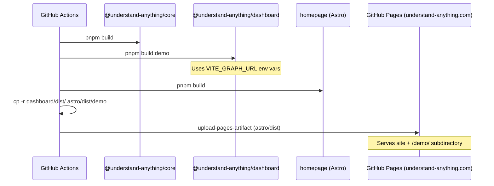

# Homepage 및 Marketing Site

관련 소스 파일

이 wiki 페이지를 생성할 때 다음 파일들이 컨텍스트로 사용되었습니다.

- [.github/workflows/deploy-homepage.yml](.github/workflows/deploy-homepage.yml)
- [CONTRIBUTING.md](CONTRIBUTING.md)
- [READMEs/README.ru-RU.md](READMEs/README.ru-RU.md)
- [homepage/.gitignore](homepage/.gitignore)
- [homepage/.vscode/extensions.json](homepage/.vscode/extensions.json)
- [homepage/.vscode/launch.json](homepage/.vscode/launch.json)
- [homepage/README.md](homepage/README.md)
- [homepage/astro.config.mjs](homepage/astro.config.mjs)
- [homepage/public/.gitkeep](homepage/public/.gitkeep)
- [homepage/public/CNAME](homepage/public/CNAME)
- [homepage/public/images/overview-domain.gif](homepage/public/images/overview-domain.gif)
- [homepage/public/images/overview-structural.gif](homepage/public/images/overview-structural.gif)
- [homepage/src/components/CommunityVideo.astro](homepage/src/components/CommunityVideo.astro)
- [homepage/src/components/Features.astro](homepage/src/components/Features.astro)
- [homepage/src/components/Footer.astro](homepage/src/components/Footer.astro)
- [homepage/src/components/Hero.astro](homepage/src/components/Hero.astro)
- [homepage/src/components/Install.astro](homepage/src/components/Install.astro)
- [homepage/src/components/Nav.astro](homepage/src/components/Nav.astro)
- [homepage/src/components/Problem.astro](homepage/src/components/Problem.astro)
- [homepage/src/components/Showcase.astro](homepage/src/components/Showcase.astro)
- [homepage/src/layouts/Layout.astro](homepage/src/layouts/Layout.astro)
- [homepage/src/pages/index.astro](homepage/src/pages/index.astro)
- [homepage/src/styles/global.css](homepage/src/styles/global.css)
- [understand-anything-plugin/packages/dashboard/vite.config.demo.ts](understand-anything-plugin/packages/dashboard/vite.config.demo.ts)

**Understand Anything** marketing site와 homepage는 **Astro** framework로 구축되며 `homepage/` 디렉터리에 위치합니다. 이 site는 사용자를 위한 primary entry point로서 system capability의 overview, live interactive demo, installation instruction을 제공합니다.

## 1. Architecture 및 Component Structure

homepage는 Astro로 생성되는 static site이며, marketing landing page의 여러 section을 관리하기 위해 component-based architecture를 사용합니다.

### 1.1 Page Layout
main entry point는 `homepage/src/pages/index.astro`이며, 여러 specialized component를 조합하여 page를 구성합니다. 또한 `reveal` class를 가진 element에 `visible` class를 추가함으로써 "scroll-reveal" animation을 trigger하는 global `IntersectionObserver`를 구현합니다 [homepage/src/pages/index.astro:13-38]().

### 1.2 Core Components

| Component | Purpose | Key Logic/Data |
| :--- | :--- | :--- |
| `Hero.astro` | page 상단의 impact, badge, CTA입니다. | GitHub, Discord, Substack link를 포함합니다 [homepage/src/components/Hero.astro:2-35](). |
| `Showcase.astro` | interactive demo embedding입니다. | `iframe`을 통해 "demo mode"로 dashboard를 embed합니다 [homepage/src/components/Showcase.astro:25-33](). |
| `Features.astro` | value proposition grid입니다. | `features` array를 iterate하여 card를 render합니다 [homepage/src/components/Features.astro:2-47](). |
| `Install.astro` | quick-start command입니다. | installation command를 위한 clipboard copy script를 포함합니다 [homepage/src/components/Install.astro:24-37](). |
| `CommunityVideo.astro` | social proof / walkthrough입니다. | YouTube video walkthrough를 embed합니다 [homepage/src/components/CommunityVideo.astro:2-34](). |
| `Footer.astro` | navigation 및 legal link입니다. | license, contact, social에 대한 standard link입니다 [homepage/src/components/Footer.astro:10-21](). |

### 1.3 Global Styling
styling은 `homepage/src/styles/global.css`를 통해 관리됩니다. 이 파일은 self-hosted font(Inter, DM Serif Display, JetBrains Mono)와 site 전반에서 사용되는 primary gradient sweep을 포함해 "Dark Gold" aesthetic을 위한 design token을 정의합니다 [homepage/src/styles/global.css:35-53]().

**출처:**
- [homepage/src/pages/index.astro:1-38]()
- [homepage/src/components/Hero.astro:1-86]()
- [homepage/src/components/Showcase.astro:1-44]()
- [homepage/src/styles/global.css:1-127]()

---

## 2. Live Demo Integration

"Live Demo"는 `@understand-anything/dashboard` package의 specialized build입니다.

### 2.1 Demo Build Configuration
dashboard는 `vite.config.demo.ts`를 사용해 homepage용으로 build됩니다. 이 configuration은 특정 base path를 설정하고 `VITE_DEMO_MODE`를 `true`로 정의합니다 [understand-anything-plugin/packages/dashboard/vite.config.demo.ts:7-19](). 이 mode는 local file system API call을 disable하고, 대신 GitHub Pages에 host된 static JSON file에 의존합니다.

### 2.2 Demo Data Flow
demo dashboard는 development 중 사용하는 local Vite middleware가 아니라 environment-defined URL에서 Knowledge Graph data를 가져옵니다.

**출처:**
- [understand-anything-plugin/packages/dashboard/vite.config.demo.ts:1-49]()
- [homepage/src/components/Showcase.astro:2-33]()
- [.github/workflows/deploy-homepage.yml:46-52]()

---

## 3. Deployment Pipeline

site는 `deploy-homepage.yml` workflow를 통해 GitHub Pages로 자동 deploy됩니다.

### 3.1 Build 및 Merge Strategy
deployment process는 단일 distribution directory로 merge되는 세 가지 distinct build step으로 구성됩니다.
1.  **Core Build**: dependency로 `@understand-anything/core`를 build합니다 [ .github/workflows/deploy-homepage.yml:43-44]().
2.  **Dashboard Build**: interactive visualization을 생성하기 위해 `build:demo` command를 실행합니다 [ .github/workflows/deploy-homepage.yml:46-47]().
3.  **Homepage Build**: Astro site를 build합니다 [ .github/workflows/deploy-homepage.yml:39-41]().
4.  **Merge**: dashboard의 `dist` folder를 `homepage/dist/demo`으로 copy하여 root domain 기준 `/demo/`에서 demo에 접근할 수 있게 합니다 [ .github/workflows/deploy-homepage.yml:53-54]().

### 3.2 Deployment Diagram
다음 diagram은 CI/CD pipeline을 resulting URL structure에 mapping합니다.

**출처:**
- [.github/workflows/deploy-homepage.yml:23-69]()
- [understand-anything-plugin/packages/dashboard/vite.config.demo.ts:7-7]()

---

## 4. Configuration 및 SEO

*   **CNAME**: `homepage/public/CNAME` file은 custom domain `understand-anything.com`을 설정합니다.
*   **Astro Config**: `homepage/astro.config.mjs`는 site의 integration 및 output setting을 정의합니다.
*   **Internationalization**: homepage는 주로 English이지만, `READMEs/`의 README(예: `README.ru-RU.md`)는 homepage의 value proposition을 반영하는 translated marketing copy를 제공합니다 [READMEs/README.ru-RU.md:42-98]().

**출처:**
- [homepage/public/CNAME:1-1]()
- [READMEs/README.ru-RU.md:1-100]()
