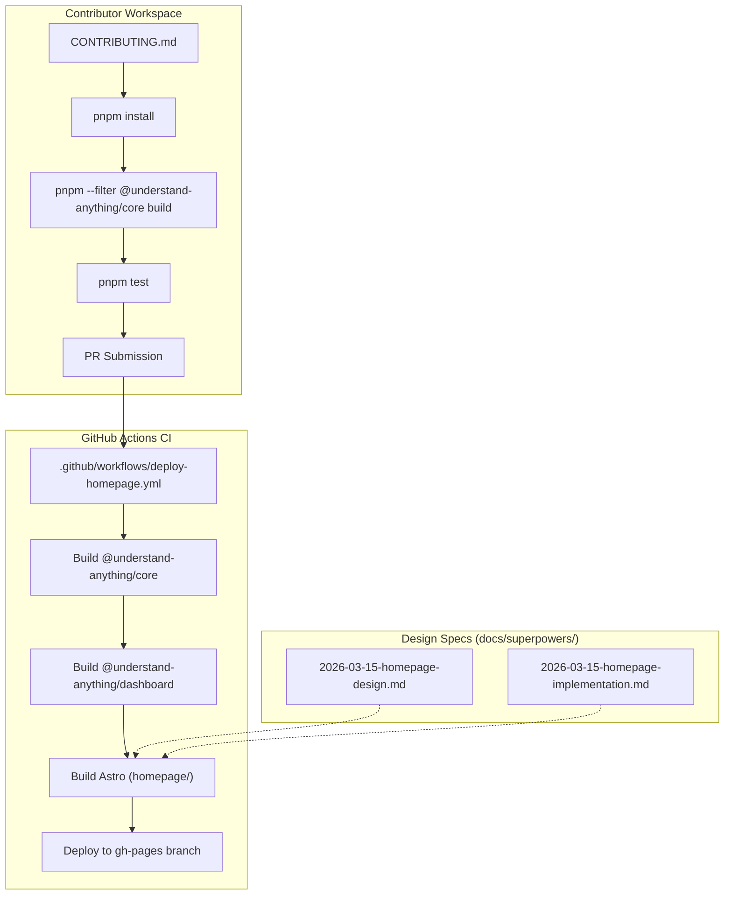

# Contributing 및 Community

<details>
<summary>관련 소스 파일</summary>

이 wiki 페이지를 생성할 때 다음 파일들이 컨텍스트로 사용되었습니다.

- [.github/FUNDING.yml](.github/FUNDING.yml)
- [.github/ISSUE_TEMPLATE/bug_report.yml](.github/ISSUE_TEMPLATE/bug_report.yml)
- [.github/ISSUE_TEMPLATE/config.yml](.github/ISSUE_TEMPLATE/config.yml)
- [.github/ISSUE_TEMPLATE/feature_request.yml](.github/ISSUE_TEMPLATE/feature_request.yml)
- [.github/ISSUE_TEMPLATE/question.yml](.github/ISSUE_TEMPLATE/question.yml)
- [.github/PULL_REQUEST_TEMPLATE.md](.github/PULL_REQUEST_TEMPLATE.md)
- [.github/workflows/deploy-homepage.yml](.github/workflows/deploy-homepage.yml)
- [CODE_OF_CONDUCT.md](CODE_OF_CONDUCT.md)
- [CONTRIBUTING.md](CONTRIBUTING.md)
- [SECURITY.md](SECURITY.md)
- [docs/superpowers/plans/2026-03-14-phase1-implementation.md](docs/superpowers/plans/2026-03-14-phase1-implementation.md)
- [docs/superpowers/plans/2026-03-14-phase2-implementation.md](docs/superpowers/plans/2026-03-14-phase2-implementation.md)
- [docs/superpowers/plans/2026-03-14-phase3-implementation.md](docs/superpowers/plans/2026-03-14-phase3-implementation.md)
- [docs/superpowers/plans/2026-03-14-phase4-implementation.md](docs/superpowers/plans/2026-03-14-phase4-implementation.md)
- [docs/superpowers/plans/2026-03-15-homepage-implementation.md](docs/superpowers/plans/2026-03-15-homepage-implementation.md)
- [docs/superpowers/plans/2026-03-18-multi-platform-simple-implementation.md](docs/superpowers/plans/2026-03-18-multi-platform-simple-implementation.md)
- [docs/superpowers/plans/2026-03-21-language-agnostic-plan.md](docs/superpowers/plans/2026-03-21-language-agnostic-plan.md)
- [docs/superpowers/plans/2026-03-25-dashboard-robustness-impl.md](docs/superpowers/plans/2026-03-25-dashboard-robustness-impl.md)
- [docs/superpowers/plans/2026-03-25-dashboard-robustness-plan.md](docs/superpowers/plans/2026-03-25-dashboard-robustness-plan.md)
- [docs/superpowers/plans/2026-03-26-theme-system-implementation.md](docs/superpowers/plans/2026-03-26-theme-system-implementation.md)
- [docs/superpowers/plans/2026-03-27-token-reduction-impl.md](docs/superpowers/plans/2026-03-27-token-reduction-impl.md)
- [docs/superpowers/specs/2026-03-15-homepage-design.md](docs/superpowers/specs/2026-03-15-homepage-design.md)
- [homepage/public/images/overview-domain.gif](homepage/public/images/overview-domain.gif)
- [homepage/public/images/overview-structural.gif](homepage/public/images/overview-structural.gif)

</details>


이 페이지는 Understand Anything 프로젝트의 contribution workflow, community standard, historical design documentation을 설명합니다. local-only static analysis tool인 이 프로젝트는 Claude Code와 Cursor 같은 여러 platform에서 기능을 유지하기 위해 multi-agent pipeline과 shared core library에 의존합니다.

## Contribution Workflow

프로젝트는 monorepo 관리를 위해 `pnpm` workspace를 사용하는 표준 GitHub 기반 workflow를 따릅니다 [CONTRIBUTING.md:18-19]().

### Getting Started
기여하려면 개발자는 Node.js >= 22와 pnpm >= 10이 설치되어 있어야 합니다 [CONTRIBUTING.md:17-18](). 초기 setup에는 repository를 clone하고 test 실행 전에 core analysis engine을 build하는 과정이 포함됩니다 [CONTRIBUTING.md:25-43]().

```bash
# Core build requirement for all contributions
pnpm install
pnpm --filter @understand-anything/core build
pnpm test
```

### Development Cycle
1.  **Branching**: `feat/`, `fix/`, `docs/`, `refactor/` 같은 prefix를 사용합니다 [CONTRIBUTING.md:56-59]().
2.  **Testing**: 새 functionality에는 `__tests__` directory에 배치된 Vitest suite가 필요합니다 [CONTRIBUTING.md:115-116]().
3.  **Versioning**: user-visible behavior change가 도입되면 project guideline에 따라 5개 manifest 모두에서 version을 bump해야 합니다 [.github/PULL_REQUEST_TEMPLATE.md:21-23]().
4.  **Linting**: project의 strict TypeScript mode와 2-space indentation style을 준수하는지 확인하기 위해 `pnpm lint`를 실행합니다 [CONTRIBUTING.md:76-164]().

### Pull Request (PR) Requirements
PR template은 change summary, related issue link, concrete testing step 설명(예: 특정 large-scale repository에서 graph output 검증)을 요구합니다 [.github/PULL_REQUEST_TEMPLATE.md:1-12]().

**출처:** [CONTRIBUTING.md:1-178](), [.github/PULL_REQUEST_TEMPLATE.md:1-27]()

## Issue Management 및 Community Standards

프로젝트는 communication과 debugging을 간소화하기 위해 structured GitHub Issue Templates를 사용합니다.

### Issue Templates
*   **Bug Reports**: 분석된 project의 primary language, 대략적인 file count, platform(예: Claude Code CLI, Cursor)을 요구합니다 [.github/ISSUE_TEMPLATE/bug_report.yml:42-76]().
*   **Feature Requests**: 단순한 technical implementation보다 "user pain" 또는 workflow gap을 설명하는 데 초점을 둡니다 [.github/ISSUE_TEMPLATE/feature_request.yml:9-14]().
*   **Questions**: open-ended design proposal은 GitHub Discussions로 안내됩니다 [.github/ISSUE_TEMPLATE/config.yml:6-8]().

### Code of Conduct
community는 개인이 아니라 idea에 대한 constructive critique를 강조하는 "Be Respectful" policy를 따릅니다 [CODE_OF_CONDUCT.md:9-11](). 지속적인 disruption 또는 private information 게시 행위는 엄격히 금지됩니다 [CODE_OF_CONDUCT.md:16-17]().

### Security Model
Understand Anything은 **local-only** tool입니다. "phone home"하지 않으며, dashboard의 file-access endpoint는 access token과 graph에서 도출된 path allowlist로 보호됩니다 [SECURITY.md:31-35]().

**출처:** [.github/ISSUE_TEMPLATE/bug_report.yml:1-86](), [CODE_OF_CONDUCT.md:1-34](), [SECURITY.md:1-54]()

## Project Architecture 및 Design Docs

`docs/superpowers/` directory는 과거 architectural decision의 "source of truth" 역할을 하는 design specification과 implementation plan을 포함합니다. 이 문서들은 high-level requirement와 specific code entity 사이의 gap을 연결합니다.

### Homepage 및 Deployment Infrastructure
프로젝트 homepage는 Astro를 사용해 build되며 GitHub Actions를 통해 deploy됩니다. deployment pipeline은 dashboard demo를 homepage output에 merge하기 전에 `@understand-anything/core`와 `@understand-anything/dashboard` package를 build합니다 [.github/workflows/deploy-homepage.yml:43-54]().

**Natural Language to Code Entity Mapping: Homepage Pipeline**

| Concept | Code Entity / File Path | Role |
| :--- | :--- | :--- |
| Build Pipeline | `.github/workflows/deploy-homepage.yml` | multi-package build와 GH Pages deployment를 orchestration합니다 |
| Design Token | `homepage/src/styles/global.css` | dashboard와 일치하는 `--accent`, `--surface`, `--bg`를 정의합니다 [docs/superpowers/specs/2026-03-15-homepage-design.md:62-68]() |
| Layout System | `homepage/src/layouts/Layout.astro` | `IntersectionObserver` logic이 있는 base HTML wrapper입니다 [docs/superpowers/plans/2026-03-15-homepage-implementation.md:218-246]() |
| Static Site Config | `homepage/astro.config.mjs` | GitHub Pages용 `site` 및 `base` URL을 설정합니다 [docs/superpowers/plans/2026-03-15-homepage-implementation.md:41-47]() |

### Implementation Reference Diagram
다음 diagram은 contribution guideline과 design spec이 physical repository structure 및 CI/CD flow로 어떻게 변환되는지 보여줍니다.

**Contribution and Deployment Flow**


**출처:** [.github/workflows/deploy-homepage.yml:1-69](), [docs/superpowers/specs/2026-03-15-homepage-design.md:1-84](), [docs/superpowers/plans/2026-03-15-homepage-implementation.md:1-250]()

## Funding 및 Recognition
프로젝트는 `Lum1104`가 유지관리하며 Patreon을 통해 funding을 받습니다 [.github/FUNDING.yml:1](). contributor는 GitHub contributors list와 project documentation에서 인정됩니다 [CONTRIBUTING.md:267-268]().

**출처:** [.github/FUNDING.yml:1-2](), [CONTRIBUTING.md:265-269]()
