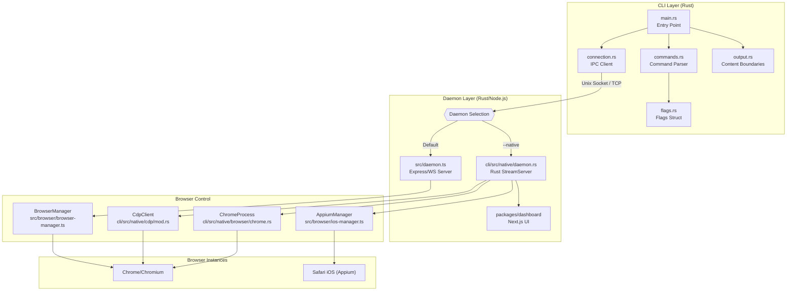
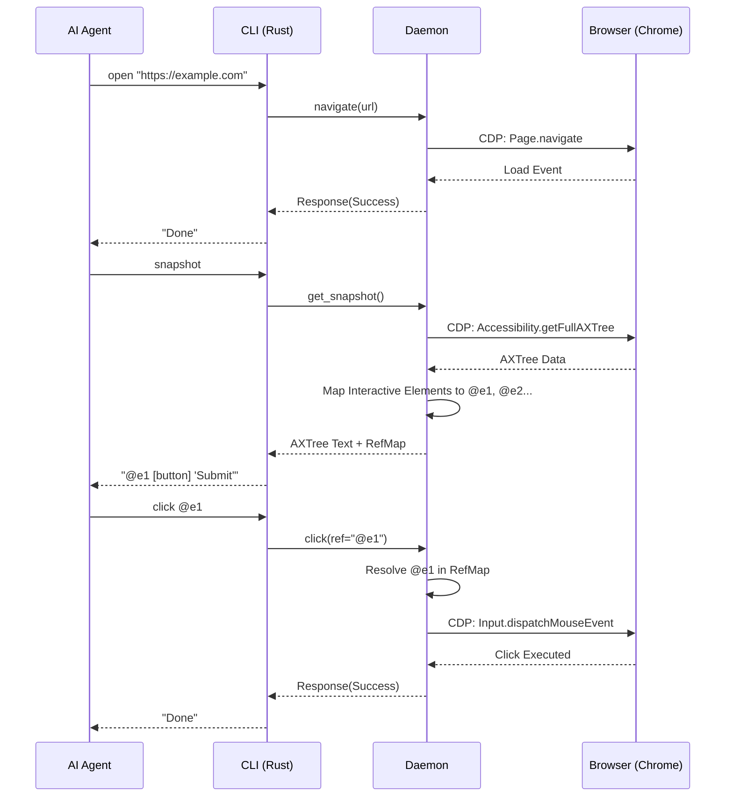

# 개요

관련 소스 파일

다음 파일들이 이 위키 페이지를 생성하기 위한 컨텍스트로 사용되었습니다.

- [CHANGELOG.md](CHANGELOG.md)
- [README.md](README.md)
- [cli/Cargo.lock](cli/Cargo.lock)
- [cli/Cargo.toml](cli/Cargo.toml)
- [cli/src/output.rs](cli/src/output.rs)
- [package.json](package.json)

## 목적과 범위

`agent-browser`는 AI 에이전트를 위해 특별히 설계된 고성능 브라우저 자동화 CLI입니다. 기존 CSS selector의 취약성을 제거하는 결정적 ref 기반 상호작용 모델을 제공하므로, LLM 기반 웹 탐색, 데이터 추출, 자동화 테스트에 적합합니다. [package.json:2-4](), [README.md:3-4]()

이 도구는 여러 CLI 호출에 걸쳐 브라우저 상태를 유지하는 **영구 백그라운드 daemon**을 제공하여, 고수준 AI 추론과 저수준 브라우저 제어 사이의 간극을 연결합니다. 이 아키텍처는 매 명령마다 브라우저 시작과 context 초기화에 드는 오버헤드를 제거해 지연 시간을 크게 줄입니다. [CHANGELOG.md:15-16](), [README.md:77]()

---

## agent-browser란 무엇인가?

`agent-browser`는 페이지를 동적으로 "보고" 그 위에서 "행동"해야 하는 에이전트에 최적화되어 있습니다. 인간 개발자를 위해 만들어진 일반 자동화 도구와 달리, 시각적 좌표나 복잡한 DOM selector보다 accessibility tree와 안정적인 reference를 우선합니다. [README.md:85](), [README.md:138]()

**핵심 설계 원칙:**

| 원칙                | 구현                                                                                                                                   |
| ----------------- | ------------------------------------------------------------------------------------------------------------------------------------ |
| **AI-First**      | `snapshot` 명령은 안정적인 element reference(`@e1`, `@e2`)가 포함된 accessibility tree를 생성합니다. [README.md:85](), [README.md:138]()              |
| **Deterministic** | 상호작용은 이러한 `@refs`를 사용하며, 이는 마지막 snapshot 중 생성된 내부 `RefMap`에 직접 매핑됩니다. [README.md:86-88](), [CHANGELOG.md:9]()                        |
| **Performance**   | **네이티브 Rust CLI**가 영구 백그라운드 daemon에 연결합니다. warm command latency는 약 1ms로 최적화되어 있습니다. [README.md:3-4](), [CHANGELOG.md:15-16]()        |
| **Safety**        | 내장 domain allowlist, action policy, CSPRNG 기반 content boundary가 악성 페이지 콘텐츠로부터 보호합니다. [cli/src/output.rs:8-17](), [CHANGELOG.md:45]() |

**출처:** [README.md:1-5](), [package.json:4](), [cli/src/output.rs:8-17](), [CHANGELOG.md:15-16]()

---

## 시스템 아키텍처

이 시스템은 client-daemon-browser 아키텍처를 사용합니다. CLI는 경량 frontend 역할을 하고, daemon은 브라우저 lifecycle을 관리하며 상태(cookies, tabs)를 유지하고 element reference mapping을 처리합니다. [CHANGELOG.md:69](), [CHANGELOG.md:76-77]()

### 코드 엔티티 공간 매핑

다음 다이어그램은 고수준 시스템 component를 코드베이스 내의 구체적인 구현 파일과 module에 매핑합니다.

**핵심 구성 요소:**

| 구성 요소 | 책임 |
|-----------|----------------|
| **Rust CLI** | 모든 사용자 명령의 entry point로, parsing과 output formatting을 처리합니다. [cli/Cargo.toml:2-5]() |
| **Command Parser** | CLI 문자열을 구조화된 command variant로 매핑합니다. [README.md:108-148]() |
| **IPC Client** | `UnixStream` 또는 `TcpStream`을 통해 daemon과의 연결을 관리합니다. [cli/src/output.rs:4]() |
| **Content Boundaries**| 안전한 출력을 위해 `BOUNDARY_NONCE`와 `truncate_if_needed`를 구현합니다. [cli/src/output.rs:11-17]() |
| **ChromeProcess** | OS 수준 브라우저 process lifecycle과 discovery를 관리합니다. [README.md:77]() |
| **CdpClient** | 직접적인 브라우저 제어를 위한 저수준 Chrome DevTools Protocol 구현입니다. [README.md:159]() |

**출처:** [cli/src/output.rs:1-60](), [README.md:77-80](), [cli/Cargo.toml:1-40]()

---

## 명령 실행 흐름

에이전트가 명령(예: `agent-browser click @e1`)을 실행하면, terminal input에서 브라우저 실행까지 검증된 경로를 따릅니다.

```mermaid
graph LR
    subgraph "CLI Process (Rust)"
        ARGS["Argv Strings"]
        PARSE["commands::parse"]
        MERGE["flags::merge_config"]
        SEND["connection::send_command"]
    end
    
    subgraph "Daemon Process"
        RECV["Socket Listener"]
        VALIDATE["serde / protocol.ts<br/>Schema Validation"]
        ACTION["actions.ts / interaction.rs<br/>execute_command"]
        POLICY["policy.ts / policy.rs<br/>Security Check"]
    end
    
    subgraph "Browser Execution"
        EXEC["BrowserManager / CdpClient"]
        REFS["RefMap Resolution"]
    end
    
    ARGS --> PARSE
    PARSE --> MERGE
    MERGE --> SEND
    
    SEND -->|"JSON over IPC"| RECV
    RECV --> VALIDATE
    VALIDATE --> POLICY
    POLICY --> ACTION
    
    ACTION --> EXEC
    EXEC --> REFS
```

**실행 단계:**
1. **Parsing**: 인수가 구조화된 command object로 parsing됩니다. [README.md:112-148]()
2. **Merging**: 환경 변수, CLI flag, config file(`agent-browser.json`)이 최종 `OutputOptions` 또는 `Flags`로 병합됩니다. [cli/src/output.rs:27-33]()
3. **Validation**: daemon은 들어오는 JSON request를 예상되는 `Request` 및 `Response` struct에 맞춰 검증합니다. [cli/src/output.rs:4]()
4. **Policy Enforcement**: 실행 전에 daemon은 action이 허용되는지 확인합니다(예: domain allowlist). [CHANGELOG.md:45-46]()
5. **Ref Resolution**: `@e1` 같은 ref가 사용되면, daemon은 마지막 `snapshot` 중 생성된 `RefMap`에서 실제 element internal ID를 조회합니다. [README.md:85-86]()

**출처:** [cli/src/output.rs:26-34](), [README.md:81-91](), [CHANGELOG.md:8-11]()

---

## 주요 기능

### 1. Snapshot-Ref Workflow
AI를 위한 기본 상호작용 방식입니다. 에이전트는 취약한 CSS selector 대신 `snapshot`을 사용해 상호작용 가능한 요소에 임시 ID(예: `@e1`)가 할당된 accessibility tree를 얻습니다. [README.md:85](), [README.md:138]()

### 2. 영구 Daemon과 Sessions
daemon은 브라우저 상태(cookies, tabs, localStorage)가 여러 CLI 호출에 걸쳐 유지되도록 합니다. named session은 격리를 가능하게 하고, `--state` flag로 저장된 profile을 불러올 수 있게 합니다. [CHANGELOG.md:76-77](), [README.md:144-145]()

### 3. 보안과 경계
에이전트가 악성 사이트를 방문할 수 있는 신뢰할 수 없는 환경을 위해 설계되었습니다.
- **Content Boundaries**: CLI output에서 page content를 감싸기 위해 `BOUNDARY_NONCE`(CSPRNG)를 사용하여, prompt injection이 command output의 끝을 위조하지 못하게 합니다. [cli/src/output.rs:8-17]()
- **Output Truncation**: `truncate_if_needed`를 통해 큰 page output을 잘라내어 LLM context overflow를 방지합니다. [cli/src/output.rs:36-59]()
- **Domain Allowlists**: `AGENT_BROWSER_ALLOWED_DOMAINS`를 통해 navigation을 승인된 domain으로 제한합니다. [CHANGELOG.md:46]()

### 4. 고급 Introspection과 Dashboard
- **React Introspection**: 전체 component-tree 가시성을 위해 `react tree` 및 `react inspect <fiberId>` 같은 명령과 함께 일급 React DevTools 통합을 제공합니다. [CHANGELOG.md:42]()
- **Observability Dashboard**: live session viewing과 interactive debugging을 위한 Next.js web UI입니다. [package.json:31](), [CHANGELOG.md:48]()
- **Web Vitals**: `vitals` 명령을 통해 Core Web Vitals(LCP, CLS, TTFB, FCP, INP)를 보고합니다. [CHANGELOG.md:43](), [cli/src/output.rs:161-184]()

---

## 일반적인 상호작용 순서

**출처:** [README.md:83-91](), [cli/src/output.rs:4-6](), [CHANGELOG.md:8-11]()

---

## 기술 스택 요약

| 계층 | 기술 | 핵심 코드 엔티티 |
|-------|------------|-------------------|
| **CLI** | Rust | `main.rs`, `commands.rs`, `flags.rs`, `output.rs` |
| **Daemon** | Rust / Node.js | `daemon.rs` (native), `daemon.ts`, `StreamServer` |
| **Automation** | CDP / Playwright | `CdpClient`, `BrowserManager`, `ChromeProcess` |
| **IPC** | Unix Sockets / TCP | `UnixStream`, `TcpStream`, `Response` [cli/src/output.rs:4]() |
| **Security** | AES-256-GCM / CSPRNG | `aes-gcm`, `BOUNDARY_NONCE` [cli/src/output.rs:6-12]() |
| **UI** | Next.js | `packages/dashboard` [package.json:31]() |

**출처:** [cli/src/output.rs:1-60](), [CHANGELOG.md:42-48](), [package.json:1-32]()
