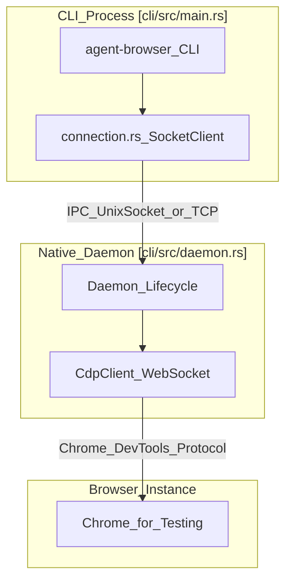
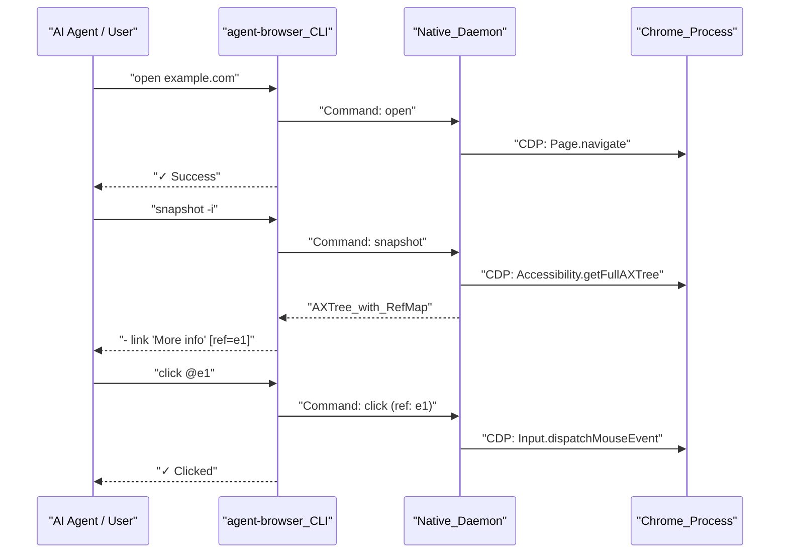

# 시작하기

<details>
<summary>관련 소스 파일</summary>

다음 파일들이 이 위키 페이지를 생성하기 위한 컨텍스트로 사용되었습니다.

- [.gitignore](.gitignore)
- [agent-browser.schema.json](agent-browser.schema.json)
- [bin/agent-browser.js](bin/agent-browser.js)
- [cli/src/install.rs](cli/src/install.rs)
- [cli/src/upgrade.rs](cli/src/upgrade.rs)
- [docs/src/app/configuration/page.mdx](docs/src/app/configuration/page.mdx)
- [pnpm-lock.yaml](pnpm-lock.yaml)
- [scripts/postinstall.js](scripts/postinstall.js)

</details>


이 가이드는 `agent-browser`를 설치하고, 아키텍처를 이해하며, 첫 명령을 실행하는 과정을 안내합니다. 핵심 workflow pattern(open → snapshot → interact)과 필요에 맞게 도구를 설정하는 방법을 배우게 됩니다.

플랫폼별 dependency를 포함한 자세한 설치 지침은 [Installation](#2.1)을 참조하세요. 권장 상호작용 pattern의 심층 walkthrough는 [Quick Start](#2.2)를 참조하세요. configuration file 문법과 우선순위 규칙은 [Configuration](#2.3)을 참조하세요.

---

## 설치 개요

`agent-browser`는 네이티브 Rust CLI와 daemon을 포함하는 npm package로 배포됩니다. 이 아키텍처는 최소한의 resource overhead로 최대 성능을 내도록 설계되었습니다 [docs/src/app/page.mdx:1-4]().

**빠른 설치:**

```bash
# Global installation (recommended)
npm install -g agent-browser
agent-browser install  # Downloads Chromium (Chrome for Testing)
```

설치 과정에서는 `postinstall.js` script를 사용해 플랫폼을 감지하고 적절한 native binary(예: `agent-browser-linux-x64`, `agent-browser-darwin-arm64`)를 다운로드합니다 [scripts/postinstall.js:34-39](). 전역 설치의 경우, 오버헤드 없는 실행을 위해 npm의 bin entry를 패치하여 native binary를 직접 호출하게 합니다 [scripts/postinstall.js:7-10](). system Chrome이 이미 있으면 이 도구가 자동으로 감지합니다 [scripts/postinstall.js:192-198]().

| 지표 | Node.js (Legacy) | Rust (Current) | 개선 |
|------|-----------|-----------|-----------|
| Cold start | ~1000ms | ~600ms | 약 1.6배 빠름 |
| Daemon memory | ~140 MB | ~7-8 MB | 약 18배 적음 |
| Install size | ~700 MB | ~7 MB | 100배 작음 |

Chromium 설정과 system dependency를 포함한 전체 설치 지침은 [Installation](#2.1)을 참조하세요.

**출처:** [docs/src/app/installation/page.mdx:1-44](), [scripts/postinstall.js:1-50](), [scripts/postinstall.js:192-198](), [docs/src/app/page.mdx:1-26](), [bin/agent-browser.js:1-15]()

---

## 아키텍처: CLI, Daemon, Browser

`agent-browser`는 client-daemon 아키텍처를 사용합니다. Rust CLI는 direct Chrome DevTools Protocol(CDP)을 통해 브라우저를 관리하는 영구 native Rust daemon과 통신합니다 [docs/src/app/page.mdx:54-61]().

**시스템 구성 요소:**



**프로세스 흐름:**

1. **CLI Execution**: 사용자가 명령을 실행합니다. CLI는 flag를 parsing하고 configuration hierarchy를 사용해 session을 결정합니다 [docs/src/app/configuration/page.mdx:13-21]().
2. **Daemon Connectivity**: CLI는 해당 session의 daemon이 이미 실행 중인지 확인합니다. 실행 중이 아니면 자동으로 spawn됩니다 [docs/src/app/page.mdx:61-61]().
3. **IPC Communication**: 명령은 socket을 통해 JSON 기반 protocol message로 전송됩니다. native path가 직접 호출되지 않은 경우, Node.js wrapper `bin/agent-browser.js`가 inherited stdio로 native binary를 spawn하는 일을 처리합니다 [bin/agent-browser.js:104-108]().
4. **Direct CDP**: daemon은 Chrome DevTools Protocol을 사용해 Chrome과 통신하며, 이를 통해 세밀한 제어와 효율적인 snapshotting이 가능합니다 [docs/src/app/page.mdx:59-59]().

**출처:** [docs/src/app/page.mdx:54-61](), [bin/agent-browser.js:1-121](), [cli/src/install.rs:17-35](), [docs/src/app/configuration/page.mdx:9-21]()

---

## Snapshot-Ref Workflow

이 도구는 **snapshot-ref pattern**을 사용하는 AI 에이전트에 최적화되어 있습니다. 취약한 CSS selector 대신 accessibility tree의 snapshot을 가져오며, 이 snapshot은 상호작용 가능한 요소에 임시 reference(`@e1`, `@e2`)를 할당합니다 [docs/src/app/page.mdx:44-53]().

**핵심 Workflow 다이어그램:**



**왜 Ref인가?**
- **Token Efficiency**: compact text snapshot은 **raw HTML의 수천 token과 비교해 약 200-400 token을 사용**합니다 [docs/src/app/page.mdx:49-49]().
- **Determinism**: AI는 selector를 추측하는 대신 `@e1`을 참조합니다.
- **AI-friendly**: LLM은 text output을 자연스럽게 parsing하므로 DOM tree의 복잡성을 피할 수 있습니다 [docs/src/app/page.mdx:52-52]().

**출처:** [docs/src/app/page.mdx:27-53](), [docs/src/app/installation/page.mdx:168-172]()

---

## 첫 Session

**Step 1: Navigate**
```bash
agent-browser open https://example.com
```
이 명령은 브라우저를 실행하고 navigation합니다. session은 백그라운드에 유지됩니다 [docs/src/app/page.mdx:31-31]().

**Step 2: Snapshot**
```bash
agent-browser snapshot -i
```
`-i`(interactive) flag는 상호작용 가능한 요소만 filtering합니다 [docs/src/app/page.mdx:32-32](). 다음과 같은 output을 보게 됩니다.
`- link "More information..." [ref=e1]`

**Step 3: Interact**
```bash
agent-browser click @e1
```
이전 snapshot의 reference를 지정하려면 `@` prefix를 사용합니다 [docs/src/app/page.mdx:39-39]().

**Step 4: Close**
```bash
agent-browser close
```
현재 session의 브라우저와 daemon을 종료합니다 [docs/src/app/page.mdx:41-41]().

**출처:** [docs/src/app/page.mdx:27-42](), [docs/src/app/installation/page.mdx:168-172]()

---

## Configuration과 Environment

`agent-browser`는 `agent-browser.json`, global config file, 또는 `AGENT_BROWSER_` prefix가 붙은 environment variable에서 configuration을 찾습니다 [docs/src/app/configuration/page.mdx:7-19]().

| 우선순위 | Source | 예시 |
|----------|--------|---------|
| 1 (높음) | CLI Flags | `--headed`, `--session my-task` |
| 2 | Env Vars | `AGENT_BROWSER_SESSION=agent1` |
| 3 | Project Config | `./agent-browser.json` |
| 4 | Global Config | `~/.agent-browser/config.json` |

**일반적인 옵션:**
- `headed`: headless로 실행하는 대신 browser window를 표시합니다 [agent-browser.schema.json:7-10]().
- `sessionName`: 상태 지속성의 이름을 자동으로 save/load합니다 [agent-browser.schema.json:23-26]().
- `executablePath`: custom browser executable의 path입니다 [agent-browser.schema.json:27-30]().
- `allowedDomains`: security allowlisting을 위한 허용 domain pattern입니다 [agent-browser.schema.json:112-118]().

자세한 configuration 규칙과 전체 option 목록은 [Configuration](#2.3)을 참조하세요.

**출처:** [docs/src/app/configuration/page.mdx:7-92](), [agent-browser.schema.json:1-170]()

---

## 다음 단계

1. **[Installation](#2.1)** — Linux, macOS, Windows를 위한 자세한 setup.
2. **[Quick Start](#2.2)** — AI agent workflow와 `SKILL.md` 심층 설명.
3. **[Configuration](#2.3)** — 모든 environment variable과 flag에 대한 reference.

**출처:** [docs/src/app/installation/page.mdx:1-128](), [docs/src/app/configuration/page.mdx:1-180]()
