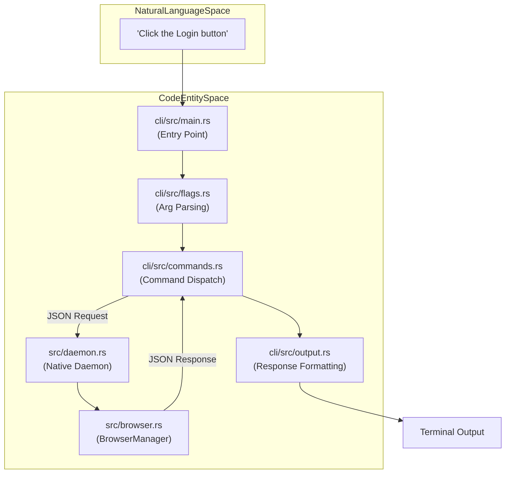
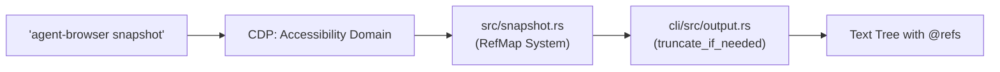

# 빠른 시작

<details>
<summary>관련 소스 파일</summary>

다음 파일들이 이 위키 페이지를 생성하기 위한 컨텍스트로 사용되었습니다.

- [README.md](README.md)
- [cli/src/output.rs](cli/src/output.rs)
- [docs/src/app/commands/page.mdx](docs/src/app/commands/page.mdx)
- [docs/src/app/quick-start/page.mdx](docs/src/app/quick-start/page.mdx)
- [docs/src/app/selectors/page.mdx](docs/src/app/selectors/page.mdx)
- [skills/agent-browser/SKILL.md](skills/agent-browser/SKILL.md)

</details>


이 가이드는 `agent-browser`로 첫 브라우저 자동화 session을 진행하는 과정을 안내합니다. 페이지 열기, element를 발견하기 위한 snapshot 생성, reference(ref)를 사용한 상호작용, 브라우저 종료라는 핵심 workflow를 배우게 됩니다. 이 workflow는 token 사용량을 줄이고 신뢰성을 높이도록 AI 에이전트에 맞게 특별히 최적화되어 있습니다.

**범위**: 이 페이지는 기본 command-line 사용법과 snapshot-interaction pattern의 underlying implementation을 다룹니다.

---

## 사전 준비

`agent-browser`가 설치되어 있고 browser binary가 다운로드되어 있는지 확인하세요. `install` 명령은 호환성을 보장하기 위해 "Chrome for Testing"에서 특정 version의 Chromium을 다운로드합니다.

```bash
npm install -g agent-browser
agent-browser install
```

Linux system에서는 추가 system dependency를 설치해야 할 수 있습니다.
```bash
agent-browser install --with-deps
```

**출처**: [README.md:9-16](), [README.md:57-63](), [README.md:75-77]()

---

## 핵심 Workflow

`agent-browser` workflow는 발견 후 action을 수행하는 pattern을 따릅니다. 기존 selector 기반 자동화와 달리, 먼저 page state를 capture하여 ephemeral reference를 생성한 다음 그 reference를 결정적 상호작용에 사용합니다.

### Workflow Diagram: Natural Language to Code Execution

이 다이어그램은 사용자의 의도와 lifecycle의 각 단계를 처리하는 구체적인 code entity 사이의 간극을 연결합니다.

Title: Intent to Execution Flow


**출처**: [README.md:81-91](), [cli/src/output.rs:133-172]()

---

## Step 1: 페이지 열기

URL로 navigation하여 시작합니다. CLI는 browser lifecycle을 관리하는 background daemon과 통신합니다.

```bash
agent-browser open https://example.com
```

**구현 세부사항**:
`open` 명령(`goto` 또는 `navigate` alias)은 브라우저를 실행하고 navigation을 수행합니다. URL이 제공되지 않으면 `about:blank`에 머무릅니다. debugging을 위해 browser window를 보려면 `--headed` flag를 사용하세요.

**출처**: [README.md:113-114](), [docs/src/app/commands/page.mdx:6-7](), [docs/src/app/quick-start/page.mdx:47-53]()

---

## Step 2: Snapshot 생성

페이지의 interactive element를 capture합니다. 이 작업은 accessibility tree의 compact representation을 생성하고 interactive element에 "ref"(`@e1`, `@e2` 같은)를 할당합니다.

```bash
agent-browser snapshot
```

**출력 예시**:
```text
- heading "Example Domain" [ref=e1] [level=1]
- link "More information..." [ref=e2]
```

`snapshot` 명령은 AI 에이전트가 페이지를 "보는" 기본 도구입니다. 이 명령은 CDP(Chrome DevTools Protocol) Accessibility domain을 통해 accessibility tree를 추출합니다.

### Snapshot Data Flow

Title: Snapshot Generation Pipeline


**핵심 개념**:
- **Ref Assignment**: ref는 매 snapshot마다 새로 할당됩니다. page가 변경되거나 navigation되면 ref는 **stale** 상태가 됩니다. [README.md:93-95]()
- **Output Truncation**: LLM context window를 보호하기 위해 CLI는 `max_output` flag를 기준으로 `truncate_if_needed` [cli/src/output.rs:36-59]()를 통해 큰 output을 잘라냅니다. [cli/src/output.rs:20-33]()
- **Content Boundaries**: 보안을 위해 output을 `BOUNDARY_NONCE`(CSPRNG nonce)로 감싸, 신뢰할 수 없는 page content가 delimiter를 위조하지 못하게 할 수 있습니다. [cli/src/output.rs:6-17](), [cli/src/output.rs:61-75]()

**출처**: [cli/src/output.rs:6-59](), [docs/src/app/quick-start/page.mdx:11-22](), [docs/src/app/selectors/page.mdx:3-21]()

---

## Step 3: Element와 상호작용

snapshot에서 발견한 ref를 사용해 action을 수행합니다. ref는 ephemeral하며 현재 page state에 묶여 있습니다.

```bash
agent-browser click @e2
agent-browser fill @e3 "test@example.com"
```

**이 방식이 CSS selector보다 나은 이유**:
- **Deterministic**: ref는 snapshot 중 발견된 정확한 element를 가리킵니다. [docs/src/app/selectors/page.mdx:25]()
- **AI-friendly**: LLM은 복잡한 CSS path보다 `@eN` ref를 안정적으로 parsing하고 사용할 수 있습니다. [docs/src/app/selectors/page.mdx:27]()
- **Fast**: 비용이 큰 DOM re-query를 피합니다. [docs/src/app/selectors/page.mdx:26]()

**상호작용 유형**:
- `click <sel>`: 표준 click입니다. [README.md:115]()
- `fill <sel> <text>`: input을 지우고 값을 채웁니다. [README.md:119]()
- `type <sel> <text>`: text를 append합니다. [README.md:118]()
- `get text <sel>`: element의 text content를 가져옵니다. [README.md:153]()

**출처**: [README.md:83-88](), [docs/src/app/selectors/page.mdx:23-28]()

---

## Step 4: 브라우저 닫기

resource를 정리하고 background daemon을 종료하려면 `close` 명령을 사용합니다.

```bash
agent-browser close
```

daemon이 관리하는 모든 active session을 종료하려면 `close --all`도 사용할 수 있습니다.

**출처**: [README.md:144-145](), [docs/src/app/commands/page.mdx:37-38]()

---

## Command Chaining과 Persistence

효율성을 위해 `&&`를 사용해 단일 shell invocation에서 여러 명령을 chain할 수 있습니다. daemon은 CLI 호출 사이에 browser state를 유지하므로 session이 지속됩니다.

```bash
# Open, wait for network idle, and snapshot in one call
agent-browser open example.com && agent-browser wait --load networkidle && agent-browser snapshot
```

### 중요: Content 기다리기
AI 에이전트는 page가 준비되기 전에 상호작용하여 실패하는 경우가 많습니다. **navigation 후에는 항상 `wait`를 사용**하세요.
- `wait <selector>`: 특정 element(또는 ref)가 나타날 때까지 기다립니다. [docs/src/app/commands/page.mdx:108]()
- `wait --load networkidle`: network activity가 안정될 때까지 기다립니다. [docs/src/app/commands/page.mdx:112]()
- `wait <ms>`: 특정 duration을 millisecond 단위로 기다립니다. [docs/src/app/commands/page.mdx:109]()

**출처**: [docs/src/app/commands/page.mdx:108-117](), [docs/src/app/quick-start/page.mdx:55-79]()

---

## 빠른 Reference Table

| 작업 | Command | 설명 |
| :--- | :--- | :--- |
| **Navigate** | `open <url>` | 실행 후 URL로 이동 |
| **Snapshot** | `snapshot` | `@refs`가 포함된 accessibility tree 가져오기 |
| **Click** | `click @e1` | reference로 element click |
| **Fill** | `fill @e2 "val"` | input을 지우고 채우기 |
| **Wait** | `wait --load networkidle` | page loading이 끝날 때까지 대기 |
| **Screenshot** | `screenshot img.png` | 현재 viewport capture |
| **Get Info** | `get text @e1` | 특정 ref에서 text 추출 |
| **Close** | `close` | browser session 종료 |

**출처**: [README.md:113-163](), [docs/src/app/commands/page.mdx:1-62]()
