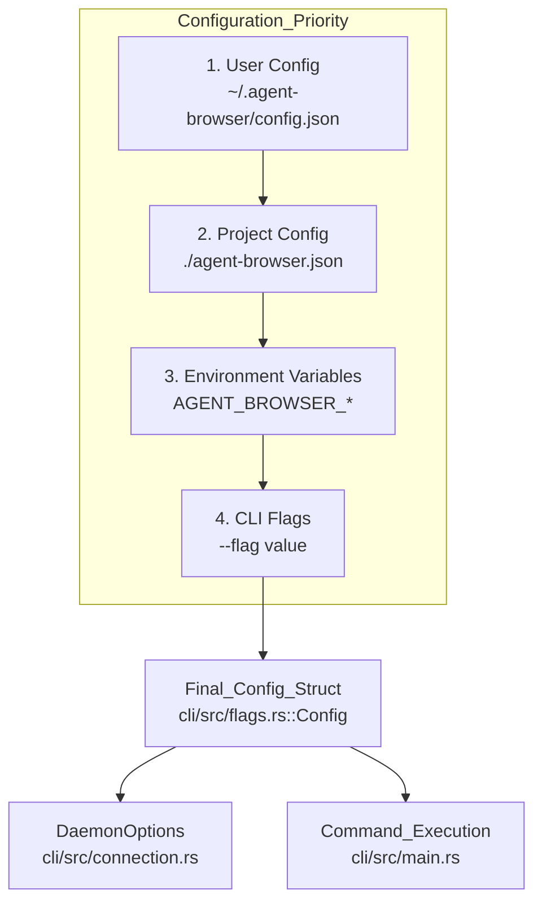
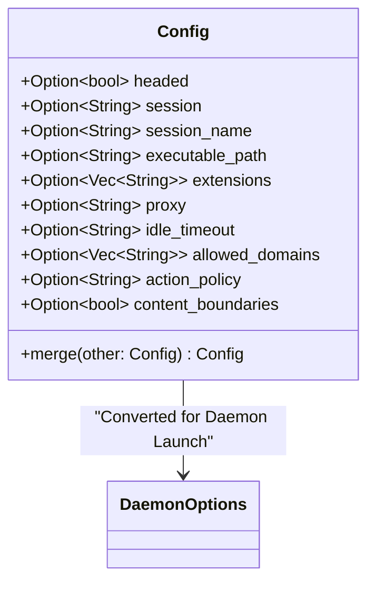
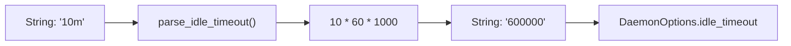
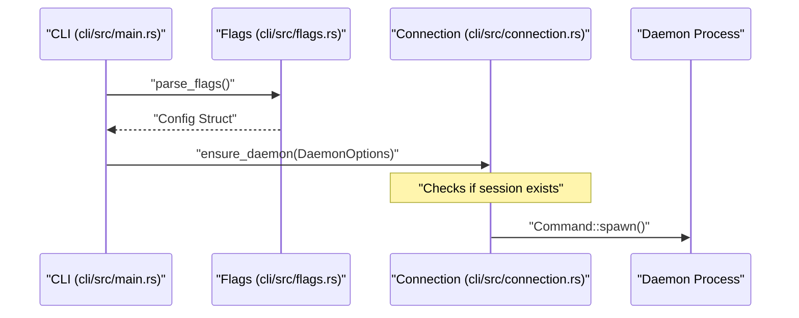

# Configuration

관련 소스 파일

다음 파일들이 이 위키 페이지를 생성하기 위한 컨텍스트로 사용되었습니다.

- [agent-browser.schema.json](agent-browser.schema.json)
- [cli/src/connection.rs](cli/src/connection.rs)
- [cli/src/flags.rs](cli/src/flags.rs)
- [cli/src/main.rs](cli/src/main.rs)
- [docs/public/schema.json](docs/public/schema.json)
- [docs/src/app/configuration/page.mdx](docs/src/app/configuration/page.mdx)

이 페이지는 configuration hierarchy, environment variable, configuration loading pipeline의 기술적 구현을 포함해 `agent-browser`에서 사용하는 configuration system을 문서화합니다.

## Configuration Hierarchy

`agent-browser`는 네 단계 configuration precedence model을 사용합니다. 우선순위가 높은 source의 값은 우선순위가 낮은 source의 값을 override합니다.

Title: Configuration Precedence Flow

**우선순위 규칙:**
1. **User Config**: `~/.agent-browser/config.json`에 위치합니다. `headed: true` 같은 machine-wide default에 유용합니다 [docs/src/app/configuration/page.mdx:14]().
2. **Project Config**: `./agent-browser.json`에 위치합니다. 현재 working directory에 특화됩니다 [docs/src/app/configuration/page.mdx:15]().
3. **Environment Variables**: `AGENT_BROWSER_` prefix가 붙은 variable은 file 기반 configuration을 override합니다 [docs/src/app/configuration/page.mdx:16]().
4. **CLI Flags**: command에 명시적으로 전달된 flag는 항상 가장 높은 우선순위를 가집니다 [docs/src/app/configuration/page.mdx:17]().

**출처:** [docs/src/app/configuration/page.mdx:7-21](), [cli/src/flags.rs:7-9]()

## 기술적 구현

### Data Structures

configuration은 `cli/src/flags.rs`의 `Config` struct를 통해 관리됩니다. 이 struct는 deserialization에 `serde`를 사용하며 layer를 결합하기 위한 `merge` method를 제공합니다.

Title: Config Entity Mapping

**출처:** [cli/src/flags.rs:53-94](), [cli/src/flags.rs:97-157]()

### Loading Pipeline

loading process는 `cli/src/flags.rs`에서 발생하며 다음 단계를 따릅니다.

1. **Path Discovery**: CLI는 명시적인 `--config <path>` flag 또는 `AGENT_BROWSER_CONFIG` environment variable을 확인합니다 [docs/src/app/configuration/page.mdx:23-28]().
2. **File Reading**: `read_config_file`은 `fs::read_to_string`과 `serde_json`을 사용해 JSON content를 `Config` instance로 parse합니다 [cli/src/flags.rs:159-179]().
3. **Merging**: `Config::merge`는 override logic을 구현합니다. 대부분의 field는 "other"(더 높은 우선순위) config로 대체되지만, `extensions`, `init_scripts`, `enable`은 **concatenate**됩니다 [cli/src/flags.rs:105-125]().
4. **Boolean Interpretation**: CLI는 boolean flag를 유연하게 처리합니다. `env_var_is_truthy`는 "0", "false", "no" 또는 빈 문자열을 false로 취급합니다 [cli/src/flags.rs:183-200](). 

**출처:** [cli/src/flags.rs:97-200](), [docs/src/app/configuration/page.mdx:152-157]()

## Configuration Options Reference

모든 CLI flag는 camelCase equivalent를 사용해 config file에 설정할 수 있습니다 [docs/src/app/configuration/page.mdx:53-54]().

| Config Key (JSON)   | CLI Flag               | Type     | 설명                                                                           |
| :------------------ | :--------------------- | :------- | :--------------------------------------------------------------------------- |
| `headed`            | `--headed`             | boolean  | headless로 실행하는 대신 browser window를 표시합니다 [agent-browser.schema.json:7-10]()   |
| `session`           | `--session`            | string   | Session identifier [agent-browser.schema.json:19-22]()                       |
| `sessionName`       | `--session-name`       | string   | 상태 지속성 이름을 자동으로 save/load합니다 [agent-browser.schema.json:23-26]()             |
| `executablePath`    | `--executable-path`    | string   | custom browser binary의 path입니다 [agent-browser.schema.json:27-30]()           |
| `extensions`        | `--extension`          | string[] | extension path 목록입니다 [agent-browser.schema.json:31-37]()                     |
| `proxy`             | `--proxy`              | string   | Proxy server URL [agent-browser.schema.json:46-49]()                         |
| `idleTimeout`       | `--idle-timeout`       | string   | 자동 종료 duration(예: "10s", "1h") [agent-browser.schema.json:152-155]()         |
| `allowedDomains`    | `--allowed-domains`    | string[] | 보안을 위한 domain allowlist [agent-browser.schema.json:112-118]()                |
| `contentBoundaries` | `--content-boundaries` | boolean  | page output을 safety marker로 감쌉니다 [agent-browser.schema.json:103-106]()       |
| `actionPolicy`      | `--action-policy`      | string   | `policy.json`의 path [agent-browser.schema.json:119-122]()                    |
| `model`             | `--model`              | string   | `chat` 명령을 위한 AI model [agent-browser.schema.json:157-159]()                 |
| `engine`            | `--engine`             | string   | Browser engine(`chrome`, `lightpanda`) [agent-browser.schema.json:131-136]() |

**출처:** [agent-browser.schema.json:1-167](), [docs/src/app/configuration/page.mdx:55-101](), [cli/src/flags.rs:55-95]()

## Environment-Specific Variables

여러 variable이 low-level behavior와 directory location을 제어합니다.

### Directory Management
- `AGENT_BROWSER_SOCKET_DIR`: `.sock`, `.pid`, `.version` file의 base directory를 override합니다. 우선순위: `AGENT_BROWSER_SOCKET_DIR` > `XDG_RUNTIME_DIR` > `~/.agent-browser` > `tmpdir` [cli/src/connection.rs:91-115]().

### Security & AI Safety
- `AGENT_BROWSER_ALLOWED_DOMAINS`: 에이전트가 방문할 수 있는 domain의 comma-separated list입니다 [docs/src/app/configuration/page.mdx:88]().
- `AGENT_BROWSER_CONTENT_BOUNDARIES`: 악성 content로부터 보호하기 위해 CSPRNG nonce로 AI output을 감싸는 기능을 활성화합니다 [docs/src/app/configuration/page.mdx:86]().
- `AGENT_BROWSER_ACTION_POLICY`: action policy file의 path입니다 [docs/src/app/configuration/page.mdx:89]().

### Runtime Behavior
- `AGENT_BROWSER_AUTO_CONNECT`: 실행 중인 Chrome instance를 자동으로 discover하고 연결합니다 [docs/src/app/configuration/page.mdx:82]().
- `AGENT_BROWSER_DOWNLOAD_PATH`: browser download의 default directory를 설정합니다 [docs/src/app/configuration/page.mdx:85]().
- `AGENT_BROWSER_COLOR_SCHEME`: preferred color scheme(`dark`, `light`, `no-preference`)을 설정합니다 [docs/src/app/configuration/page.mdx:84]().

**출처:** [cli/src/connection.rs:91-115](), [docs/src/app/configuration/page.mdx:56-101]()

## 구현: `idle_timeout` Parsing

`idle_timeout` configuration은 사람이 읽기 쉬운 문자열을 지원합니다. `cli/src/flags.rs`의 `parse_idle_timeout` function은 이 값을 처리되기 전에 millisecond로 변환합니다 [cli/src/flags.rs:13-36]().

Title: Idle Timeout Transformation

**출처:** [cli/src/flags.rs:13-36]()

## Daemon Forwarding

CLI가 새 daemon을 시작할 때, resolved configuration을 `DaemonOptions` struct로 mapping합니다. 그런 다음 이 option은 적절한 environment와 argument로 daemon process를 spawn하는 데 사용됩니다.

Title: Configuration to Daemon Spawning

**출처:** [cli/src/main.rs:27-31](), [cli/src/connection.rs:27-30]()
