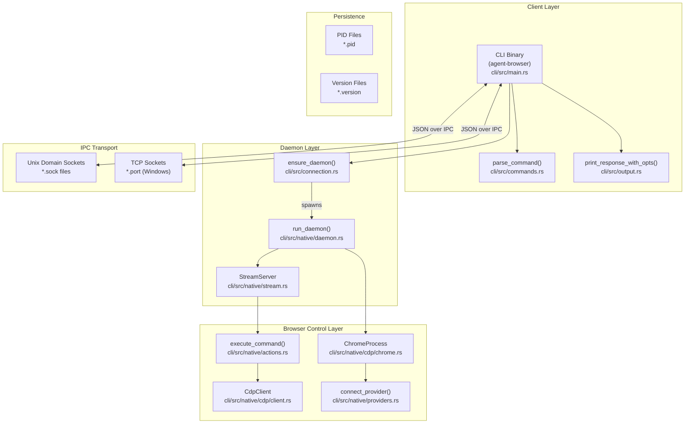
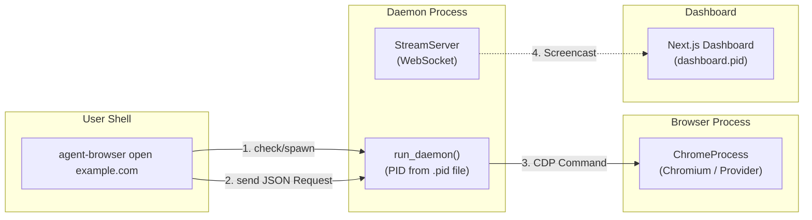

# 아키텍처

관련 소스 파일

다음 파일들이 이 위키 페이지를 생성하기 위한 컨텍스트로 사용되었습니다.

- [cli/src/connection.rs](cli/src/connection.rs)
- [cli/src/flags.rs](cli/src/flags.rs)
- [cli/src/main.rs](cli/src/main.rs)
- [cli/src/native/actions.rs](cli/src/native/actions.rs)
- [cli/src/native/browser.rs](cli/src/native/browser.rs)
- [cli/src/native/cdp/chrome.rs](cli/src/native/cdp/chrome.rs)
- [cli/src/native/cdp/client.rs](cli/src/native/cdp/client.rs)
- [cli/src/native/daemon.rs](cli/src/native/daemon.rs)
- [cli/src/native/e2e_tests.rs](cli/src/native/e2e_tests.rs)
- [cli/src/native/providers.rs](cli/src/native/providers.rs)

이 문서는 multi-layered design, client-daemon model, IPC mechanism, component interaction을 포함해 agent-browser의 전체 시스템 아키텍처를 설명합니다. 특정 아키텍처 구성 요소에 대한 자세한 정보는 다음을 참조하세요.

- [System Overview](#3.1) — 고수준 아키텍처와 data flow.
- [CLI Client (Rust)](#3.2) — command-line interface 구현 세부사항.
- [Daemon Layer](#3.3) — daemon lifecycle과 process management.
- [Browser Control](#3.4) — browser abstraction과 control mechanism.
- [Communication Protocol](#3.5) — JSON 기반 command protocol 명세.

## 설계 철학

Agent-browser는 브라우저 시작 overhead를 최소화하기 위해 **persistent daemon architecture**를 사용합니다. CLI client는 IPC를 통해 장기 실행 daemon process와 통신하는 경량 Rust binary입니다. 이 설계는 다음을 가능하게 합니다.

- **빠른 명령 실행**: 명령 사이에 browser restart가 없습니다(일반적인 latency <100ms).
- **Session isolation**: session name으로 식별되는 별도 daemon instance를 통해 여러 독립 browser session을 제공합니다 [cli/src/main.rs:201-245]().
- **State persistence**: cookie와 storage state를 자동으로 save/restore합니다 [cli/src/flags.rs:127-128]().
- **Resource efficiency**: 여러 CLI invocation이 단일 browser instance를 공유합니다.
- **AI-Native Security**: 악성 page content로부터 LLM을 보호하기 위한 content boundary marker와 output truncation을 제공합니다 [cli/src/flags.rs:82-83]().

이 시스템은 성능을 위해 주로 Rust로 구현되었으며, sidecar process로 실행할 수 있는 observability dashboard를 포함합니다 [cli/src/main.rs:247-252]().

출처: [cli/src/main.rs:1-245](), [cli/src/connection.rs:1-115](), [cli/src/flags.rs:53-95]()

## Component Architecture

시스템은 세 가지 주요 layer로 구성됩니다.

**시스템 Component Diagram**

**핵심 구성 요소:**

| Component | Implementation | Purpose |
|-----------|---------------|---------|
| `agent-browser` CLI | Rust binary ([cli/src/main.rs]()) | entry point, flag와 command parsing, daemon lifecycle 관리. |
| `parse_command()` | Rust ([cli/src/commands.rs:26-26]()) | CLI argument를 JSON protocol action으로 매핑합니다. |
| `ensure_daemon()` | Rust ([cli/src/connection.rs:27-29]()) | session에 대해 기존 daemon을 찾거나 새 daemon을 spawn하는 logic입니다. |
| `run_daemon()` | Rust ([cli/src/native/daemon.rs:19-19]()) | browser를 소유하는 장기 실행 process의 main loop입니다. |
| `ChromeProcess` | Rust ([cli/src/native/cdp/chrome.rs:8-15]()) | Chromium instance의 OS process lifecycle을 관리합니다. |
| `CdpClient` | Rust ([cli/src/native/cdp/client.rs:29-46]()) | browser의 CDP port에 대한 WebSocket connection을 처리합니다. |
| `connect_provider()` | Rust ([cli/src/native/providers.rs:26-26]()) | 원격 browser cloud(Browserbase 등)에 연결합니다. |

출처: [cli/src/main.rs:26-36](), [cli/src/connection.rs:93-124](), [cli/src/native/daemon.rs:19-150](), [cli/src/native/cdp/chrome.rs:8-61](), [cli/src/native/providers.rs:26-73]()

## Process Model

시스템은 여러 CLI call에 걸쳐 browser가 responsive하게 유지되도록 **multi-process architecture**를 사용합니다.

**Process Interaction Diagram**

**Process Lifecycle:**

1. **CLI Invocation**: 사용자가 명령을 실행합니다. CLI는 flag [cli/src/main.rs:31-31]()와 command argument [cli/src/main.rs:26-26]()를 parsing합니다.
2. **Daemon Coordination**: CLI는 `get_pid_path`를 통해 socket directory의 `.pid` file을 확인합니다 [cli/src/connection.rs:122-124](). process가 살아 있지 않으면 [cli/src/connection.rs:157-175]() 새 daemon을 spawn합니다.
3. **Daemon Initialization**: daemon은 sidecar file(`.pid`, `.version`, `.sock`/`.port`)을 생성하고 [cli/src/native/daemon.rs:62-70](), real-time observation을 위한 `StreamServer`를 시작합니다 [cli/src/native/daemon.rs:102-109]().
4. **Browser Launch**: 첫 navigation 또는 명시적 launch 시 daemon은 특정 `LaunchOptions` [cli/src/native/cdp/chrome.rs:90-116]()와 함께 `ChromeProcess` [cli/src/native/cdp/chrome.rs:8-15]() 또는 `LightpandaProcess` [cli/src/native/browser.rs:11-11]()를 spawn합니다.
5. **Cleanup**: 종료 시 daemon은 orphaned process를 방지하기 위해 Chrome process group을 kill합니다 [cli/src/native/cdp/chrome.rs:18-31]().

출처: [cli/src/main.rs:26-32](), [cli/src/connection.rs:122-175](), [cli/src/native/daemon.rs:62-145](), [cli/src/native/cdp/chrome.rs:18-31]()

## Inter-Process Communication (IPC)

CLI와 daemon 사이의 통신은 platform-specific transport 위에서 **line-delimited JSON**을 사용합니다.

- **Unix Platforms**: Unix Domain Sockets(`.sock`)를 사용합니다 [cli/src/connection.rs:117-120]().
- **Windows**: `.port` file에 저장된 port와 TCP socket을 사용합니다 [cli/src/connection.rs:145-149]().
- **Protocol**: CLI는 `id`, `action`, `extra` parameter를 포함하는 `Request` struct를 보냅니다 [cli/src/connection.rs:22-27](). daemon은 `Response` JSON object로 응답합니다 [cli/src/connection.rs:29-36]().

출처: [cli/src/connection.rs:20-150](), [cli/src/native/daemon.rs:68-87]()

## Configuration과 Flags

아키텍처는 `Config` struct가 처리하는 layered configuration approach를 지원합니다 [cli/src/flags.rs:53-95]().

- **Environment Variables**: `AGENT_BROWSER_SOCKET_DIR` [cli/src/connection.rs:93-100]() 또는 `AGENT_BROWSER_DEBUG` [cli/src/native/daemon.rs:29-29]() 같은 variable이 runtime environment를 설정합니다.
- **Config Files**: global `~/.agent-browser/config.json`과 project-local `agent-browser.json`을 지원합니다 [cli/src/flags.rs:7-9]().
- **Cloud Providers**: 시스템은 browser backend를 abstract하여 `connect_provider`를 통해 local Chrome 또는 Browserbase, Browserless 같은 cloud provider를 지원합니다 [cli/src/native/providers.rs:26-73]().

출처: [cli/src/flags.rs:7-95](), [cli/src/connection.rs:93-115](), [cli/src/native/providers.rs:26-73]()

## Security and Reliability

- **Process Isolation**: Chrome은 자체 process group에서 spawn됩니다. Unix에서는 Chrome helper process가 종료되도록 `libc::kill(-pgid, libc::SIGKILL)`을 사용합니다 [cli/src/native/cdp/chrome.rs:24-29]().
- **Content Boundaries**: CSPRNG nonce를 사용해 page content를 감싸고, 신뢰할 수 없는 web content가 CLI output을 위조하지 못하게 합니다 [cli/src/flags.rs:82-82]().
- **Idle Shutdown**: daemon은 inactivity 기간 후 자동 종료를 위한 `idle_timeout` mechanism을 지원합니다 [cli/src/native/daemon.rs:117-120]().
- **Action Policies**: destructive action은 `ActionPolicy`로 gate할 수 있습니다 [cli/src/native/actions.rs:29-29]().

출처: [cli/src/flags.rs:53-95](), [cli/src/native/daemon.rs:117-120](), [cli/src/native/cdp/chrome.rs:18-31]()
