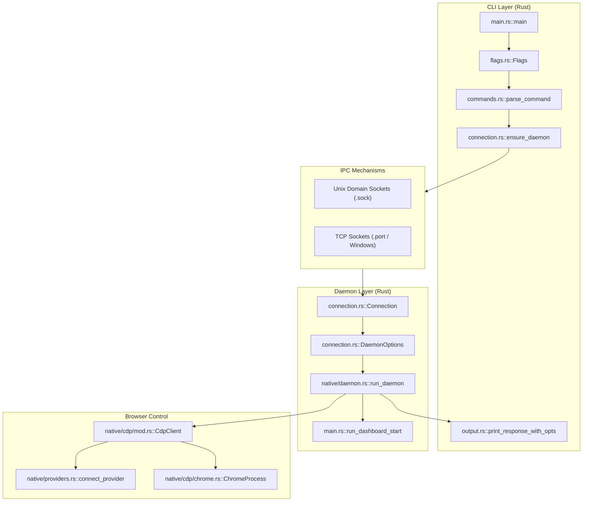
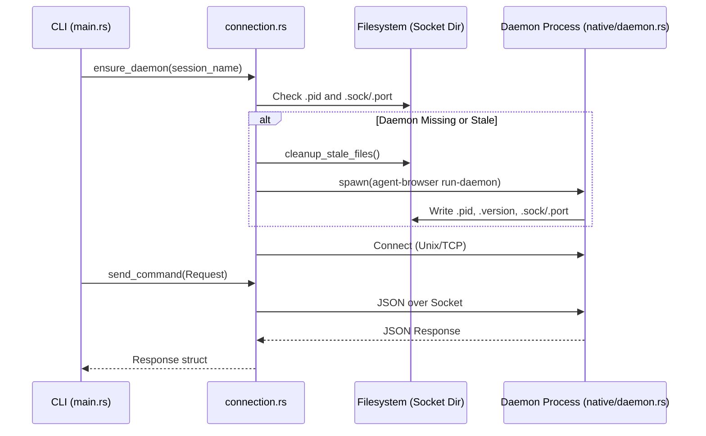

# 시스템 개요

관련 소스 파일

다음 파일들이 이 위키 페이지를 생성하기 위한 컨텍스트로 사용되었습니다.

- [CHANGELOG.md](CHANGELOG.md)
- [cli/src/connection.rs](cli/src/connection.rs)
- [cli/src/flags.rs](cli/src/flags.rs)
- [cli/src/main.rs](cli/src/main.rs)
- [cli/src/native/mod.rs](cli/src/native/mod.rs)
- [package.json](package.json)

## 목적과 범위

이 문서는 `agent-browser` 시스템 아키텍처의 고수준 개요를 제공하며, AI 에이전트를 위한 브라우저 자동화 기능을 제공하기 위해 component들이 어떻게 상호작용하는지 설명합니다. 세 계층 아키텍처(CLI, daemon, browser control), inter-process communication(IPC) mechanism, session management를 다룹니다. 

`agent-browser`는 AI agent workflow와 호환되면서 빠르고 안전하도록 설계된 고성능 native Rust 도구로 만들어졌습니다. Node.js 기반 대안과 비교해 latency를 크게 줄였으며, warm CLI command latency는 약 1ms까지 감소했습니다 [CHANGELOG.md:15-16]().

특정 component에 대한 자세한 정보:
- CLI 구현 세부사항: [CLI Client (Rust) (3.2)]() 참조
- Daemon 구현: [Daemon Layer (3.3)]() 참조
- Browser control 세부사항: [Browser Control (3.4)]() 참조
- Communication protocol 세부사항: [Communication Protocol (3.5)]() 참조

## 아키텍처 계층

`agent-browser`는 세 개의 구분된 layer를 갖는 client-server system으로 구성됩니다. CLI는 JSON 기반 protocol을 통해 persistent background daemon과 통신하는 경량 frontend 역할을 합니다.

### 고수준 Component 상호작용

다음 다이어그램은 자연어 명령 공간을 실행을 담당하는 code entity와 연결합니다.

**출처:**
- [cli/src/main.rs:1-36]()
- [cli/src/connection.rs:39-43]()
- [cli/src/flags.rs:53-95]()
- [cli/src/native/mod.rs:1-44]()

### Layer 1: CLI Client (Rust)

CLI client는 user-facing interface를 제공하는 native Rust binary입니다. 여러 source(environment variable, config file, CLI flag)에서 configuration merging을 처리하고 daemon lifecycle을 관리합니다.

| Component | File | Purpose |
|-----------|------|---------|
| Entry point | [cli/src/main.rs:1-36]() | main entry, CLI command routing, initialization. |
| Command parser | [cli/src/commands.rs:26-26]() | CLI 문자열(예: `click @e1`)을 JSON `Request` object로 매핑합니다. |
| Flag processor | [cli/src/flags.rs:53-95]() | `Config` struct와 precedence logic(Env > Config > Flag)을 구현합니다. |
| IPC client | [cli/src/connection.rs:352-380]() | daemon에 대한 `UnixStream` 또는 `TcpStream` connection을 관리합니다. |
| Output formatter | [cli/src/output.rs:133-172]() | `Response` data를 formatting하고 security boundary를 강제합니다. |

**출처:**
- [cli/src/flags.rs:97-159]()
- [cli/src/connection.rs:22-27]()
- [cli/src/main.rs:26-31]()

### Layer 2: Daemon (Native Rust)

daemon은 browser instance를 유지하고 명령을 실행하는 persistent background process입니다. 

*   **Native Rust Daemon**: 시스템은 기본적으로 100% native Rust입니다. daemon은 `agent-browser run-daemon`을 통해 호출됩니다 [cli/src/connection.rs:302-310]().
*   **Observability Dashboard**: CLI는 session, viewport, network activity를 inspection하기 위한 web UI를 제공하는 dashboard process [cli/src/main.rs:251-280]()를 실행할 수 있습니다. reverse proxy 뒤에 배포하기 위한 proxy origin을 지원합니다 [CHANGELOG.md:48-48]().
*   **Lifecycle Management**: daemon은 `.version` file [cli/src/connection.rs:126-128]()을 통해 자체 version을 추적하고, CLI는 connection phase 중 version consistency를 확인합니다 [cli/src/connection.rs:223-229](). 또한 environment와 daemon health를 진단하기 위한 `doctor` 명령을 포함합니다 [CHANGELOG.md:69-69]().

**출처:**
- [cli/src/connection.rs:121-125]()
- [cli/src/main.rs:251-252]()
- [cli/src/native/mod.rs:12-12]()
- [CHANGELOG.md:48-48]()

### Layer 3: Browser Control

이 layer는 underlying automation engine과 browser instance를 abstract합니다.

- **Local Browsers**: Chrome installation의 자동 discovery와 profile management [cli/src/main.rs:143-156]().
- **Cloud Providers**: `provider` configuration을 통한 외부 browser provider(예: Browserbase, Browserless) 지원 [cli/src/flags.rs:71-71]().
- **CDP Integration**: Chrome DevTools Protocol(CDP)을 통해 browser와 직접 통신하여 browser process에 대한 low-level control을 가능하게 합니다 [cli/src/flags.rs:76-76]().
- **Advanced Features**: 일급 React DevTools 통합(`react tree`, `react inspect`)과 Web Vitals reporting(`vitals`)을 포함합니다 [CHANGELOG.md:42-43]().

**출처:**
- [cli/src/main.rs:146-156]()
- [cli/src/flags.rs:53-95]()
- [CHANGELOG.md:42-43]()

## Inter-Process Communication

### Connection Lifecycle

CLI는 명령을 보내기 전에 요청된 session에 대해 daemon이 사용 가능한지 확인합니다. latency를 최소화하기 위해 한 번 retry하여 stale socket discovery를 처리합니다 [CHANGELOG.md:15-16]().

**출처:**
- [cli/src/connection.rs:131-150]()
- [cli/src/connection.rs:352-380]()
- [cli/src/connection.rs:157-175]()
- [CHANGELOG.md:15-16]()

### Transport Details

| Platform | Mechanism | Location / Discovery |
|----------|-----------|----------------------|
| **Unix** | Unix Domain Socket | `get_socket_dir()/{session}.sock` [cli/src/connection.rs:118-120]() |
| **Windows** | TCP Loopback | `get_port_path`와 local file storage를 통해 파생된 port [cli/src/connection.rs:146-148]() |

socket directory 우선순위는 `AGENT_BROWSER_SOCKET_DIR` > `XDG_RUNTIME_DIR` > `~/.agent-browser` > `tmp`입니다 [cli/src/connection.rs:93-115]().

## Session Management

### Session Model
`agent-browser`는 각 session name이 고유한 daemon/browser instance에 매핑되는 multi-session model을 사용합니다.

- **Default Session**: `--session` flag가 제공되지 않으면 사용됩니다.
- **Named Sessions**: `session` 또는 `session_name` configuration을 통해 관리됩니다 [cli/src/flags.rs:59-60]().
- **Stable Tab IDs**: session 내 tab은 앞선 tab이 닫히더라도 지속되는 안정적인 string ID(예: `t1`, `t2`)를 사용합니다 [CHANGELOG.md:70-70]().
- **Isolation**: 각 session은 자체 IPC socket, PID file, version marker를 유지합니다 [cli/src/connection.rs:122-128]().
- **State Persistence**: session은 `state` flag [cli/src/flags.rs:66-66]()를 통해 state(cookie와 localStorage)를 file에 persist하거나 기존 browser profile [cli/src/flags.rs:65-65]()을 활용할 수 있습니다.

**출처:**
- [cli/src/flags.rs:53-95]()
- [cli/src/connection.rs:121-125]()
- [CHANGELOG.md:70-70]()

## Command Flow와 Data Security

### End-to-End Command Execution
1.  **Parsing**: CLI가 input string을 command structure로 parsing합니다 [cli/src/commands.rs:26-26]().
2.  **Request Generation**: command는 `id`, `action`, extra parameter를 포함하는 JSON `Request`로 변환됩니다 [cli/src/connection.rs:22-27]().
3.  **IPC**: `Request`는 serialize되어 `Connection`을 통해 daemon으로 전송됩니다 [cli/src/connection.rs:39-43]().
4.  **Execution**: daemon이 browser에 대해 action을 실행합니다.
5.  **Security Wrapping**: `content_boundaries`가 활성화되어 있으면, `output.rs`가 `get_boundary_nonce()`로 생성한 cryptographically secure nonce로 page content를 감싸 LLM prompt injection을 방지합니다 [cli/src/output.rs:11-17](), [cli/src/output.rs:61-75]().
6.  **Truncation**: 큰 output은 LLM context window를 보호하기 위해 `truncate_if_needed`를 통해 `max_output` 설정에 따라 잘립니다 [cli/src/output.rs:36-59]().

**출처:**
- [cli/src/output.rs:8-17]()
- [cli/src/output.rs:61-75]()
- [cli/src/connection.rs:22-27]()
