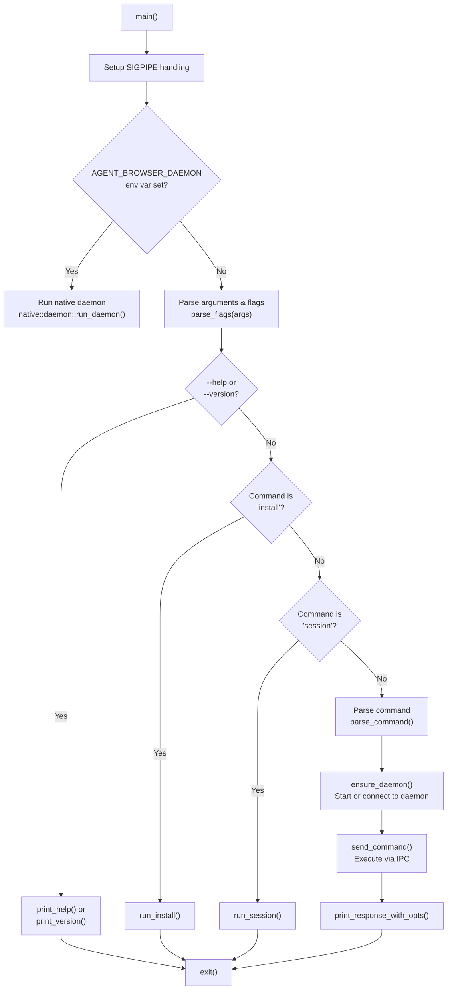
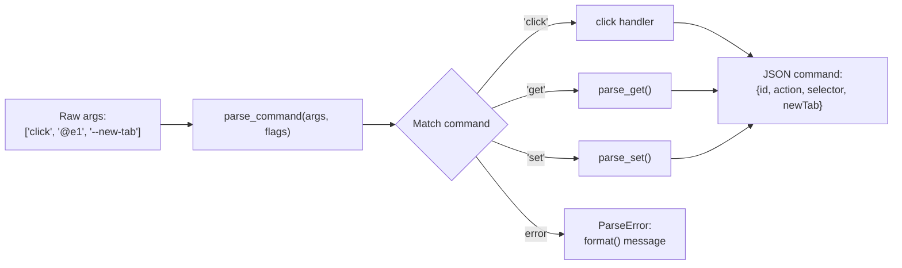

# CLI Client (Rust)

<details>
<summary>관련 소스 파일</summary>

다음 파일들이 이 위키 페이지를 생성하기 위한 컨텍스트로 사용되었습니다.

- [README.md](README.md)
- [cli/src/commands.rs](cli/src/commands.rs)
- [cli/src/connection.rs](cli/src/connection.rs)
- [cli/src/flags.rs](cli/src/flags.rs)
- [cli/src/main.rs](cli/src/main.rs)
- [cli/src/output.rs](cli/src/output.rs)

</details>


CLI client는 agent-browser의 주요 user-facing component이며, zero-overhead execution과 cross-platform distribution을 위해 Rust로 구현되었습니다. command-line argument parsing, configuration loading, daemon lifecycle management, output formatting을 처리합니다. client는 browser automation command를 실행하기 위해 IPC(Unix socket 또는 TCP)를 통해 daemon layer와 통신합니다.

CLI가 통신하는 daemon layer architecture는 [3.3 Daemon Layer]()를 참조하세요. communication protocol 세부사항은 [3.5 Communication Protocol]()을 참조하세요.

---

## Entry Point와 Execution Flow

CLI client는 `main.rs`에서 실행을 시작합니다. `main` function은 command execution 전에 여러 initialization step을 조율합니다.

**Initialization Sequence:**

1.  **Signal Handling** - output이 `head`나 `tail` 같은 도구로 pipe될 때 panic을 방지하기 위해 `SIGPIPE`를 무시합니다 [cli/src/main.rs:360-363]().
2.  **Path Translation Prevention** - Windows에서 일관된 URL과 selector 처리를 보장하기 위해 MSYS/Git Bash path mangling을 비활성화합니다 [cli/src/main.rs:366-370]().
3.  **Daemon Mode Detection** - `AGENT_BROWSER_DAEMON` environment variable이 설정되어 있으면, process는 client logic 대신 native Rust daemon logic을 실행합니다 [cli/src/main.rs:373-384]().
4.  **Argument Collection** - `parse_flags`를 통해 command-line argument와 flag를 parse합니다 [cli/src/main.rs:386-388]().
5.  **Help/Version Handling** - `--help` 또는 `--version` flag의 경우 조기 종료합니다 [cli/src/main.rs:390-406]().

### CLI Execution Flow
Title: CLI Execution Flow (`main.rs`)


**출처:** [cli/src/main.rs:358-1004](), [cli/src/flags.rs:256-587]()

---

## Command Parsing

command parser는 정리된 command-line argument를 daemon protocol을 따르는 구조화된 JSON command로 변환합니다. parser는 `commands.rs`에 구현되어 있으며 main entry point는 `parse_command`입니다 [cli/src/commands.rs:74-89]().

### Parse Error Types

parser는 contextual error message를 제공하기 위해 typed error system인 `ParseError` [cli/src/commands.rs:11-31]()를 사용합니다.

| Error Type | Triggered When | Example |
| :--- | :--- | :--- |
| `UnknownCommand` | command가 존재하지 않을 때 | `agent-browser foobar` |
| `UnknownSubcommand` | command에 대해 subcommand가 유효하지 않을 때 | `agent-browser auth invalid` |
| `MissingArguments` | 필수 argument가 누락되었을 때 | `agent-browser click` (selector 없음) |
| `InvalidValue` | argument format이 유효하지 않을 때 | `agent-browser open --headers 'bad-json'` |
| `InvalidSessionName` | session name에 path traversal이 포함될 때 | `agent-browser --session-name ../etc` |

### Command Structure

command는 request tracking을 위해 `gen_id()` [cli/src/commands.rs:63-72]()를 사용하는 일관된 구조의 JSON object로 parsing됩니다. `parse_command` function은 명시적 timeout이 제공되지 않은 경우 `wait` command에 `AGENT_BROWSER_DEFAULT_TIMEOUT`도 주입합니다 [cli/src/commands.rs:80-86]().

### Cookie Parsing
CLI는 `parse_curl_cookies` [cli/src/commands.rs:85-127]()를 통해 고급 cookie ingestion을 지원하며, JSON array, cURL command dump, bare HTTP header를 자동 감지할 수 있습니다. line continuation을 제거하고 header를 찾기 위해 `extract_cookie_header_from_curl` [cli/src/commands.rs:129-146]()을 사용합니다.

### Command Parsing Logic
Title: Command Parsing Pipeline (`commands.rs`)


**출처:** [cli/src/commands.rs:11-89](), [cli/src/commands.rs:85-146]()

---

## Flag Processing과 Configuration System

flag processing system은 multi-tier configuration precedence model을 구현합니다. `Flags` struct [cli/src/flags.rs:207-254]()는 여러 source의 setting을 aggregate합니다.

### Configuration Precedence

1.  **Built-in defaults** (`Flags` struct에 hardcoded).
2.  **User config file** (`~/.agent-browser/config.json`) [cli/src/flags.rs:7-8]().
3.  **Project config file** (`./agent-browser.json`) [cli/src/flags.rs:9]().
4.  **Environment variables** (`AGENT_BROWSER_*`).
5.  **Command-line flags** (`--headed`, `--json` 등).

### Configuration Loading

`Config` struct [cli/src/flags.rs:53-95]()는 deserialization에 `serde`를 사용합니다. `merge` method [cli/src/flags.rs:98-158]()는 서로 다른 configuration level을 결합하는 방법을 정의합니다. 

**Idle Timeout Parsing**: CLI는 사람이 읽기 쉬운 timeout(예: "10s", "3m")을 지원하며, 이는 `parse_idle_timeout` [cli/src/flags.rs:13-36]()을 통해 millisecond로 변환됩니다.

### Argument Cleaning

`clean_args` function [cli/src/flags.rs:589-659]()은 argument vector에서 global flag를 제거하여 parser에 command-specific argument만 남깁니다.

**출처:** [cli/src/flags.rs:7-158](), [cli/src/flags.rs:589-659]()

---

## Output Formatting

output system은 `OutputOptions` [cli/src/output.rs:19-34]()를 통해 human 또는 machine consumption에 맞게 daemon response를 formatting합니다.

### Content Boundaries

content boundary는 cryptographic boundary marker로 page content를 감싸 prompt injection으로부터 AI agent를 보호합니다. nonce는 CSPRNG를 사용해 process당 한 번 생성됩니다 [cli/src/output.rs:8-17]().

**Boundary Format** [cli/src/output.rs:61-75]()
```
--- AGENT_BROWSER_PAGE_CONTENT nonce=a3f9e2... origin=https://example.com ---
<page content here>
--- END_AGENT_BROWSER_PAGE_CONTENT nonce=a3f9e2... ---
```

### Output Truncation

`truncate_if_needed` function [cli/src/output.rs:36-59]()은 LLM context에서 token limit exhaustion을 방지하기 위해 output character count를 제한합니다. UTF-8을 인식한 상태를 유지하기 위해 `char_indices()`를 사용해 limit번째 character의 byte offset을 찾습니다 [cli/src/output.rs:46]().

### Response Formatting Dispatch

`print_response_with_opts` function [cli/src/output.rs:216-335]()은 specialized formatter로 dispatch합니다.
*   **Storage**: `format_storage_text`를 통해 `localStorage` 또는 `sessionStorage` entry를 formatting합니다 [cli/src/output.rs:84-100]().
*   **Streaming**: `format_stream_status_text`를 통해 WebSocket streaming status를 formatting합니다 [cli/src/output.rs:102-131]().
*   **Vitals**: `format_vitals_text`를 통해 Core Web Vitals와 performance metric을 formatting합니다 [cli/src/output.rs:161-214]().

**출처:** [cli/src/output.rs:8-59](), [cli/src/output.rs:216-335]()

---

## Connection Management

CLI는 `connection.rs`의 `ensure_daemon`과 `send_command`를 통해 daemon lifecycle을 조율합니다.

### Socket Management

CLI는 `get_socket_dir()` [cli/src/connection.rs:93-115]()을 통해 IPC file의 base directory를 결정하며, `AGENT_BROWSER_SOCKET_DIR` 다음 `XDG_RUNTIME_DIR`을 우선합니다.

*   **Unix**: `get_socket_path` [cli/src/connection.rs:118-120]()를 통해 Unix domain socket(`.sock` file)을 사용합니다.
*   **Windows**: session name hash에서 파생된 port의 TCP socket을 사용합니다 [cli/src/connection.rs:147-149]().

### Daemon Lifecycle

`cleanup_stale_files` function [cli/src/connection.rs:131-150]()은 orphaned `.pid`, `.sock`, `.version` file을 제거합니다. CLI는 `is_pid_alive` [cli/src/connection.rs:157-175]()를 사용해 daemon이 실제로 실행 중인지 확인합니다.

### Request/Response Protocol

request는 `Request` struct [cli/src/connection.rs:22-27]()로 serialize되고, response는 `Response` struct [cli/src/connection.rs:29-36]()로 deserialize됩니다. `Connection` enum [cli/src/connection.rs:39-43]()은 Unix stream과 TCP stream을 abstract하여 unified `Read`/`Write` interface를 제공합니다.

**출처:** [cli/src/connection.rs:22-43](), [cli/src/connection.rs:93-120](), [cli/src/connection.rs:131-175]()
