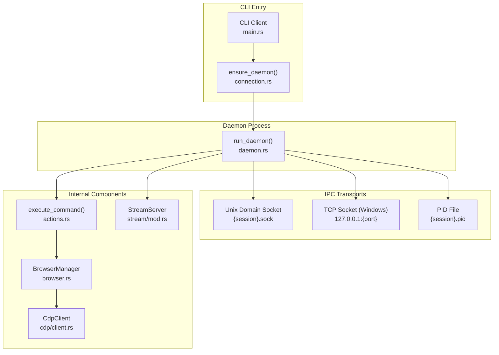
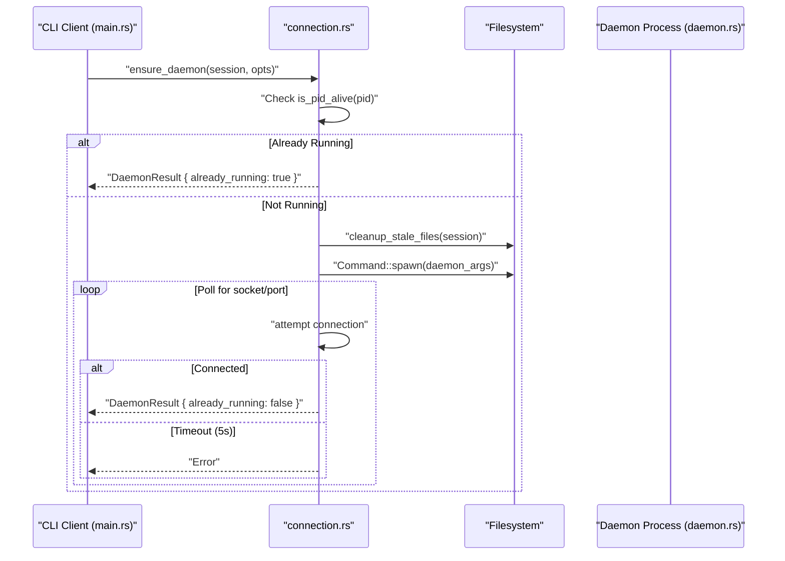

# Daemon Layer

관련 소스 파일

다음 파일들이 이 위키 페이지를 생성하기 위한 컨텍스트로 사용되었습니다.

- [cli/src/native/cdp/chrome.rs](cli/src/native/cdp/chrome.rs)
- [cli/src/native/cdp/client.rs](cli/src/native/cdp/client.rs)
- [cli/src/native/daemon.rs](cli/src/native/daemon.rs)
- [cli/src/native/providers.rs](cli/src/native/providers.rs)
- [cli/src/native/stream/cdp_loop.rs](cli/src/native/stream/cdp_loop.rs)
- [cli/src/native/stream/http.rs](cli/src/native/stream/http.rs)
- [cli/src/native/stream/mod.rs](cli/src/native/stream/mod.rs)
- [cli/src/native/stream/websocket.rs](cli/src/native/stream/websocket.rs)

Daemon Layer는 browser instance를 관리하고, IPC를 통해 CLI client의 command를 처리하며, session state를 유지하는 persistent background server process를 구현합니다. 이 아키텍처는 browser startup overhead를 제거해 빠른 command execution을 가능하게 하고, stateful browser session이 command 사이에도 지속되도록 합니다.

---

## 아키텍처 개요

daemon layer는 주로 direct CDP를 사용하는 native Rust daemon으로 구성됩니다. 표준화된 IPC interface와 command processing semantic을 제공하여, CLI client가 종료된 뒤에도 browser session이 살아 있도록 보장합니다.

**Daemon Coordination and Lifecycle**

**출처:** [cli/src/native/daemon.rs:19-150](), [cli/src/native/cdp/client.rs:29-46](), [cli/src/native/stream/mod.rs:45-64]()

---

## Native Rust Daemon 구현

native daemon은 핵심 background process입니다. binary가 internal daemon flag로 실행될 때 trigger되며, 일반적으로 CLI의 `ensure_daemon`에 의해 시작됩니다.

### Lifecycle Management
daemon lifecycle은 `run_daemon` [cli/src/native/daemon.rs:19-150]()에서 관리됩니다. 다음 단계를 수행합니다.
1. **Log Redirection**: Unix에서 `AGENT_BROWSER_DEBUG`가 설정되어 있으면 stderr가 `{session}.log`로 redirect됩니다 [cli/src/native/daemon.rs:29-43](). 그렇지 않으면 parent CLI가 pipe를 닫았을 때 crash를 방지하기 위해 `/dev/null`로 redirect됩니다 [cli/src/native/daemon.rs:49-60]().
2. **PID & Versioning**: process ID를 `{session}.pid`에 쓰고 [cli/src/native/daemon.rs:62-63](), package version을 `{session}.version`에 씁니다 [cli/src/native/daemon.rs:65-66]().
3. **State Cleanup**: `AGENT_BROWSER_STATE_EXPIRE_DAYS`가 설정되어 있으면 선택적으로 `state_clean`을 실행합니다 [cli/src/native/daemon.rs:88-94]().
4. **Stream Server**: WebSocket preview와 dashboard data를 처리하기 위해 `StreamServer::start_without_client`를 통해 `StreamServer`를 시작합니다 [cli/src/native/daemon.rs:102-113]().
5. **Socket Server**: 들어오는 IPC command를 처리하기 위해 main `run_socket_server` loop에 진입합니다 [cli/src/native/daemon.rs:122-129]().
6. **Idle Timeout**: `AGENT_BROWSER_IDLE_TIMEOUT_MS`가 설정되어 있으면 daemon은 inactivity를 monitoring하고 `mpsc` reset channel을 통해 자동 종료됩니다 [cli/src/native/daemon.rs:117-120](), [cli/src/native/daemon.rs:176-188]().

### StreamServer와 WebSocket Protocol
`StreamServer` [cli/src/native/stream/mod.rs:45-64]()는 dashboard를 위한 real-time observation interface를 제공합니다.

- **Dual Protocol Support**: server는 `handle_connection`에서 incoming connection을 WebSocket(streaming용)과 HTTP(dashboard asset/API용) 사이에 dispatch합니다 [cli/src/native/stream/websocket.rs:99-147]().
- **Screencasting**: `cdp_event_loop` [cli/src/native/stream/cdp_loop.rs:14-28]()를 통해 CDP screencast lifecycle을 관리합니다. `Page.screencastFrame` event를 수신하고 연결된 WebSocket client에 broadcast합니다 [cli/src/native/stream/cdp_loop.rs:142-153]().
- **Status Broadcasting**: 현재 `engine`, `connected` state, `recording` status를 포함하는 `status` JSON message를 주기적으로 broadcast합니다 [cli/src/native/stream/cdp_loop.rs:88-97]().
- **Viewport Coordination**: screencast frame이 browser의 현재 state와 일치하도록 viewport dimension을 추적합니다 [cli/src/native/stream/mod.rs:108-121]().

**출처:** [cli/src/native/daemon.rs:19-150](), [cli/src/native/stream/mod.rs:45-148](), [cli/src/native/stream/cdp_loop.rs:14-112](), [cli/src/native/stream/websocket.rs:99-147]()

---

## IPC Mechanisms

daemon은 CLI client와의 통신을 위해 두 가지 IPC transport를 지원합니다.

### Unix Domain Sockets
Unix 계열 system에서 daemon은 `UnixListener`를 통해 listen합니다 [cli/src/native/daemon.rs:160-163](). socket directory는 environment variable 또는 system default를 기반으로 resolve되어 session 전반에서 일관된 access를 보장합니다.

### TCP Sockets (Windows)
Windows에서 daemon은 `127.0.0.1`의 TCP를 사용합니다.
- **Port Resolution**: client는 daemon이 작성한 `{session}.port` file을 읽어 port를 resolve합니다.
- **Cleanup**: daemon은 startup 시 stale port file과 socket이 제거되도록 보장합니다 [cli/src/native/daemon.rs:77-86]().

**출처:** [cli/src/native/daemon.rs:68-86](), [cli/src/native/daemon.rs:160-163]()

---

## Process Coordination

### `ensure_daemon` Flow
CLI client는 command를 보내기 전에 daemon이 active 상태인지 확인합니다.

### Chrome Process Management
daemon은 `ChromeProcess` [cli/src/native/cdp/chrome.rs:8-15]()를 통해 browser lifecycle을 직접 관리합니다.
- **Process Group Termination**: Unix에서 `ChromeProcess::kill`은 모든 helper process(GPU, renderer)가 종료되도록 process group ID(`pgid`)를 사용합니다 [cli/src/native/cdp/chrome.rs:18-31]().
- **Wait or Kill**: daemon은 force-killing 전에 cookie를 flush할 수 있도록 timeout 동안 Chrome이 graceful하게 exit하도록 시도합니다 [cli/src/native/cdp/chrome.rs:47-60]().

**출처:** [cli/src/native/cdp/chrome.rs:8-31](), [cli/src/native/cdp/chrome.rs:47-60]()

---

## Dashboard와 API Server

daemon은 `packages/dashboard`에 위치한 Next.js dashboard와의 통합을 제공합니다.

- **Asset Serving**: `StreamServer`는 `DashboardAssets`를 통해 binary에 embedded된 dashboard asset을 serve합니다 [cli/src/native/stream/http.rs:16-18]().
- **CORS Protection**: `/api/command` 같은 sensitive endpoint는 same-origin check로 보호됩니다 [cli/src/native/stream/http.rs:139-154]().
- **Frontend Interaction**: dashboard는 `execCommand`와 `killSession` utility를 통해 daemon과 통신합니다.
- **Session Control**: dashboard는 `/api/kill` endpoint를 통해 session termination을 trigger할 수 있습니다 [cli/src/native/stream/http.rs:210-215]().

**출처:** [cli/src/native/stream/http.rs:16-18](), [cli/src/native/stream/http.rs:139-154](), [cli/src/native/stream/http.rs:210-215]()
