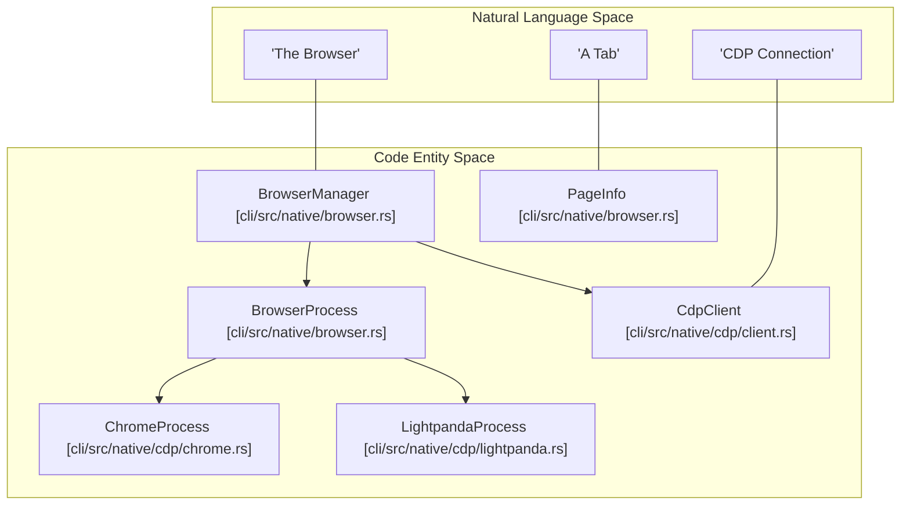
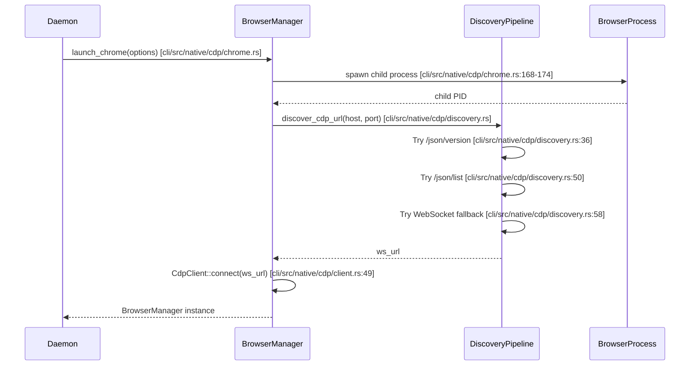

# Browser Control

관련 소스 파일

다음 파일들이 이 위키 페이지를 생성하기 위한 컨텍스트로 사용되었습니다.

- [cli/src/native/actions.rs](cli/src/native/actions.rs)
- [cli/src/native/browser.rs](cli/src/native/browser.rs)
- [cli/src/native/cdp/chrome.rs](cli/src/native/cdp/chrome.rs)
- [cli/src/native/cdp/client.rs](cli/src/native/cdp/client.rs)
- [cli/src/native/cdp/discovery.rs](cli/src/native/cdp/discovery.rs)
- [cli/src/native/cdp/lightpanda.rs](cli/src/native/cdp/lightpanda.rs)
- [cli/src/native/cdp/mod.rs](cli/src/native/cdp/mod.rs)
- [cli/src/native/daemon.rs](cli/src/native/daemon.rs)
- [cli/src/native/e2e_tests.rs](cli/src/native/e2e_tests.rs)
- [cli/src/native/providers.rs](cli/src/native/providers.rs)

이 문서는 browser instance, page, context, interaction을 관리하는 agent-browser의 browser control layer를 설명합니다. Rust 기반 native daemon에서 이는 주로 `BrowserManager` struct와 `DaemonState`가 처리하며, Playwright-compatible CDP(Chrome/Lightpanda)와 WebDriver(iOS/Safari)를 포함한 여러 backend를 조율합니다.

browser manager를 사용하는 command execution과 action handling은 [Command Reference](cli/src/native/actions.rs)를 참조하세요. browser content와 상호작용하는 데 사용되는 element reference와 snapshot은 [Element References (Refs)](cli/src/native/element.rs) 및 [Snapshots](cli/src/native/snapshot.rs)를 참조하세요.

## BrowserManager Struct

`BrowserManager` struct [cli/src/native/browser.rs:202-211]()는 native daemon에서 CDP 기반 browser operation을 위한 중심 abstraction입니다. `CdpClient`, underlying browser process(Chrome 또는 Lightpanda), page state를 유지합니다.

**핵심 책임:**
- **Process Management**: `ChromeProcess` [cli/src/native/cdp/chrome.rs:8-15]() 또는 `LightpandaProcess` [cli/src/native/cdp/lightpanda.rs:17-21]()를 통해 browser process를 launch하고 관리합니다.
- **Communication**: browser와의 WebSocket 기반 통신을 위해 `CdpClient`를 유지합니다 [cli/src/native/cdp/client.rs:29-46]().
- **Page Tracking**: `PageInfo` [cli/src/native/browser.rs:160-173]()를 통해 active page와 session을 추적합니다.
- **Tab Control**: browser-level navigation, tab switching, labeling을 처리합니다 [cli/src/native/browser.rs:216-320]().
- **Teaching Errors**: 기술적인 browser error를 AI 친화적이고 실행 가능한 설명으로 변환합니다 [cli/src/native/browser.rs:135-157]().

**Browser Control Entity Mapping**

출처: [cli/src/native/browser.rs:135-211](), [cli/src/native/cdp/chrome.rs:8-15](), [cli/src/native/cdp/lightpanda.rs:17-21](), [cli/src/native/cdp/client.rs:29-46]()

## Browser Launch와 Lifecycle

browser lifecycle은 specialized launch function과 `BrowserProcess` enum을 통해 관리됩니다. 시스템은 standard Chrome, Lightpanda high-performance engine, remote CDP connection을 지원합니다.

### Launch Flow

**Launch Options** [cli/src/native/cdp/chrome.rs:90-116]():
- `headless`: GUI 없이 실행합니다(`--headless=new` [cli/src/native/cdp/chrome.rs:180]() 사용).
- `profile`: persistent user data directory의 path [cli/src/native/cdp/chrome.rs:97]().
- `proxy`: credential을 포함한 proxy server configuration [cli/src/native/cdp/chrome.rs:93-96]().
- `extensions`: load할 Chrome extension 목록입니다(headed mode 필요 [cli/src/native/cdp/chrome.rs:179]()).
- `args`: browser binary에 전달되는 raw CLI argument [cli/src/native/cdp/chrome.rs:98]().
- `storage_state`: JSON state file에서 cookie/localStorage를 load합니다 [cli/src/native/cdp/chrome.rs:101]().

### Discovery Pipeline
`discover_cdp_url` function [cli/src/native/cdp/discovery.rs:20-65]()은 CDP endpoint를 찾기 위한 robust multi-stage discovery mechanism을 구현합니다.
1. **Primary**: `/json/version`을 fetch하여 `webSocketDebuggerUrl`을 가져옵니다 [cli/src/native/cdp/discovery.rs:36-47]().
2. **Fallback**: `/json/list`를 fetch하고 `browser` target을 찾습니다 [cli/src/native/cdp/discovery.rs:49-53]().
3. **Final Fallback**: `ws://host:port/devtools/browser`에 직접 WebSocket connection을 시도합니다(Chrome 136+ remote debugging에 필요) [cli/src/native/cdp/discovery.rs:58-64]().

출처: [cli/src/native/cdp/chrome.rs:90-180](), [cli/src/native/cdp/discovery.rs:20-65](), [cli/src/native/browser.rs:8-12]()

## Browser Provider Abstraction

시스템은 `BrowserProcess` enum과 cloud service용 `providers.rs` module을 통해 다양한 browser backend를 abstract합니다.

### Chrome vs. Lightpanda
- **ChromeProcess** [cli/src/native/cdp/chrome.rs:8-15](): 표준 Chromium 기반 browser입니다. 전체 extension set과 표준 CDP domain을 지원합니다. Unix에서 orphaned helper process를 방지하기 위해 process group을 정리하는 logic을 포함합니다 [cli/src/native/cdp/chrome.rs:20-31]().
- **LightpandaProcess** [cli/src/native/cdp/lightpanda.rs:17-21](): 경량 고성능 browser engine입니다. `serve` command [cli/src/native/cdp/lightpanda.rs:43-52]()를 통해 launch되며, startup output을 capture하기 위해 specialized log drainer를 사용합니다 [cli/src/native/cdp/lightpanda.rs:197-219]().

### Cloud Providers
시스템은 `providers` module [cli/src/native/providers.rs:26-73]()을 통해 remote browser infrastructure에 연결할 수 있습니다. Browserbase, Browserless, Kernel 같은 provider를 지원합니다.

| Provider | Protocol | Implementation Detail |
| :--- | :--- | :--- |
| **Browserbase** | CDP | `BROWSERBASE_API_KEY`를 사용해 POST로 session을 생성합니다 [cli/src/native/providers.rs:134-184](). |
| **Browserless** | CDP | `BROWSERLESS_TTL`과 direct stop URL을 지원합니다 [cli/src/native/providers.rs:186-210](). |
| **Kernel** | CDP | `KERNEL_API_KEY`와 custom endpoint를 통해 연결합니다 [cli/src/native/providers.rs:52-59](). |
| **AgentCore** | CDP | signed session cleanup을 갖춘 remote browser infrastructure [cli/src/native/providers.rs:60-66](). |

출처: [cli/src/native/cdp/lightpanda.rs:149-219](), [cli/src/native/cdp/chrome.rs:20-31](), [cli/src/native/providers.rs:26-73]()

## Tab and Session Management

native daemon에서 tab은 `PageInfo` object [cli/src/native/browser.rs:160-173]()로 추적됩니다.

**Target Tracking**:
`should_track_target` function [cli/src/native/browser.rs:99-102]()은 AI agent가 web content와만 상호작용하도록 내부 Chrome target(예: `chrome://`, `devtools://`)을 filtering합니다.

**Iframe Sessions**:
`DrainedEvents` struct [cli/src/native/actions.rs:166-175]()는 `Target.attachedToTarget`을 통해 생성된 cross-origin iframe session을 추적합니다. multi-frame interaction을 허용하기 위해 이것들은 `DaemonState`에 저장됩니다 [cli/src/native/actions.rs:172]().

**Event Draining**:
command execution 중 시스템은 내부 `pages` list를 실제 browser state와 sync하기 위해 `TargetCreated`, `TargetDestroyed`, `TargetInfoChanged` [cli/src/native/actions.rs:166-175]() 같은 event를 "drain"합니다.

출처: [cli/src/native/browser.rs:99-173](), [cli/src/native/actions.rs:166-175]()

## Security and Policy Enforcement

browser control은 `ActionPolicy`와 `DomainFilter`로 gate됩니다.

1. **Domain Filtering**: `DomainFilter` [cli/src/native/network.rs:28]()는 `DaemonState`에 통합됩니다. network event를 intercept하여 허용되지 않은 domain 또는 unauthorized protocol로의 navigation을 block합니다.
2. **Action Policies**: `BrowserManager`가 destructive action(`browser.close` 또는 `navigation` 같은)을 실행하기 전에 `DaemonState`가 `ActionPolicy` [cli/src/native/actions.rs:29]()를 확인합니다.
3. **Confirmation Workflow**: policy가 `RequiresConfirmation`을 반환하면 browser action이 suspend되고, 사용자가 `confirmationId`를 통해 approve하거나 deny할 때까지 `PendingConfirmation` [cli/src/native/actions.rs:61-64]()이 저장됩니다.

출처: [cli/src/native/actions.rs:28-64](), [cli/src/native/network.rs:28]()
