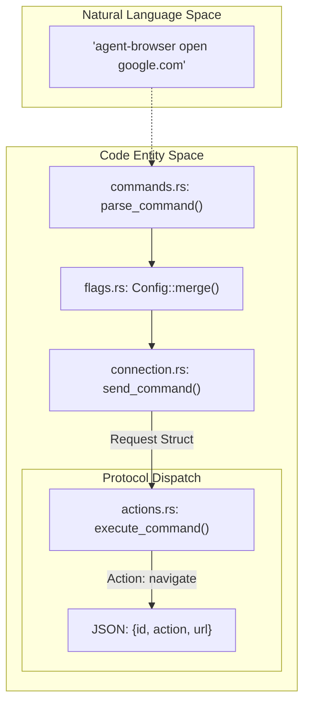
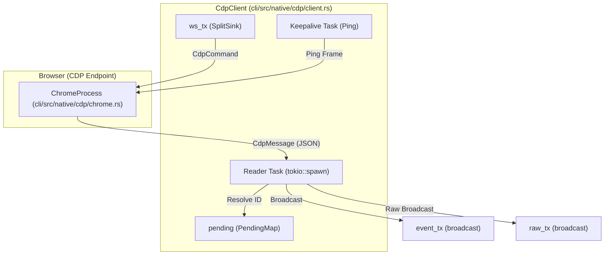

# Communication Protocol

관련 소스 파일

다음 파일들이 이 위키 페이지를 생성하기 위한 컨텍스트로 사용되었습니다.

- [cli/src/commands.rs](cli/src/commands.rs)
- [cli/src/connection.rs](cli/src/connection.rs)
- [cli/src/flags.rs](cli/src/flags.rs)
- [cli/src/main.rs](cli/src/main.rs)
- [cli/src/native/cdp/chrome.rs](cli/src/native/cdp/chrome.rs)
- [cli/src/native/cdp/client.rs](cli/src/native/cdp/client.rs)
- [cli/src/native/daemon.rs](cli/src/native/daemon.rs)
- [cli/src/native/providers.rs](cli/src/native/providers.rs)

이 문서는 CLI client와 daemon process 사이에서 사용되는 JSON 기반 communication protocol을 설명합니다. 이 protocol은 command(request), response, validation mechanism, type system의 구조와 `CdpClient` WebSocket 구현 및 browser provider integration을 포함한 underlying transport infrastructure를 정의합니다.

---

## Protocol Overview

agent-browser communication protocol은 IPC channel(Unix domain socket 또는 TCP) 위에서 동작하는 **JSON 기반 newline-delimited** protocol입니다. 각 message는 newline character(`\n`)로 끝나는 완전한 JSON object입니다.

### 핵심 기능
- **Command dispatch**: client는 JSON command를 보내고, daemon은 `execute_command`를 통해 JSON result로 응답합니다. [cli/src/native/daemon.rs:14-14](), [cli/src/native/daemon.rs:172-174]()
- **Bi-directional communication**: `CdpClient`가 관리하는 persistent connection 위에서 full-duplex로 통신합니다. [cli/src/native/cdp/client.rs:86-100]()
- **Type-safe validation**: Rust 측 parsing과 serialization에 `serde`와 `serde_json`을 사용합니다. [cli/src/connection.rs:20-36]()
- **Session isolation**: session name을 기반으로 한 unique socket path 또는 deterministic port를 통해 여러 concurrent session을 지원합니다. [cli/src/native/daemon.rs:19-71]()
- **CdpClient Integration**: WebSocket 위의 Chrome DevTools Protocol(CDP)을 통해 browser를 직접 제어합니다. [cli/src/native/cdp/client.rs:29-46]()
- **Provider Support**: remote CDP session(Browserbase, Browserless 등)을 위한 extensible architecture입니다. [cli/src/native/providers.rs:26-73]()

출처: [cli/src/native/daemon.rs:1-174](), [cli/src/native/cdp/client.rs:1-100](), [cli/src/connection.rs:20-36](), [cli/src/native/providers.rs:26-73]()

---

## Message Structure

### Request Format
client는 command를 `action`과 `id`를 포함하는 `Request` structure로 serialize합니다. [cli/src/connection.rs:20-27]()

- **`id`**: string으로 생성되는 unique request identifier입니다. [cli/src/connection.rs:23-23]()
- **`action`**: command verb입니다(예: `navigate`, `click`, `screenshot`). [cli/src/connection.rs:24-24]()
- **`extra`**: action-specific parameter를 포함하는 flattened `serde_json::Value`입니다. [cli/src/connection.rs:25-26]()

### Response Format
daemon은 success status와 optional data 또는 error를 포함하는 `Response` struct로 응답합니다. [cli/src/connection.rs:29-36]()

- **`success`**: command가 error 없이 실행되었는지를 나타내는 Boolean입니다. [cli/src/connection.rs:31-31]()
- **`data`**: command result를 포함하는 optional `serde_json::Value` payload입니다. [cli/src/connection.rs:32-32]()
- **`error`**: failure에 대한 optional string description입니다. [cli/src/connection.rs:33-33]()
- **`warning`**: optional warning message이며, `None`이면 생략됩니다. [cli/src/connection.rs:34-35]()

출처: [cli/src/connection.rs:20-36]()

---

## Command Validation and Parsing

CLI는 user input과 flag를 구조화된 JSON command로 매핑합니다. 여기에는 global configuration과 command-specific parameter를 병합하는 과정이 포함됩니다.

### Validation Logic
1. **Command Mapping**: CLI는 command와 subcommand를 식별하고, invalid input에 대해서는 `ParseError`를 반환합니다. [cli/src/commands.rs:9-31]()
2. **Flag Processing**: `Config` struct는 `agent-browser.json`, environment variable, CLI flag의 merging hierarchy를 관리합니다. [cli/src/flags.rs:53-95](), [cli/src/flags.rs:97-158]()
3. **Session Name Validation**: path traversal을 방지하기 위해 `is_valid_session_name`으로 session name을 확인합니다. [cli/src/commands.rs:7-7](), [cli/src/commands.rs:30-30]()
4. **Proxy Parsing**: proxy는 server와 credential component를 포함하는 `ParsedProxy`로 parsing됩니다. [cli/src/main.rs:80-141]()

### Command Mapping Diagram

다음 다이어그램은 CLI의 "Natural Language Space"를 protocol의 "Code Entity Space"와 연결합니다.

출처: [cli/src/commands.rs:9-31](), [cli/src/flags.rs:97-158](), [cli/src/connection.rs:20-27](), [cli/src/main.rs:80-141]()

---

## Transport Layer: CdpClient Infrastructure

`CdpClient`는 browser의 Chrome DevTools Protocol(CDP) endpoint에 대한 low-level WebSocket connection을 관리합니다. message multiplexing, keepalive, asynchronous response tracking을 처리합니다.

### CdpClient Architecture

### 핵심 구성 요소
- **`PendingMap`**: outgoing command를 추적하는 `HashMap<u64, oneshot::Sender<CdpMessage>>`입니다. 일치하는 ID를 가진 response가 도착하면 sender가 original future를 resolve합니다. [cli/src/native/cdp/client.rs:15-15](), [cli/src/native/cdp/client.rs:150-155]()
- **Reader Task**: WebSocket을 polling하는 dedicated `tokio` task입니다. `Text`와 `Binary` frame을 모두 처리합니다(Browserless 같은 일부 remote proxy에 필요). [cli/src/native/cdp/client.rs:100-148]()
- **Keepalive**: 중간 proxy가 idle connection을 끊지 않도록 30초마다(`WS_KEEPALIVE_INTERVAL_SECS`) WebSocket `Ping` frame을 보냅니다. [cli/src/native/cdp/client.rs:19-19](), [cli/src/native/cdp/client.rs:176-178]()
- **Raw Broadcast**: `raw_tx` channel은 typed parsing이 발생하기 전에 subscriber(dashboard 또는 inspect proxy 등)에게 `RawCdpMessage`를 보냅니다. [cli/src/native/cdp/client.rs:24-27](), [cli/src/native/cdp/client.rs:133-141]()

출처: [cli/src/native/cdp/client.rs:15-178](), [cli/src/native/cdp/chrome.rs:8-15]()

---

## Connection Management

daemon은 CLI 또는 dashboard에서 command를 수신하기 위해 socket server를 운영합니다.

### Transport Selection
- **Unix**: `get_socket_dir`가 반환한 directory의 `.sock` file에 연결하는 `UnixListener`를 사용합니다. [cli/src/native/daemon.rs:160-163](), [cli/src/connection.rs:93-115]()
- **Windows**: TCP를 사용하며, server는 client가 connection point를 discover할 수 있도록 `.port` file을 씁니다. [cli/src/native/daemon.rs:68-80]()

### Daemon Lifecycle
- **PID/Version Files**: daemon은 process를 추적하고 compatibility를 보장하기 위해 `.pid` 및 `.version` file을 씁니다. [cli/src/native/daemon.rs:62-66]()
- **Auto-shutdown**: daemon은 `AGENT_BROWSER_IDLE_TIMEOUT_MS`로 정의된 inactivity 기간 후 자동으로 종료될 수 있습니다. [cli/src/native/daemon.rs:117-120]()
- **Cleanup**: session이 dead로 판단되면 `cleanup_stale_files`를 통해 stale file이 제거됩니다. [cli/src/connection.rs:131-150]()

### Browser Providers
protocol은 provider abstraction을 통해 remote CDP session을 지원합니다.

| Provider | Authentication | Connection Method |
| :--- | :--- | :--- |
| Browserbase | `BROWSERBASE_API_KEY` | POST `/v1/sessions` [cli/src/native/providers.rs:134-184]() |
| Browserless | `BROWSERLESS_API_KEY` | API key가 포함된 WebSocket URL [cli/src/native/providers.rs:186-207]() |
| Kernel | `KERNEL_API_KEY` | cleanup을 위한 DELETE `/browsers/{id}` [cli/src/native/providers.rs:111-125]() |

출처: [cli/src/native/daemon.rs:62-163](), [cli/src/connection.rs:93-150](), [cli/src/native/providers.rs:111-207]()

---

## Command Identification

protocol은 request/response correlation과 element reference를 위해 unique ID를 사용합니다.

- **Request ID Generation**: system time(microsecond)을 사용해 생성되며 'r' prefix가 붙습니다. [cli/src/commands.rs:63-72]()
- **Cookie Parsing**: JSON, cURL dump, bare header를 지원하며, 이를 `cookies_set` action을 위한 표준 JSON array로 변환합니다. [cli/src/commands.rs:85-127]()

출처: [cli/src/commands.rs:63-127]()
