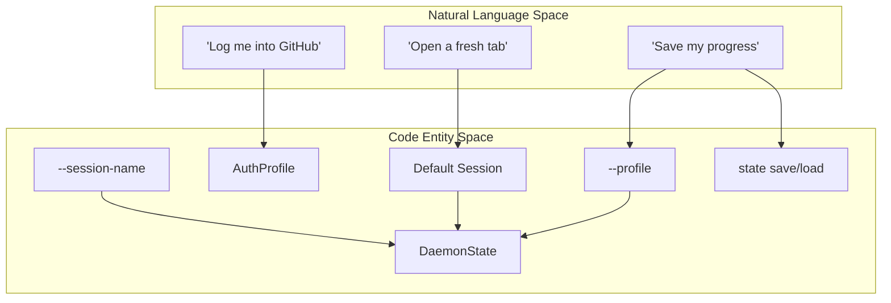
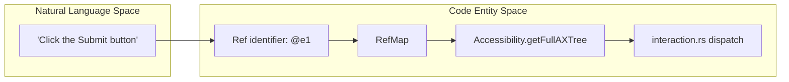

# 핵심 개념

관련 소스 파일

다음 파일들이 이 위키 페이지를 생성하기 위한 컨텍스트로 사용되었습니다.

- [README.md](README.md)
- [cli/src/doctor/launch.rs](cli/src/doctor/launch.rs)
- [cli/src/native/react/mod.rs](cli/src/native/react/mod.rs)
- [cli/src/output.rs](cli/src/output.rs)
- [docs/src/app/commands/page.mdx](docs/src/app/commands/page.mdx)
- [docs/src/app/react/page.mdx](docs/src/app/react/page.mdx)
- [skill-data/core/SKILL.md](skill-data/core/SKILL.md)
- [skill-data/core/references/commands.md](skill-data/core/references/commands.md)
- [skill-data/core/references/video-recording.md](skill-data/core/references/video-recording.md)
- [skills/agent-browser/SKILL.md](skills/agent-browser/SKILL.md)

이 페이지는 `agent-browser`의 아키텍처와 동작을 뒷받침하는 기본 개념을 설명합니다. 이러한 개념을 이해하는 것은 도구를 효과적으로 사용하는 데 필수적이며, 특히 신뢰할 수 있는 브라우저 자동화가 필요한 AI 에이전트를 만들 때 중요합니다.

session type과 state persistence에 대한 자세한 내용은 [Sessions and State](#4.1)를 참조하세요.
element reference system에 대한 자세한 내용은 [Element References (Refs)](#4.2)를 참조하세요.
accessibility tree extraction과 filtering에 대한 자세한 내용은 [Snapshots](#4.3)를 참조하세요.
end-to-end execution pipeline에 대한 자세한 내용은 [Command Execution Flow](#4.4)를 참조하세요.

---

## Sessions and State

`agent-browser`는 ephemeral one-off run부터 persistent encrypted profile까지 브라우저 상태를 관리하는 여러 방식을 제공합니다. 각 session은 자체 browser instance, cookie, storage를 유지합니다.

### Session Persistence Models

**출처:** [README.md:144-145](), [skill-data/core/SKILL.md:54-55](), [skill-data/core/references/commands.md:183-195]()

*   **Ephemeral Sessions**: browser가 닫히면 state가 손실되는 default mode입니다. stateless scraping에 적합합니다.
*   **Named Sessions**: `--session-name`을 사용해 cookie와 `localStorage`를 session directory에 자동으로 save 및 restore합니다 [skill-data/core/references/commands.md:183-185]().
*   **Persistent Profiles**: IndexedDB와 service worker를 포함한 전체 browser profile persistence를 위해 `--profile <path>`를 사용해 특정 directory를 지정합니다 [skill-data/core/references/commands.md:190-192]().
*   **Encrypted State**: `state save`를 통한 manual state export는 `AGENT_BROWSER_ENCRYPTION_KEY`를 설정하여 AES-256-GCM encryption으로 보호할 수 있습니다 [skill-data/core/references/commands.md:196-200]().

자세한 내용은 [Sessions and State](#4.1)를 참조하세요.

---

## Element References (Refs)

Element reference(ref)는 snapshot 중 interactive element에 할당되는 안정적인 identifier(예: `@e1`, `@e2`)입니다. AI 에이전트가 안정적으로 사용할 수 있는 semantic handle을 제공하여 취약한 CSS selector 문제를 해결합니다.

### Ref Resolution Pipeline

**출처:** [README.md:85-88](), [skills/agent-browser/SKILL.md:10-12](), [skill-data/core/SKILL.md:27-30]()

*   **Stable Identifiers**: ref는 `snapshot` 명령 중 생성되며, compact ID를 accessibility tree의 특정 element에 매핑합니다 [skill-data/core/SKILL.md:10-12]().
*   **Context-Efficient**: text 기반 accessibility tree에서 ref를 사용하면 raw HTML의 수천 token과 비교해 약 200-400 token을 사용합니다 [skill-data/core/SKILL.md:11-12]().
*   **Deterministic**: ref는 가장 최근 snapshot에서 식별된 정확한 element를 가리켜 LLM의 ambiguity를 줄입니다. page가 변경되는 순간 ref는 stale 상태가 된다는 점에 유의하세요 [skill-data/core/SKILL.md:27-30]().

자세한 내용은 [Element References (Refs)](#4.2)를 참조하세요.

---

## Snapshots

snapshot은 AI 에이전트가 웹 페이지를 "보는" 기본 방식입니다. `agent-browser`는 raw HTML 대신 browser 내부 accessibility implementation에서 파생된 compact accessibility tree를 생성합니다.

| Feature | Description | Code Reference |
| :--- | :--- | :--- |
| **AXTree Extraction** | CDP를 통해 `Accessibility.getFullAXTree`를 사용합니다. | [skills/agent-browser/SKILL.md:10-12]() |
| **Interactive Filtering** | `-i` flag로 output을 interactive element로 제한합니다. | [skill-data/core/SKILL.md:61-61]() |
| **Annotation Mode** | visual grounding을 위해 screenshot 위에 번호가 매겨진 label을 overlay합니다. | [README.md:134-134]() |
| **Compact Mode** | token을 절약하기 위해 `-c` flag로 structural noise를 제거합니다. | [skill-data/core/SKILL.md:63-63]() |

자세한 내용은 [Snapshots](#4.3)를 참조하세요.

---

## Command Execution Flow

command의 여정은 CLI에서 시작해 native daemon을 거쳐 browser로 전송되는 low-level protocol message로 끝납니다.

1.  **Parsing**: Rust CLI가 argument를 command structure로 parsing합니다 [README.md:108-148]().
2.  **Routing**: command는 성능을 위해 command 사이에 persist되는 native daemon으로 전송됩니다 [skill-data/core/SKILL.md:54-55]().
3.  **Execution**: daemon은 action을 specialized handler(예: interaction, navigation, info retrieval)로 dispatch합니다.
4.  **CDP Dispatch**: handler는 Chrome DevTools Protocol(CDP)을 통해 Chrome과 직접 통신합니다 [skills/agent-browser/SKILL.md:48-48]().
5.  **Output Formatting**: 결과가 CLI로 반환되어 formatting됩니다. page content는 CSPRNG nonce를 사용해 security boundary로 감쌀 수 있습니다 [cli/src/output.rs:8-17]().

### Security and Observability
*   **Security**: command는 domain allowlist와 action policy의 적용을 받습니다. LLM context overflow를 방지하기 위해 output을 truncate할 수 있습니다 [cli/src/output.rs:36-59]().
*   **Observability**: port 4848의 Observability Dashboard를 통해 real-time activity를 monitor할 수 있습니다 [skills/agent-browser/SKILL.md:53-55]().

자세한 내용은 [Command Execution Flow](#4.4)를 참조하세요.

**출처:** [README.md:1-148](), [cli/src/output.rs:8-75](), [skills/agent-browser/SKILL.md:53-55]()
