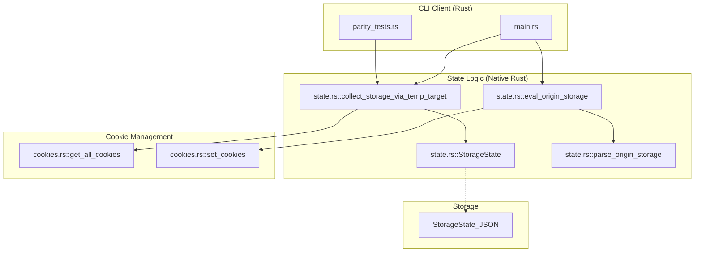
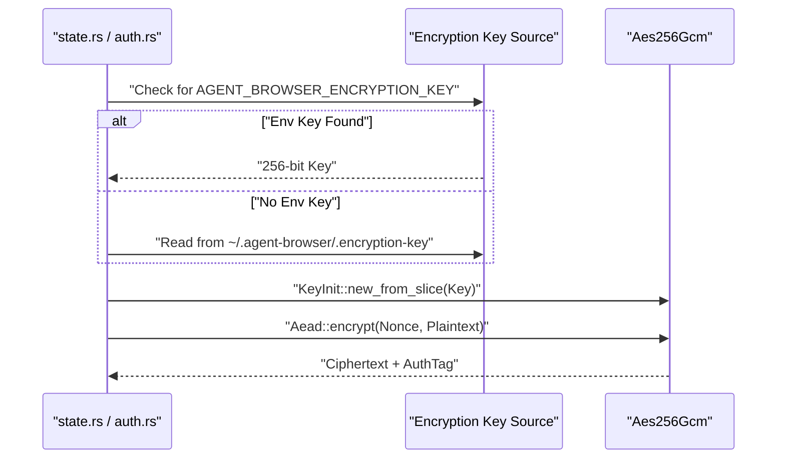

# Sessions and State

관련 소스 파일

다음 파일들이 이 위키 페이지를 생성하기 위한 컨텍스트로 사용되었습니다.

- [cli/src/native/cookies.rs](cli/src/native/cookies.rs)
- [cli/src/native/state.rs](cli/src/native/state.rs)
- [docs/src/app/diffing/page.mdx](docs/src/app/diffing/page.mdx)
- [docs/src/app/ios/page.mdx](docs/src/app/ios/page.mdx)
- [docs/src/app/sessions/page.mdx](docs/src/app/sessions/page.mdx)
- [skill-data/core/references/session-management.md](skill-data/core/references/session-management.md)

이 문서는 daemon lifecycle management, state auto-save/load, AES-256-GCM encryption을 포함해 `agent-browser`의 session isolation과 state persistence mechanism을 설명합니다.

---

## Session Types

`agent-browser`는 persistence 수준이 점점 높아지는 세 가지 session type을 제공합니다.

| Session Type | Flag | Persistence | Use Case |
|--------------|------|-------------|----------|
| **Default** | _(none)_ | 없음 | 빠른 one-off automation task |
| **Named** | `--session <name>` | Runtime only (daemon isolation) | state reuse 없는 parallel automation |
| **Persistent** | `--session-name <name>` | restart 간 auto-save/restore | long-running workflow, authenticated session |

### Default Session
session flag가 제공되지 않으면 daemon은 `"default"`라는 session name을 사용합니다. state는 browser lifetime 동안 memory에만 존재하며 browser가 닫히면 손실됩니다. [skill-data/core/references/session-management.md:136-145]()

### Named Sessions
`--session` flag는 별도의 daemon process를 spawn하여 browser context를 isolate합니다. 각 session은 자체 socket/PID file을 가집니다. state는 각 daemon 내부 memory에만 존재하며, 독립적인 cookie, storage, history를 제공합니다. [skill-data/core/references/session-management.md:17-41](), [docs/src/app/sessions/page.mdx:3-22]()

### Persistent Sessions
`--session-name` flag(또는 manual `state save`/`state load` command)는 state save/restore를 활성화합니다. 요청 시 cookie, `localStorage`, `sessionStorage`가 capture되어 JSON file에 저장됩니다. 다음 launch 시 state를 자동으로 restore하여 authenticated session을 계속할 수 있습니다. [skill-data/core/references/session-management.md:43-60](), [docs/src/app/sessions/page.mdx:131-147]()

---

## Session Lifecycle and Code Entities

다음 다이어그램은 session management logic을 코드베이스 내의 특정 function과 file에 매핑합니다.

**Diagram: Session Lifecycle and Code Entities**

**출처:** [cli/src/native/state.rs:17-38](), [cli/src/native/state.rs:112-141](), [skill-data/core/references/session-management.md:62-72]()

---

## State Persistence Mechanism

### Storage State Structure
`StorageState` struct는 session save 중 capture되는 항목을 정의합니다. 여기에는 모든 cookie와 origin별 storage가 포함됩니다. [cli/src/native/state.rs:17-22]()

| Component | Code Entity | Description |
|-----------|-------------|-------------|
| **Cookies** | `Vec<Cookie>` | `cookies::get_all_cookies`를 통해 capture됩니다. [cli/src/native/cookies.rs:27-38]() |
| **Origins** | `Vec<OriginStorage>` | associated storage가 있는 domain 목록입니다. [cli/src/native/state.rs:24-31]() |
| **LocalStorage** | `Vec<StorageEntry>` | JS injection을 통해 추출된 key-value pair입니다. [cli/src/native/state.rs:33-38]() |
| **SessionStorage**| `Vec<StorageEntry>` | JS injection을 통해 추출된 transient storage입니다. [cli/src/native/state.rs:35-38]() |

### Auto-Save/Load Flow
여러 origin(iframe 내부 origin 포함)에서 state를 capture하기 위해 시스템은 `collect_storage_via_temp_target`을 사용합니다. 이는 temporary CDP target을 생성하고, 발견된 각 origin으로 navigation한 뒤 `Fetch.enable`을 사용해 request를 intercept합니다. 이 방식은 실제 network에 접근하지 않고 blank HTML을 serve하여 storage를 빠르게 추출합니다. [cli/src/native/state.rs:112-141](), [cli/src/native/state.rs:169-178]()

state를 load할 때:
1. 시스템은 state file을 읽습니다(encrypted 상태라면 decrypt합니다). [cli/src/native/state.rs:1-5]()
2. cookie는 `cookies::set_cookies`를 통해 `Network.setCookies`로 restore됩니다. [cli/src/native/cookies.rs:62-93]()
3. storage entry는 `eval_origin_storage` function을 사용해 `Runtime.evaluate`를 통해 각 origin에 inject됩니다. [cli/src/native/state.rs:88-107]()

**출처:** [cli/src/native/state.rs:17-107](), [cli/src/native/state.rs:112-180](), [cli/src/native/cookies.rs:62-93]()

---

## Encryption and Security

### AES-256-GCM Implementation
`agent-browser`는 session state file과 authentication profile에 AES-256-GCM encryption을 지원합니다. encryption은 key derivation을 위해 `Sha256`과 함께 `aes_gcm` crate를 사용합니다. [cli/src/native/state.rs:1-5]()

**Diagram: Encryption Key Resolution and Data Flow**

**출처:** [cli/src/native/state.rs:1-8](), [docs/src/app/sessions/page.mdx:164-181](), [skill-data/core/references/session-management.md:178-187]()

---

## Session Isolation Properties

named 또는 default 여부와 관계없이 각 session은 다음 browser data의 독립 instance를 유지합니다.
*   **Cookies**: `get_all_cookies`와 `set_cookies`를 사용해 `Network` CDP domain으로 관리됩니다. [cli/src/native/cookies.rs:27-60](), [cli/src/native/cookies.rs:62-93]()
*   **Storage**: `localStorage`와 `sessionStorage`는 origin 및 session별로 isolate되며, `OriginStorage` struct에 저장됩니다. [cli/src/native/state.rs:24-38]()
*   **Network State**: cache와 session은 서로 다른 `--session` identifier 간에 공유되지 않습니다. [skill-data/core/references/session-management.md:33-41]()

## Chrome Profile Reuse
manual state file 없이 기존 login state를 사용하려면 `--profile` flag를 통해 Chrome profile을 temporary directory로 복사해 read-only snapshot 용도로 사용할 수 있습니다. [docs/src/app/sessions/page.mdx:33-49]()

| Detail | Description |
|-----------|-------------|
| **Supported** | Chrome, Chromium, Brave |
| **Persistence** | original profile은 수정되지 않으며, temp copy는 close 시 삭제됩니다 |
| **Content** | cookie, localStorage, extension state |

**출처:** [docs/src/app/sessions/page.mdx:33-62](), [cli/src/native/state.rs:17-38](), [cli/src/native/cookies.rs:27-60](), [skill-data/core/references/session-management.md:33-41](), [skill-data/core/references/session-management.md:157-186]()
