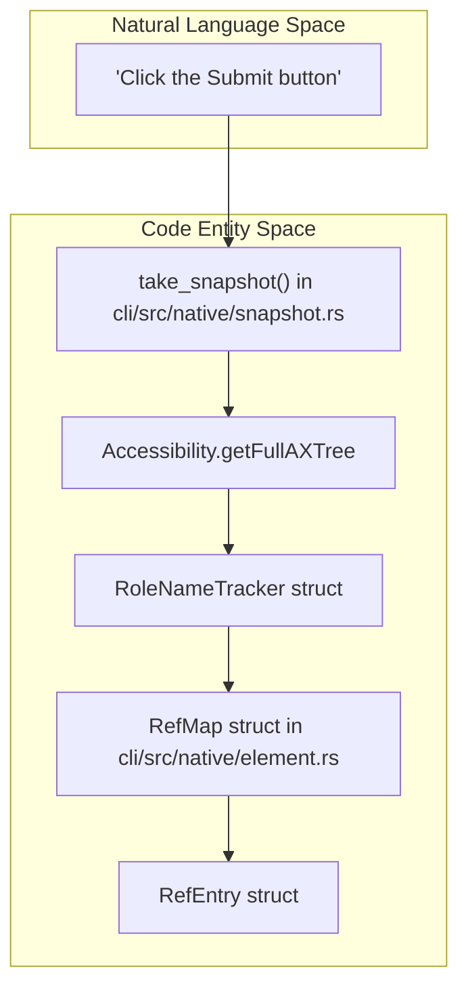
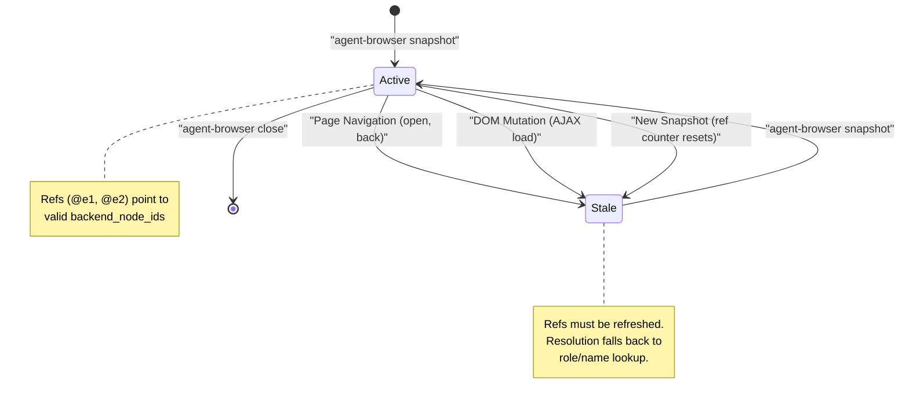
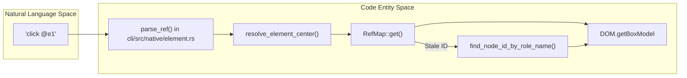

# Element References (Refs)

<details>
<summary>관련 소스 파일</summary>

다음 파일들이 이 위키 페이지를 생성하기 위한 컨텍스트로 사용되었습니다.

- [cli/src/native/actions.rs](cli/src/native/actions.rs)
- [cli/src/native/browser.rs](cli/src/native/browser.rs)
- [cli/src/native/e2e_tests.rs](cli/src/native/e2e_tests.rs)
- [cli/src/native/element.rs](cli/src/native/element.rs)
- [cli/src/native/interaction.rs](cli/src/native/interaction.rs)
- [cli/src/native/screenshot.rs](cli/src/native/screenshot.rs)
- [cli/src/native/snapshot.rs](cli/src/native/snapshot.rs)
- [skill-data/core/references/snapshot-refs.md](skill-data/core/references/snapshot-refs.md)

</details>


Element reference(ref)는 snapshot의 특정 element를 가리키는 `@e1`, `@e2`, `@e3` 같은 안정적인 identifier입니다. 잠재적으로 모호한 selector로 DOM을 다시 query하는 대신, snapshot 시점에 보이는 정확한 element에 binding하여 AI 에이전트를 위한 결정적 element selection을 가능하게 합니다.

**범위**: 이 페이지는 ref system의 목적, 생성, lifecycle, 사용법을 다룹니다. snapshot command 자체와 filtering option은 [Snapshots (4.3)](4.3.md)을 참조하세요. ref를 사용하는 element interaction command는 [Element Interaction (5.2)](5.2.md)를 참조하세요.

---

## Ref란 무엇인가?

ref는 snapshot generation 중 element에 할당되는 짧은 identifier입니다. `@e` 뒤에 sequential number가 붙는 pattern을 따릅니다.

```
@e1  →  first interactive element
@e2  →  second interactive element
@e3  →  third interactive element
```

각 ref는 저장된 `RefEntry` structure [cli/src/native/element.rs:8-16]()를 통해 특정 element에 매핑되며, 이 structure는 각 ref ID를 다음 정보와 연결합니다.

- **backend_node_id**: 특정 DOM node에 대해 Chrome DevTools Protocol(CDP)이 제공하는 unique ID.
- **role**: ARIA role(예: `button`, `textbox`, `link`).
- **name**: accessible name(예: `"Submit"`, `"Email"`).
- **nth**: 중복된 role/name pair를 구분하기 위한 optional index.
- **frame_id**: 해당되는 경우 element를 포함하는 iframe의 ID.

snapshot output 예시 [skill-data/core/references/snapshot-refs.md:41-61]():

```bash
@e1 [header]
  @e2 [nav]
    @e3 [a] "Home"
@e4 [button] "Sign In"
```

이 snapshot을 생성한 뒤에는 ref를 사용해 element와 상호작용할 수 있습니다 [skill-data/core/references/snapshot-refs.md:63-79]().

```bash
agent-browser click @e4
agent-browser fill @e3 "user@example.com"
```

**출처**: [cli/src/native/element.rs:8-16](), [cli/src/native/element.rs:18-21](), [skill-data/core/references/snapshot-refs.md:41-79]()

---

## CSS Selector 대신 Ref를 사용하는 이유

| Aspect | Refs (`@e1`) | CSS Selectors (`#submit`) |
|--------|--------------|---------------------------|
| **Deterministic** | `backend_node_id`를 통해 snapshot의 정확한 element를 가리킵니다 | 여러 element와 match되거나 변경될 수 있습니다 |
| **Speed** | direct CDP node resolution을 통한 fast path | DOM querying과 selector parsing이 필요합니다 |
| **Stability** | node가 stale이면 role/name lookup으로 fallback합니다 | DOM structure가 바뀌면 조용히 깨집니다 |
| **AI-Friendly** | compact notation이 token usage를 줄입니다 | agent가 복잡한 selector를 구성해야 합니다 |
| **Disambiguation** | `nth` index와 role/name tracking으로 자동 처리됩니다 | manual `:nth-of-type()` construction이 필요합니다 |

주요 장점은 **determinism**입니다. agent가 snapshot을 생성하고 `@e2`를 보았다면, `@e2`를 click하는 것은 underlying HTML structure가 복잡하거나 dynamic하더라도 그 특정 element를 target하도록 보장됩니다 [skill-data/core/references/snapshot-refs.md:17-27]().

**출처**: [skill-data/core/references/snapshot-refs.md:17-27](), [cli/src/native/element.rs:149-209]()

---

## Ref Generation Process

generation process는 CDP가 제공하는 accessibility tree를 순회하는 `take_snapshot` function [cli/src/native/snapshot.rs:216-223]() 중 발생합니다.

### Ref Assignment Logic



**출처**: [cli/src/native/snapshot.rs:216-230](), [cli/src/native/snapshot.rs:185-214](), [cli/src/native/element.rs:18-21]()

---

### Interactive and Content Roles

ref는 node의 ARIA role을 기준으로 자동 할당됩니다. 시스템은 element가 actionable한지 아니면 단순 content인지를 판단하기 위해 role을 분류합니다.

- **Interactive Roles**: `button`, `link`, `textbox`, `checkbox`, `radio`, `combobox`, `listbox`, `menuitem`, `option`, `searchbox`, `slider`, `spinbutton`, `switch`, `tab`, `treeitem`, `Iframe` [cli/src/native/snapshot.rs:11-30]().
- **Content Roles**: `heading`, `cell`, `gridcell`, `columnheader`, `rowheader`, `listitem`, `article`, `region`, `main`, `navigation` [cli/src/native/snapshot.rs:32-43]().

**출처**: [cli/src/native/snapshot.rs:11-43]()

---

### Duplicate Handling

여러 element가 같은 role과 name을 가질 때(예: 세 개의 "Delete" button), `RoleNameTracker` [cli/src/native/snapshot.rs:185-188]()가 uniqueness를 보장하기 위해 `nth` index를 할당합니다.

```rust
struct RoleNameTracker {
    counts: HashMap<String, usize>,
    entries: Vec<(usize, String)>,
}
```

**예시**:
1. `@e1 [button] "Delete" (nth: 0)`
2. `@e2 [button] "Delete" (nth: 1)`

이 metadata는 `RefMap`에 저장되며, `backend_node_id`가 stale해지더라도 올바른 element를 찾기 위해 resolution 중 사용됩니다 [cli/src/native/element.rs:31-62]().

**출처**: [cli/src/native/snapshot.rs:198-205](), [cli/src/native/element.rs:31-62]()

---

## Ref Lifecycle and Invalidation

ref는 page의 현재 state에 대해서만 유효합니다. 특정 DOM node와 accessibility tree position에 묶여 있기 때문에 중요한 page change가 발생하면 invalidation됩니다 [skill-data/core/references/snapshot-refs.md:81-96]().



### Stale Ref Fallback
stale `backend_node_id`를 가진 ref로 command가 실행되면, 시스템은 `find_node_id_by_role_name` function [cli/src/native/element.rs:186-195]()을 통해 저장된 `role`, `name`, `nth` index를 사용한 **fallback lookup**을 시도합니다. 이를 통해 ref system은 page의 semantic structure를 바꾸지 않는 minor DOM update에 더 resilient해집니다.

**출처**: [cli/src/native/element.rs:149-209](), [skill-data/core/references/snapshot-refs.md:81-96]()

---

## Command에서 Ref 사용하기

### Resolution Logic

`click @e1` 같은 command가 실행되면 [cli/src/native/interaction.rs:28-36](), `resolve_element_center` [cli/src/native/element.rs:149-155]() 또는 `resolve_element_object_id` [cli/src/native/element.rs:216-222]() function이 호출되어 ref string을 사용 가능한 CDP target으로 변환합니다.



**Ref-to-CDP Resolution**

**출처**: [cli/src/native/element.rs:124-147](), [cli/src/native/element.rs:149-209](), [cli/src/native/element.rs:216-260](), [cli/src/native/interaction.rs:28-58]()

---

## Iframe Support

snapshot은 iframe content를 자동으로 detect하고 inline합니다 [skill-data/core/references/snapshot-refs.md:165-182](). main frame의 각 `Iframe` node가 resolve되고, 그 child accessibility tree가 바로 아래에 포함됩니다.

- **Automatic Context**: iframe 내부 element에 할당된 ref는 `frame_id`를 가집니다 [cli/src/native/element.rs:15-16]().
- **Transparent Interaction**: `click @e3`를 실행할 때(`@e3`가 iframe 내부에 있는 경우), 시스템은 CDP command를 보내기 전에 해당 iframe에 맞는 올바른 `effective_session_id`를 자동으로 resolve합니다 [cli/src/native/element.rs:161-163]().
- **Limitation**: iframe nesting은 한 level만 확장됩니다 [skill-data/core/references/snapshot-refs.md:185]().

**출처**: [cli/src/native/snapshot.rs:216-223](), [cli/src/native/element.rs:161-163](), [skill-data/core/references/snapshot-refs.md:165-185]()

---

## Annotated Screenshots

`screenshot` command의 `--annotate` flag는 ref system을 사용해 page에 visual label을 그립니다 [cli/src/native/screenshot.rs:100-106]().

1. **Collect**: 시스템은 `entries_sorted()` [cli/src/native/screenshot.rs:236]()를 통해 현재 `RefMap`을 순회합니다.
2. **Measure**: `collect_annotations` [cli/src/native/screenshot.rs:231-255]()를 통해 각 ref에 대해 `DOM.getBoxModel`을 호출하여 좌표를 찾습니다.
3. **Inject**: temporary HTML overlay(`__agent_browser_annotations__`)가 `inject_annotation_overlay` [cli/src/native/screenshot.rs:127]()를 통해 page에 inject됩니다.
4. **Capture**: `@e1`, `@e2`와 matching되는 numbered label `[1]`, `[2]` 등이 포함된 screenshot이 촬영됩니다.
5. **Clean**: overlay는 `remove_annotation_overlay` [cli/src/native/screenshot.rs:137]()를 통해 즉시 제거됩니다.

**출처**: [cli/src/native/screenshot.rs:100-169](), [cli/src/native/screenshot.rs:11-12](), [cli/src/native/element.rs:89-104]()
