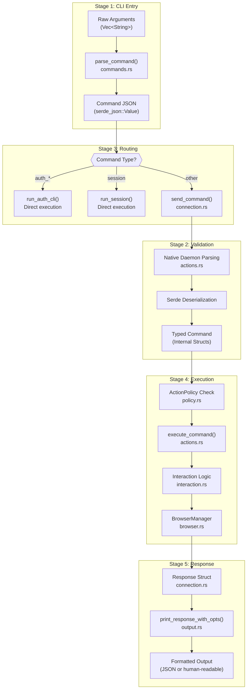
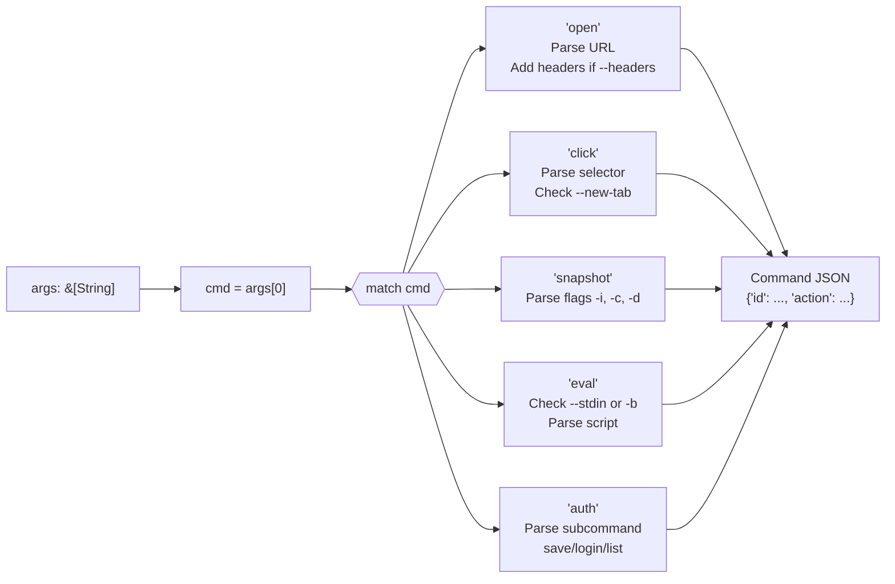
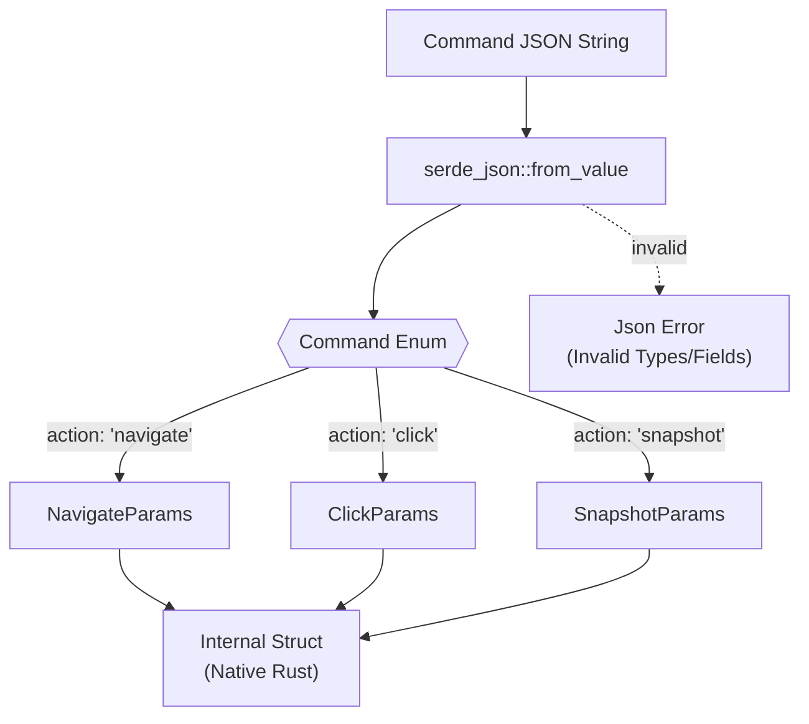
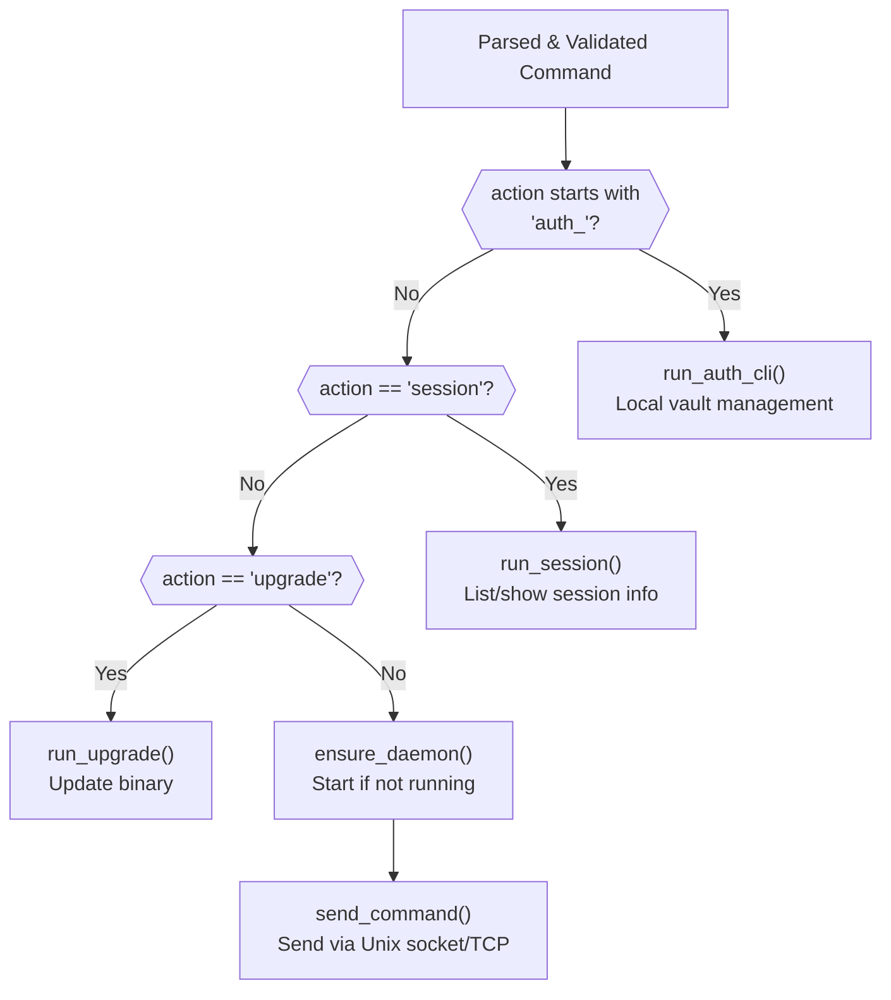
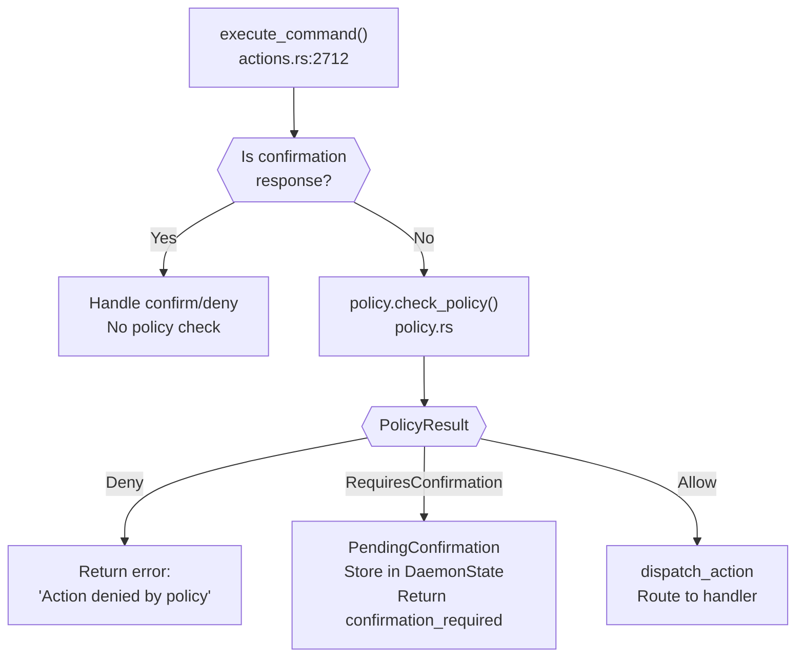
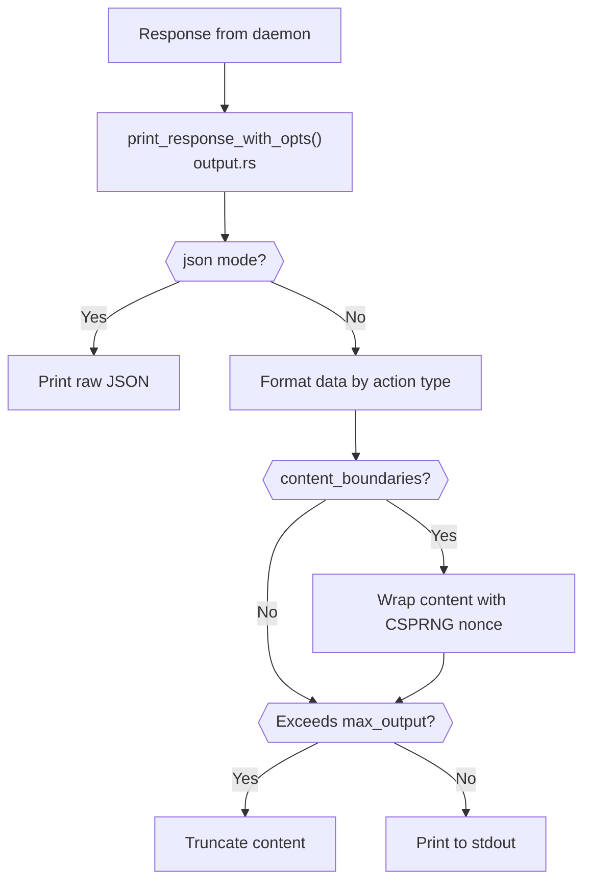
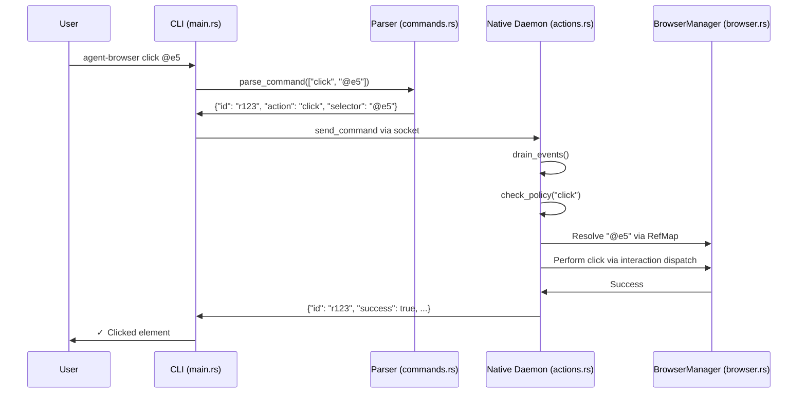

# Command Execution Flow

<details>
<summary>관련 소스 파일</summary>

다음 파일들이 이 위키 페이지를 생성하기 위한 컨텍스트로 사용되었습니다.

- [cli/src/commands.rs](cli/src/commands.rs)
- [cli/src/connection.rs](cli/src/connection.rs)
- [cli/src/flags.rs](cli/src/flags.rs)
- [cli/src/main.rs](cli/src/main.rs)
- [cli/src/native/actions.rs](cli/src/native/actions.rs)
- [cli/src/native/browser.rs](cli/src/native/browser.rs)
- [cli/src/native/e2e_tests.rs](cli/src/native/e2e_tests.rs)

</details>


## 목적과 범위

이 페이지는 command가 CLI input에서 전체 execution pipeline을 거쳐 흐르는 방식을 추적합니다. parsing, validation, daemon routing, policy enforcement, browser execution, response formatting을 포함합니다. 이는 안전하고 검증된 browser automation을 가능하게 하는 multi-stage architecture를 설명합니다.

특정 command syntax와 parameter는 [Command Reference]()를 참조하세요. authentication 관련 command handling은 [Authentication]()을 참조하세요. session management internals는 [Sessions and State]()를 참조하세요.

---

## 개요: Five-Stage Pipeline

command는 user input에서 최종 output까지 다섯 개의 구분된 stage를 통과합니다. 각 stage는 특정 responsibility를 가지며, command가 browser에 도달하기 전에 reject할 수 있습니다.

### Pipeline Architecture Diagram



**출처**: [cli/src/main.rs:445-580](), [cli/src/commands.rs:26-26](), [cli/src/native/actions.rs:2712-3214](), [cli/src/connection.rs:22-36]()

---

## Stage 1: CLI Entry and Parsing

### Argument Collection

CLI entry point는 raw argument를 수집하고 parsing layer에 위임합니다.

| Step | Function | File | Purpose |
|------|----------|------|---------|
| 1 | `main()` | [cli/src/main.rs:445-460]() | entry point, args 수집 |
| 2 | `parse_flags()` | [cli/src/flags.rs:245-420]() | args에서 flag 추출 |
| 3 | `clean_args()` | [cli/src/flags.rs:435-460]() | flag 제거, command 유지 |
| 4 | `parse_command()` | [cli/src/commands.rs:74-89]() | JSON command로 parse |

### Command Parsing Logic

`parse_command()` function은 command name을 structured JSON에 매핑하는 큰 match statement를 포함한 `parse_command_inner()`에 위임합니다. [cli/src/commands.rs:74-110]()



**Command JSON Structure**: 모든 command는 다음을 포함합니다.
- `id`: `gen_id()`를 통해 생성되는 unique request ID [cli/src/commands.rs:63-72]()
- `action`: action name(protocol schema와 일치)
- action별 additional field

**출처**: [cli/src/commands.rs:74-763](), [cli/src/commands.rs:63-72]()

### 예시: Click Command Parsing

click command parsing은 일반적인 pattern을 보여줍니다.

[cli/src/commands.rs:158-172]()

```rust
"click" => {
    let new_tab = rest.contains(&"--new-tab");
    let sel = rest
        .iter()
        .find(|arg| **arg != "--new-tab")
        .ok_or_else(|| ParseError::MissingArguments {
            context: "click".to_string(),
            usage: "click <selector> [--new-tab]",
        })?;
    if new_tab {
        Ok(json!({ "id": id, "action": "click", "selector": sel, "newTab": true }))
    } else {
        Ok(json!({ "id": id, "action": "click", "selector": sel }))
    }
}
```

**Error Handling**: parse error는 contextual information과 usage hint가 포함된 `ParseError` enum variant를 반환합니다. [cli/src/commands.rs:9-61]()

**출처**: [cli/src/commands.rs:9-61](), [cli/src/commands.rs:158-172]()

---

## Stage 2: Schema Validation (Native Daemon)

### Protocol Schema System

native Rust daemon에서 command는 JSON에서 strongly-typed structure로 deserialize됩니다. validation은 `execute_command` lifecycle 내 `serde_json` parsing phase 중 발생합니다.



**출처**: [cli/src/native/actions.rs:2712-2800](), [cli/src/connection.rs:22-36]()

---

## Stage 3: Command Routing

### Routing Decision Tree

모든 command가 daemon으로 가는 것은 아닙니다. CLI는 보안과 효율성을 위해 일부 command를 local에서 처리합니다.



**출처**: [cli/src/main.rs:520-580](), [cli/src/main.rs:184-228](), [cli/src/connection.rs:270-350]()

### IPC Communication

daemon으로 routed된 command는 inter-process communication을 위해 Unix domain socket(또는 Windows의 TCP)을 사용합니다.

| Component | Function | Purpose |
|-----------|----------|---------|
| `ensure_daemon()` | [cli/src/connection.rs:270-350]() | daemon이 실행 중이 아니면 시작하고 PID를 validate |
| `send_command()` | [cli/src/connection.rs:360-420]() | JSON command를 보내고 response를 읽음 |
| `get_socket_dir()` | [cli/src/connection.rs:93-115]() | 우선순위: ENV > XDG > Home > Tmp |

**출처**: [cli/src/connection.rs:93-115](), [cli/src/connection.rs:360-420]()

---

## Stage 4: Policy Enforcement and Execution

### Policy Check Flow

browser action을 실행하기 전에 daemon은 `ActionPolicy`를 사용해 policy check를 수행합니다. 이를 통해 위험한 operation을 gate할 수 있습니다.



**출처**: [cli/src/native/actions.rs:2712-2850](), [cli/src/native/policy.rs:29-29]()

### Command Execution Lifecycle

`execute_command` function은 event draining과 state update를 포함한 전체 lifecycle을 관리합니다. [cli/src/native/actions.rs:2712-2730]()

1. **Event Draining**: 다음 command 전에 pending CDP event(target creation, target destruction, iframe attachment 등)를 처리하기 위해 `drain_events`가 호출됩니다. [cli/src/native/actions.rs:166-175]()
2. **Policy Check**: `ActionPolicy`에 대해 action을 validate합니다 [cli/src/native/actions.rs:29-29]().
3. **Dispatch**: 특정 logic(예: `interaction` dispatch [cli/src/native/actions.rs:27-27]())으로 route합니다.
4. **Result Handling**: `Response` struct를 formatting합니다.

**출처**: [cli/src/native/actions.rs:2712-3214](), [cli/src/native/actions.rs:166-175](), [cli/src/native/actions.rs:29-29]()

---

## Stage 5: Response Formatting

### Response Structure

모든 command는 `connection.rs`에 정의된 표준화된 `Response` object를 반환합니다.

[cli/src/connection.rs:29-36]()

```rust
pub struct Response {
    pub success: bool,
    pub data: Option<Value>,
    pub error: Option<String>,
    #[serde(skip_serializing_if = "Option::is_none")]
    pub warning: Option<String>,
}
```

### Output Formatting Pipeline

CLI는 `OutputOptions`(JSON vs human-readable)를 기준으로 response를 formatting하고, optional content boundary와 truncation을 적용합니다.



**출처**: [cli/src/output.rs:33-35](), [cli/src/main.rs:33-35]()

---

## Complete Flow: Click Command Example

### End-to-End Trace

`agent-browser click @e5`의 trace:



**출처**: [cli/src/main.rs:445-580](), [cli/src/native/actions.rs:2712-3214](), [cli/src/native/browser.rs:13-13]()
