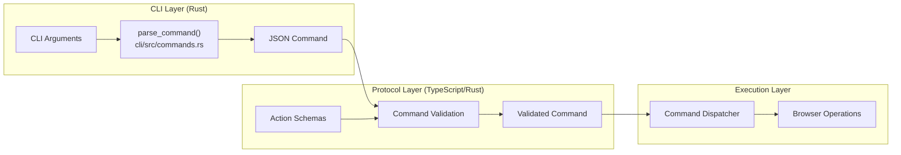
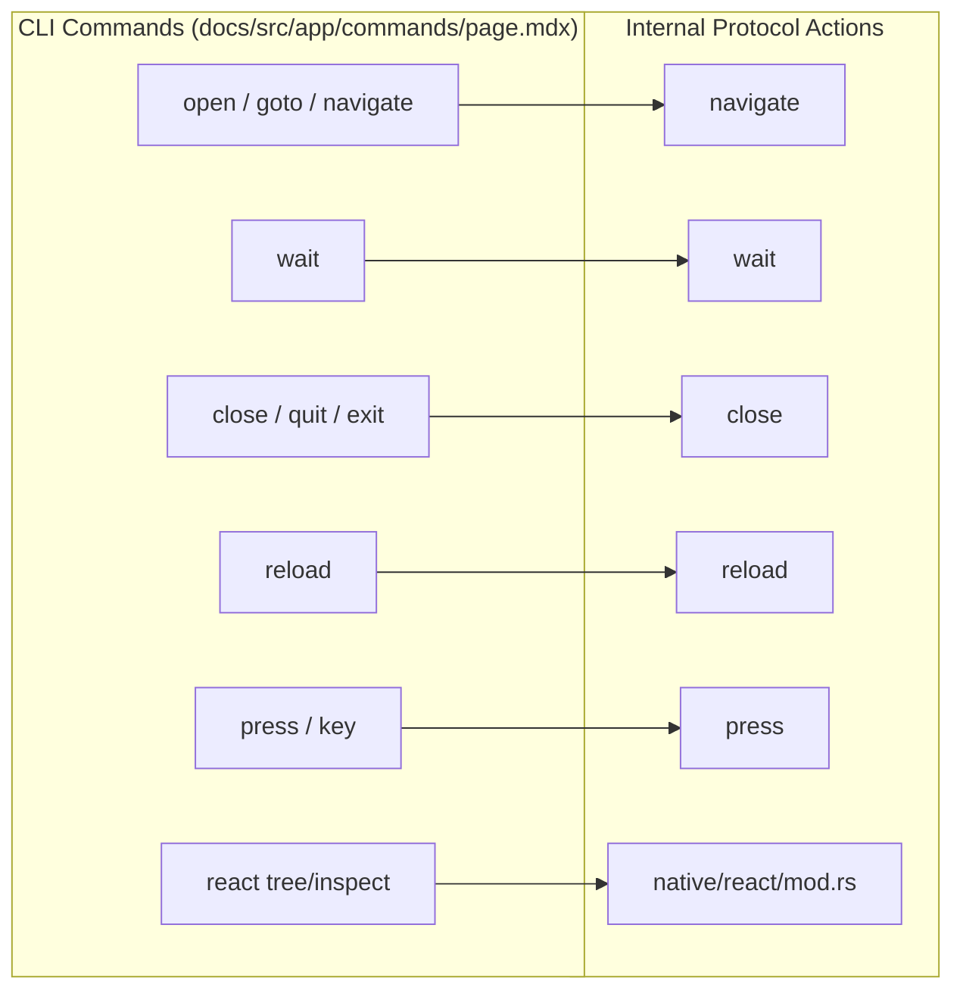
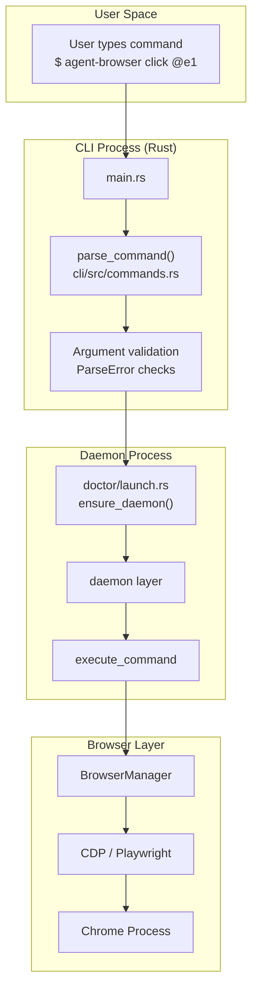

# Command Reference

<details>
<summary>관련 소스 파일</summary>

다음 파일들이 이 위키 페이지를 생성하기 위한 컨텍스트로 사용되었습니다.

- [cli/src/commands.rs](cli/src/commands.rs)
- [cli/src/doctor/launch.rs](cli/src/doctor/launch.rs)
- [cli/src/native/react/mod.rs](cli/src/native/react/mod.rs)
- [docs/src/app/commands/page.mdx](docs/src/app/commands/page.mdx)
- [docs/src/app/react/page.mdx](docs/src/app/react/page.mdx)
- [skill-data/core/SKILL.md](skill-data/core/SKILL.md)
- [skill-data/core/references/commands.md](skill-data/core/references/commands.md)
- [skill-data/core/references/video-recording.md](skill-data/core/references/video-recording.md)
- [skills/agent-browser/SKILL.md](skills/agent-browser/SKILL.md)

</details>


이 페이지는 `agent-browser`에서 사용할 수 있는 모든 command에 대한 종합 reference를 제공합니다. command는 기능 category별로 구성되어 있으며 syntax, parameter, behavior와 함께 문서화되어 있습니다.

특정 command category의 자세한 문서는 다음 section을 참조하세요.
- **Navigation and Browser Control** ([Navigation and Browser Control](#5.1)) — browser lifecycle, navigation, viewport, setting.
- **Element Interaction** ([Element Interaction](#5.2)) — clicking, typing, filling, scrolling, dragging.
- **Information Retrieval** ([Information Retrieval](#5.3)) — page content, element property, screenshot, PDF 가져오기.
- **State and Session Management** ([State and Session Management](#5.4)) — cookie, storage, state persistence, session isolation.
- **Authentication** ([Authentication](#5.5)) — credential vault와 automated login.

command behavior에 영향을 주는 configuration option은 [Configuration](#2.3)을 참조하세요. CLI와 daemon 사이의 communication protocol은 [Communication Protocol](#3.5)을 참조하세요.

---

## Command Structure

`agent-browser`의 command는 일관된 two-stage parsing model을 따릅니다. CLI syntax는 먼저 Rust client에서 JSON command object로 parsing된 다음, 실행 전에 daemon이 schema에 맞춰 validate합니다.

### CLI to JSON Transformation

CLI는 사람이 읽을 수 있는 shell syntax의 command를 받습니다.

```bash
agent-browser click @e1
agent-browser fill @e2 "user@example.com"
agent-browser wait --load networkidle
```

`cli/src/main.rs` [cli/src/main.rs:1-31]()의 CLI entry point는 `cli/src/commands.rs`에 정의된 command parsing logic을 사용합니다. 내부 logic은 이를 daemon용 structured JSON command로 변환합니다.

```json
{"id": "r123456", "action": "click", "selector": "@e1"}
{"id": "r123457", "action": "fill", "selector": "@e2", "value": "user@example.com"}
{"id": "r123458", "action": "waitforloadstate", "state": "networkidle"}
```

각 command는 request/response correlation을 위해 `gen_id()` [cli/src/commands.rs:63-72]()가 생성한 unique `id`를 받습니다.

### JSON Protocol Schema

daemon은 모든 command를 schema에 맞춰 validate합니다. 각 action에는 parameter type과 constraint를 강제하는 대응 schema가 있습니다.



**Diagram: Command Parsing and Validation Pipeline**

출처: [cli/src/commands.rs:63-72](), [cli/src/main.rs:1-31]()

---

## Command Categories Overview

command는 functional category로 구성되어 있습니다. 다음 table은 core command list [docs/src/app/commands/page.mdx:3-183]()를 기준으로 일반적인 CLI entry point의 고수준 map을 제공합니다.

| Category | CLI Commands | Documentation |
|----------|--------------|---------------|
| Navigation | `open`, `back`, `forward`, `reload`, `connect` | [Navigation and Browser Control](#5.1) |
| Element Interaction | `click`, `fill`, `type`, `hover`, `drag`, `select` | [Element Interaction](#5.2) |
| Keyboard Input | `press`, `keydown`, `keyup`, `keyboard type` | [Element Interaction](#5.2) |
| Scrolling | `scroll`, `scrollintoview` | [Element Interaction](#5.2) |
| Waiting | `wait` (`--load`, `--text`, `--url` 같은 flag 포함) | [Element Interaction](#5.2) |
| Information | `get` (text, html, value, attr, title, url), `is` | [Information Retrieval](#5.3) |
| Capture | `screenshot`, `pdf`, `snapshot` | [Information Retrieval](#5.3) |
| Cookies/Storage | `cookies`, `storage` | [State and Session Management](#5.4) |
| Authentication | `auth`, `state save`, `state load` | [Authentication](#5.5) |
| Tabs/Windows | `tab` | [Navigation and Browser Control](#5.1) |
| Network | `network route`, `network list` | [Navigation and Browser Control](#5.1) |
| Browser Settings | `set` (viewport, device, geo, offline, headers) | [Navigation and Browser Control](#5.1) |
| Semantic Locators | `find` (role, text, label, placeholder, alt) | [Element Interaction](#5.2) |
| Specialized | `react`, `vitals`, `record` | [Information Retrieval](#5.3) |

출처: [docs/src/app/commands/page.mdx:3-183](), [skill-data/core/references/commands.md:5-185](), [docs/src/app/react/page.mdx:18-29](), [skill-data/core/references/video-recording.md:34-46]()

---

## Command Parsing Details

### Parse Error Types

CLI는 `ParseError` enum [cli/src/commands.rs:10-31]()을 통해 invalid command에 대한 structured error message를 제공합니다.

| Error Type | Trigger |
|------------|---------|
| `UnknownCommand` | command가 존재하지 않음 |
| `UnknownSubcommand` | valid command에 대한 invalid subcommand |
| `MissingArguments` | required argument 누락 |
| `InvalidValue` | argument value가 validation 실패 |
| `InvalidSessionName` | session name에 path traversal 또는 invalid character 포함 |

### Advanced Parsing: Cookies

CLI에는 `parse_curl_cookies` [cli/src/commands.rs:85-127]() 같은 complex input용 specialized parser가 포함되어 있습니다. 이 parser는 bulk cookie import를 위해 JSON array, cURL dump(예: DevTools에서 복사한 값), bare header 같은 format을 자동 감지합니다 [cli/src/commands.rs:74-84]().

출처: [cli/src/commands.rs:10-31](), [cli/src/commands.rs:85-127]()

---

## Command Identifier Generation

각 command는 `gen_id()` [cli/src/commands.rs:63-72]()가 생성한 unique identifier를 받습니다. ID format은 `r<microseconds>`이며, microseconds는 Unix epoch time을 1000000으로 나눈 나머지의 마지막 6자리입니다. 이는 CLI client와 daemon 사이의 request/response correlation을 제공합니다.

출처: [cli/src/commands.rs:63-72]()

---

## Command-to-Action Mapping

다음 다이어그램은 user-facing command가 internal protocol action으로 매핑되는 방식을 보여줍니다.



**Diagram: Command Aliases and Action Dispatch**

### Notable Patterns

**Command Aliases:** 여러 CLI command가 같은 action에 매핑되어 agent와 사람을 위한 flexible interface를 제공합니다.
- `open`, `goto`, `navigate` → `navigate` [docs/src/app/commands/page.mdx:7]()
- `close`, `quit`, `exit` → `close` [docs/src/app/commands/page.mdx:37]()
- `press`, `key` → `press` [skill-data/core/references/commands.md:59]()

**Stable Tab IDs:** tab은 닫힌 tab 때문에 오류가 발생하는 것을 방지하기 위해 positional index 대신 `t1`, `t2` 같은 stable string ID를 사용합니다 [docs/src/app/commands/page.mdx:181]().

출처: [docs/src/app/commands/page.mdx:6-38](), [skill-data/core/references/commands.md:5-185]()

---

## Command Execution Architecture

다음 다이어그램은 CLI invocation에서 browser execution까지의 전체 흐름을 보여줍니다.



**Diagram: End-to-End Command Execution Flow**

출처: [cli/src/main.rs:1-31](), [cli/src/commands.rs:10-31](), [cli/src/doctor/launch.rs:87-101]()

---

## For More Information

- **Detailed Command Syntax**: 전체 reference documentation은 child page [Navigation and Browser Control](#5.1)부터 [Authentication](#5.5)까지를 참조하세요.
- **Configuration Options**: command behavior를 수정하는 flag는 [Configuration](#2.3)을 참조하세요.
- **Security Controls**: destructive command를 gate하는 방법은 [Action Policies](#6.3)를 참조하세요.
- **Element References**: `@e1` style selector를 이해하려면 [Element References (Refs)](#4.2)를 참조하세요.
- **Skills System**: canonical usage guide와 runtime instruction set은 `agent-browser skills get core`를 참조하세요 [skills/agent-browser/SKILL.md:21]().
- **React & Vitals**: React tree와 web standard에 대한 자세한 inspection [cli/src/native/react/mod.rs:1-12]().
