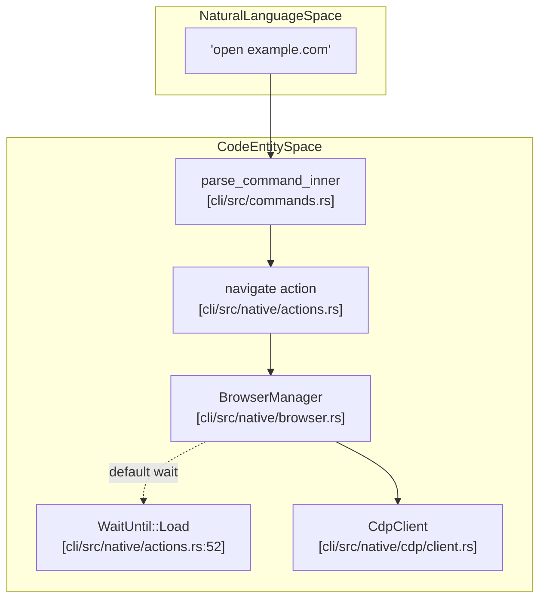
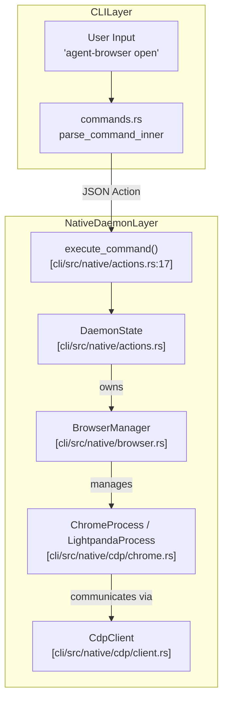

# Navigation and Browser Control

<details>
<summary>관련 소스 파일</summary>

다음 파일들이 이 위키 페이지를 생성하기 위한 컨텍스트로 사용되었습니다.

- [cli/src/commands.rs](cli/src/commands.rs)
- [cli/src/native/actions.rs](cli/src/native/actions.rs)
- [cli/src/native/browser.rs](cli/src/native/browser.rs)
- [cli/src/native/e2e_tests.rs](cli/src/native/e2e_tests.rs)

</details>


이 페이지는 browser navigation, viewport setting, browser-level configuration을 제어하는 command를 문서화합니다. 이 command들은 browser lifecycle, page navigation history, viewport size, device emulation, network condition 같은 environment setting을 관리합니다.

element interaction command(click, type, fill)는 **Element Interaction (5.2)**를 참조하세요. page content와 element property를 가져오는 방법은 **Information Retrieval (5.3)**를 참조하세요. state management와 session은 **State and Session Management (5.4)**를 참조하세요.

## Navigation Commands

navigation command는 page loading과 history traversal을 제어합니다. 시스템은 표준 HTTP/HTTPS URL뿐 아니라 local content와 browser internal을 위한 `file://`, `data:`, `about:`, `chrome://` 같은 special scheme도 지원합니다.

### Navigate (open, goto)

`open` command는 URL로 navigation합니다. CLI와 daemon layer는 안정적인 page load를 보장하기 위해 URL normalization과 wait strategy를 처리합니다.

**CLI Usage:**
```bash
agent-browser open example.com
agent-browser goto https://example.com
agent-browser navigate https://example.com --headers '{"Authorization":"Bearer token"}'
```

**Implementation Detail:**
`AUTH_LOGIN_WAIT_UNTIL` constant는 authentication flow의 default wait strategy를 `WaitUntil::Load`로 정의합니다. persistent background connection을 유지하는 modern SPA에서는 `NetworkIdle`이 신뢰하기 어려울 수 있기 때문입니다. [cli/src/native/actions.rs:52]()

**URL Normalization:**
CLI client는 action을 daemon에 보내기 전에 normalization을 수행합니다. protocol이 지정되지 않으면 기본값은 `https://`입니다. 지원되는 scheme은 `http://`, `https://`, `about:`, `data:`, `file:`, `chrome-extension://`, `chrome://`입니다.

**Next.js Optimization:**
environment-specific router를 detect하여 specialized SPA navigation을 처리합니다. Next.js site의 경우, 시스템은 standard browser history event로 fallback하기 전에 React Server Component(RSC) fetch를 수행하도록 `window.next.router.push` trigger를 시도합니다.

**Navigation Execution Flow:**



**출처:**
- [cli/src/native/actions.rs:52]()
- [cli/src/native/browser.rs:8-15]()
- [cli/src/native/e2e_tests.rs:171-179]()

### History Navigation

CLI는 browser backend 내에서 `CdpClient`를 통해 이 command들을 각각의 protocol action으로 직접 매핑합니다.

**Back:**
```bash
agent-browser back
```
history의 이전 page로 navigation합니다.

**Forward:**
```bash
agent-browser forward
```
history의 다음 page로 navigation합니다.

**Reload:**
```bash
agent-browser reload
```
현재 page를 reload합니다.

## Browser Connection and Lifecycle

### CDP Connection

`connect` command는 Chrome DevTools Protocol(CDP)을 통해 기존 browser instance에 attach합니다. 이는 debugging endpoint를 찾기 위해 `auto_connect_cdp`와 `discover_cdp_url`을 사용합니다. [cli/src/native/browser.rs:8-10]()

**CLI Usage:**
```bash
# Connect to local Chrome with remote debugging on port 9222
agent-browser connect 9222

# Auto-discover running Chrome instance
agent-browser --auto-connect open example.com
```

### Launch Options and Validation

`LaunchOptions` struct는 browser가 시작되는 방식을 정의합니다. invalid configuration을 방지하기 위해 시스템은 process spawn을 시도하기 전에 validation을 수행합니다. [cli/src/native/actions.rs:16-17]()

**Launch Hashing:**
시스템은 `launch_hash`를 사용해 browser relaunch가 필요한 field(`headless` mode, `extensions`, `executable_path` 등)의 hash를 계산합니다. session 내 command 사이에 이러한 field가 변경되면 기존 browser process가 종료되고 새 configuration으로 restart됩니다. [cli/src/native/actions.rs:186-200]()

**Validation Logic:**
- **Extensions/Profiles vs CDP**: remote `cdp_url`에 연결할 때는 local extension이나 profile을 사용할 수 없습니다. [cli/src/native/browser.rs:31-41]()
- **Lightpanda Restrictions**: Lightpanda(high-performance headless engine)는 extension, profile, headed mode, custom Chrome argument를 지원하지 않습니다. [cli/src/native/browser.rs:62-89]()
- **File Access**: `allow_file_access`는 Chromium 기반 browser로 제한되며 `validate_launch_options`에서 validate됩니다. [cli/src/native/browser.rs:48-57]()

**출처:**
- [cli/src/native/actions.rs:186-200]()
- [cli/src/native/browser.rs:21-89]()

### Tab and Target Management

시스템은 `BrowserManager` 내부에서 browser tab을 `PageInfo` object로 추적합니다. [cli/src/native/browser.rs:160-173]()

- **Target Filtering**: AI가 browser internal과 상호작용하지 못하도록 내부 Chrome target(예: `chrome://`, `chrome-extension://`, `devtools://`)은 `should_track_target`을 통해 filtering됩니다. [cli/src/native/browser.rs:93-102]()
- **Tab IDs**: tab은 `format_tab_id`가 생성하는 stable `t<N>` format(예: `t1`, `t2`)을 사용해 식별됩니다. 이는 stable ID와 positional index를 구분합니다. [cli/src/native/browser.rs:178-180]()
- **Labels**: 사용자는 multi-tab workflow에서 더 쉽게 참조하기 위해 tab에 unique label(예: `tab new --label docs`)을 할당할 수 있습니다. label은 session 내에서 unique하며 navigation 간에도 유지됩니다. [cli/src/native/browser.rs:167-171]()

**출처:**
- [cli/src/native/browser.rs:93-180]()

## Viewport and Display

browser의 physical 및 logical display characteristic을 수정하는 command는 `execute_command` pipeline을 통해 dispatch됩니다.

| Command | Description | Example |
| :--- | :--- | :--- |
| `set viewport` | width, height, optional device scale factor(DPR)를 설정합니다. | `set viewport 1920 1080 2` |
| `set device` | 특정 device profile(예: iPhone, Pixel)을 emulate합니다. | `set device "iPhone 14"` |
| `set media` | `prefers-color-scheme` 같은 CSS media feature를 emulate합니다. | `set media dark` |

## Browser Settings

### Network and Environment

- **Geolocation**: browser location API의 coordinate를 설정합니다.
- **Offline Mode**: network availability state를 toggle합니다.
- **HTTP Headers**: 모든 request에 대한 global extra HTTP header를 설정합니다.
- **Basic Auth**: `credentials` action을 통해 HTTP Basic Authentication용 credential을 설정합니다.

## Command Execution Flow

다음 다이어그램은 CLI input에서 native Rust `execute_command` pipeline을 거쳐 browser control logic까지의 data flow를 추적합니다.

**Command Execution Logic Map:**



**출처:**
- [cli/src/native/actions.rs:17-112]()
- [cli/src/native/browser.rs:8-14]()
- [cli/src/native/e2e_tests.rs:158-212]()
