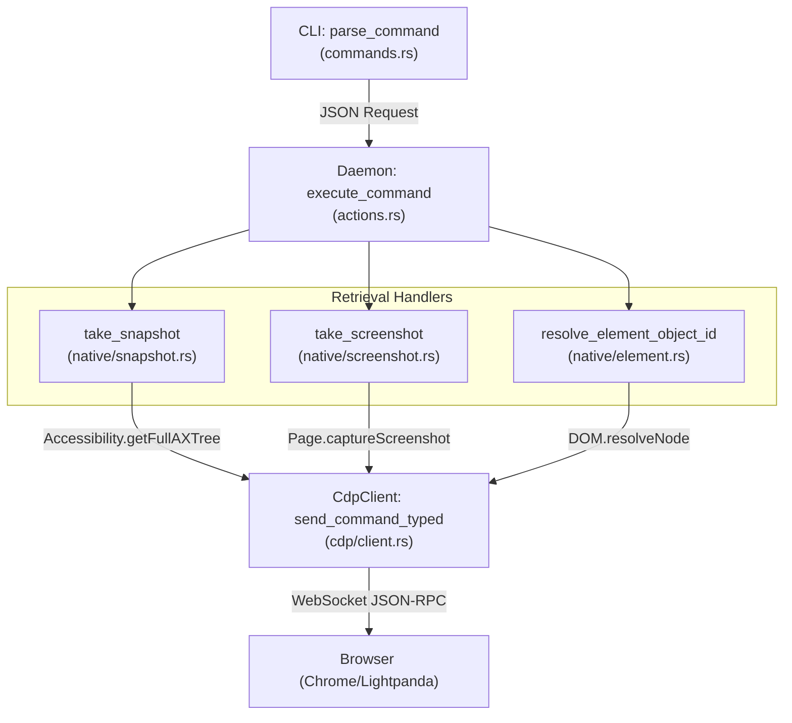
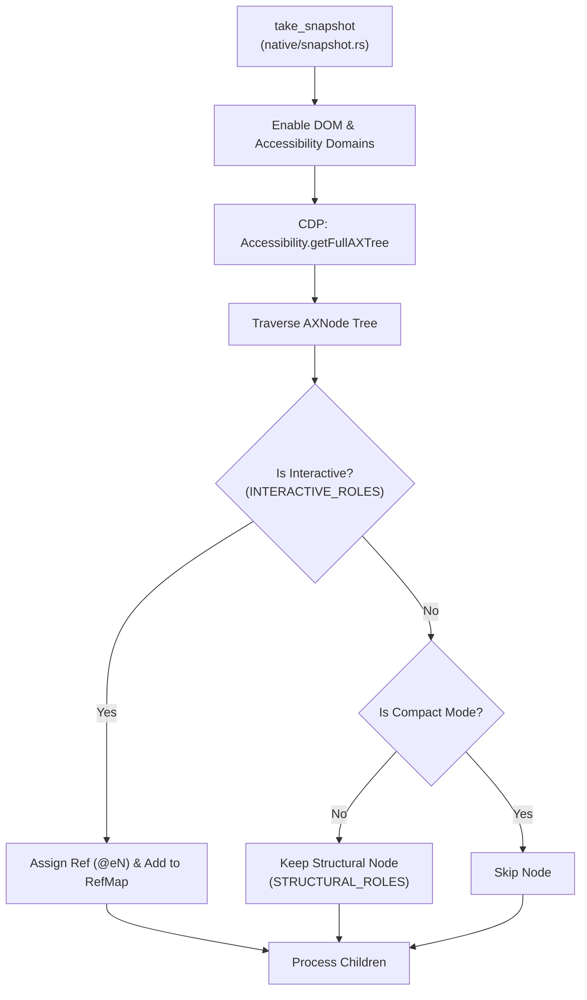

# Information Retrieval

<details>
<summary>관련 소스 파일</summary>

다음 파일들이 이 위키 페이지를 생성하기 위한 컨텍스트로 사용되었습니다.

- [cli/src/commands.rs](cli/src/commands.rs)
- [cli/src/native/element.rs](cli/src/native/element.rs)
- [cli/src/native/interaction.rs](cli/src/native/interaction.rs)
- [cli/src/native/screenshot.rs](cli/src/native/screenshot.rs)
- [cli/src/native/snapshot.rs](cli/src/native/snapshot.rs)
- [skill-data/core/templates/capture-workflow.sh](skill-data/core/templates/capture-workflow.sh)

</details>


이 문서는 page content, element property, accessibility snapshot, visual capture, diagnostic data를 포함해 web page에서 정보를 추출하는 command를 다룹니다. 이러한 command는 AI 에이전트가 page state를 관찰하고 수정 없이 data를 추출하는 데 필수적입니다.

---

## 개요

information retrieval command는 browser state와 DOM을 query합니다. native Rust architecture에서 이러한 command는 CLI에서 daemon을 거쳐 `CdpClient`로 흐르며, `CdpClient`는 Chrome DevTools Protocol(CDP)을 통해 browser와 직접 통신합니다.

핵심 기능은 다음과 같습니다.
- **Page-level**: URL, title, HTML content, PDF generation. [cli/src/commands.rs:32-60](), [skill-data/core/templates/capture-workflow.sh:32-52]()
- **Element-level**: text, attribute, value, bounding box, computed style. [cli/src/native/element.rs:171-202](), [cli/src/native/interaction.rs:122-144]()
- **Structured snapshots**: element reference(ref)가 포함된 compact accessibility tree. [cli/src/native/snapshot.rs:216-230]()
- **Visual captures**: interactive element에 대한 optional SVG-based annotation이 포함된 screenshot. [cli/src/native/screenshot.rs:100-107]()

모든 information retrieval command는 `Response` struct로 정의된 JSON response를 반환합니다.

---

## Command Processing Flow (Native)

다음 다이어그램은 information retrieval command가 system을 통과하는 방식을 추적하며, 특히 high-level CLI command에서 low-level CDP call로 전환되는 지점을 강조합니다.

**Retrieval Dispatch Pipeline**


**출처:** [cli/src/native/snapshot.rs:224-229](), [cli/src/native/screenshot.rs:100-107](), [cli/src/native/element.rs:187-202](), [cli/src/native/interaction.rs:132-144]()

---

## Page Information Commands

### get url / get title
현재 URL 또는 page title을 반환합니다. agent의 위치를 확인하는 기본 query입니다.

**CLI syntax:**
```bash
agent-browser get url
agent-browser get title
```

**Implementation:** native daemon에서 이 command들은 현재 browser state에 매핑되거나, state가 아직 cached되어 있지 않으면 특정 CDP `Runtime.evaluate` call에 매핑됩니다. [skill-data/core/templates/capture-workflow.sh:32-36]()

**출처:** [skill-data/core/templates/capture-workflow.sh:32-36]()

---

### get text / get value / get attr
이 command들은 CSS selector 또는 ref(`@e1`)를 사용해 element에서 특정 data를 가져옵니다.

| Command | Action | Description |
|---------|--------|-------------|
| `get text <sel>` | `text` | `innerText` 또는 `textContent`를 반환합니다. |
| `get html <sel>` | `html` | `innerHTML`을 반환합니다. |
| `get value <sel>` | `value` | input/textarea의 `value` property를 반환합니다. |
| `get attr <sel> <attr>` | `attribute` | 특정 HTML attribute(예: `href`)를 반환합니다. |

**Implementation:** daemon은 element를 찾기 위해 [cli/src/native/element.rs:122-129]()의 `resolve_element_object_id`를 사용한 뒤(`interaction.rs`를 통해), CDP를 통해 `Runtime.callFunctionOn`을 실행하여 property를 추출합니다.

**출처:** [cli/src/native/interaction.rs:122-144](), [cli/src/native/element.rs:171-202]()

---

## Snapshots and Accessibility Tree

`snapshot` command는 text 기반 AI 에이전트를 위한 기본 "vision"입니다. ARIA accessibility tree를 기반으로 page의 hierarchical view를 추출합니다.

### snapshot
stable element reference(ref)가 포함된 compact tree를 생성합니다.

**CLI syntax:**
```bash
agent-browser snapshot -i -c -d 5
```

**Options:**
- `-i, --interactive`: actionable element(button, link, input)만 포함합니다. [cli/src/native/snapshot.rs:11-30](), [cli/src/native/snapshot.rs:80]()
- `-c, --compact`: generic div 같은 빈 structural node를 제거합니다. [cli/src/native/snapshot.rs:45-66](), [cli/src/native/snapshot.rs:81]()
- `-d, --depth`: tree traversal depth를 제한합니다. [cli/src/native/snapshot.rs:82]()

**Snapshot Generation Logic**


**출처:** [cli/src/native/snapshot.rs:11-66](), [cli/src/native/snapshot.rs:78-104](), [cli/src/native/snapshot.rs:216-230](), [cli/src/native/element.rs:18-21]()

---

## Visual Capture Commands

### screenshot
현재 viewport 또는 full page를 capture합니다.

**CLI syntax:**
```bash
agent-browser screenshot --annotate --full-page
```

**Annotated Screenshots:**
`--annotate`가 사용되면 시스템은 다음을 수행합니다.
1. `entries_sorted()`를 사용해 현재 `RefMap` entry를 가져옵니다. [cli/src/native/screenshot.rs:236-249]()
2. `inject_annotation_overlay`를 통해 ref에 대응하는 numbered label이 포함된 temporary SVG overlay를 page DOM에 inject합니다. [cli/src/native/screenshot.rs:126-131]()
3. `capture_screenshot_base64`에서 `Page.captureScreenshot`을 통해 screenshot을 capture합니다. [cli/src/native/screenshot.rs:171-229]()
4. page state를 복원하기 위해 `remove_annotation_overlay`로 overlay를 제거합니다. [cli/src/native/screenshot.rs:136-138]()

**출처:** [cli/src/native/screenshot.rs:100-229](), [cli/src/native/element.rs:89-104]()

---

### pdf
현재 page를 PDF file로 print합니다.

**CLI syntax:**
```bash
agent-browser pdf output.pdf
```

**Implementation:** 현재 page의 document representation을 생성하기 위해 CDP command `Page.printToPDF`를 사용합니다. [skill-data/core/templates/capture-workflow.sh:50-52]()

**출처:** [skill-data/core/templates/capture-workflow.sh:50-52]()

---

## Output Formatting and Security

CLI는 stdout에 출력하기 전에 security filter와 limit을 적용하여 가져온 information의 presentation을 처리합니다.

### Content Boundaries
악성 webpage가 agent output을 종료하고 자체 command를 inject하려는 "Prompt Injection"을 방지하기 위해, `agent-browser`는 가져온 content를 random nonce로 감쌀 수 있습니다.

**Implementation:**
시스템은 command tracking을 위한 unique ID를 생성합니다. [cli/src/commands.rs:63-72](). content boundary가 enabled 상태이면, output은 untrusted page content를 구분하기 위해 CSPRNG-generated nonce로 감싸집니다.

### Output Truncation
LLM context window를 압도하지 않도록, 시스템은 configured maximum output limit을 초과하는 string을 clip합니다.

**출처:** [cli/src/commands.rs:63-72](), [cli/src/commands.rs:85-107]()
