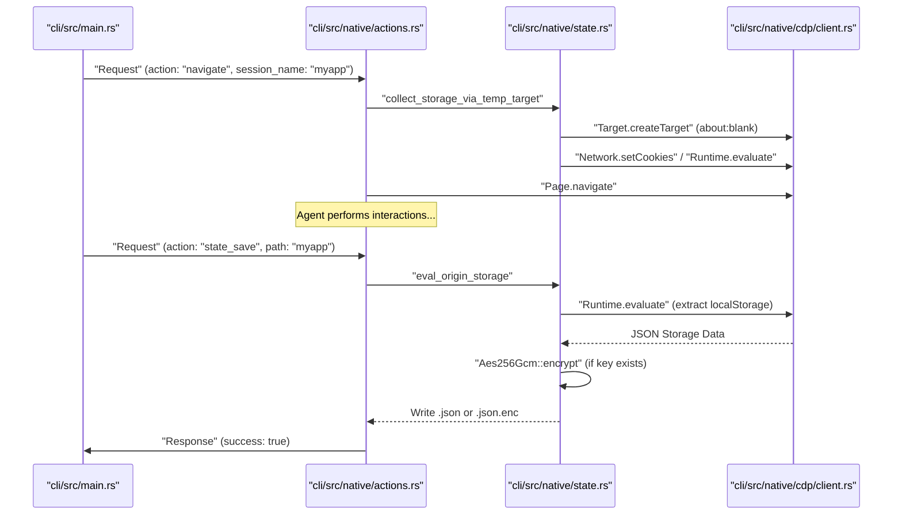
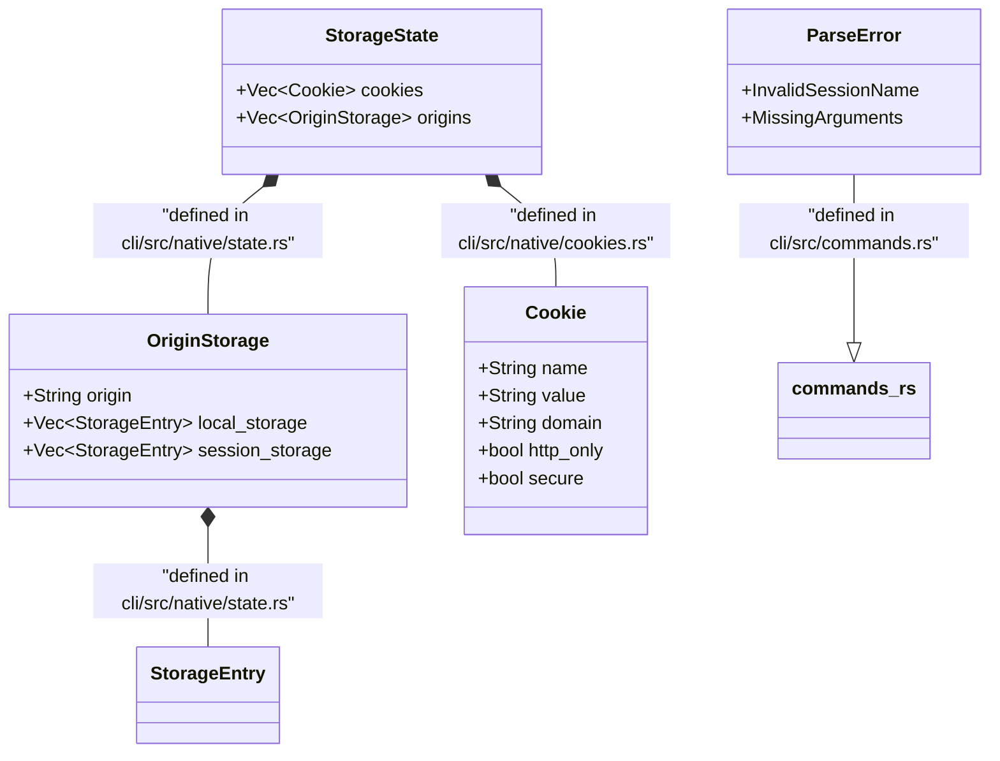

# State and Session Management

관련 소스 파일

다음 파일들이 이 위키 페이지를 생성하기 위한 컨텍스트로 사용되었습니다.

- [cli/src/commands.rs](cli/src/commands.rs)
- [cli/src/native/cookies.rs](cli/src/native/cookies.rs)
- [cli/src/native/state.rs](cli/src/native/state.rs)
- [skill-data/core/templates/authenticated-session.sh](skill-data/core/templates/authenticated-session.sh)

이 페이지는 browser state management, persistent session, cookie, web storage(localStorage/sessionStorage)의 구현과 사용법을 문서화합니다. 이러한 기능은 AI 에이전트가 restart 사이에 context를 유지하고, authentication token을 재사용하며, native Rust daemon을 통해 browser data를 직접 조작할 수 있게 합니다.

## Session Types and Persistence

`agent-browser`는 CLI flag로 결정되고 native Rust 구현의 `DaemonState`가 관리하는 세 가지 주요 session mode를 지원합니다.

| Session Mode | CLI Flag | Persistence | Implementation Detail |
|--------------|----------|-------------|-----------------------|
| **Default** | (none) | In-memory | temporary context이며, daemon process가 exit하면 손실됩니다. |
| **Named** | `--session <id>` | In-memory | `<id>`로 식별되는 isolated context이며, parallel agent가 cross-talk 없이 실행되도록 합니다. |
| **Persistent** | `--session-name <name>` | Disk-backed | 지정된 name을 사용해 `~/.agent-browser/sessions/`에서 state를 auto-save/load합니다. |

**출처:** [cli/src/commands.rs:11-31](), [cli/src/commands.rs:7-7]()

### Session Lifecycle Diagram

이 다이어그램은 native daemon의 command lifecycle 내에서 session이 initialize되고 persist되는 방식을 추적합니다.

**출처:** [cli/src/native/state.rs:88-107](), [cli/src/native/state.rs:112-141](), [cli/src/native/state.rs:1-5]()

## State File Management

state file은 cookie, `localStorage`, `sessionStorage`를 포함해 browser context의 전체 storage state를 capture합니다.

### state_save and state_load

`cli/src/native/state.rs`의 `state_save` 구현은 Chrome DevTools Protocol(CDP)을 통해 data extraction을 처리합니다. 현재 origin의 data를 수집하기 위해 `eval_origin_storage`를 사용하며, temporary target(`collect_storage_via_temp_target`)을 사용해 fetch를 blank HTML로 intercept함으로써 실제 network request 없이 다른 known origin을 crawl할 수 있습니다.

**state_save의 Data Flow:**
1. **Cookies:** `cli/src/native/cookies.rs`의 `Network.getAllCookies` CDP command를 사용해 `get_all_cookies`로 가져옵니다.
2. **Storage:** `localStorage`와 `sessionStorage` entry를 반환하는 script와 함께 `Runtime.evaluate`를 호출하는 `eval_origin_storage`를 사용해 추출합니다.
3. **Serialization:** data는 `cli/src/native/state.rs`에 정의된 `StorageState` struct로 구조화됩니다.
4. **Encryption:** encryption key가 있으면 JSON은 AES-256-GCM을 사용해 encrypted됩니다.

**출처:** [cli/src/native/state.rs:19-38](), [cli/src/native/state.rs:88-107](), [cli/src/native/state.rs:112-141](), [cli/src/native/cookies.rs:27-38]()

### Encryption at Rest

state file과 authentication profile은 설정된 경우 industrial-grade encryption으로 보호됩니다.

- **Mechanism:** AES-256-GCM(Authenticated Encryption with Associated Data).
- **Implementation:** encryption에는 `aes_gcm` crate를, key derivation에는 `sha2`를 사용합니다.
- **Key Source:** 시스템은 `AGENT_BROWSER_ENCRYPTION_KEY` environment variable을 찾습니다.

**출처:** [cli/src/native/state.rs:1-5]()

## Storage and Cookie Commands

browser data의 직접 조작은 protocol에 정의되고 native daemon이 처리하는 특정 action을 통해 제공됩니다.

### Cookie Management
`cli/src/native/cookies.rs` file은 CDP를 통해 cookie를 관리하는 helper function을 제공합니다.
- `get_cookies`: 특정 URL로 filtering된 cookie를 가져옵니다.
- `set_cookies`: cookie attribute를 설정합니다. domain만 제공되고 `current_url`을 사용할 수 있으면 `url` field를 자동으로 채웁니다.
- `clear_cookies`: `Network.clearBrowserCookies`를 사용해 모든 cookie를 제거합니다.

CLI는 `cli/src/commands.rs`의 `parse_curl_cookies`를 통해 다양한 format(JSON array, cURL dump, bare header)의 cookie parsing도 지원합니다.

**출처:** [cli/src/native/cookies.rs:40-60](), [cli/src/native/cookies.rs:62-93](), [cli/src/native/cookies.rs:95-100](), [cli/src/commands.rs:85-127]()

### Web Storage Management
`StorageState`와 `OriginStorage` struct는 `localStorage`와 `sessionStorage`의 transfer를 지원합니다.

| Struct | Purpose | File |
|---------|----------------|----------------------|
| `StorageState` | 모든 cookie와 origin-specific storage의 container입니다. | [cli/src/native/state.rs:19-22]() |
| `OriginStorage` | 특정 origin을 해당 `localStorage` 및 `sessionStorage` entry에 매핑합니다. | [cli/src/native/state.rs:26-31]() |
| `StorageEntry` | storage item을 위한 단순 key-value pair입니다. | [cli/src/native/state.rs:35-38]() |

**출처:** [cli/src/native/state.rs:19-38]()

## Implementation Entities

다음 다이어그램은 logical state concept를 특정 Rust struct 및 file에 매핑합니다.

**출처:** [cli/src/native/state.rs:19-38](), [cli/src/native/cookies.rs:8-25](), [cli/src/commands.rs:11-31]()

## Batch Command Execution

Rust CLI와 background daemon 사이의 IPC(Inter-Process Communication) overhead를 최소화하기 위해 `agent-browser`는 command batching을 지원합니다. CLI는 이러한 command를 추적하기 위한 unique request ID를 생성하기 위해 `gen_id`를 사용합니다.

**출처:** [cli/src/commands.rs:63-72]()

## Security and Validation

### Session Name Validation
path traversal과 shell injection을 방지하기 위해 session name은 엄격하게 validate됩니다. name에 invalid character 또는 path traversal sequence가 포함되면 `ParseError::InvalidSessionName` variant가 사용됩니다.

- **Validation Logic:** `is_valid_session_name`을 통해 처리되고 `session_name_error`로 formatting됩니다.
- **Rejection:** path traversal을 시도하거나 invalid character를 포함하는 모든 string은 reject됩니다.

**출처:** [cli/src/commands.rs:29-31](), [cli/src/commands.rs:58-60](), [cli/src/commands.rs:7]()

### Authenticated Sessions
일반적인 workflow는 한 번 login하고 reuse를 위해 state를 저장하는 방식입니다. `authenticated-session.sh` template은 이 pattern을 보여줍니다.
1. login interaction을 수행합니다(ref를 찾기 위한 Discovery mode, 이후 Login mode).
2. state 저장: `agent-browser state save "$STATE_FILE"`.
3. state 재사용: `agent-browser --state "$STATE_FILE" open "$LOGIN_URL"`.

**출처:** [skill-data/core/templates/authenticated-session.sh:35-52](), [skill-data/core/templates/authenticated-session.sh:101-106]()
